import ValidateTextByToken from "/src/utils/getQueryString.js";
import StrongTextParser from "/src/utils/textParser.js";
import text from "/src/locale/ko/SMT/tutorial-01-auth/create-a-acount-circle-user.json";
import SWUpdate from "./img/024.png";
import Report from "./img/026.png";
import Estimate from "./img/027.png";

# 服务处理

我们将指导您完成服务订单的处理过程。

<ValidateTextByToken dispTargetViewer={true} dispCaution={false} validTokenList={['head', 'branch', 'agent']}>
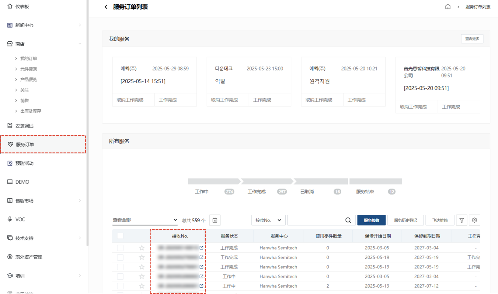

1. 选择您想要输入服务处理详情的服务的**接收No.**。

## 基本信息
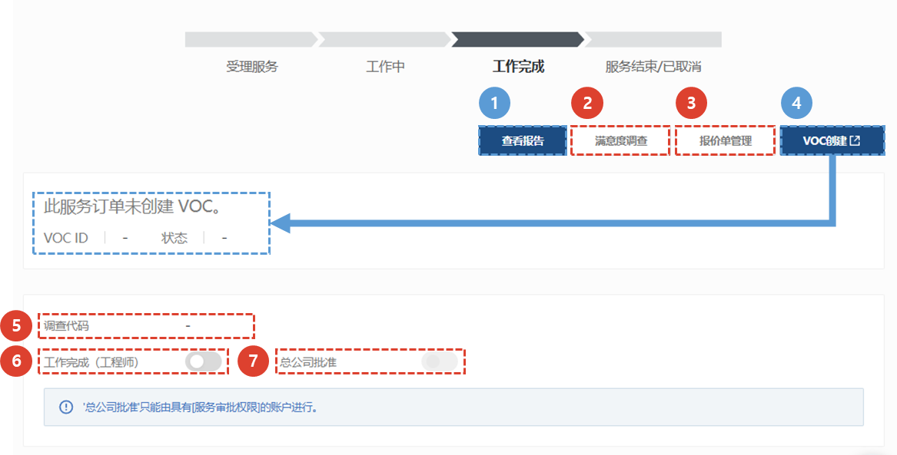
1. **查看报告** : 当服务处理状态变为**已完成**时，会创建一个**查看报告**按钮，允许您下载服务报告。
    :::info
        将生成如下所示格式的服务报告。  
        

    :::
1. **满意度调查** : 您可以通过短信或电子邮件向接受服务的人员发送服务满意度调查链接。
1. **报价单管理** : 您可以创建服务报价或复制并使用现有报价。
    :::info
        您可以通过点击**+**按钮添加报价。
        

    :::
1. **VOC创建** : 您可以立即注册服务处理过程中发生的VOC。已注册的VOC可在“创建VOC”按钮下方显示，方便您查看进度。
1. **满意度调查发送信息**：选择满意度调查按钮，就会出现发送信息。
1. **工作已完成（请求付款）**：若服务工作已完成，请点击完成流程并请求付款。 工作完成后，信息将无法修改。
1. **与总部核对**：对于已完成的项目，您可以与总部核对。
    :::warning
        对于某些地区（例如中国），只有与总部核实后才可以**免费运送材料**。  
    :::

## 更改设施信息
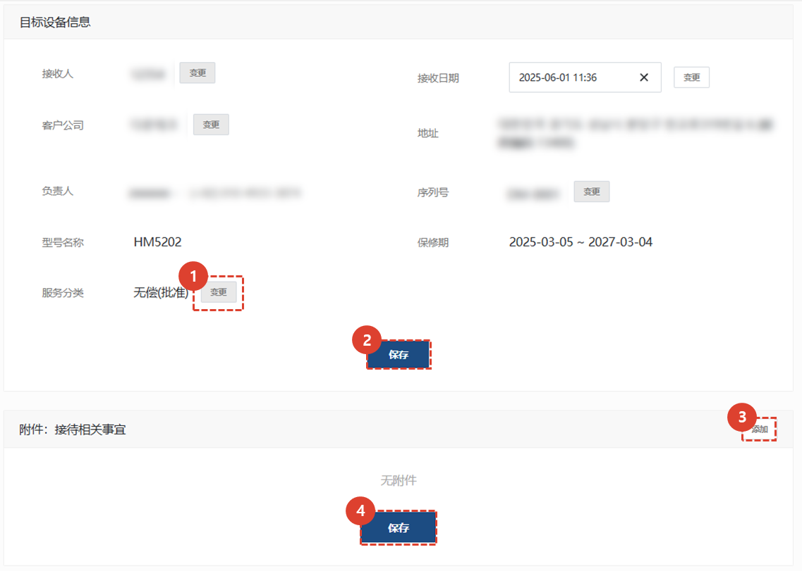
1. 如需修改服务目标设施信息，请点击**更改**按钮进行修改。
1. 点击**保存**按钮，完成设施信息修改。
1. 点击**添加**按钮，添加服务处理的参考资料。
1. 点击**保存**按钮，完成附件添加。

## 修改询价内容及管理调度
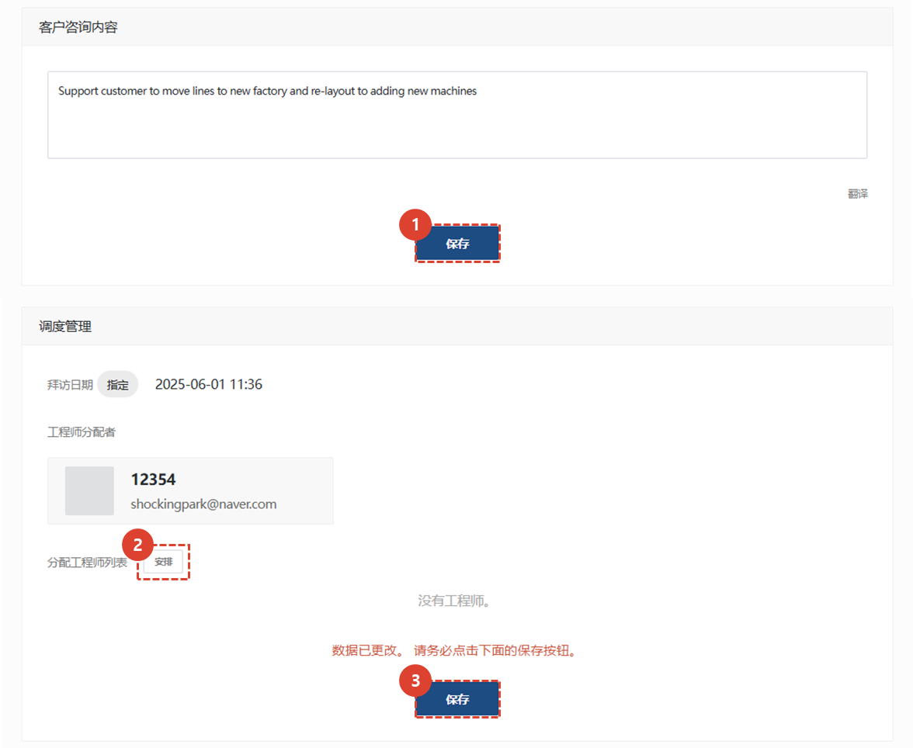
1. 如需修改服务咨询内容，修改后请点击**保存**按钮。
1. 您可以修改待派遣工程师列表。
1. 添加或删除工程师，然后点击**保存**按钮。

## 服役历史
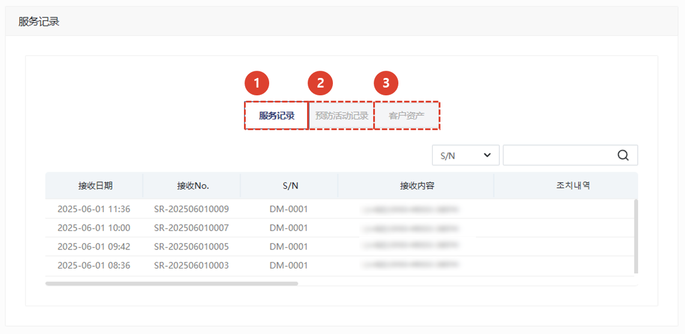
1. 显示**服务历史记录**。 您可以查看接收日期、接收编号、S/N、接收内容、处理详情、服务类别（详情）、免费服务类别、指派工程师、预约访问日期、处理日期、客户代表和客户公司名称。
1. 显示**预防活动历史记录**。 您可以查看 S/N、客户公司、类型、负责中心、是否采取了措施、处理人员和处理日期。
1. 显示**拥有资产清单**。 您可以查看 S/N、负责中心名称、型号名称、产品代码、产品名称、保修开始和结束日期以及订单号。

## 添加使用过的零件

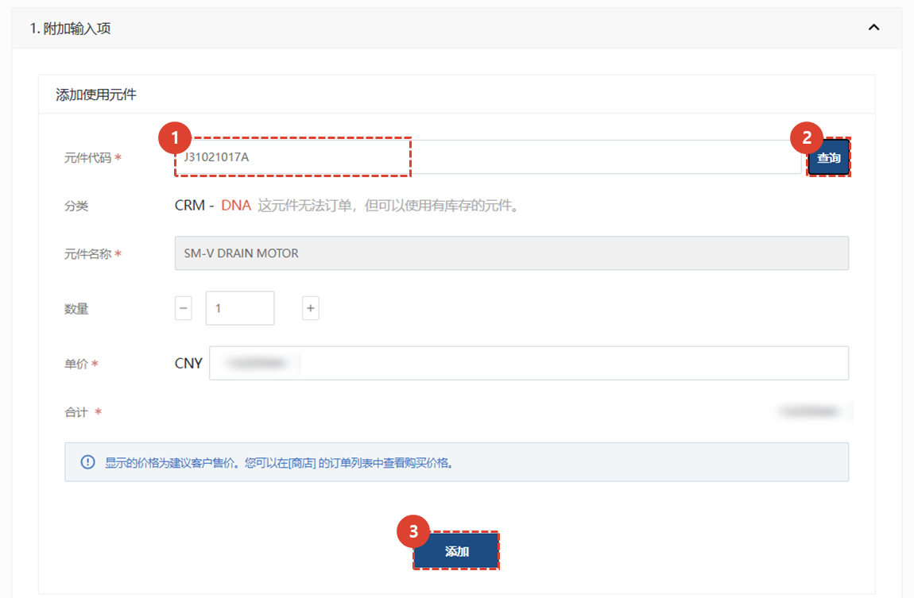

1. **输入**所用零件代码。
1. 点击**搜索**按钮。
    :::note
    如果系统中已注册零件代码，则会自动输入零件名称和单价。
    如果没有注册，则在“分类”选项卡中会显示原因，您可以根据需要直接输入数据。 
    :::
    :::info
    **SA** : 可用的
     **DNA** : 这是一个已停产的部件，但如果我们有库存，我们就可以使用它。
     **SNA** : 不可用（即使有库存）
    :::
1. 单击**添加**来注册该部分。

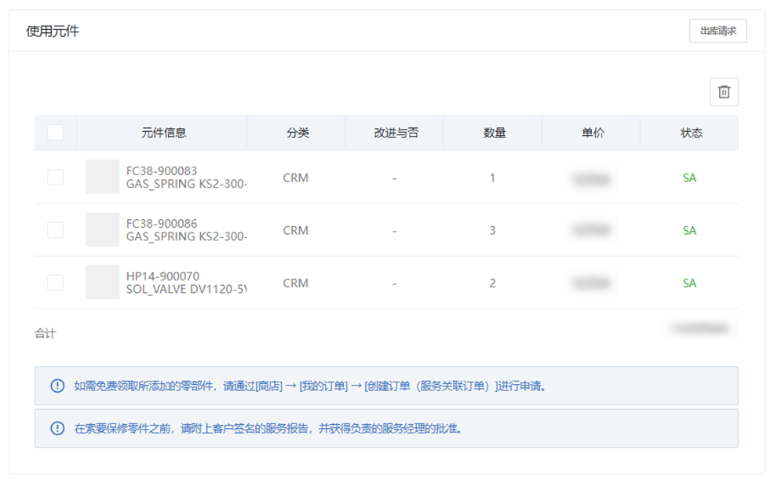
1. 验证该部件是否已正确注册。

## 行动与验证 1/2

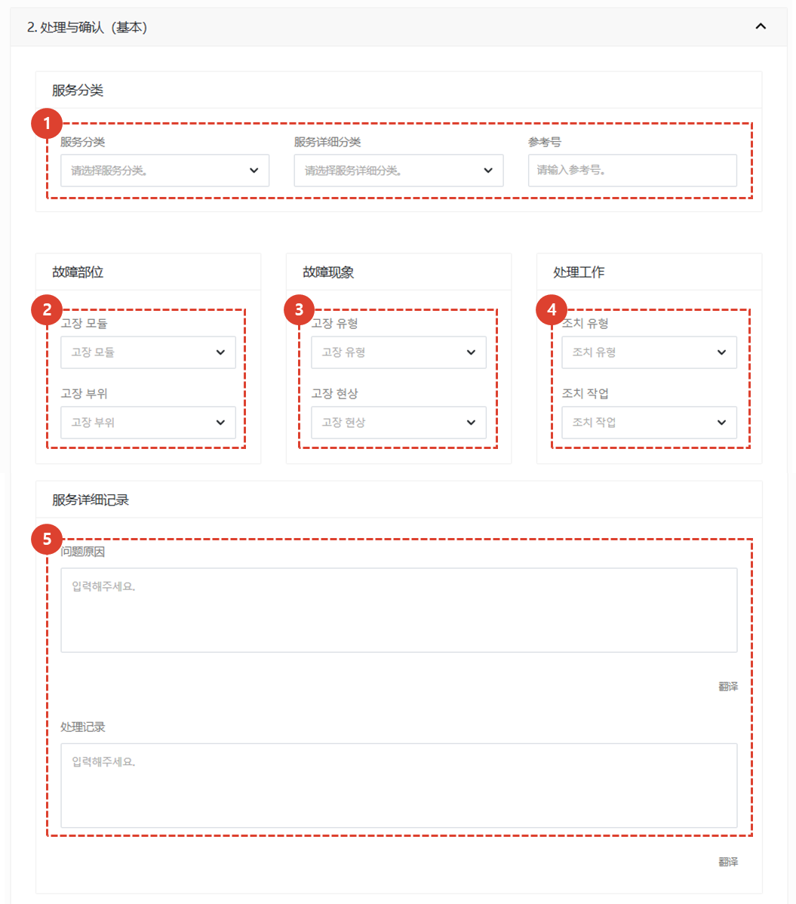
1. 选择适用的服务类别。
1. 选择故障模块和详细故障区域。
1. 选择故障类型和现象。
1. 选择行动类型和工作内容。
1. 详细填写服务详情。

## 行动与验证 2/2

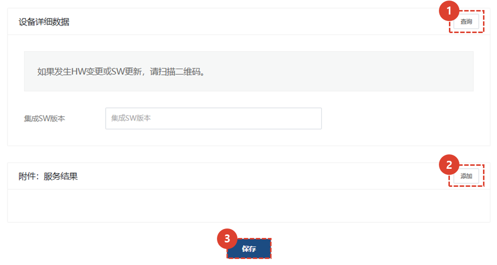
1. 如果服务进行过程中发生硬件变更或软件升级，您可以输入版本信息进行版本管理。点击“搜索”选择适用版本。
    :::info
    当识别到设备的二维码后，在识别到的手机上会弹出是否将SW信息反映到最近登记的服务订单中的弹窗，点击**确认**按钮后，数据将自动登记。
    :::
1. 如果需要，请单击添加按钮输入附件文件。
    :::warning
    请附上与工作相关的文件，例如服务期间发生的结果或故障的照片或视频。
     最终确认时需上传检验员确认的相关材料。
    :::
1. 保存内容。

## 输入工作时间

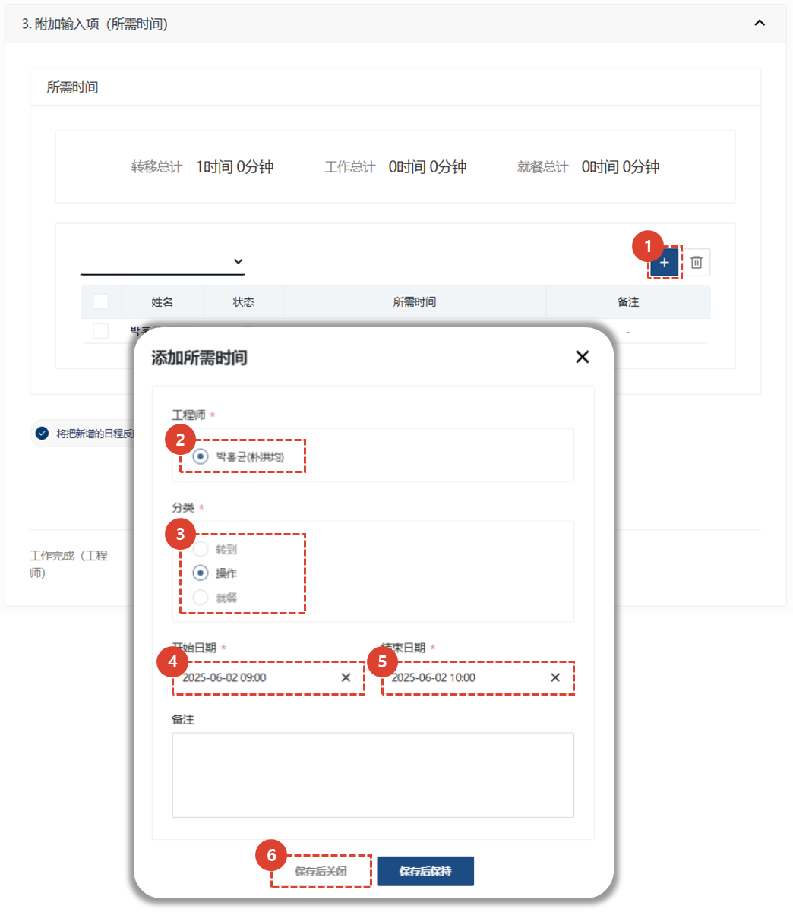
输入执行服务任务所花费的时间。
1. 点击**+**。
1. 选择一名工程师。
1. 选择耗时类别。
1. 输入开始和结束日期。
1. 点击**保存**。
    :::note
    
    您可以点击**按钮**暂时保存时间输入，而不关闭弹窗。
    :::
1. 点击“添加”按钮，并根据需要输入附件。
1. 点击“保存”按钮保存操作详情。

## 规格/发票

填写服务工作期间发生的账单金额。
1. 检查输入的金额。
1. 如果需要修改最终金额，请选择**折扣修改**以修改账单金额。
1. 选择**保存**完成服务金额的填写。
    :::note
    可以根据账单金额中存储的金额发出报价。
    :::
1. 选择**进入最终确认页面**，完成服务处理信息的输入。

## 最终确认

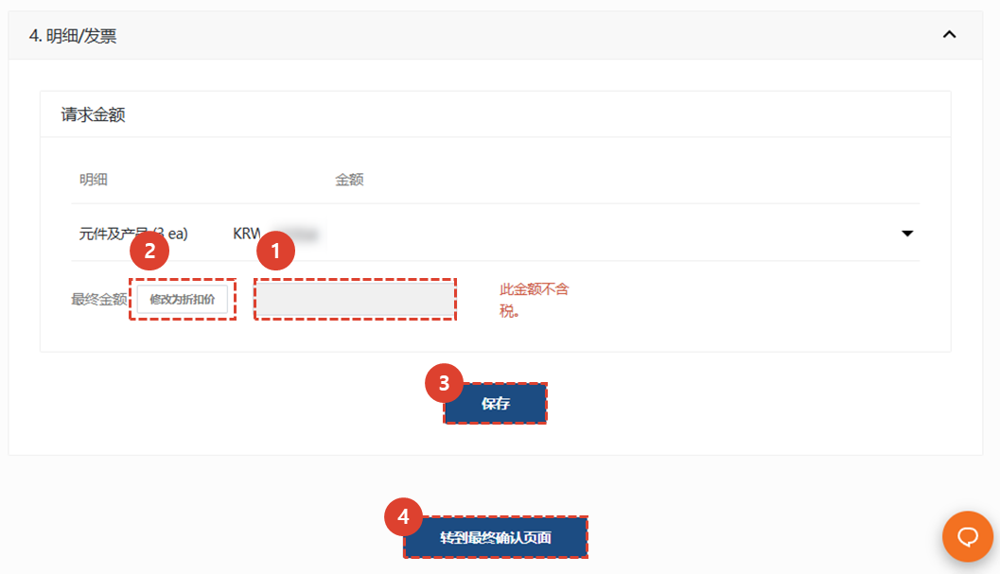
此页面可确认最终服务内容，并在收到客户评价员的确认后完成。
1. 检查您所写的内容。

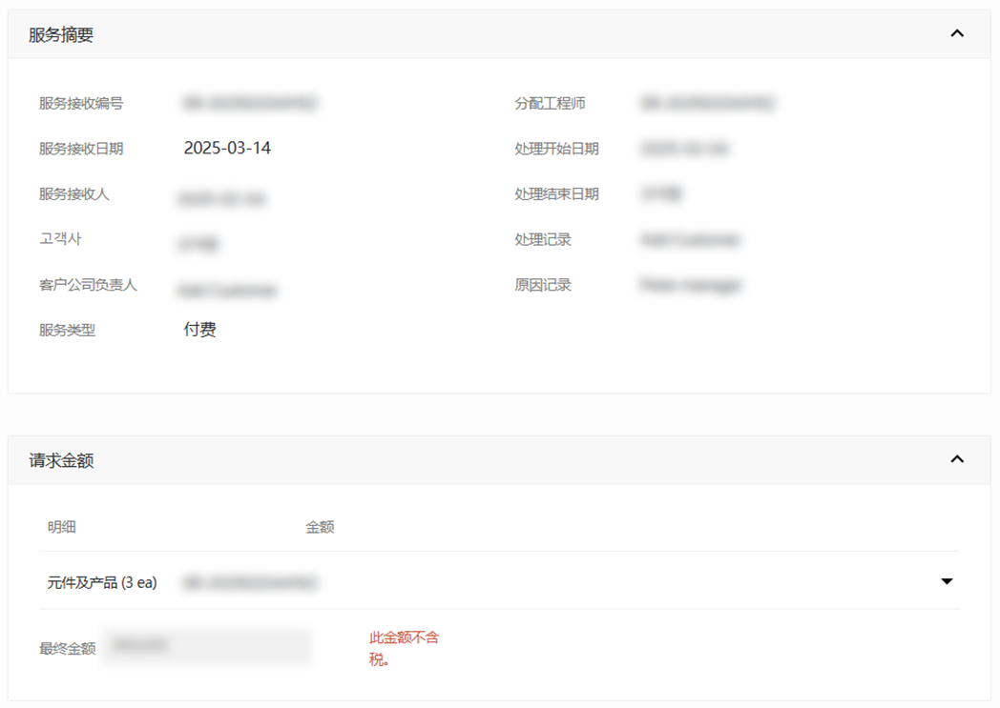
1. 选择客户验房师。
1. 选择验房日期。
    :::warning
    **如果数字签名无效或**数字签名不可用，您必须输入附件来替换签名。
     请在**上传审核文件**选项卡中添加文件。
     :::
1. 单击**保存**。 

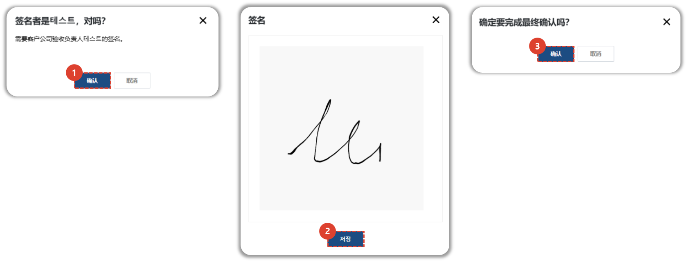
1. 检查客户验货员姓名，如有必要，请点击**取消**进行更正。
如果客户验货员姓名正确，请点击**确认**。
1. 获取客户验货员的签名。
1. 点击**确认**完成。
    :::info
    经过最终确认的服务建议状态将变为**已完成**。
     :::

</ValidateTextByToken>