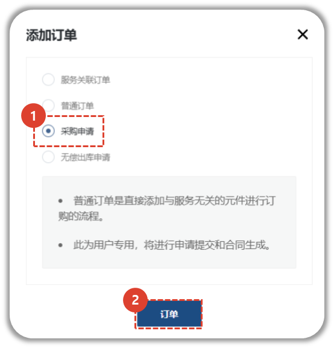
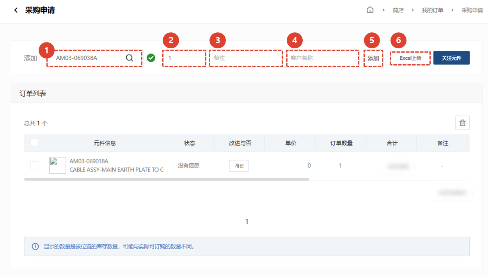
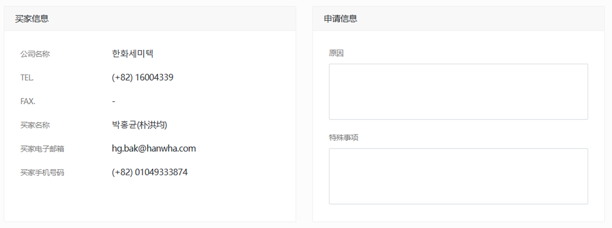
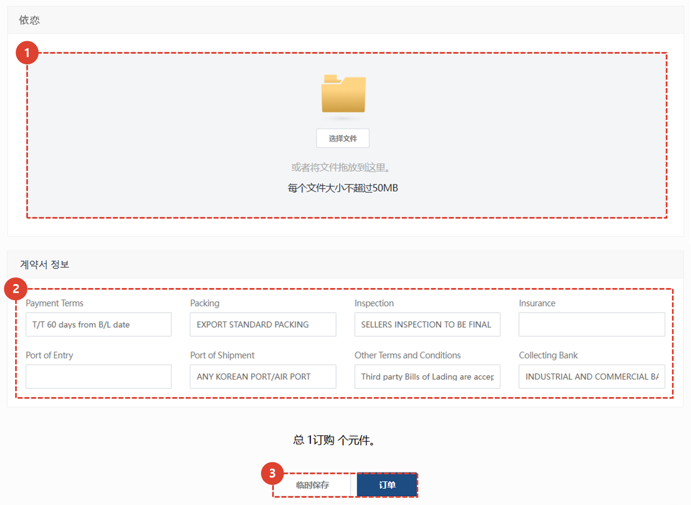
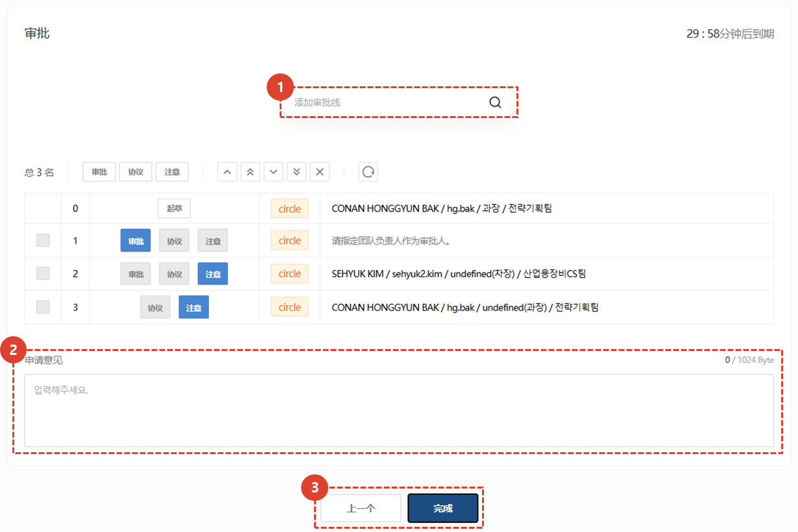

import ValidateTextByToken from "/src/utils/getQueryString.js";
import StrongTextParser from "/src/utils/textParser.js";
import text from "/src/locale/ko/SMT/tutorial-03-store/01-create-order-buyer.json";

# 填写订单 - 采购申请

<ValidateTextByToken dispTargetViewer={false} validTokenList={['head', 'branch']}>
它主要用于公司需要从总部订购零件的情况。 
您可以创建之前由 CRM 中的圈子发出的付费采购订单请求。
查看 CRM 中简化的付费采购订单请求流程。
<ValidateTextByToken dispTargetViewer={true} dispCaution={false} validTokenList={['head', 'branch', 'agent']} ></ValidateTextByToken>
 
 

## 添加订单

1. 点击您要购买的商品按钮。
1. 点击订购按钮。
 
 

## 添加零件

1. 您可以通过搜索零件代码来添加采购订单应用程序零件。
    :::info
     → 正常搜索 
     → 没有正确搜索 **(没有进展)**
    :::
1. 输入数量
1. 输入待申请零件的具体信息。
     示例）相关文件、零件具体信息、送货地址等。
1. 输入客户名称。
1. 点击“添加”按钮进行添加。
1. 可以使用 Excel 批量上传。
:::note

1. 您可以获取 Excel 表单。 
1. 通过在 Excel 中输入数据来添加文件。 
    - (必需输入)**Parts Code** : 输入零件代码。
    - (必需输入)**Quantity** : 输入零件数量。
    - **Price** : 仅当以非正常价格出售时才输入特价。**如果未输入，将自动应用正常价格。**
    - **Remarks** : 输入注释详细信息。
:::
 
 

## 查看订单列表并输入附加信息

1. 如果状态列的值为 SNA/DNA，则无法处理订单。
- 如果状态为 **无信息**，则表示物料管理员尚未更新，因此可以处理订单。
1. 对于 SNA/DNA，您可以查看改进的产品。**(待定)**
1. 您可以查看订单数量，并**双击**进行修改。
1. 您可以在**卖家中心**查看库存数量。
:::info
    清单显示**零件信息**/**状态**/**改进状态**/**单价**/**订单数量**/**总计**/**库存**以及
     **负责中心**/**备注**/**最小起订量**和**交货期限**。
:::
 
 

## 查看已付费PO产品基本信息

- 确认订单人（起草人）信息。
- 输入采购订单签发原因及特殊信息。

1. 附加附件。
1. 输入合同信息中需要输入的文本。
    - 您输入的信息将用于创建以下文档：
      
        :::note
        文档以 PDF 格式输出。
        :::
1. 单击“保存草稿”或“下一步”按钮。
 
 

## 上诉至最高法院（Circle）

1. 搜索付款明细。（Circle user）
1. 输入提案意见。
1. 点击“完成”按钮，将付款凭证发送至圈子。
</ValidateTextByToken>
