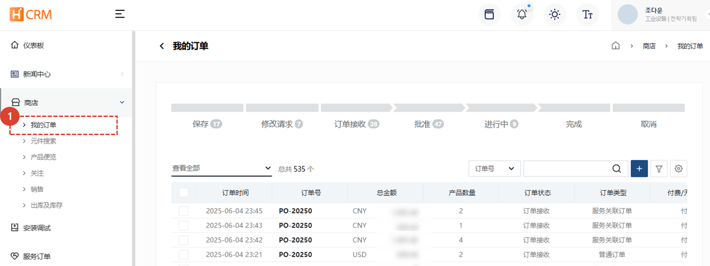
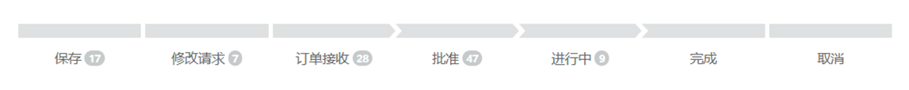
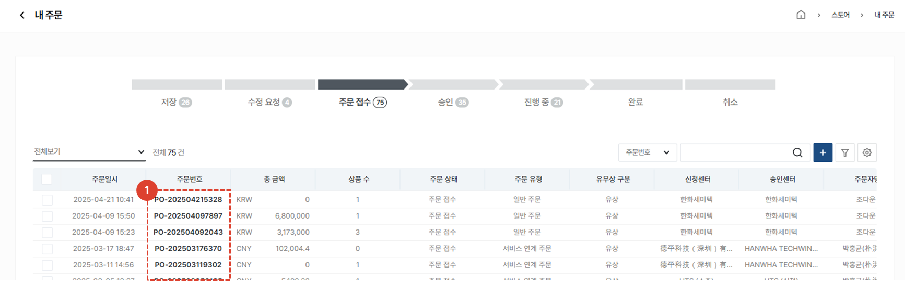
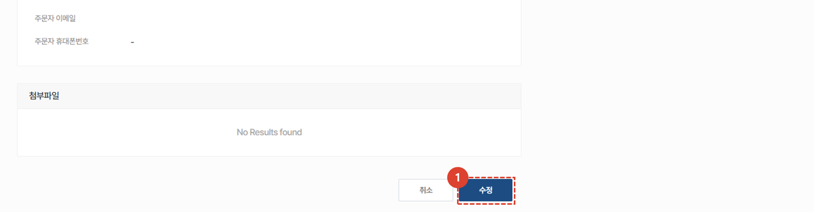

import ValidateTextByToken from "/src/utils/getQueryString.js";

# 修改订单

<ValidateTextByToken dispTargetViewer={true} dispCaution={false} validTokenList={['head', 'branch', 'agent']}>

我们将指导您完成修改您想要购买的服务零件订单的过程。

</ValidateTextByToken>

## 订单列表

<ValidateTextByToken dispTargetViewer={false} dispCaution={true} validTokenList={['head', 'branch', 'agent']}>

1. 选择**门店** - **我的订单**菜单。
1. 查看订单列表。

</ValidateTextByToken>

## 订单列表 - 订单状态

<ValidateTextByToken dispTargetViewer={false} dispCaution={true} validTokenList={['head', 'branch', 'agent']}>

- 已保存：订单已暂时保存。
- 修改请求：订单处于卖家请求客户修改的状态。
- 订单已收到：订单处于客户已创建订单并从卖家处收到的状态。
- 已批准：订单处于卖家已批准的状态。
- 处理中：订单处于已批准的订单正在向客户发货的状态。
- 已完成：订单处于已完成向客户发货的状态。
- 已取消：订单处于客户已取消的状态。

</ValidateTextByToken>

## 주문서 수정

<ValidateTextByToken dispTargetViewer={false} dispCaution={true} validTokenList={['head', 'branch', 'agent']}>

1. 수정이 필요한 **주문번호**를 선택합니다. 주문서 수정은 저장 및 주문 접수 상태에서만 가능합니다.

1. 주문 수정을 위해 상세 페이지 하단의 **수정** 버튼을 선택하여 작성 내용을 **수정**, **저장** 할 수 있습니다. 
    :::warning
        수정된 주문서는 반드시 "**주문**" 버튼을 클릭해야만 주문이 진행됩니다. 
    ::: 

</ValidateTextByToken>

