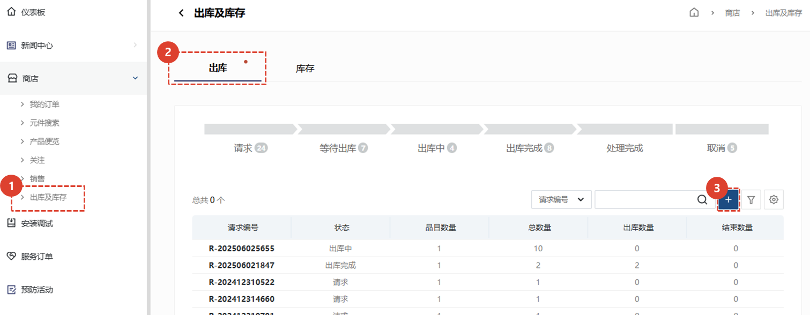
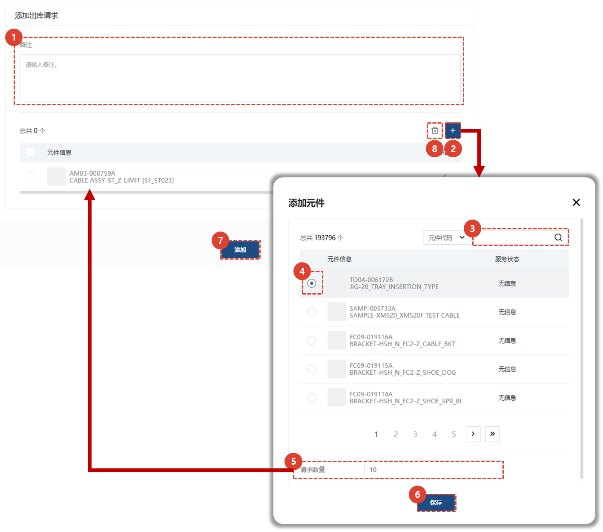

import ValidateTextByToken from "/src/utils/getQueryString.js";

# 服务部件发货请求

<ValidateTextByToken dispTargetViewer={true} dispCaution={false} validTokenList={['head', 'branch']}>

当需要服务零件收据/放行请求和批准流程时，我们将指导您完成使用程序。

</ValidateTextByToken>

## 零件发货请求

<ValidateTextByToken dispTargetViewer={false} dispCaution={true} validTokenList={['head', 'branch']}>

我们将指导您完成零件装运请求流程。

## 从其他菜单请求送货

- 您可以从与零件运输服务相关的另一个菜单中请求运输服务所需的零件。
    :::info
    ※ 相关服务菜单
    - 服务订单
    - 安装试驾
    :::

## 直接从此菜单请求送货

### 注册您的请求

1. 点击“商店”→“配送和库存”菜单。
1. 点击“配送”选项卡。
1. 点击“+”按钮。
    :::info 
    进度条状态
    - **请求**：这是创建发货请求表单后的状态。
    - **等待发货**：这是发货经理/经理批准发货请求后的状态。
    - **发货**：发货经理/经理请求的部分零件已发货。
    - **发货完成**：发货经理/经理请求的所有零件已发货。
    - **处理完成**：所有已发货零件的状态如下。
        - **客户销售**：表示已发货的零件已售出。
        - **免费供应**：表示已发货的零件已免费供应。
        - **退货**：表示零件已退回仓库。
    :::

### 写下您的请求

1. 在备注栏中输入与申请相关的信息。
1. 点击“+”按钮打开零件搜索窗口。
1. 搜索零件。
1. 选择要添加的零件。
1. 输入数量。
1. 点击“保存”按钮。
1. 点击“添加”按钮创建发货申请。
- 申请创建后，系统会同时向**发货审批经理**发送通知邮件。
1. 用于删除已添加的零件。

</ValidateTextByToken>