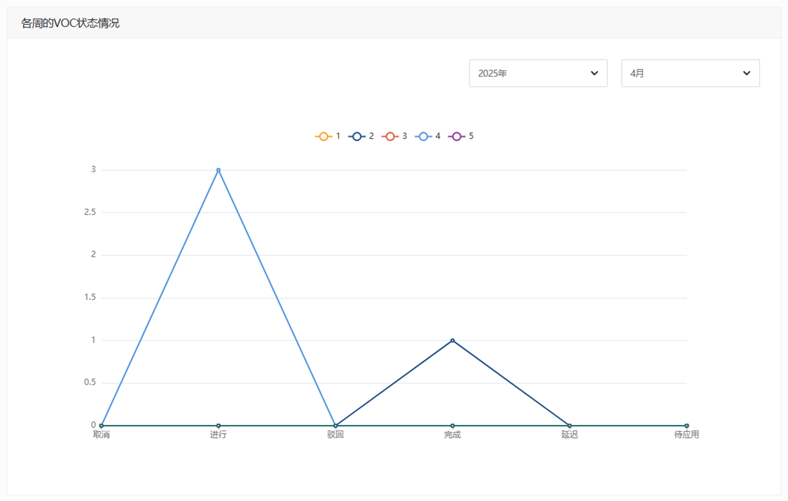
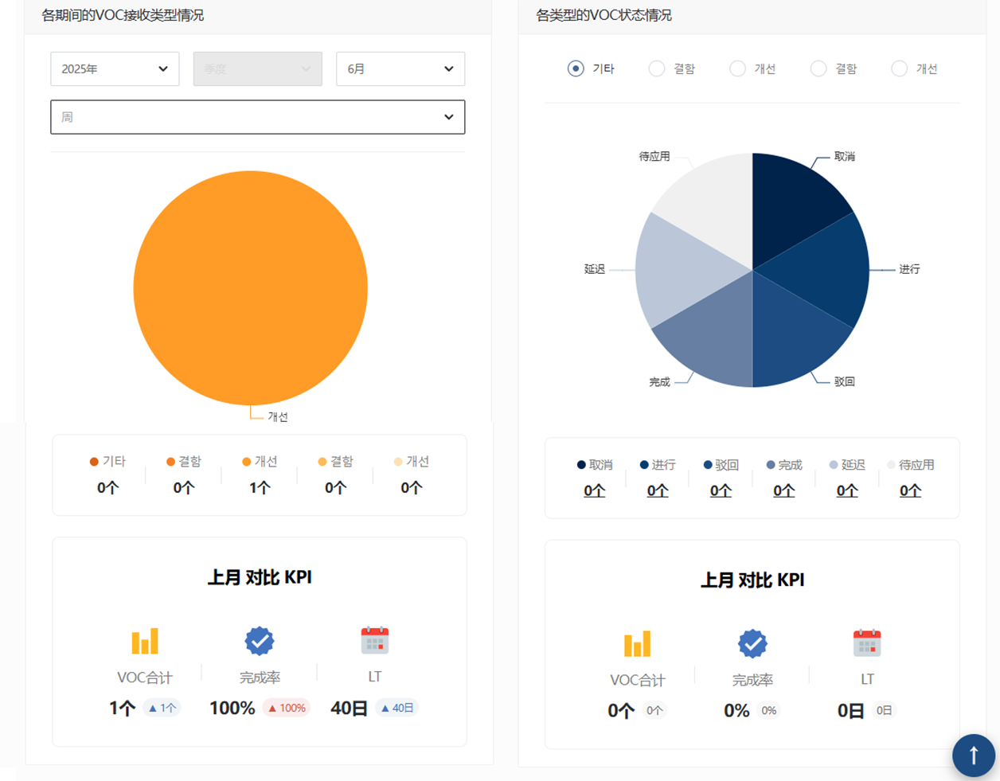

import ValidateTextByToken from "/src/utils/getQueryString.js";

# 大纲

<ValidateTextByToken dispTargetViewer={true} dispCaution={false} validTokenList={['head']}>

VOC 仪表板允许您检查 VOC 的进度。

</ValidateTextByToken>

## 指标状况

<ValidateTextByToken dispTargetViewer={false} dispCaution={true} validTokenList={['head']}>

### 停车场状况

 

- 按周显示VOC接收和处理状态。

### 按期间和类型划分的状态

 

- 按期间或类型显示 VOC 接收和处理的状态。

</ValidateTextByToken>