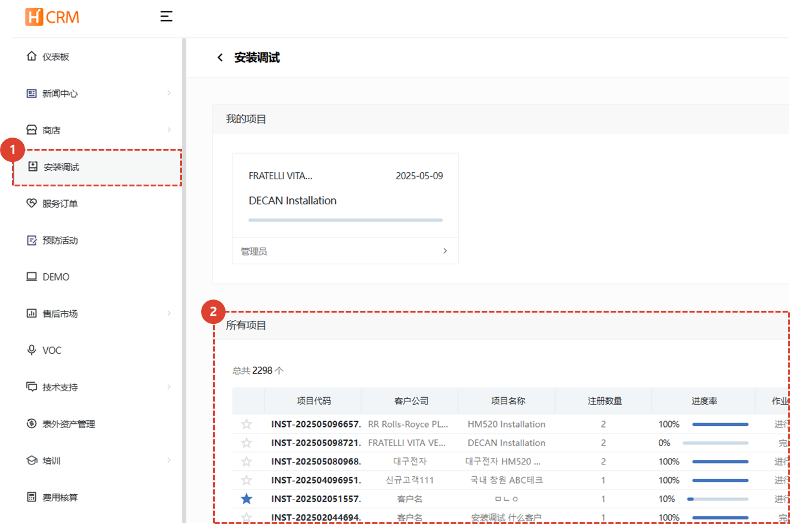

import ValidateTextByToken from "/src/utils/getQueryString.js";
import StrongTextParser from "/src/utils/textParser.js";
import text from "/src/locale/ko/SMT/tutorial-02-installation/01-create-project.json";

# 项目列表

以下是安装和调试项目清单。

<ValidateTextByToken dispTargetViewer={true} dispCaution={true} validTokenList={['head', 'branch', 'agent']}>

1. 选择**安装试驾**菜单。
1. 显示安装试驾项目列表。

</ValidateTextByToken>
