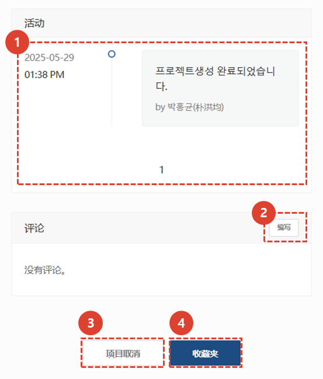

import ValidateTextByToken from "/src/utils/getQueryString.js";
import StrongTextParser from "/src/utils/textParser.js";
import text from "/src/locale/ko/SMT/tutorial-02-installation/02-details-project.json";
import DataAdd from "./img/012.png";
import Signature from "./img/039.png";

# 项目详情 - 概要

本指南将带您进入项目详细信息屏幕的概览选项卡。

## 项目详情选项卡指南

<ValidateTextByToken dispTargetViewer={true} dispCaution={true} validTokenList={['head', 'branch', 'agent']}>

1. **概要**：输入安装试驾的基本信息、概要以及发货清单。
1. **会前会**：您可以输入与客户进行安装试驾预会的内容。您可以管理预会所需的细节和时间。
1. **检查安装环境**：（仅限美国公司）如果预会比较困难，您可以保存客户通过电报收到的安装环境信息。
1. **升级**：（仅限美国公司）您可以输入根据客户订单进行可选安装的地点。
1. **出货**：（仅限美国公司）您可以输入发货信息。
1. **安装调试**：您可以输入安装试驾的详细信息，并选择是否确认最终安装试驾。
1. **培训**：可输入安装试驾前后进行的试驾与培训详情。 
1. **缺陷管理**：可输入安装调试后质量稳定的工作历史。
 
 

## 概要 - 基本信息

1. 您可以修改创建项目时输入的基本信息。
1. 您可以管理添加到安装试运行项目中的安装目标资产的保修期。 
    :::warning 
    **添加资产**后即可使用保修期管理。
    :::
 
 

1. 点击**添加**按钮，添加要安装的目标资产。
1. 如果要使用资产附带的条形码进行添加，请点击**扫描条形码**按钮。
    :::info
    所有需要保修管理的资产都必须注册。请参阅下文，了解更多方法。
    :::

</ValidateTextByToken>
 
 

## 概要 - 添加到发货清单
### 添加到销售订单

<ValidateTextByToken dispTargetViewer={false} dispCaution={true} validTokenList={['head', 'branch']}>

1. 如果您按销售订单查找资产，请点击“按销售订单号查找”按钮。
1. 选择所需的销售订单号。
1. 您可以通过单击箭头按钮来添加和删除。
1. 勾选要添加的资产后，请点击“保存”按钮。
    - 此处添加的资产将显示为**通过销售订单添加资产时查看交货清单**。
</ValidateTextByToken>
 
 

### 从资产列表添加

<ValidateTextByToken dispTargetViewer={false} dispCaution={true} validTokenList={['head', 'branch', 'agent']}>

1.  如果您正在持股列表中寻找资产，请单击**在持股中查找**按钮。
    :::note
    这里展示的是我的中心（总公司/总代理）和分中心（总公司/总代理）的资产。
    :::
1. 选择您需要的资产。
    - 如果列表很长，您可以搜索资产。
        :::info
        
        :::
1. 点击箭头按钮添加或删除。
1. 确认后，点击保存按钮。
 
 

### 概要 S/N 输入

1. 若在持有资产列表中找不到该资产，请点击**直接输入序列号**按钮。
    :::danger
    如果您虚假登记您的资产，您将来可能会面临不利。
    :::
1. 输入要添加的资产的序列号。 按照图示输入，可以一次性添加大量资产。
1. 检查已添加序列号的状态，如有必要，可以点击**添加资产**按钮添加资产。
     
    

1. 选择模型后，点击“确认”按钮。
1. 如果没有其他资产可添加，请点击“保存”按钮。
 
 

## 概要 - 发货清单

<StrongTextParser text={text.serveList01} />

### 通过销售订单添加资产时

1. 如果序列号未映射或由于任何其他原因未被归类为安装目标/非目标，它将保留在队列中。
    :::warning
    如果队列中有资产，则无法继续下一步。
     双击**S/N**或点击**操作按钮**输入序列号，然后移动到安装目标或非目标。
    :::

1. 这是符合安装和试驾条件的车型列表。
     如果在模型数据中勾选了**安装试驾安装目标**，则会将其添加到列表中。
    :::info
    示例：已进行安装和检查并进行客户检查的资产 -> 设备
    :::
1. 如果不是安装目标，请点击**型号名称**取消选择**安装试用安装目标**。
   如果从安装目标中取消选择，它将被移动到**非安装目标**列表。 
1. 这是无需安装的交付清单。
    :::info
    示例：按序列号进行保修管理但仅交付的资产 -> 供料器
    :::
</ValidateTextByToken>
 
 

### 从持有资产清单中添加资产或直接登记资产时

<ValidateTextByToken dispTargetViewer={false} dispCaution={true} validTokenList={['head', 'branch', 'agent']}>

1. 如果您直接添加资产，则无需排队。其余流程与通过卖单添加资产相同。
 
 

## 概述 - 保修管理

1. 您可以附加与保修期相关的数据。
1. 您可以删除已上传的文件。
1. 您可以批量更改安装目标中产品的保修期。
1. 您可以**双击**要更改的产品的保修期选项卡来修改保修期。
 
 

## 共同内容

:::info
    这是项目详情页面中各标签页的通用内容。有关通用内容的各项目，请参阅以下内容。
:::
 
 

### 共同内容 - 1/3

1. 您可以查看安装试驾项目的代码。
1. 完成安装试驾后，**操作员**必须点击**项目完成**按钮。点击此按钮后，所有选项卡中的任务都将**处理为完成**。
    :::warning
    您可以在点击“完成”按钮后出现的弹出窗口中更改保修期开始日期。
     在继续完成过程之前，您必须再次检查保修期开始日期是否正确。
    :::
1. 当选择**项目完成**后，该按钮将变为活动状态。**管理员**检查项目结果后，点击**批准项目**按钮。
    :::warning
    您可以在点击“完成”按钮后出现的弹出窗口中更改保修期开始日期。
     在继续完成过程之前，您必须再次检查保修期开始日期是否正确。
    :::
1. 点击查看**安装试驾报告**。如果您完成**安装**选项卡中的所有清单，报告将自动生成。
1. 您可以添加对项目有用的附件。
 
 

### 共同内容 - 2/3

1. 核对客户信息，如需修改，请点击**修改**按钮。
1. 如果需要更改客户审核人，请点击**更改**按钮。
1. 对于负责中心，项目创建后无法更改。
1. 您可以通过**添加**按钮添加项目经理。
 
 

### 共同内容 - 3/3

1. 您可以在时间轴中查看项目的活动历史记录。
1. 您可以通过撰写评论与工程师和经理进行沟通。
    :::tip
    - **重要** 如果您选中该框并写评论，则会向项目中注册的人员发送电子邮件。
    :::
1. 当您需要取消项目时，请使用此选项。安装和调试过程完成后，该按钮将被禁用。
1. 您可以选择**收藏夹**。
</ValidateTextByToken>

