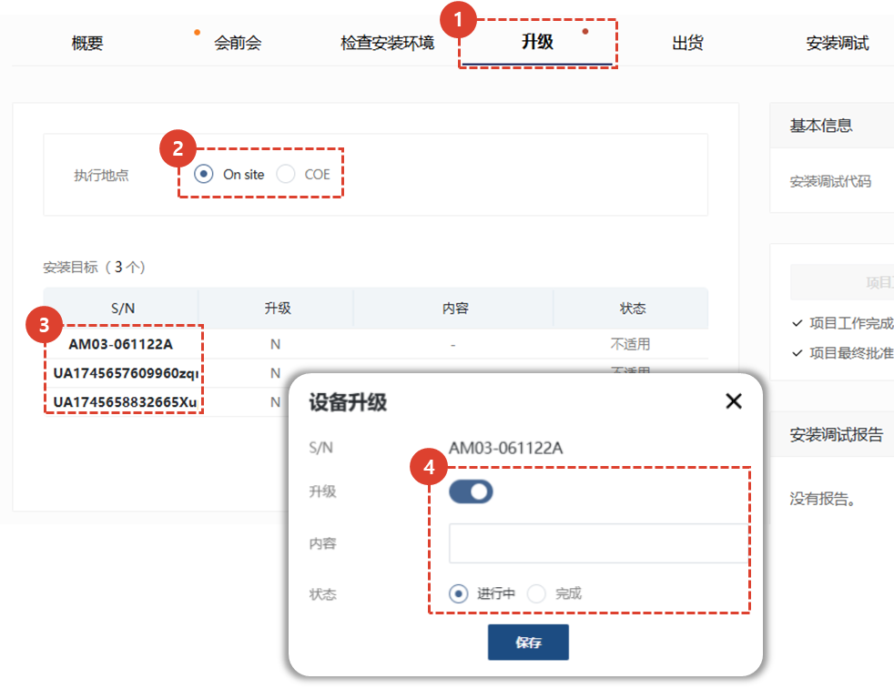
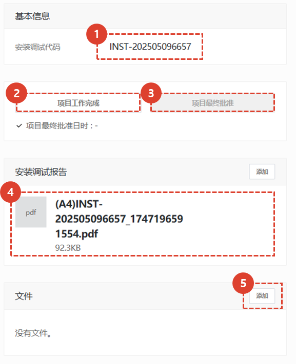
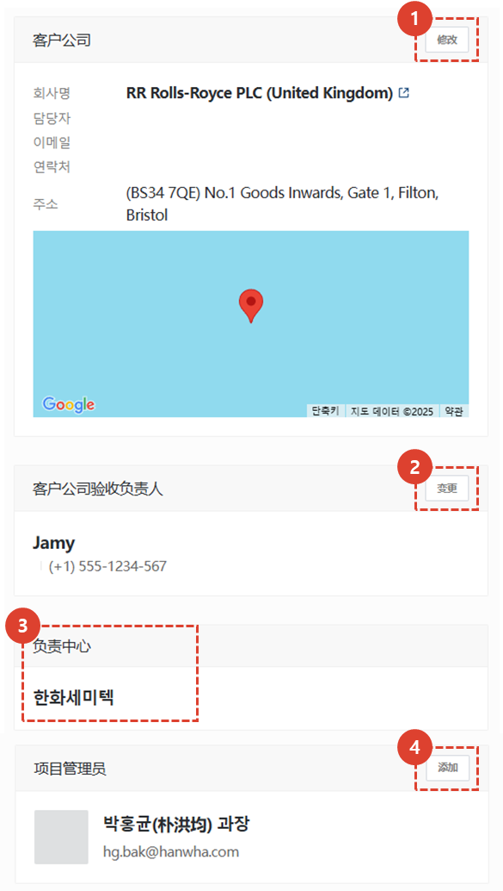

import ValidateTextByToken from "/src/utils/getQueryString.js";
import StrongTextParser from "/src/utils/textParser.js";
import text from "/src/locale/ko/SMT/tutorial-02-installation/02-details-project.json";
import DataAdd from "./img/012_2.png";
import Signature from "./img/039.png";

# 项目细节 - 升级 (HSA)

这将引导您完成“项目详细信息”屏幕上的“升级”选项卡。 这是一个仅限 HSA 的选项卡。 

## 项目详情选项卡指南

<ValidateTextByToken dispTargetViewer={true} dispCaution={true} validTokenList={['head', 'branch', 'agent']}>

1. **概要**：输入安装试驾的基本信息、概要以及发货清单。
1. **会前会**：您可以输入与客户进行安装试驾预会的内容。您可以管理预会所需的细节和时间。
1. **检查安装环境**：（仅限美国公司）如果预会比较困难，您可以保存客户通过电报收到的安装环境信息。
1. **升级**：（仅限美国公司）您可以输入根据客户订单进行可选安装的地点。
1. **出货**：（仅限美国公司）您可以输入发货信息。
1. **安装调试**：您可以输入安装试驾的详细信息，并选择是否确认最终安装试驾。
1. **培训**：可输入安装试驾前后进行的试驾与培训详情。 
1. **缺陷管理**：可输入安装调试后质量稳定的工作历史。
</ValidateTextByToken>
 
 

## 升级 (for HSA)

<ValidateTextByToken dispTargetViewer={false} dispCaution={true} validTokenList={['branch']}>

1. 当需要在交付安装现场（例如 HSA）之前管理修改（升级）时使用此选项卡。
1. 选择演出地点。
    - On site: 现场修改
    - COE: 在公司修改设备后发货
1. 点击序列号更新升级状态。
1. 更新状态并点击“保存”按钮。

</ValidateTextByToken>

## 共同内容
<ValidateTextByToken dispTargetViewer={false} dispCaution={true} validTokenList={['head', 'branch', 'agent']}>

:::info
    这是项目详情页面中各标签页的通用内容。有关通用内容的各项目，请参阅以下内容。
:::
 
 

### 共同内容 - 1/3

1. 您可以查看安装试驾项目的代码。
1. 完成安装试驾后，**操作员**必须点击**项目完成**按钮。点击此按钮后，所有选项卡中的任务都将**处理为完成**。
    :::warning
    您可以在点击“完成”按钮后出现的弹出窗口中更改保修期开始日期。
     在继续完成过程之前，您必须再次检查保修期开始日期是否正确。
    :::
1. 当选择**项目完成**后，该按钮将变为活动状态。**管理员**检查项目结果后，点击**批准项目**按钮。
    :::warning
    您可以在点击“完成”按钮后出现的弹出窗口中更改保修期开始日期。
     在继续完成过程之前，您必须再次检查保修期开始日期是否正确。
    :::
1. 点击查看**安装试驾报告**。如果您完成**安装**选项卡中的所有清单，报告将自动生成。
1. 您可以添加对项目有用的附件。
 
 

### 共同内容 - 2/3

1. 核对客户信息，如需修改，请点击**修改**按钮。
1. 如果需要更改客户审核人，请点击**更改**按钮。
1. 对于负责中心，项目创建后无法更改。
1. 您可以通过**添加**按钮添加项目经理。
 
 

### 共同内容 - 3/3

1. 您可以在时间轴中查看项目的活动历史记录。
1. 您可以通过撰写评论与工程师和经理进行沟通。
    :::tip
    - **重要** 如果您选中该框并写评论，则会向项目中注册的人员发送电子邮件。
    :::
1. 当您需要取消项目时，请使用此选项。安装和调试过程完成后，该按钮将被禁用。
1. 您可以选择**收藏夹**。
</ValidateTextByToken>

