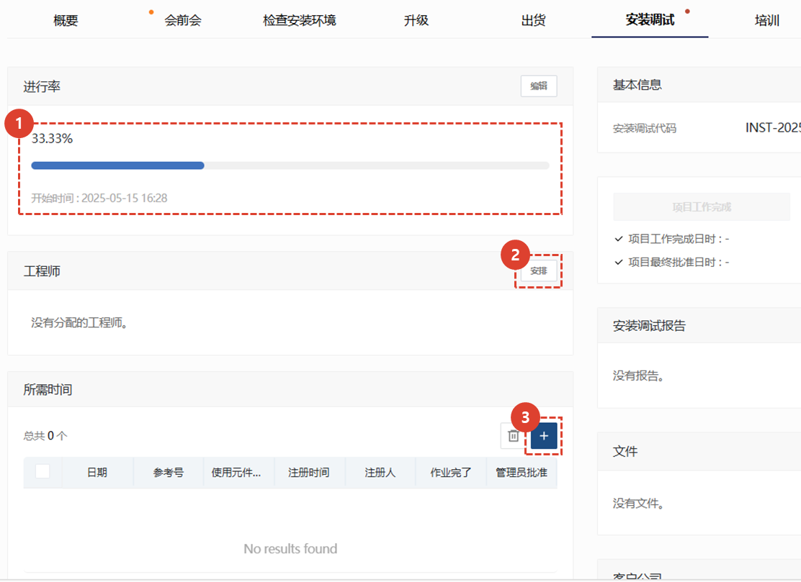
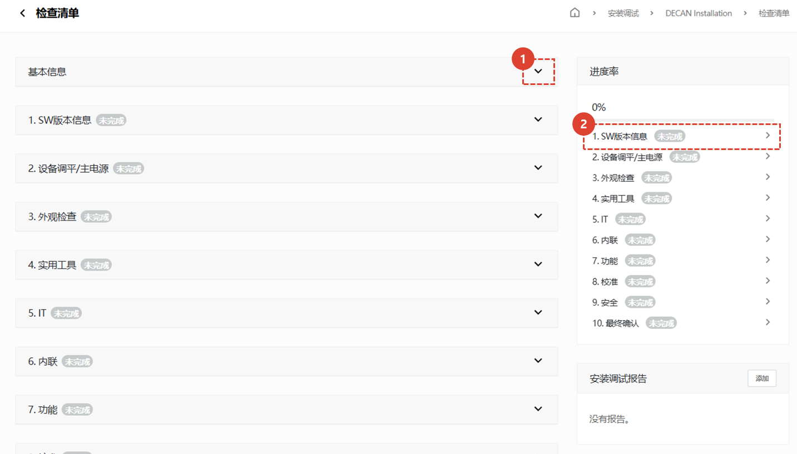
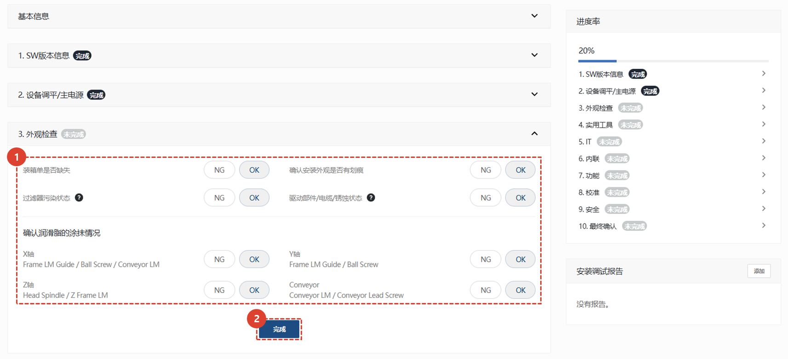
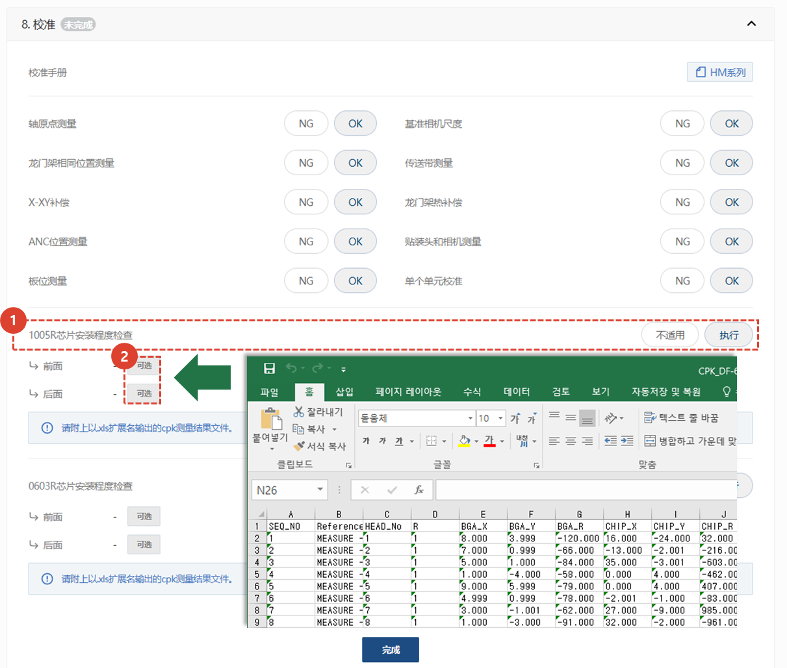
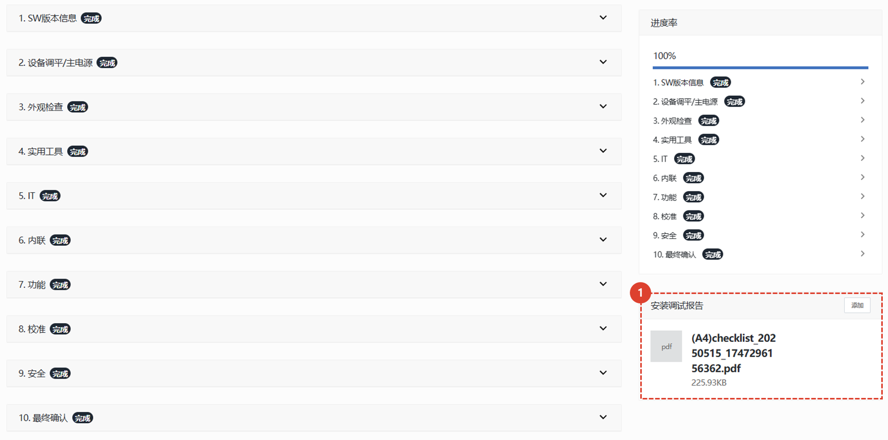
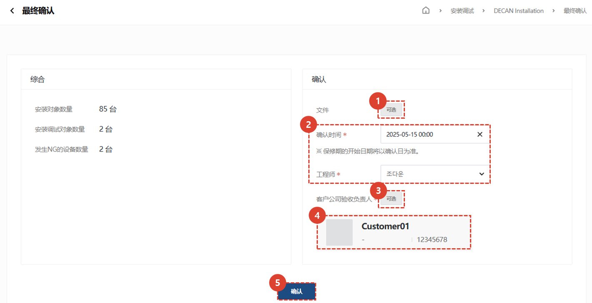
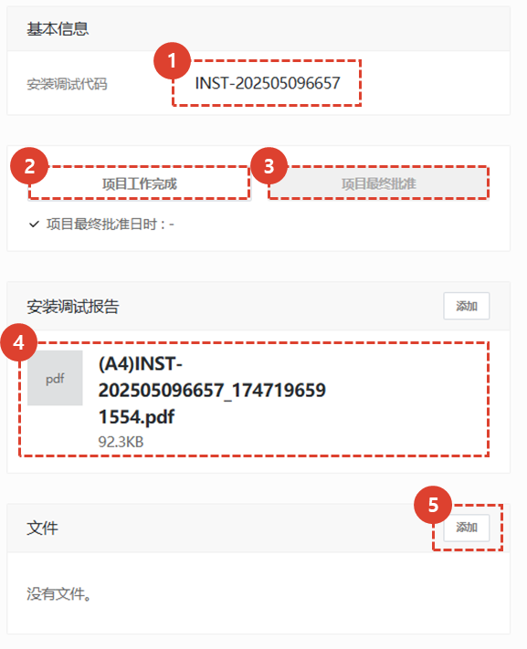

import ValidateTextByToken from "/src/utils/getQueryString.js";
import StrongTextParser from "/src/utils/textParser.js";
import text from "/src/locale/ko/SMT/tutorial-02-installation/02-details-project.json";
import DataAdd from "./img/012_2.png";
import Signature from "./img/039.png";

# 项目细节 - 安装调试

프로젝트 상세 화면의 설치 탭을 안내합니다. 

## 项目详情选项卡指南

<ValidateTextByToken dispTargetViewer={true} dispCaution={true} validTokenList={['head', 'branch', 'agent']}>

1. **概要**：输入安装试驾的基本信息、概要以及发货清单。
1. **会前会**：您可以输入与客户进行安装试驾预会的内容。您可以管理预会所需的细节和时间。
1. **检查安装环境**：（仅限美国公司）如果预会比较困难，您可以保存客户通过电报收到的安装环境信息。
1. **升级**：（仅限美国公司）您可以输入根据客户订单进行可选安装的地点。
1. **出货**：（仅限美国公司）您可以输入发货信息。
1. **安装调试**：您可以输入安装试驾的详细信息，并选择是否确认最终安装试驾。
1. **培训**：可输入安装试驾前后进行的试驾与培训详情。 
1. **缺陷管理**：可输入安装调试后质量稳定的工作历史。
 
 

## 安装调试

1. 单击“安装试用”选项卡。
    :::info
    
     蓝点：有已完成任务时出现。
     橙点：任务已完成并需要管理员批准时出现。
    :::
1. 单击“开始安装试用”。
 
 

1. 一旦“安装测试”开始，您就可以检查进度。
    :::info
    此进度适用于所有需要“安装调试”的设备。
     **示例**：如果五台待安装设备中，只有一台已完成安装调试，则进度为 20%。
    :::
1. 添加参与安全测试活动的工程师。
1. 输入该任务所花费的时间。（用于成本核算）
 
 

1. 输入所需时间。
1. 附上试驾和培训期间需要参考的文件（例如培训报告）。
1. 如果您想在日历上显示添加的所需时间，请点击勾选按钮。
 
 

1. 添加试驾和培训期间使用的零件。
1. 输入零件信息。
1. 点击**添加**按钮，检查零件是否已正常添加到列表中。
:::warning
如果您的工作需要零件，您必须输入您需要使用的零件才能在商店申请免费供应。
:::
1. 您可以通过**申请发货**按钮申请材料发货。
1. 点击**保存**，完成安装调试所需工时登记（建议填写成本处理相关项目）。
 
 

### 选择安装目标

1. 点击安装目标。 点击目标后，安装测试将开始。
1. 如果您拥有多个资产，可以执行序列号搜索。
 
 

### Check List

1. 打开每个步骤并输入检查结果。
1. 您可以点击进度列表移动到相应的步骤。
 
 

1. 检查每一项并输入结果。
1. 输入完成后，点击**完成**按钮。
     已完成的项目显示在进度条中。
    :::info
    安装和操作清单在**最终确认**前可以修改。
     如需修改，请在修改后再次点击**完成**按钮进行保存。
    ::: 
 
 

1. 如果您已在步骤**8. 校准**中执行了芯片贴装精度测试，请点击**执行**按钮。
1. 点击**选择**，上传从设备中提取的贴装偏移数据 Excel 文件。
    :::info
    当您上传安装偏移数据时，安装试驾报告中会创建安装度图。
    :::
 
 

1. 检查清单完成后，将自动生成设备的安装和调试报告。
 
 

### 客户评论

1. 安装和调试100%完成后，即可进行**最终确认**。
     您将被带到最终确认页面。
 
 

1. 如果有附件，请按照附件进行操作。
1. 选择确认日期和时间，以及工程师。
    :::warning
    保修期从输入的**确认日期**开始。
    :::
1. 选择客户检验经理。
1. 检查客户检验经理是否输入正确。
1. 点击**确认**按钮结束安装试运行。
    :::info
    

     客户公司审核员签名后，您必须点击“保存”才能完成项目。
    1. 如果可以使用手写签名，请选择并使用手写签名。
    1. 如果电子签名不具有法律效力，例如在**中国**，请附上可以替代签名的可信文件。
    :::
    :::warning
    本页面附件为替代签名的文件，请将工作相关附件上传至通用项目进行安装运行。
    :::
 
 

## 共同内容

:::info
    这是项目详情页面中各标签页的通用内容。有关通用内容的各项目，请参阅以下内容。
:::
 
 

### 共同内容 - 1/3

1. 您可以查看安装试驾项目的代码。
1. 完成安装试驾后，**操作员**必须点击**项目完成**按钮。点击此按钮后，所有选项卡中的任务都将**处理为完成**。
    :::warning
    您可以在点击“完成”按钮后出现的弹出窗口中更改保修期开始日期。
     在继续完成过程之前，您必须再次检查保修期开始日期是否正确。
    :::
1. 当选择**项目完成**后，该按钮将变为活动状态。**管理员**检查项目结果后，点击**批准项目**按钮。
    :::warning
    您可以在点击“完成”按钮后出现的弹出窗口中更改保修期开始日期。
     在继续完成过程之前，您必须再次检查保修期开始日期是否正确。
    :::
1. 点击查看**安装试驾报告**。如果您完成**安装**选项卡中的所有清单，报告将自动生成。
1. 您可以添加对项目有用的附件。
 
 

### 共同内容 - 2/3

1. 核对客户信息，如需修改，请点击**修改**按钮。
1. 如果需要更改客户审核人，请点击**更改**按钮。
1. 对于负责中心，项目创建后无法更改。
1. 您可以通过**添加**按钮添加项目经理。
 
 

### 共同内容 - 3/3

1. 您可以在时间轴中查看项目的活动历史记录。
1. 您可以通过撰写评论与工程师和经理进行沟通。
    :::tip
    - **重要** 如果您选中该框并写评论，则会向项目中注册的人员发送电子邮件。
    :::
1. 当您需要取消项目时，请使用此选项。安装和调试过程完成后，该按钮将被禁用。
1. 您可以选择**收藏夹**。
</ValidateTextByToken>

