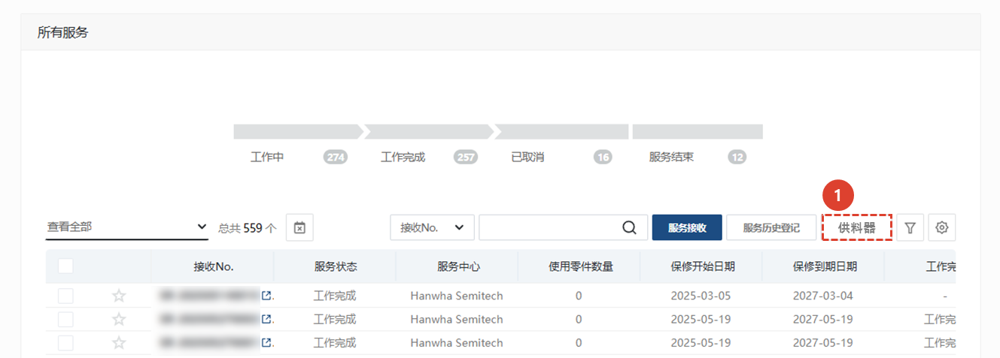
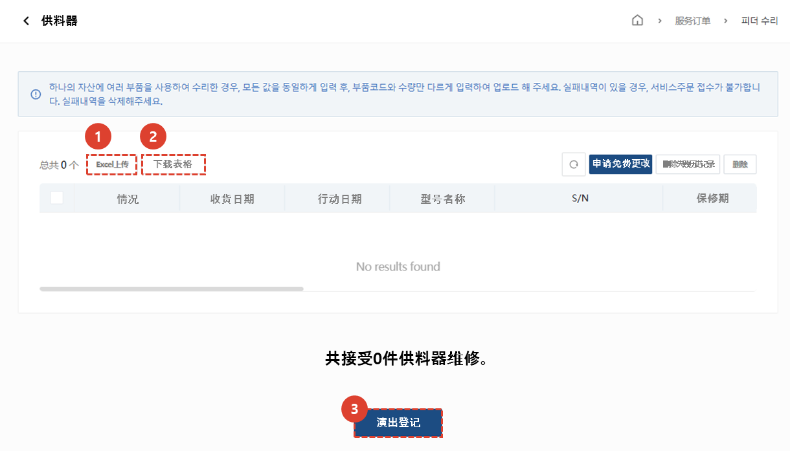

import ValidateTextByToken from "/src/utils/getQueryString.js";
import StrongTextParser from "/src/utils/textParser.js";
import text from "/src/locale/ko/SMT/tutorial-01-auth/create-a-acount-circle-user.json";

# 飞达维修

我们将指导您完成注册和处理进纸器维修请求的过程。
<ValidateTextByToken dispTargetViewer={true} dispCaution={true} validTokenList={['head', 'branch', 'agent']}>

## 服务列表

1. 选择**服务**。
1. 将显示所有服务的列表。
      - 工作中 : 指示正在处理的服务数量。单击后，仅显示正在处理的服务列表。
      - 工作完成 : 表示已完成的服务数量。点击后，列表中仅显示已完成的服务。
      - 已取消 : 表示已取消的服务数量。点击后，列表中仅显示已取消的服务。
      - 服务结束 : 显示接受服务后未按正常流程处理而被终止的服务数量。点击后，列表中仅显示已终止的服务列表。
1. 服务接收 : 您可以注册成为一般服务接待员。 
      - 这适用于您仅先注册应用程序或有单独的管理员接收和注册应用程序时使用。
1. 服务历史登记 : 您可以一次性输入从服务接待到处理细节的所有内容。 
      - 适用于服务工作完成后，需要立即录入接待及工作详情时使用。
1. [飞达维修](./create-a-service-order_feeder.md) : 当您需要输入多个资产（例如喂食器）的服务历史记录时，请继续操作。与**接收**和**执行登记**不同，您只需输入**接收日期**和**行动日期**即可注册服务，无需添加移动/工作/用餐所需的时间。
 
 

## 飞达维修

1. 选择**飞大维秀**。
 
 

1. 选择**下载表格**，下载送料器维修表格。
1. 在下载的**表格**中填写服务详情并保存。
    :::note
      收货日期和操作日期必须以“20250301”的格式输入。
      您必须正确输入供料器的**S/N**才能自动检索客户信息。
      服务类别和服务类型必须从表单右侧的项目中选择。
    :::
1. 选择**Excel上传**，将填写好的表格进行登记。
1. 检查填写的数据，然后点击**登记成绩**按钮，即可完成申请。
</ValidateTextByToken>