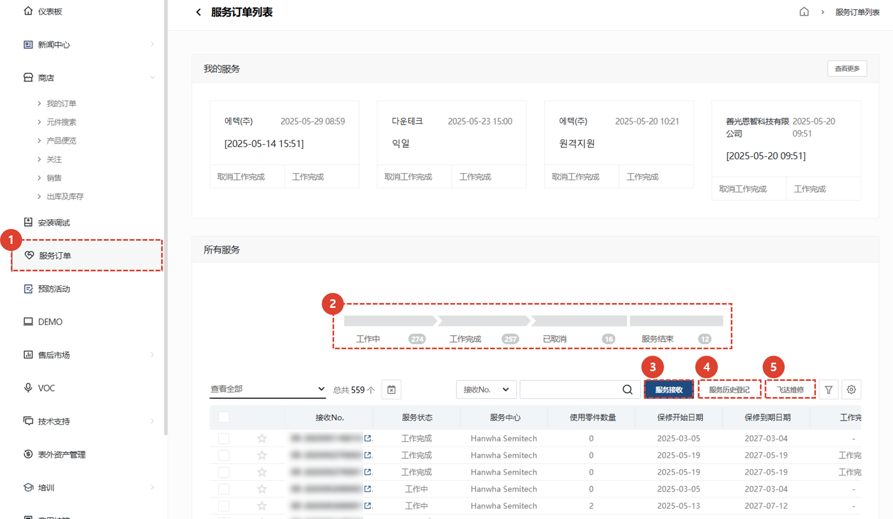
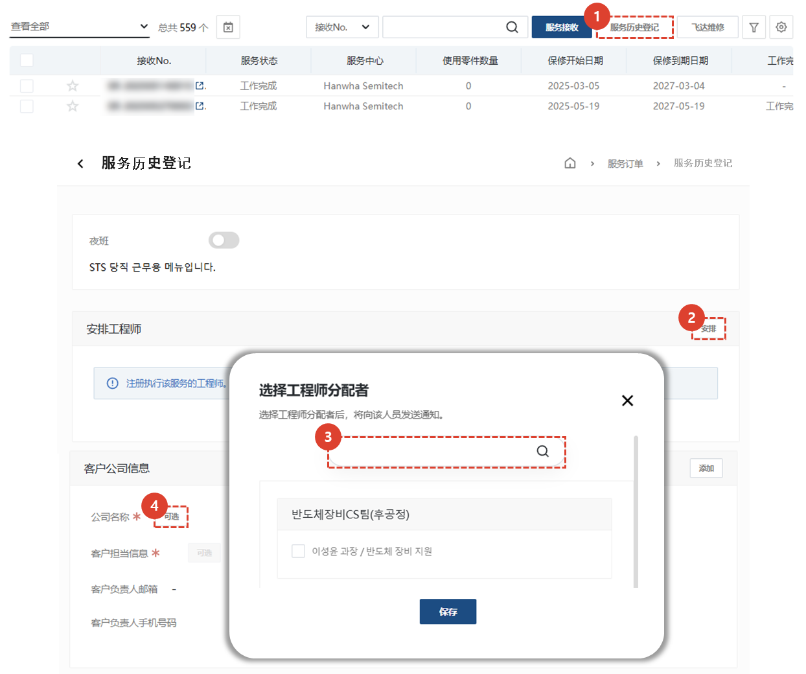
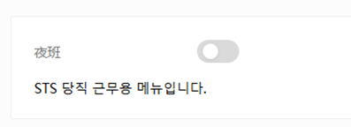
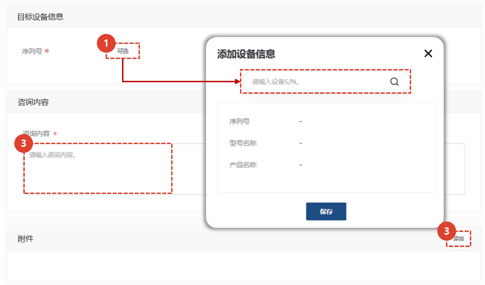
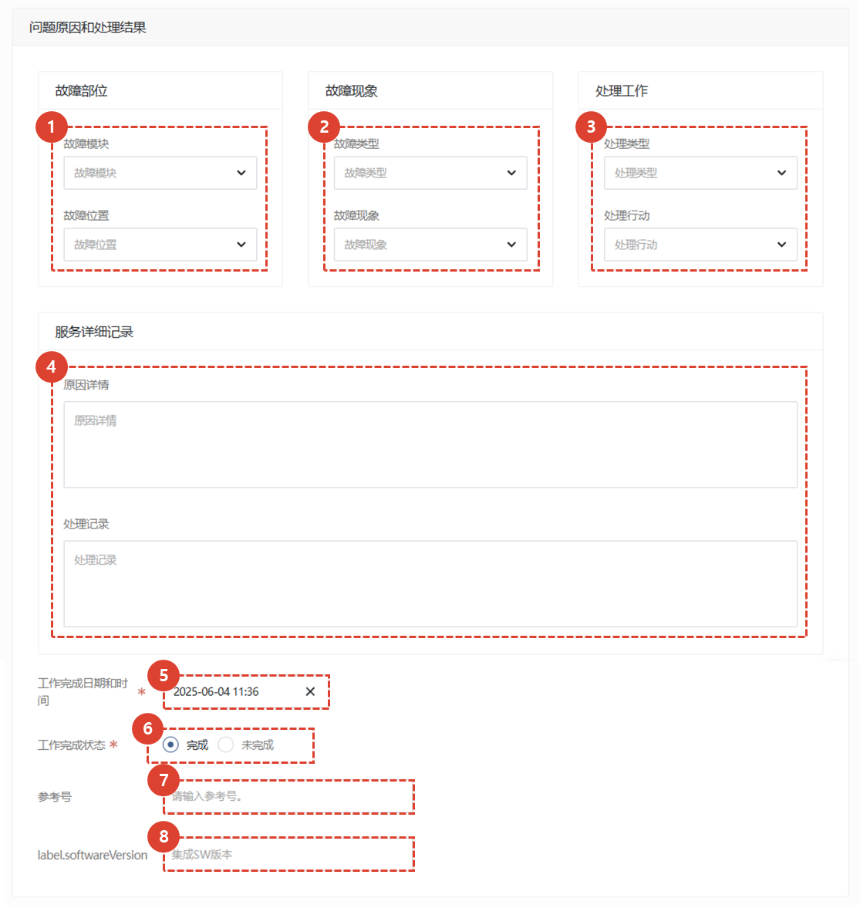
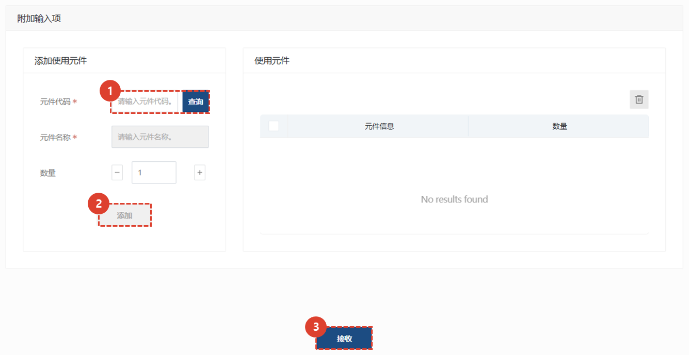

import ValidateTextByToken from "/src/utils/getQueryString.js";
import StrongTextParser from "/src/utils/textParser.js";
import text from "/src/locale/ko/SMT/tutorial-01-auth/create-a-acount-circle-user.json";

# 服务历史登记
与注册服务后再输入处理详细信息的基本程序不同，我们将引导您完成性能注册选项卡，您可以在其中一次性输入服务接收/注册/处理。
<ValidateTextByToken dispTargetViewer={true} dispCaution={true} validTokenList={['head', 'branch', 'agent']}>

## 服务列表

1. 选择**服务**。
1. 将显示所有服务的列表。
      - 工作中 : 指示正在处理的服务数量。单击后，仅显示正在处理的服务列表。
      - 工作完成 : 表示已完成的服务数量。点击后，列表中仅显示已完成的服务。
      - 已取消 : 表示已取消的服务数量。点击后，列表中仅显示已取消的服务。
      - 服务结束 : 显示接受服务后未按正常流程处理而被终止的服务数量。点击后，列表中仅显示已终止的服务列表。
1. 服务接收 : 您可以注册成为一般服务接待员。 
      - 这适用于您仅先注册应用程序或有单独的管理员接收和注册应用程序时使用。
1. 服务历史登记 : 您可以一次性输入从服务接待到处理细节的所有内容。 
      - 适用于服务工作完成后，需要立即录入接待及工作详情时使用。
1. [飞达维修](./create-a-service-order_feeder.md) : 当您需要输入多个资产（例如喂食器）的服务历史记录时，请继续操作。与**接收**和**执行登记**不同，您只需输入**接收日期**和**行动日期**即可注册服务，无需添加移动/工作/用餐所需的时间。
 
 

## 服务历史登记 - 1/2

1. 选择**服务历史注册**。
    :::note
    
    此按钮为在韩国服务外包公司值班时管理人员使用。
    :::
1. 选择**分配**来分配工程师。
1. 点击**选择**来登记客户信息。
    :::note
    如果您不首先搜索目标设施或资产，则无法注册为客户。
    :::
1. 点击**选择**设置客户的联系人。
 
 

## 服务历史登记 - 2/2

1. 点击**选择**，输入目标设施信息。
1. 输入客户询价详情。
1. 点击**添加**，输入相关附件文件。
 
 

### 服务处理 - 1/2

1. 选择故障模块及详细故障部位。
1. 选择故障类型及现象。
1. 选择处理类型及工作内容。
1. 详细填写服务详情。
1. 选择**处理日期**。
1. 选择**服务处理完成类别**。如果服务处理已完成，请选择**完成**。
1. 输入相关参考编号。
1. 输入集成软件版本。
 
 

### 服务处理 -2/2

1. 输入所用零件代码，然后单击**搜索**按钮。 
    :::note
    如果系统中已注册零件代码，则会自动输入零件名称和单价。
    如果没有注册，则在“分类”选项卡中会显示原因，您可以根据需要直接输入数据。
    :::
1. 点击“添加”注册一个部件。
1. 检查已注册的部件。
1. 点击“保存”按钮保存操作内容。
</ValidateTextByToken>