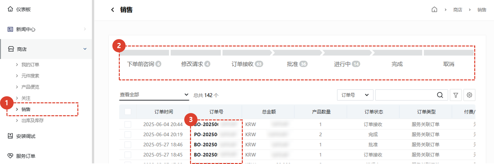
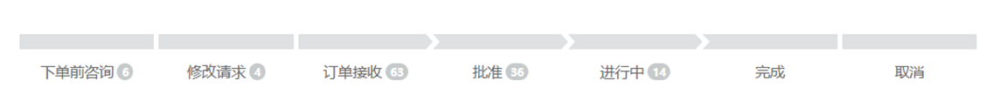
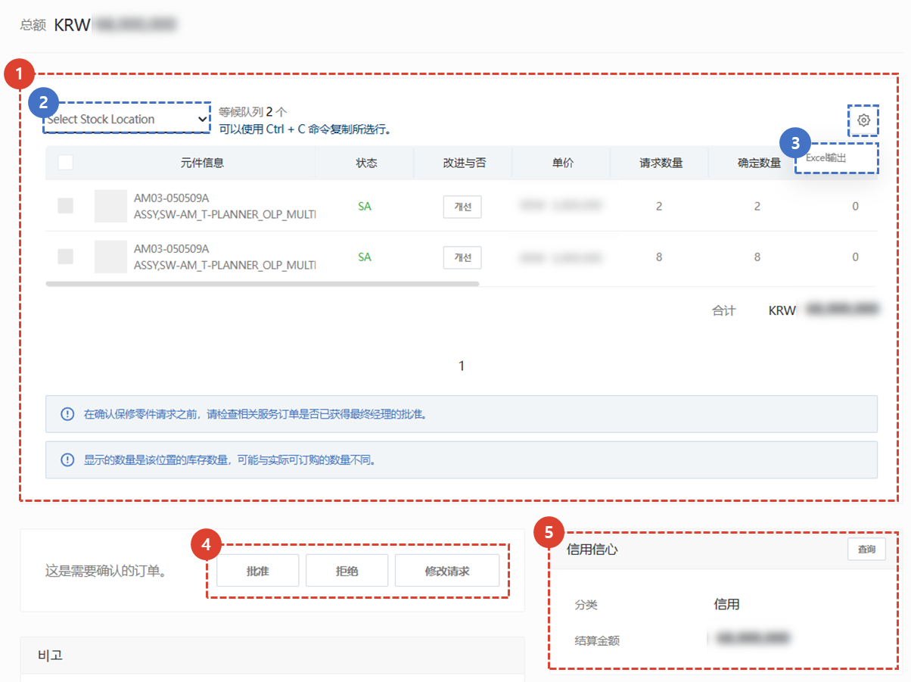
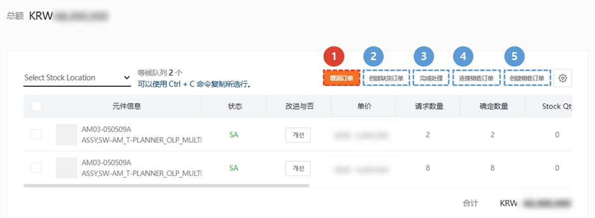
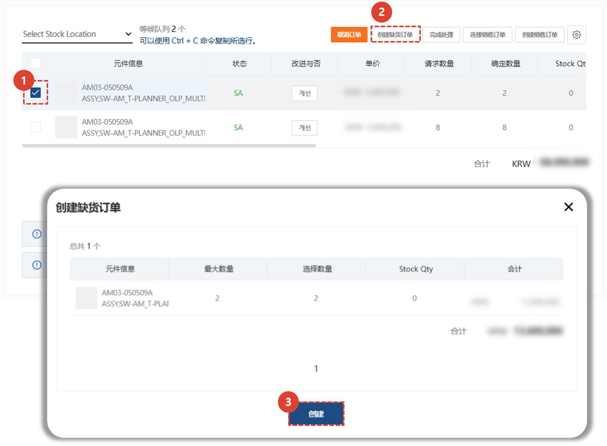
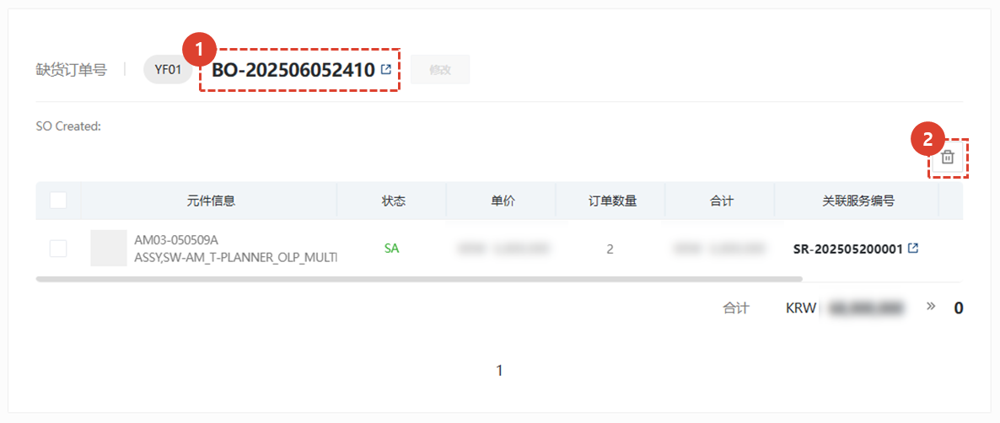
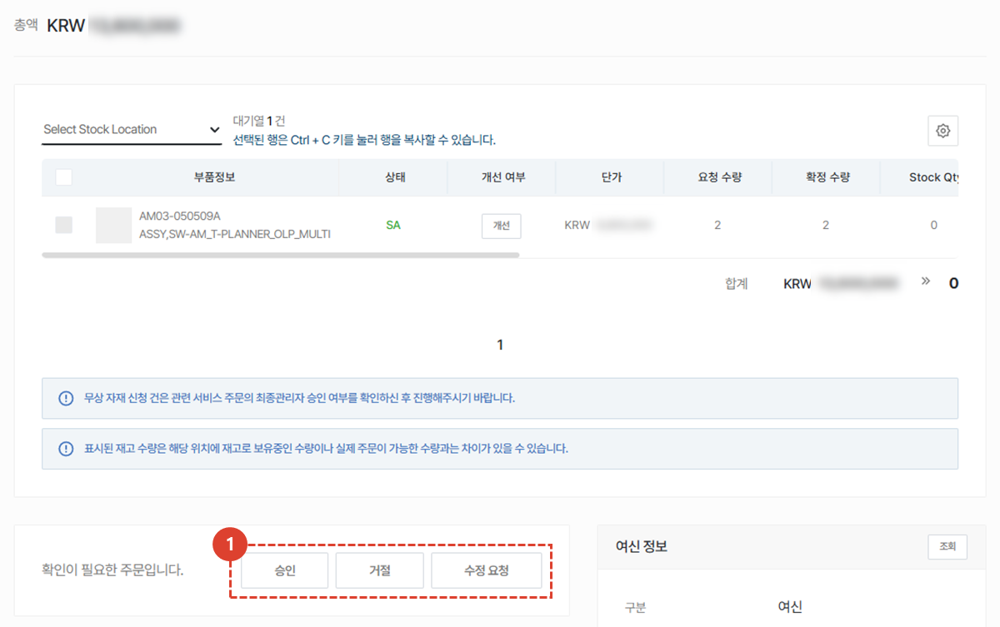
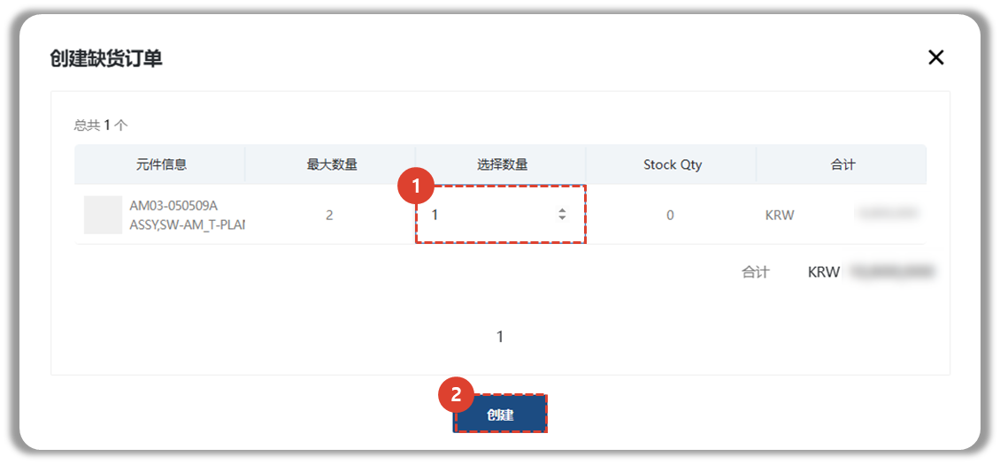
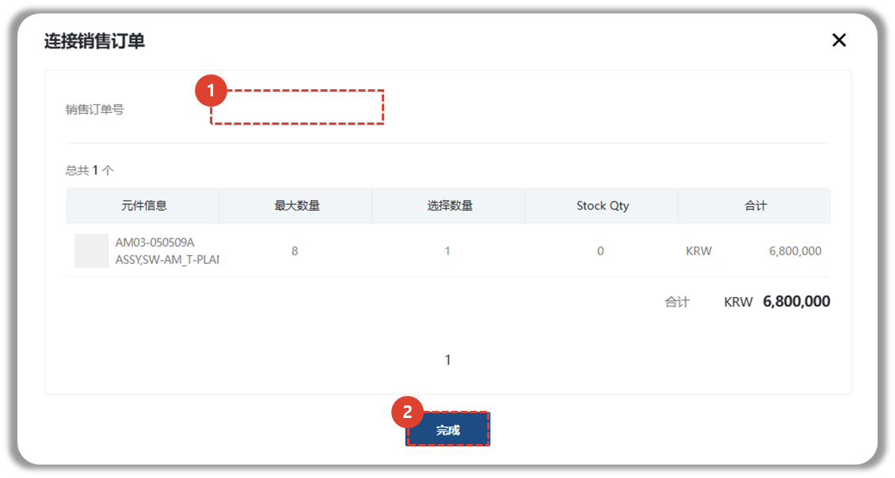

import ValidateTextByToken from "/src/utils/getQueryString.js";
import Cancle from "./img/057.png";
import back_order from "./img/058.png";
import circle from "./img/062.png";

# 订单处理

<ValidateTextByToken dispTargetViewer={true} dispCaution={false} validTokenList={['head', 'branch', 'seller', 'agent']}>
我们将指导您完成已收到订单的处理流程。

## 订单列表

1. 选择**商店** - **销售**菜单。
1. 在订单列表中查看订单状态。
    :::info
    订单列表中可查看的项目如下：
    - 订单信息
    - 订单号
    - 总金额
    - 商品数量

    - 订单状态
    - 订单类型
    - 付费/免费分类：付费/免费分类根据服务订单类型进行，审批中心经理可根据需要进行修改。
    - 申请中心
    - 审批中心
    - 订购人信息（姓名、邮箱、手机号码）
    - 询价
    - 客户信息（客户公司名称、客户公司经理姓名、经理邮箱、手机号码）
    :::
1. 点击订单号，进入详情页面。
 
 

### 订单状态

- 订购前询问：买家在暂时保存订单时写下了**评论**。
    :::warning
        需要订单处理器对**评论**进行**回复**。
    :::
- 修改请求：这是卖方请求买方修改订单的订单。
- 订单已收到：这是买方已收到卖方的订单。
- 已批准：这是卖方已批准的订单。
- 进行中：发出采购订单 (SO) 时显示为“进行中”。
- 已完成：所有订单项目均分配了订单编号 (DO) 时显示为“完成”。
- 已取消：这是已取消的订单。
 
 
</ValidateTextByToken>

## 订单处理第一步
<ValidateTextByToken dispTargetViewer={false} dispCaution={true} validTokenList={['head', 'branch']}>

1. 查看订单项目信息。
     您可以在列表中查看零件信息、零件状态、改进状态、单价、申请数量、确认数量、库存数量、总计、相关服务编号、服务类型、最终管理员审批状态、目标序列号和备注。 
1. 您可以通过选择**Storate Location**来查看特定物料仓库的库存。
1. 您可以**将订单列表导出到Excel**。
1. 检查内容后，选择是否批准订单。
    - 批准：批准订单。[点击此处查看批准后的流程。](#订单处理-步骤 2)
    - 拒绝：订单被拒绝/取消。 您必须为订单输入**拒绝原因**，输入后会向订单创建者发送电子邮件。
    - 修改请求：请求修改订单。 您必须为订单输入**修改原因**（例如数量变更、价格变更、零件代码变更等原因），输入后会向订单创建者发送电子邮件。
1. 您可以检查买家与此相关的信用信息。
 
 

## 订单处理第 2 步

已批准的订单可以通过以下五种方式处理：

1. **取消订单** : 如果订单信息的免费或付费状态发生变化等原因，您可以取消采购订单。
    :::info
        

        如果订单信息发生变化（例如免费或付费状态发生变化），您可以取消采购订单。已取消的订单可以申请修改并重新批准。
    :::
1. **创建缺货订单** : 当中间卖家需要从订单中重新订购零件到总部时使用。
1. **完成处理** : 此按钮由非企业代理中心用于处理从其他代理机构收到的订单。点击“完成处理”按钮后，**订单文件将被标记为“已完成”并发送给买家。
1. **连接销售订单** : 当您已经在 SAP 中下了销售订单并想要输入信息时使用此功能。
1. **创建销售订单** : 根据此订单发出销售订单时使用此项。
 
 

</ValidateTextByToken>

### 创建缺货订单

<ValidateTextByToken dispTargetViewer={false} dispCaution={true} validTokenList={['head', 'branch', 'seller']}>

延期交货是**中间卖家**（例如 Amtest 等公司或物料基地）用来响应买家订单请求，然后向总部下订单以补充库存的菜单。基于此订单，总部将创建一个订单。
:::info
只有在请求免费材料时才可以创建缺失材料。
:::

1. 勾选需要订购至总部的零件，以确保库存。
​​1. 点击**创建缺货订单**按钮。
1. 勾选需要创建缺货订单的零件数量。您可以双击**选定数量**进行编辑。
 单击**创建**按钮来创建预订订单。
    :::info
    

    一旦 SO 保存完毕，您必须按下 **Circle Payment Submission** 按钮提交 Circle 请求。
    :::
 
 

创建后门后，零件列表底部将显示**订单历史记录**。
1. 点击后门编号，查看**订单详情**。
2. 点击**删除**按钮，取消已创建的订单。

</ValidateTextByToken>

<ValidateTextByToken dispTargetViewer={false} dispCaution={true} validTokenList={['head']}>

:::info

1. 总部物料发货经理将检查待发货订单信息，然后处理批准/拒绝/修改请求。
 后续流程与**创建销售订单**相同。
:::
 
 
</ValidateTextByToken>

### 完成处理
<ValidateTextByToken dispTargetViewer={false} dispCaution={true} validTokenList={['head', 'branch', 'seller']}>
**完成处理**是非企业代理中心处理来自其他代理的订单时使用的按钮，用于记录处理结果。

1. 输入订单已完成的零件数量。 输入最大数量，如需修改，请双击修改。
1. 点击**完成**按钮，完成流程。
    :::warning
        

    :::
 
 
</ValidateTextByToken>

### 连接销售订单
<ValidateTextByToken dispTargetViewer={false} dispCaution={true} validTokenList={['head']}>

1. 输入内部系统发出的销售订单号。
1. 点击**完成**按钮，连接销售订单。
 
 

### 创建销售订单

1. 选择订单发出金额。
2. 选择付款公司和收货公司。
3. 选择成本中心。
4. 点击**完成**按钮。
</ValidateTextByToken>