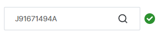
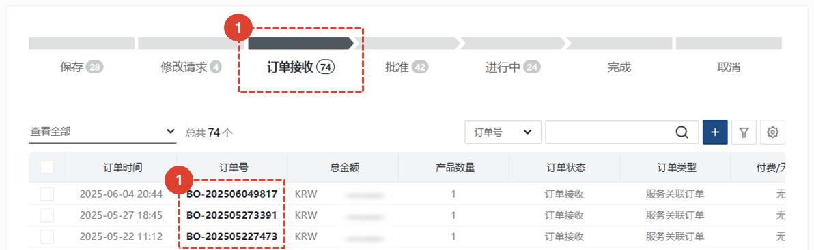

import ValidateTextByToken from "/src/utils/getQueryString.js";
import StrongTextParser from "/src/utils/textParser.js";
import text from "/src/locale/ko/SMT/tutorial-03-store/01-create-order-buyer.json";

# 填写订单 - 普通订单
<ValidateTextByToken dispTargetViewer={true} dispCaution={true} validTokenList={['head', 'branch', 'agent']}>
通用订单是指直接添加与服务和订单（付费采购订单）无关的零件的流程。
这是通用付费服务零件订单菜单，可通过直接输入、从兴趣列表导入、Excel 上传等方式添加零件。
 
 

## 添加订单

1. 点击“常规订购”按钮。
1. 点击“订购”按钮。
 
 

## 부품 추가

1. 您可以通过搜索零件代码来添加采购订单应用程序零件。
    :::info
     → 正常搜索 
     → 没有正确搜索 **(没有进展)**
    :::
1. 输入数量
1. 输入与您所申请零件相关的特殊信息。
     例）相关文件、专用零件信息、送货地址等。
1. 点击**添加**按钮进行添加。
1. 可以使用 Excel 批量上传。
    :::note
    
    1. 您可以获取 Excel 表格。 
    1. 通过在 Excel 中输入数据来添加文件。 
        - (必需输入)**Parts Code** : 输入零件代码。
        - (必需输入)**Quantity** : 输入零件数量。
        - **Price** : 仅当以非正常价格销售时才输入特价。 **如果未输入，则将自动应用一般价格。**
        - **Remarks** : 输入注释详细信息。
    :::
 
 

## 查看订单列表并输入附加信息

1. 如果状态列的值为 SNA/DNA，则无法处理订单。
    - 如果状态为 **无信息**，则确定物料经理尚未更新，因此可以处理订单。
1. 对于 SNA/DNA，您可以查看改进情况。**(TBD)**
1. 您可以查看订单数量并**双击**进行修改。
1. 您可以在**卖家中心**查看库存数量
:::info
    清单显示**零件信息**/**状态**/**改进状态**/**单价**/**订单数量**/**总计**/**库存**以及
     **负责中心**/**备注**/**最小起订量**和**交货期限**。
:::

## 输入附加信息并创建订单

1. 输入订单的整体备注。
1. 如有附件，请添加文件。
1. 如果订单尚未确认，请点击“保存草稿”。点击“保存草稿”按钮后，即使您离开当前页面，**您输入的数据也不会丢失**。
:::info
    
    1. 临时保存的订单在列表中会停留在**保存**状态。
    1. 您可以查看已保存的订单。
    1. 订单列表和备注无法修改。如需修改，请点击底部的**修改**按钮。
    1. 输入与卖家沟通的信息。
    1. 订单信息将会显示。
    1. 如需处理临时保存的订单，请点击**修改**按钮，然后在出现的修改页面上点击**订单**按钮。
:::
1. 要创建订单，请点击**订单**按钮。
 
 

## 订单完成

1. 对于已完成的订单，该订单将保留在列表中的**订单已收到**状态。
1. 您可以点击**订单号**查看订单。
 
 

1. 输入与卖家沟通的信息。
1. 您可以在卖家批准订单**之前**修改您的订单。
1. 您可以在卖家批准订单**之前**取消您的订单。
 
 
</ValidateTextByToken>