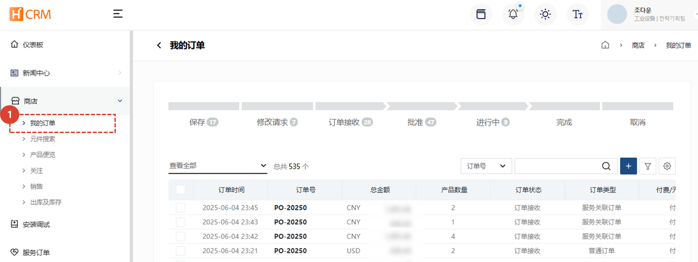
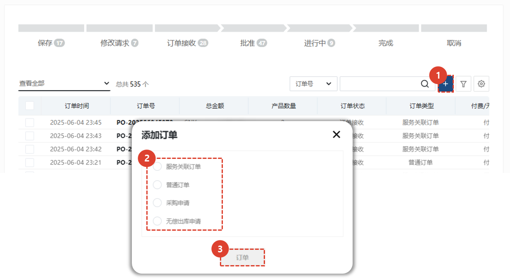

import ValidateTextByToken from "/src/utils/getQueryString.js";
import StrongTextParser from "/src/utils/textParser.js";
import text from "/src/locale/ko/SMT/tutorial-03-store/01-create-order-buyer.json";

# 我的订单

商店中“我的订单”菜单的指南。

<ValidateTextByToken dispTargetViewer={true} dispCaution={true} validTokenList={['head', 'branch', 'agent']} >

## 订单列表

1. **商店** - 选择**我的订单**。
1. 查看您的订单列表。
 
 

## 订单列表 - 订单状态

- 已保存：订单已暂时保存。
- 修改请求：订单处于卖家请求客户修改的状态。
- 订单已收到：订单处于客户已创建订单并从卖家处收到的状态。
- 已批准：订单处于卖家已批准的状态。
- 处理中：订单处于已批准的订单正在向客户发货的状态。
- 已完成：订单处于已完成向客户发货的状态。
- 已取消：订单处于客户已取消的状态。
 
 

## 创建订单

1. 点击 **+** 按钮创建订单。
1. 从四种订单创建方式中选择一种。
- 服务关联订单：用于订购服务订单中使用的零件（尤其是申请免费物料时）。
- 通用订单：用于创建通用付费采购订单。
- 采购询价：这是面向企业用户的菜单。用于为企业创建付费采购订单。
- 免运费：（仅限总部）您可以将其视为在 CRM 中创建一个圈起来的通用免运费询价。
1. 选择一种类型，然后点击 **订单** 按钮。
</ValidateTextByToken>