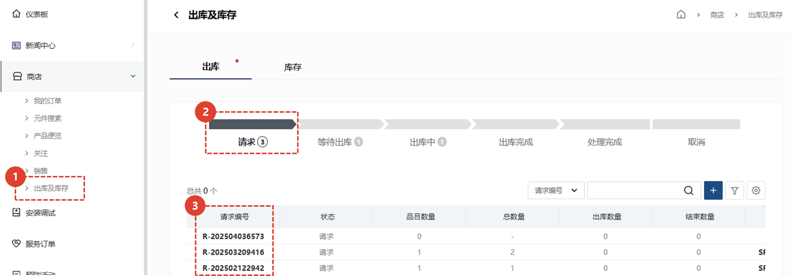
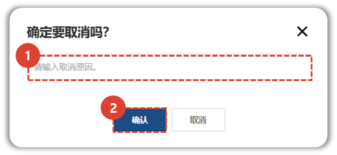
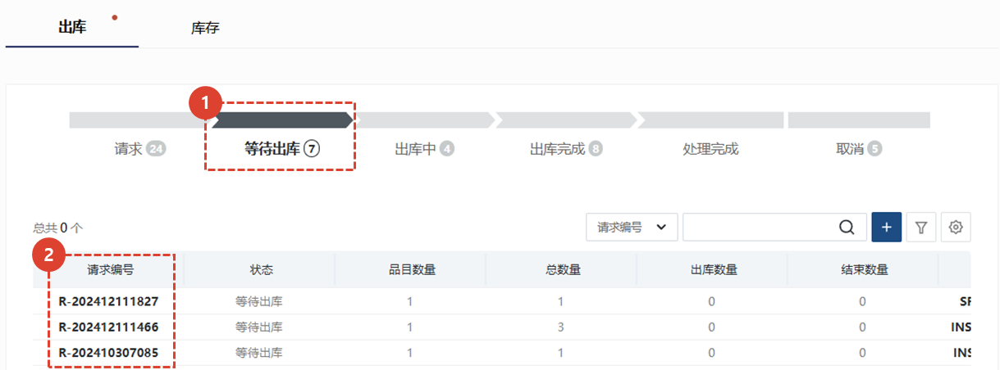
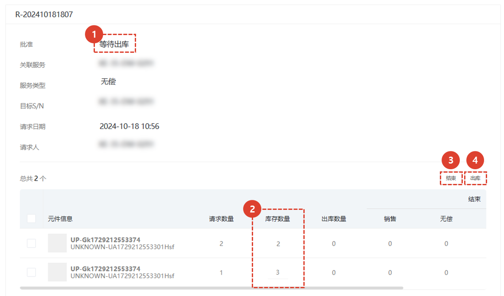
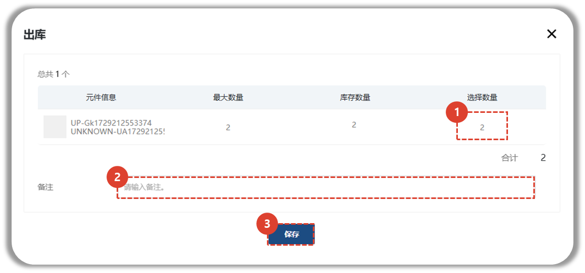
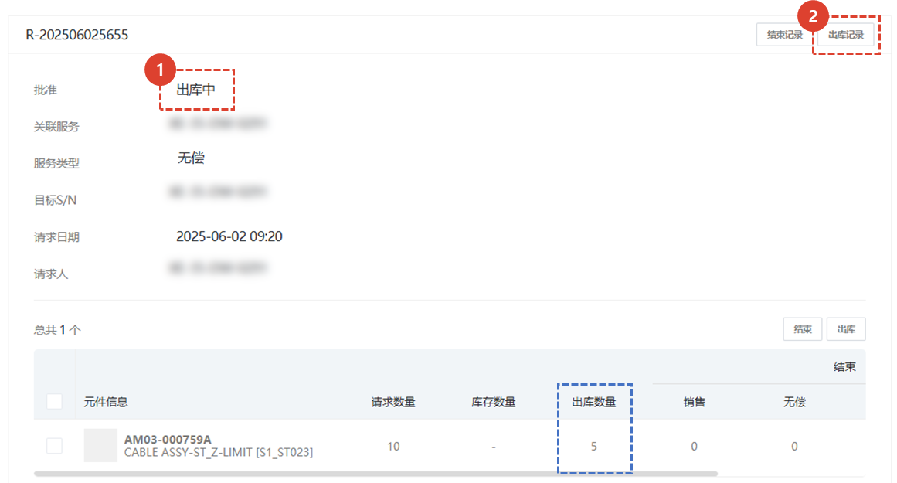
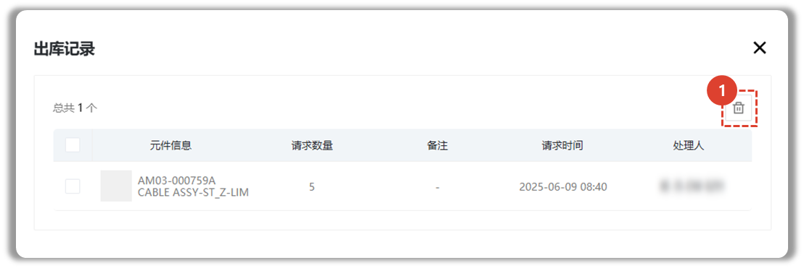
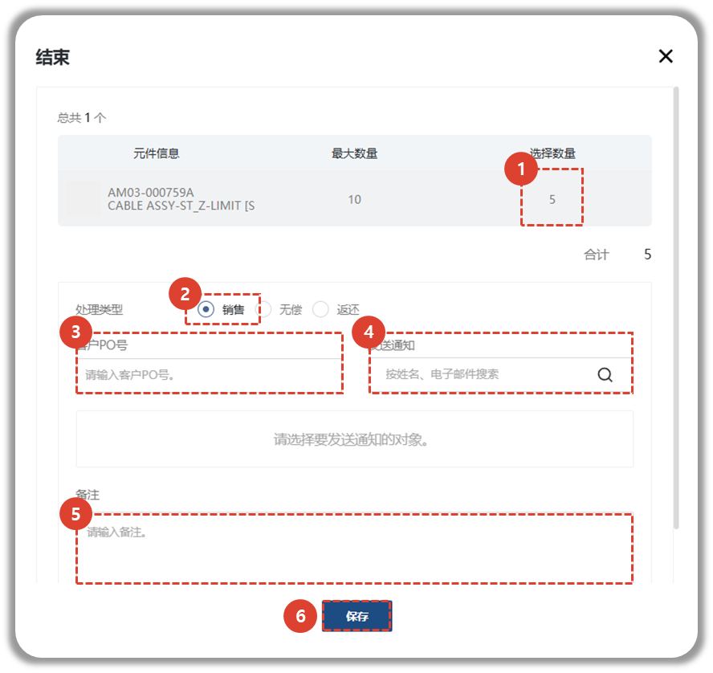

import img043 from "./img/043.png";
import img046 from "./img/046.png";
import ValidateTextByToken from "/src/utils/getQueryString.js";

# 服务部件放行审批与管理

<ValidateTextByToken dispTargetViewer={true} dispCaution={true} validTokenList={['head', 'branch']}>

当需要服务零件收据/放行请求和批准流程时，我们将指导您完成使用程序。

## 查看运输请求详情

1. 点击商店 → 配送和库存菜单。
1. 点击“配送”标签页中的“请求”，筛选后仅显示已请求的商品。
1. 点击**请求编号**
 
 

1. 检查发货状态。确认其处于**申请**阶段。
1. 如果有相关服务订单，则会显示服务订单号、服务类型以及服务目标资产的序列号。
1. 检查申请日期和申请者信息。
1. 检查申请零件列表。
1. 如果有拒绝原因，请点击。
1. 点击[批准]按钮进行发货审批。
 
 

## 发货请求被拒绝

1. 输入拒绝原因。
1. 点击“确认”按钮。
 
 

## 출고 요청 승인

在单击“发货请求批准”步骤中的“批准”按钮后出现的模式屏幕中，再次单击“确认”按钮。
 
 

## 출고 진행

1. 单击“货件”选项卡中的“待发货”栏。
1. 单击“请求详情”。
 
 

1. 检查状态是否为**等待发货**。
1. 您可以查看库存数量。
    :::info 재고수량 위치
    显示基础信息→中心→基本信息→仓储位置值对应仓储位置的可用库存数量。
    ::: 
1. 执行结账处理。
1. 继续进行装运处理。
 
 

## 运输

1. 双击货件数量进行编辑。
1. 输入与货件相关的备注。
1. 点击“保存”按钮。
:::warning
    由于这里的工作仅涉及系统处理，因此您必须根据所描述的内容实际进行实际零件的运送。
:::
 
 

### 查看运输历史记录

1. 当发生发货记录时，状态将更改为**发货中**。
1. 您可以点击“发货记录”按钮查看发货记录。
 
 

- 检查运输历史记录。
1. 如果商品尚未实际发货，您可以点击删除按钮删除发货历史记录。
 
 

## 最后期限

### 成交 - 销售

1. 您可以修改待处理的数量。
1. 选择**处理类型**为**销售**。
1. 输入**客户采购订单**编号。
    :::tip
    由于管理目的较大，请输入正确的数据。
    :::
1. 搜索可以分享成交详情的用户。
    :::info
    您只能在属于我的中心的用户中进行搜索。
    :::
1. 输入管理所需的其他信息。
1. 点击保存按钮。
 
 

### 截止日期 - 免费供应

1. 您可以修改待关闭的数量。
1. 在**处理类型**中选择**免费**。
1. 搜索用户以共享已关闭的处理详情。
    :::info
    您只能在属于我的中心的用户中进行搜索。
    :::
1. 输入管理所需的其他信息。
1. 点击“保存”按钮。
 
 

### 截止日期 - 退货

1. 您可以修改待关闭的数量。
1. 在**处理类型**中选择**退货**。
1. 搜索用户以分享已关闭的处理详情。
    :::info
    您只能在属于“我的中心”的用户中搜索。
    :::
1. 输入管理所需的其他信息。
1. 点击保存按钮。
</ValidateTextByToken>