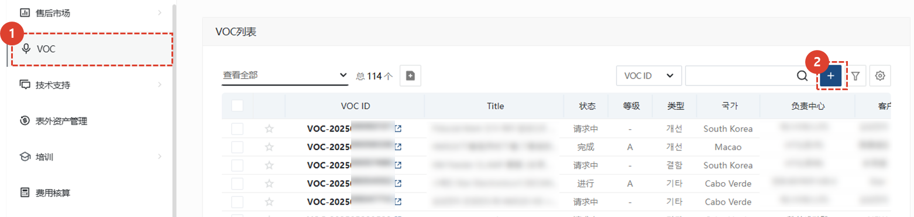
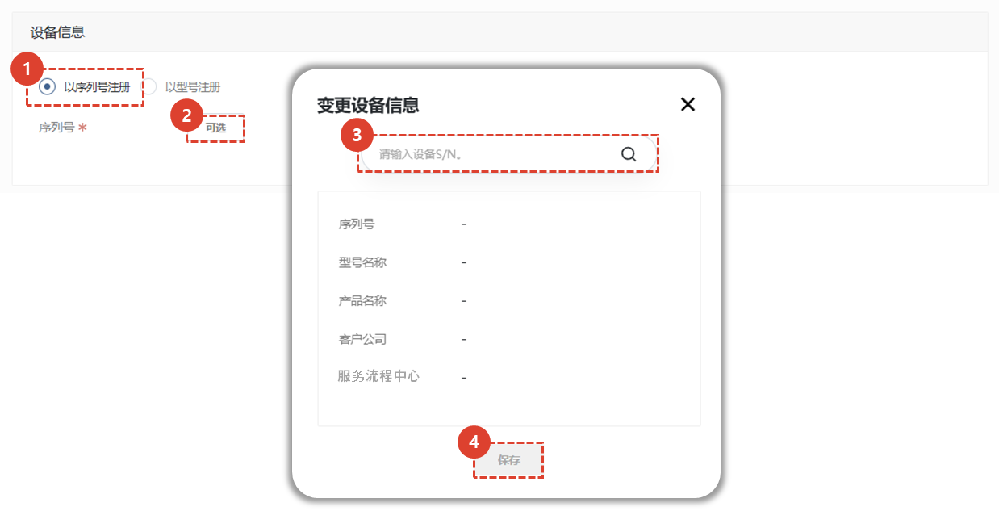
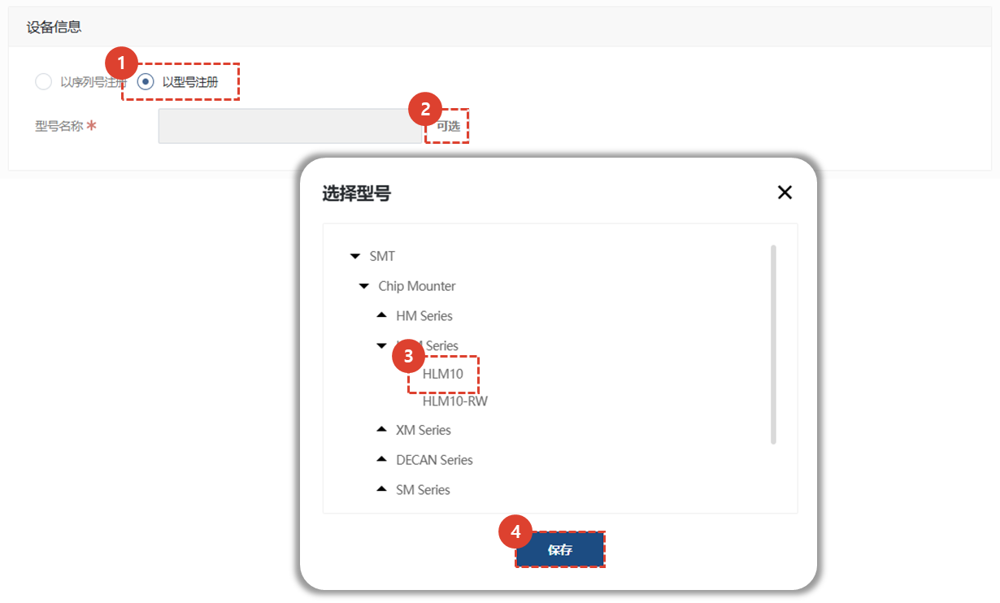
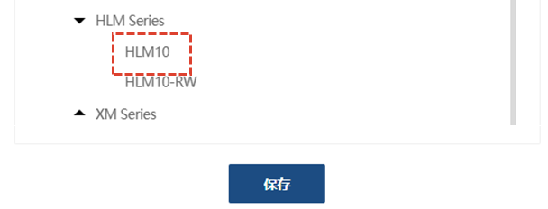
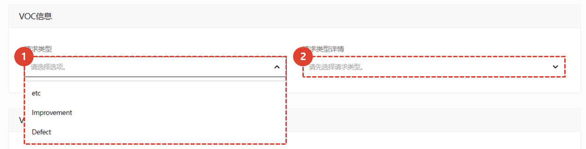
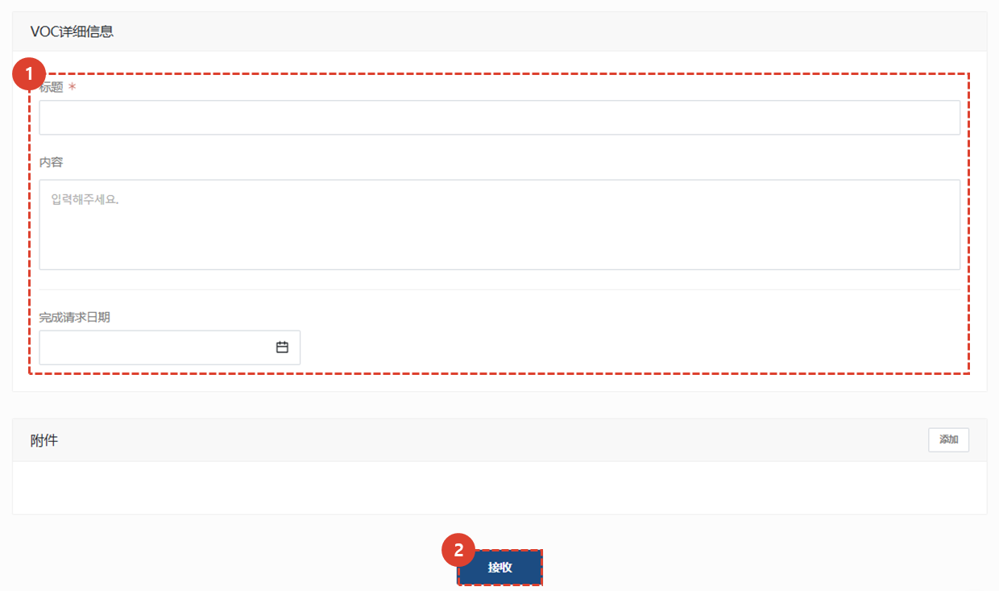
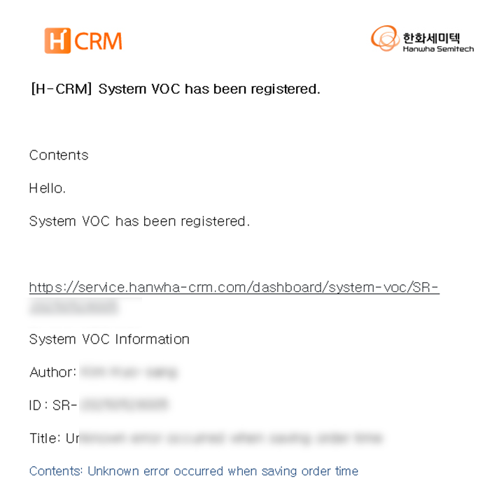

import ValidateTextByToken from "/src/utils/getQueryString.js";

# VOC 登记

<ValidateTextByToken dispTargetViewer={true} dispCaution={true} validTokenList={['head', 'branch', 'seller', 'agent']}>

我们将指导您完成在 VOC 菜单中注册您希望注册为 VOC 的问题的过程。

## VOC 存货

1. 点击侧边栏的VOC。 
2. 点击底部VOC列表中的+按钮。
 
 

## VOC 特别的
### 输入设备信息
有两种方式可以输入设备信息。
您可以按序列号或按型号注册。

1. 点击“使用序列号注册”。
1. 点击“选择”按钮打开序列号输入窗口。
1. 输入序列号。
1. 点击“保存”按钮。
 
 

1. 点击“注册为模型”。
1. 点击“选择”按钮打开模型选择模式。
1. 只能选择模型树最末端的**叶模型**。
    :::warning
      
    单击具有子模型的模型名称将导致错误。
    :::
1. 单击“保存”按钮。
 
 

### 输入注册人和客户信息

 

1. 点击“选择”按钮注册客户。
1. 选择 V​​OC 注册客户所在的国家/地区。
1. 选择地区。**用于指标管理**
 
 

### VOC 输入信息

 

1. 选择类型。类型有三种：- 缺陷
    - 故障（硬件）
        - 故障（软件）
        - 制造缺陷
        - 印刷/标注缺陷
        - ISV 缺陷
        - 操作软件缺陷
        - 控制软件缺陷
        - T/P 缺陷
        - 机械缺陷
        - 控制器缺陷
    - 改进
        - ISV 改进
        - 其他改进
        - 可维护性
        - 软件改进
        - 机械改进
    - 其他
        - 其他
        - 销售 VOC
        - 质量 VOC
        - 开发 VOC
        - 服务 VOC
1. 根据所选类型选择详细的类型项目。
 
 

### VOC 输入详细信息并提交

 
1. 输入审核所需内容。
    - 输入标题和具体的 VOC 相关内容。
    - 输入所请求 VOC 建议的期望完成日期。
    - 如有需要，请添加附件。
1. 点击“提交”按钮。
 
 

### VOC 自动发送收到的申请的电子邮件

 

- 一旦收到 VOC，就会向管理员发送如图所示的电子邮件通知。

</ValidateTextByToken>