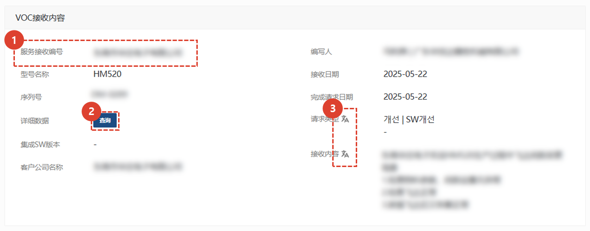
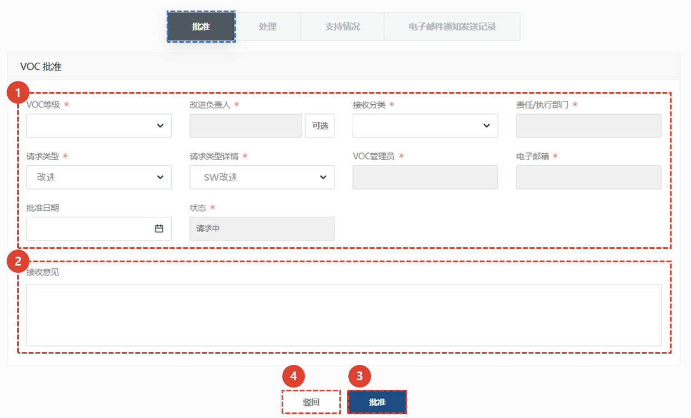
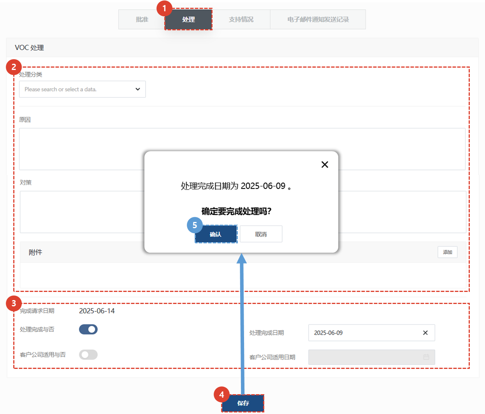
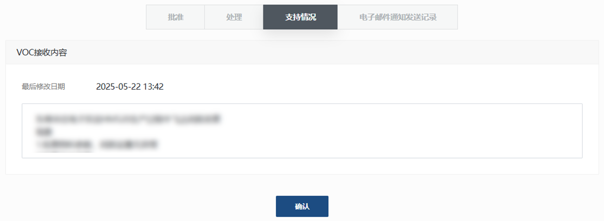

import mmiQrImg from "./img/011.png";
import ValidateTextByToken from "/src/utils/getQueryString.js";

# VOC治疗

<ValidateTextByToken dispTargetViewer={true} dispCaution={true} validTokenList={['head']}>

我们为 VOC 处理人员和经理提供审查和跟进注册 VOC 请求的指导。

## VOC接待咨询

### 在系统中查找

1. 点击侧边栏的VOC。 
2. 在底部的VOC列表中，点击VOC ID列中的ID值。

### 通过通知邮件进行查询

1. 单击您收到的电子邮件中的链接。

## VOC 特别的

### VOC 申请内容

1. 如果从服务受理案例中注册了 VOC，则会显示服务受理编号。
1. 在设备 MMI 屏幕上显示最近的 **QR 码** 扫描历史信息。
    :::tip
        

        通过扫描设备MMI屏幕上的二维码，可以轻松注册设备的基本信息，以进行VOC原因分析。
    :::
1. 当您单击该按钮时，结果将被翻译成您的 CRM 系统的语言。

## VOC 治疗

### 批准/拒绝
 

1. 输入必填字段。
- VOC 等级：从 A、B、C、D 中选择一项。
- 改进经理：点击[选择]按钮搜索并注册经理。搜索范围为非 CRM 用户的员工（圆圈用户）。
- 接收类型：根据是否为改进对象选择分隔符。
- 负责/处理部门：根据改进经理自动输入。
- 请求类型：根据 VOC 的性质选择一种类型。
- 请求类型详情：根据请求类型选择详细类型。
- VOC 经理/邮箱：如果 CRM 访问用户是**VOC 经理**，则自动输入。
- 批准日期：输入您希望批准的日期。
1. 输入接受和拒绝意见。
1. 点击[批准]按钮进行批准。
- 批准后，将向收件人发送电子邮件。
1. 点击[拒绝]按钮进行拒绝。
- 拒绝后将向收件人发送电子邮件。

### 行动

 

1. 点击[行动]按钮输入行动结果。
1. 输入行动标识符和原因/措施内容。
1. 如果行动完成日期与客户实际申请日期不同，请分别输入。**行动完成日期**将作为VOC处理LT指标的结束日期。
1. 点击[保存]按钮。
1. 执行最终确认任务。

### 支持状态

 

- 记录 VOC 行动期间责任方之间的支持历史。

### 电子邮件通知历史记录

 

- 显示与 VOC 案例相关的发送电子邮件的历史记录。

</ValidateTextByToken>