import ValidateTextByToken from "/src/utils/getQueryString.js";
import all_proceeding from "./img/027.png";
import proceeding from "./img/028.png";
import rejection from "./img/029.png";
import Approval from "./img/018.png";

# Retrofit

<ValidateTextByToken dispTargetViewer={true} dispCaution={false} validTokenList={['head', 'branch', 'seller', 'agent']}>
注册受“Retrofit”约束的资产并管理是否对已注册的资产执行工作。

## 项目列表

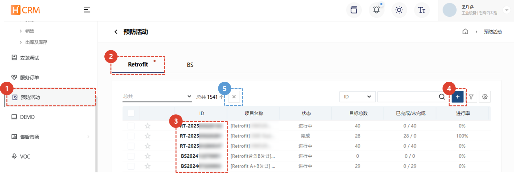
1. 选择“预防活动”选项卡。
1. “改造”菜单为默认设置。您可以查看当前已注册的改造列表。
1. 点击“改造 ID”进入详情页面。
1. 点击“+”按钮注册新的改造任务。
1. 选择项目后，您可以点击“X”按钮取消该项目。项目最终确认后无法取消。取消项目时，必须输入项目取消的原因。

</ValidateTextByToken>

## 创建项目

### 注册基本信息

<ValidateTextByToken dispTargetViewer={false} dispCaution={true} validTokenList={['head']}>
    :::info
       在创建项目之前，必须准备一份“Retrofit”提案。
    :::
 
 

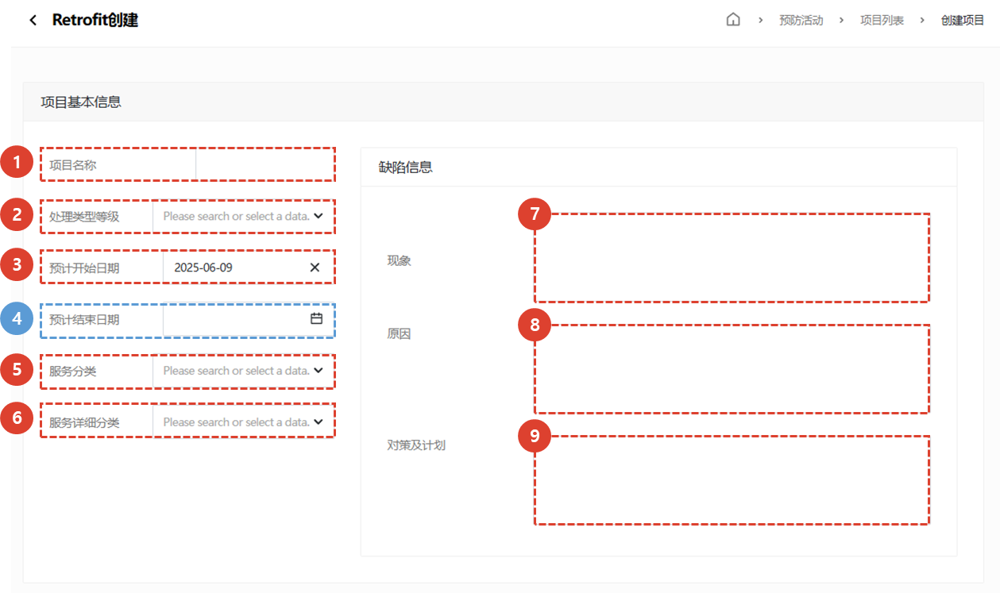
基本信息根据相关咨询内容填写。
1. 输入项目名称。
1. 选择处理类型等级。
1. 选择开始日期。
1. 选择完成日期。完成日期为选填项，如有需要可填写。
1. 选择服务类别。
1. 选择服务类别的详细类别。
1. 输入缺陷现象。
1. 输入缺陷原因。
1. 输入缺陷的改进措施及应对计划。
 
 

### 注册二手零件

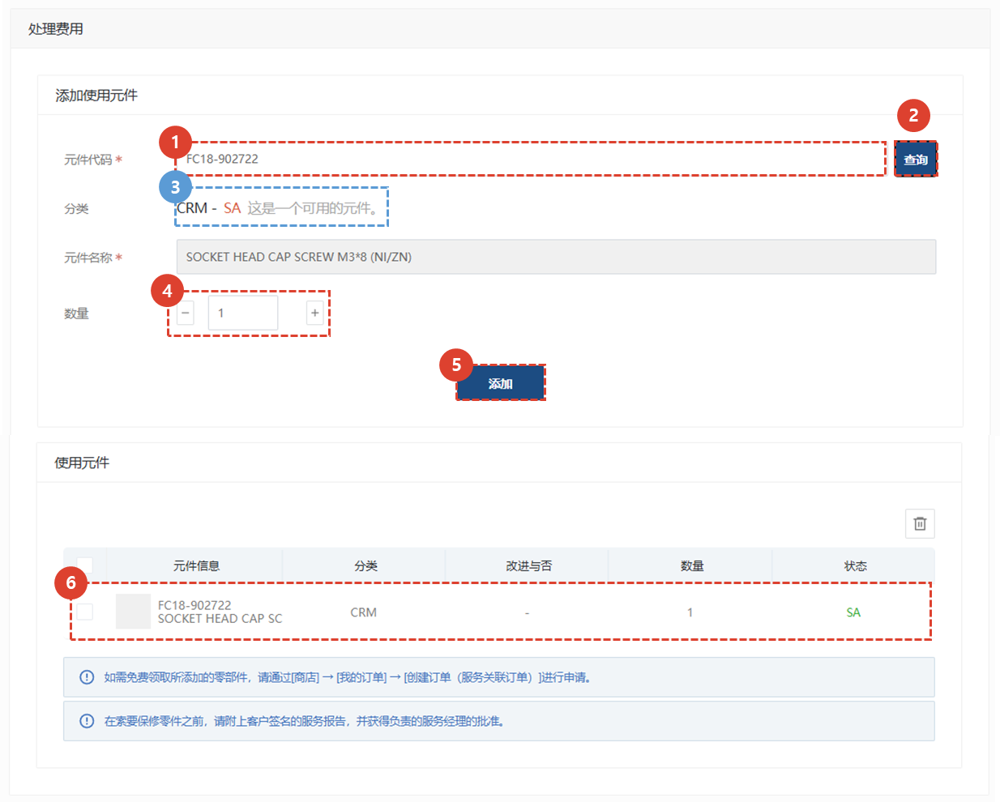
1. 输入零件代码，添加任务所需的零件。
1. 点击“搜索”按钮。
1. 检查可用零件是否正确。
1. 检查所需数量。
1. 点击“添加”按钮。
1. 检查已添加的二手零件。
 
 

### 注册目标设施信息

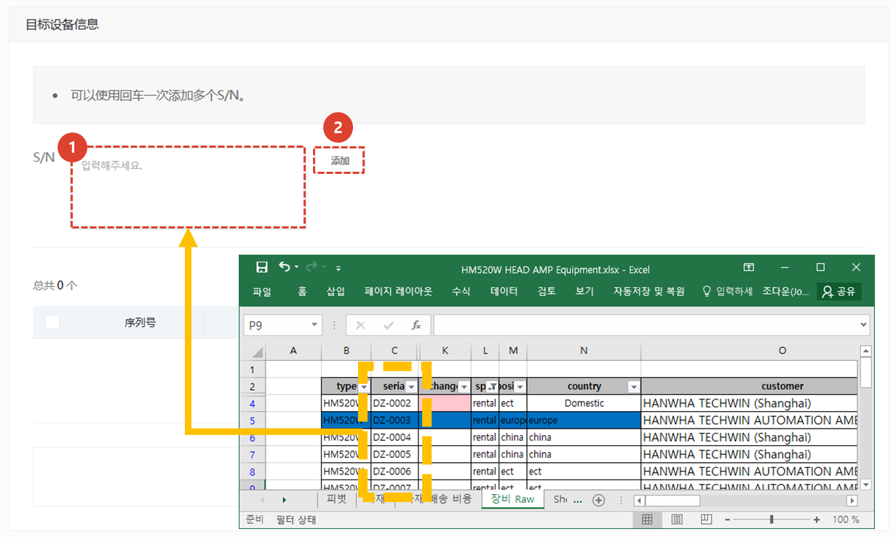
1. 复制待改造设备的名称，并将其粘贴到序列号字段中。
1. 点击“添加”按钮。添加完成后，您可以在下方列表中查看已添加的设备列表。
 
 

### 注册附件和注册项目

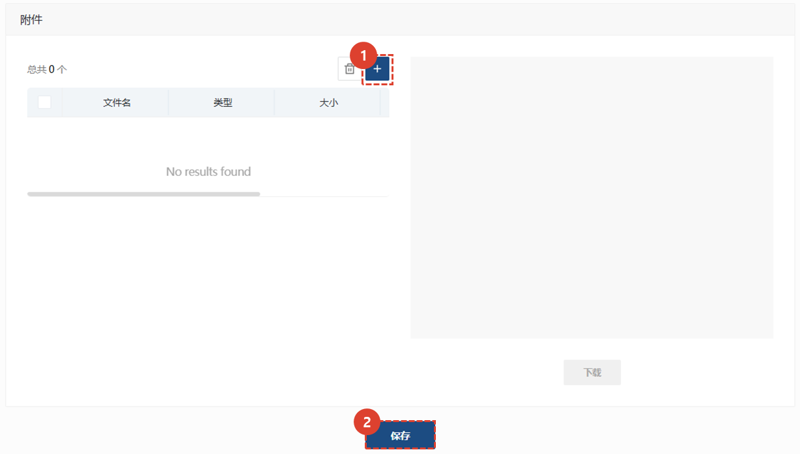
1. 添加相关附件。（例如：改造方案、相关设备清单等）
1. 点击**保存**按钮，完成项目注册。
 
 

</ValidateTextByToken>

## 项目修改及处理

<ValidateTextByToken dispTargetViewer={false} dispCaution={true} validTokenList={['head', 'branch', 'seller', 'agent']}>
 
 

### 项目列表

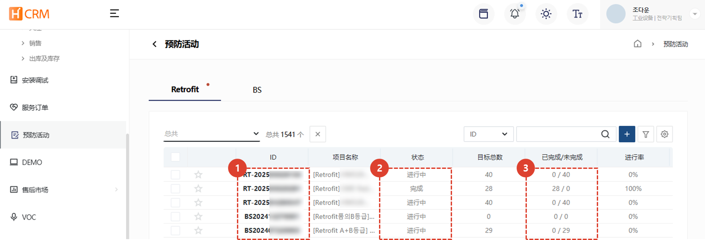
1. 您可以查看已注册的Retrofit列表。点击需要修改的ID，进入详情页。
1. 您可以查看进度状态。**已完成**状态的项目无法修改或取消。
1. 您可以查看已完成和未完成状态的设备数量。
 
 

### 修改基本信息
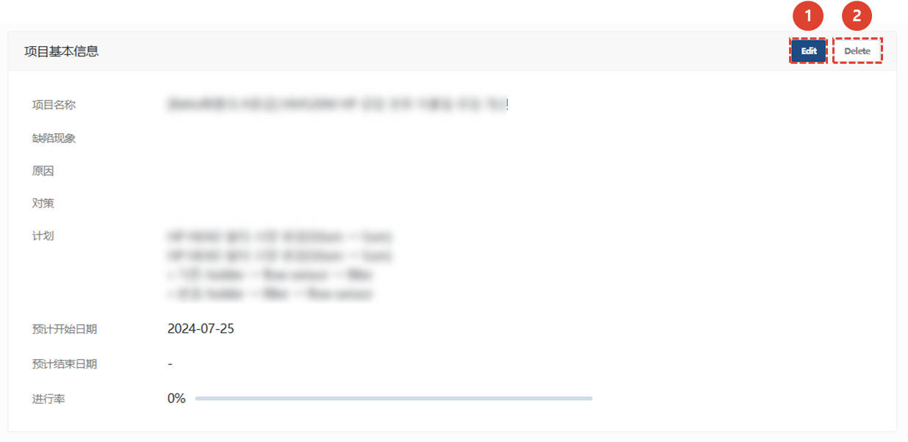
1. 点击**Edit**编辑内容。
1. 点击**Delete**删除项目。
    :::warning
    请注意，当您单击**Delete**按钮时，所有信息将被删除。
    :::
 
 

### 修改使用过的零件
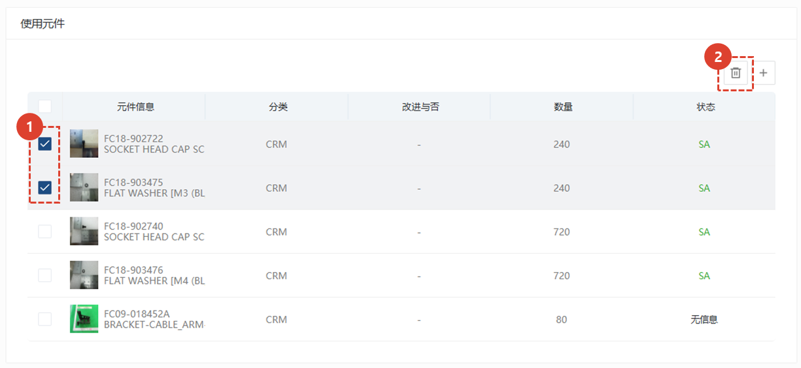

1. 选择需要删除的部分。
1. 点击按钮删除该部分。
 
 

### 添加并处理目标设备
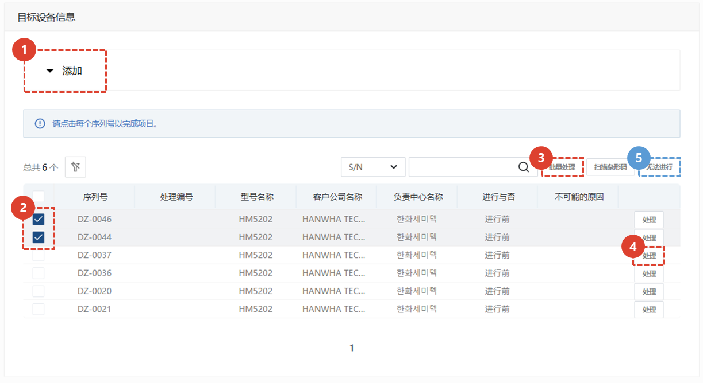
1. 点击**添加**标签页添加设备。
1. 您可以选择多个项目进行处理或停止处理，并进行批量处理。
1. 选择**批量处理**后，将处理所有选定的设备。
    :::info
   当你点击**确认**按钮时，所有选中的装备将会被批量处理。
    

    :::

1. 您可以通过单击**处理**按钮单独处理改造。
    :::info
    当你点击**确认**按钮时，设备将被批量处理。 
    

    :::

1. 当您选择一个设施并点击**无法继续**按钮时，该设施将从进度项目中排除。
    :::info
    您可以输入无法继续的原因，然后将其处理为无法访问。
    

    :::
 
 

## 取消项目
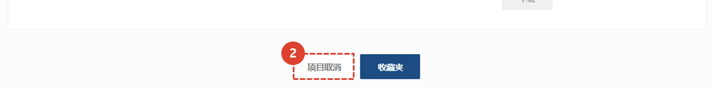
1. 您可以按屏幕底部的**取消项目**按钮来取消。

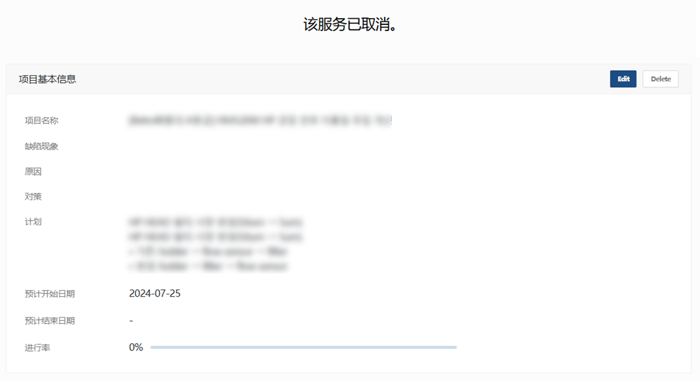

1. 您可以查看该项目是否被取消以及取消的原因。
1. 取消的项目所有功能均无法使用。

</ValidateTextByToken>