import ValidateTextByToken from "/src/utils/getQueryString.js";
import Cancle from "./img/057.png";
import back_order from "./img/058.png";
import circle from "./img/062.png";

# 销售

我们将指导您完成已接收订单的处理流程。
<ValidateTextByToken dispTargetViewer={true} dispCaution={false} validTokenList={['head', 'branch', 'seller']}>
:::info
此菜单仅对授权销售人员可见。这适用于**总部、公司和机构（物料基地）的物料人员**。
:::

## 목록
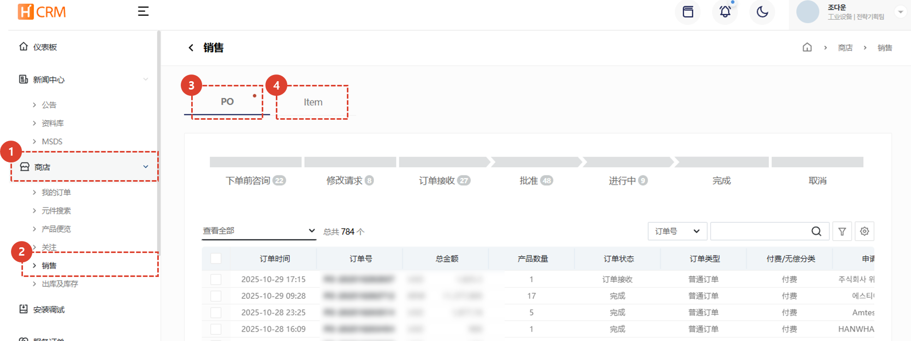
1. 点击**商店**菜单。
1. 点击**销售**菜单处理订单。
3. [**采购订单**](#po)：此页面按采购订单管理已接收的订单。您可以跟踪和管理所有采购订单的进度。
4. [**物料**](#item)：您可以按采购订单中包含的**物料单元**管理订单收货详情。如果采购订单处于待处理状态，您可以轻松识别导致待处理订单的物料单元。

## PO
:::info
采购订单菜单用于按采购订单管理零件订单。
 如果您想按零件跟踪和管理订单处理，则必须选中[**Item**](#item)。
:::

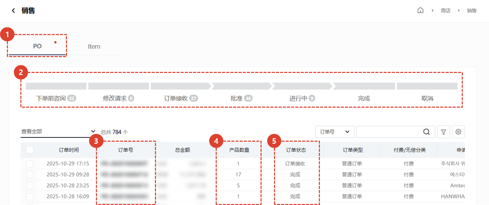
1. 点击**PO**标签页。
1. 您可以在订单列表中查看**订单状态**。点击每个状态都会在列表中显示相应的订单。
1. 点击**订单号**进入采购订单详情页面。采购订单详情页面与[**订单详情**](#订单详情)相同。
1. 显示每个订单包含的**商品总数**。
1. 您可以查看**当前订单状态**。
 
 

## Item
:::info
Item菜单用于按**零件单位**管理零件订单。
 如果您想按采购订单监控和管理订单处理状态，您应该检查[**PO**](#po)。
:::

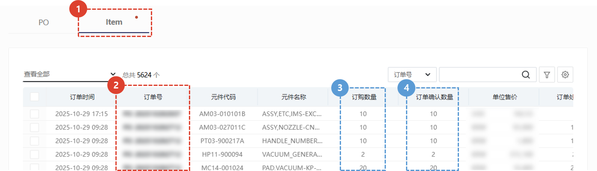
1. 点击**Item**选项卡。
1. 点击**订单号**进入采购订单详情页面。有关采购订单详情页面，请参阅[**订单详情**](#订单详情)。
1. 显示**各零件的订购数量**。
1. 显示**各零件的确认订单数量**。
    :::tip
    **通过每个零件的已确认订单数量列表，轻松确定哪些零件需要加工。**
    :::
</ValidateTextByToken>
 
 

## 订单详情
### 订单批准
<ValidateTextByToken dispTargetViewer={false} dispCaution={true} validTokenList={['head', 'branch']}>

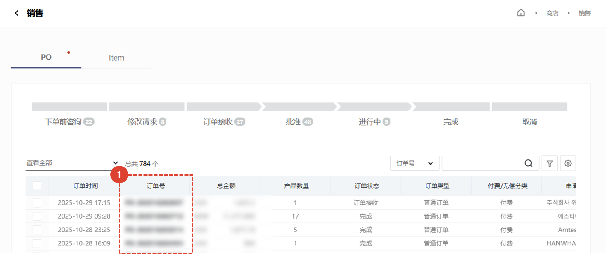
1. 点击收到订单的采购订单号。
:::info
您可以在订单详情页面批准、请求修改或拒绝订单。
:::
 
 

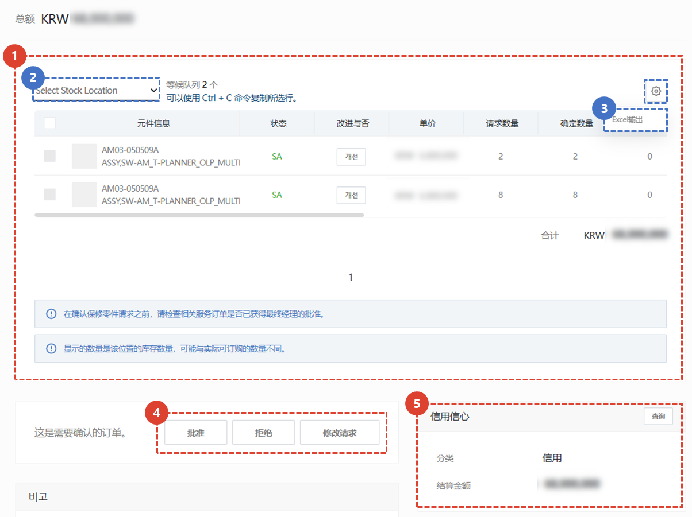
1. 显示所订购商品的相关信息。
    :::info
    - 您可以从列表中查看零件信息、零件状态、是否已改进、单价、请求数量、确认数量、库存数量、总计、相关服务编号、服务类型、最终经理批准、目标序列号和备注。
    2. 选择**存储地点**以查看特定仓库的库存。
    3. 您可以将订单列表**导出**到 Excel。
    :::
4. 确认内容后，请选择是否批准订单。
    - **批准**：批准订单。**[点击此处查看批准后流程。](#审批通过后---创建缺货订单)**
    - **拒绝**：订单已被拒绝/取消。 您必须输入**拒绝理由**。系统将向订单创建者发送电子邮件。
    - **修改请求**：您必须输入**修改理由**（例如，更改数量、价格或零件代码）。系统将向订单创建者发送电子邮件。
5. 您可以据此查看买家的信用信息。
 
 

### 经批准
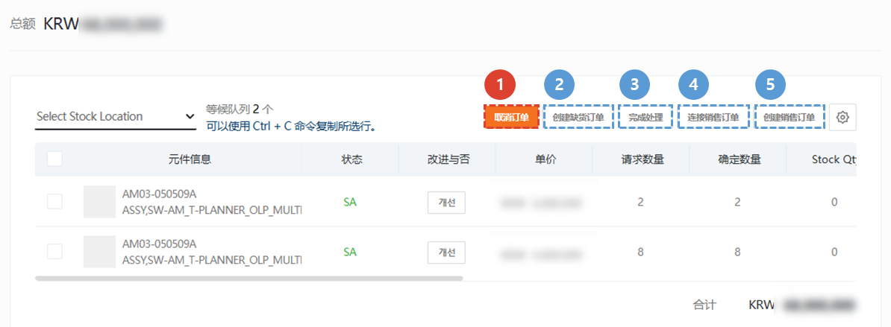
已批准的订单可以通过以下五种方式进行处理：
1. **PO 消除** : 如果订单信息的免费或付费状态发生变更等原因，您可以取消采购订单。
    :::info 如果因订单信息变更等原因，您可以取消采购订单。
        

 
    :::
1. [**创建缺货订单**](#审批通过后---创建缺货订单) : **用于中间商需要根据总部采购订单重新订购零件的情况**。
1. [**完成处理**](#审批通过后---完成处理) : 此按钮供非企业代理机构中心用于处理从其他代理机构收到的订单。点击“完成处理”按钮会将此订单标记为买家的“已完成”。
1. [**连接销售订单**](#审批通过后---连接销售订单) : 当您已经在 SAP 系统中下了销售订单并正在输入信息时，请使用此功能。
1. [**创建销售订单**](#审批通过后---创建销售订单) : 下达销售订单时请使用此订单表格。
 
 
</ValidateTextByToken>

<ValidateTextByToken dispTargetViewer={false} dispCaution={true} validTokenList={['head', 'branch', 'seller']}>

### 审批通过后 - 创建缺货订单
补货订单是**中间卖家**（例如公司或物料基地，如Amtest）在响应买家订单请求后，需要向总部下单补充库存时使用的一个菜单项。此订单表单用于生成发送给总部的采购订单。
    :::info
    只有在申请免费材料时才能创建补货订单。 
    :::
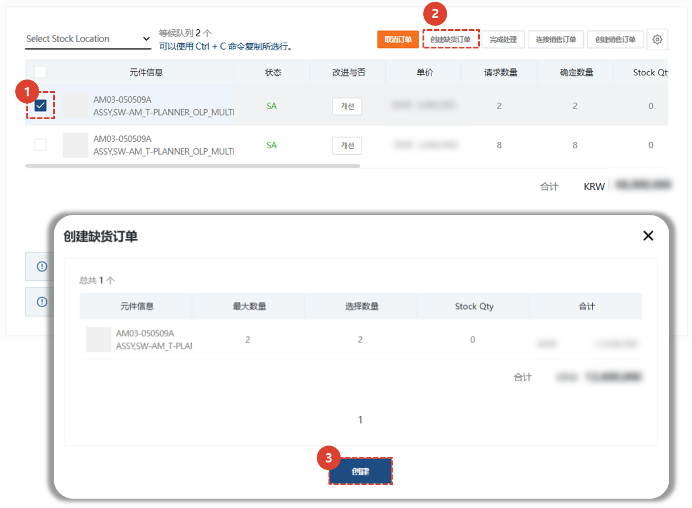
1. 确认您需要从总部订购的零件，以确保库存充足。
1. 点击“创建缺货订单”按钮。
1. 确认您需要创建缺货订单的零件数量。您可以双击“已选数量”进行编辑。
 点击**创建**按钮创建补货订单。
    :::info
    

    保存 SO 后，您必须按下 **Circle支付** 按钮提交圈子请求。
    :::
 
 

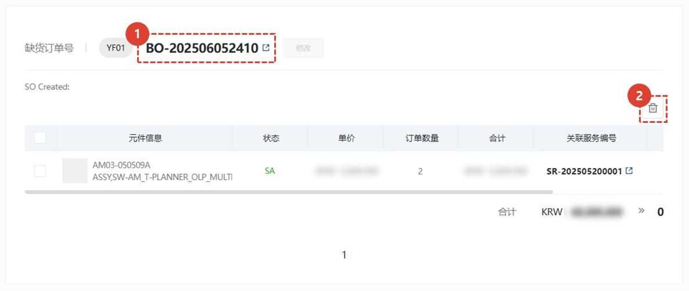
后门创建完成后，**订单历史记录**将显示在零件清单的底部。
1. 点击后门号码查看**缺货订单详情**。
1. 点击**删除**按钮取消已创建的缺货订单。
</ValidateTextByToken>

<ValidateTextByToken dispTargetViewer={false} dispCaution={true} validTokenList={['head']}>

:::info
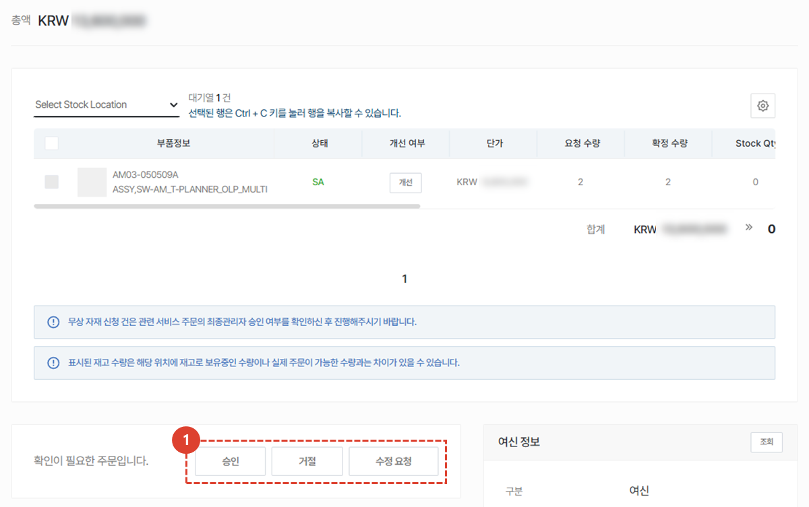
1. 总部物料运输经理审核缺货信息，然后批准/拒绝/请求修改。 
后续流程与[**创建销售订单**](#审批通过后---创建销售订单)相同。
:::
 
 
</ValidateTextByToken>

### 审批通过后 - 完成处理
<ValidateTextByToken dispTargetViewer={false} dispCaution={true} validTokenList={['head', 'branch', 'seller']}>
“完成处理”按钮供非企业代理机构中心用于处理从其他代理机构收到的订单。
 它的作用是**记录**处理结果。

1. 勾选您想要完成的部分。
1. 点击**完成处理**按钮。

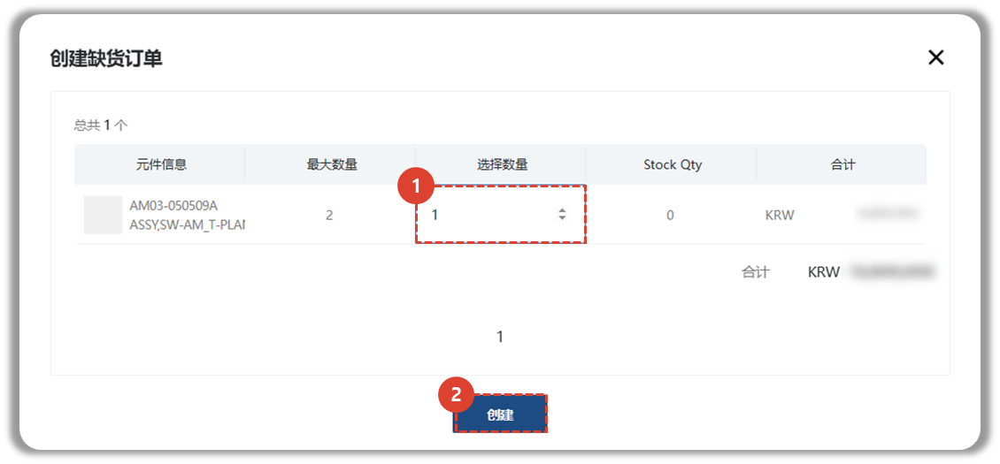
1. 输入订单已完成的零件数量。 已输入最大数量。如有必要，双击进行编辑。
1. 点击**完成**按钮完成订单。
:::info
已完成订单的订单数量和金额信息会添加到屏幕底部。 
:::
</ValidateTextByToken>
 
 

### 审批通过后 - 连接销售订单
<ValidateTextByToken dispTargetViewer={false} dispCaution={true} validTokenList={['head']}>

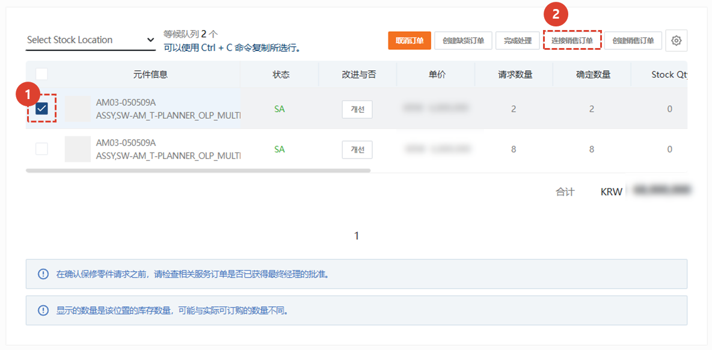
1. 勾选要关联到销售订单的零件。
1. 点击“关联销售订单”按钮。

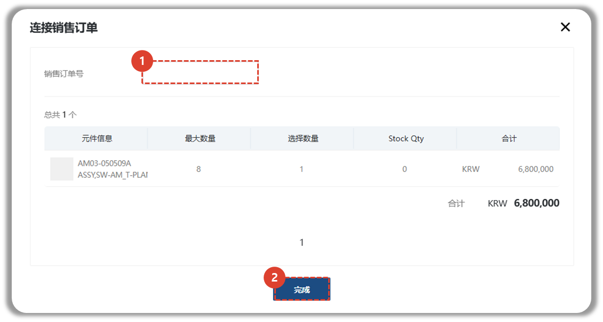
1. 输入内部系统生成的销售订单号。
1. 点击“完成”按钮以关联销售订单。
:::info
您输入的销售订单详情将显示在屏幕底部。 
:::
 
 

### 审批通过后 - 创建销售订单
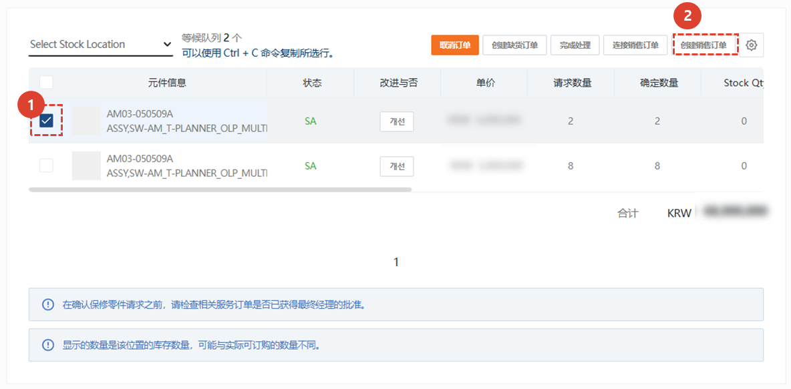
1. 勾选要创建新销售订单的零件。
1. 点击**创建销售订单**按钮。

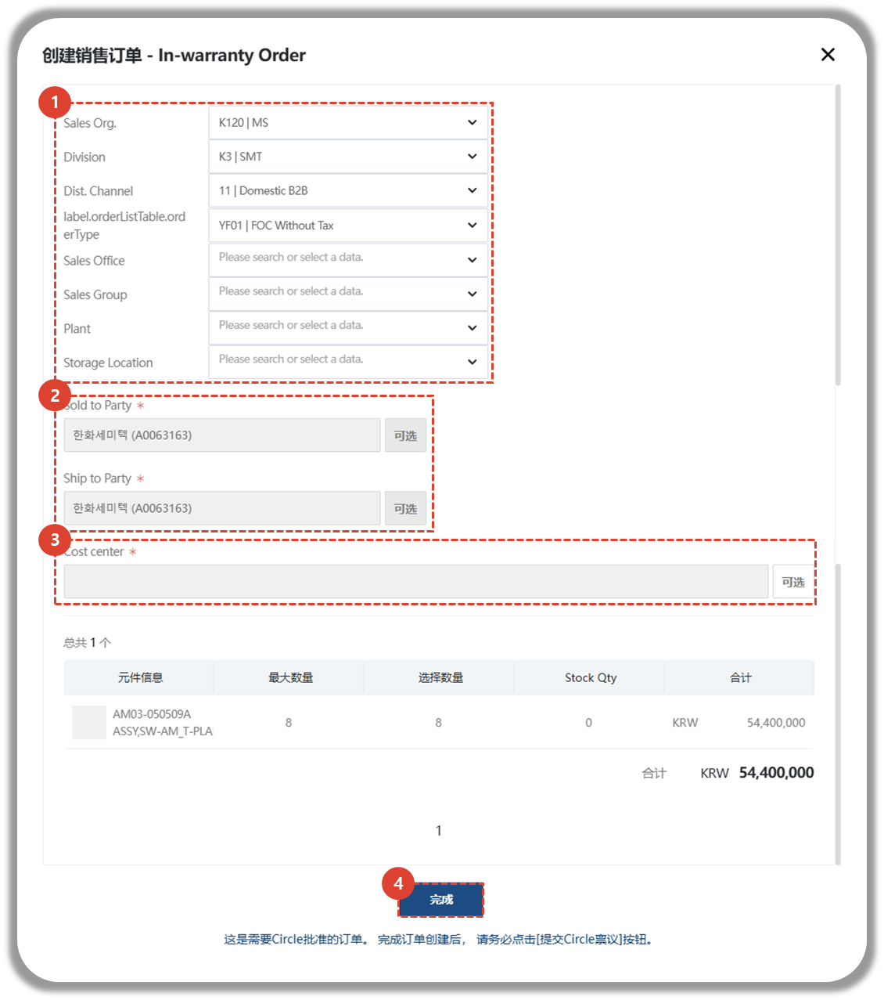
1. 选择订单发出所需的值。
1. 选择付款方和收货方。
1. 选择成本中心。
1. 点击**完成**按钮。
:::tip 
生成的销售订单详情将显示在屏幕底部。
:::
 
 
</ValidateTextByToken>

### 修改订单表格
<ValidateTextByToken dispTargetViewer={false} dispCaution={true} validTokenList={['head', 'branch', 'seller']}>

- 要修改订单，您可以通过选择详情页面底部的“修改”按钮来**修改**并**保存**您的条目。
    :::warning
        修改后的订单表格必须通过点击“**下单**”按钮提交。
    ::: 

</ValidateTextByToken>