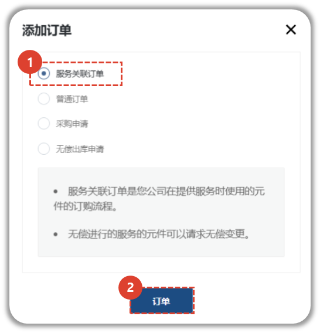
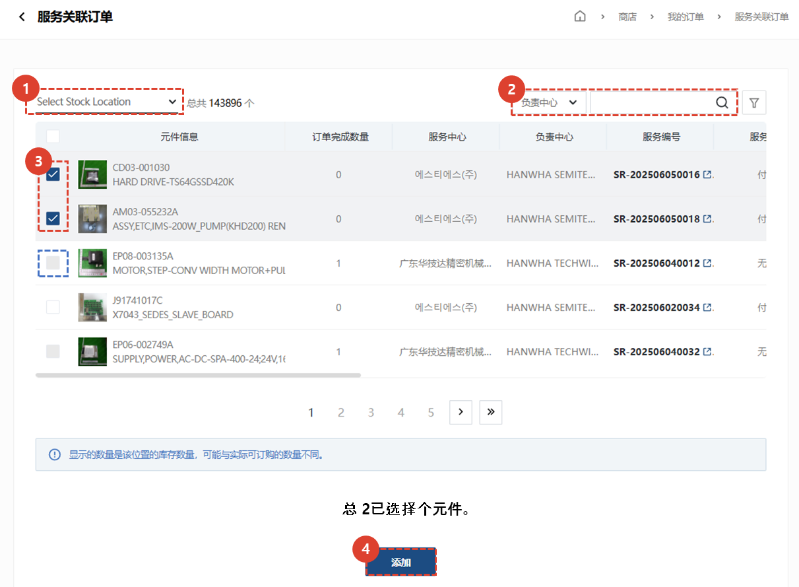
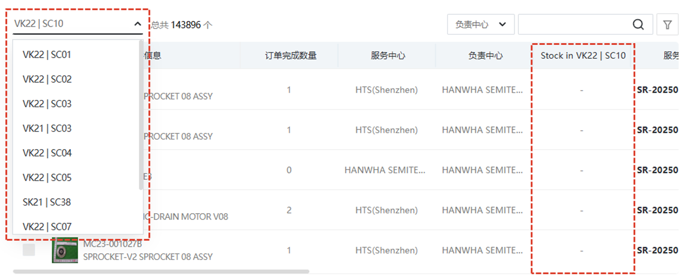
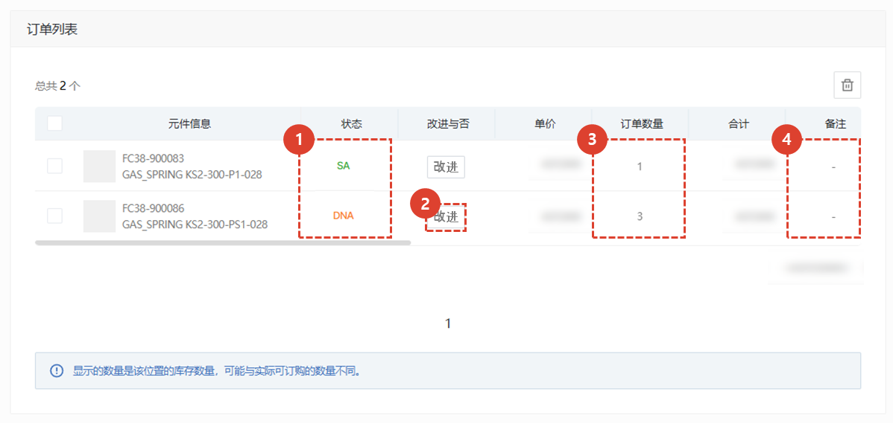
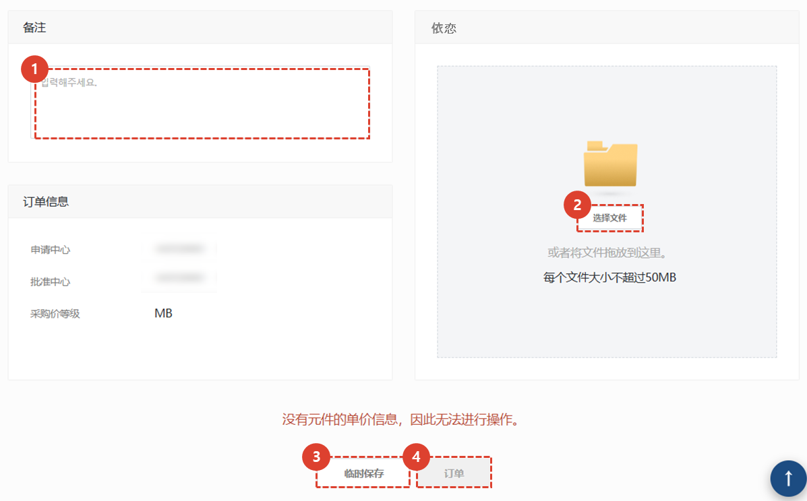
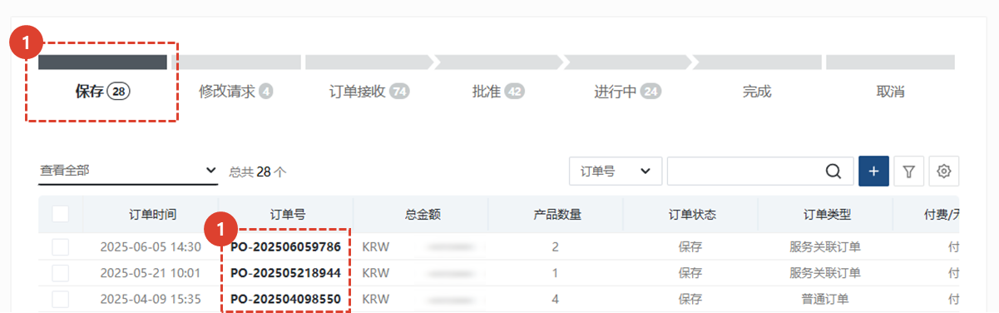
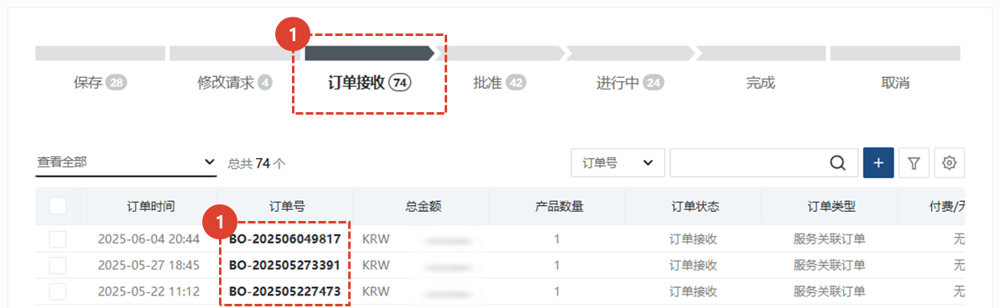
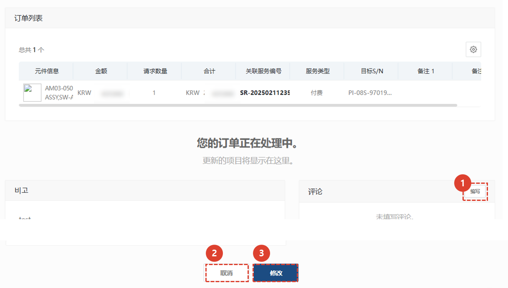

import ValidateTextByToken from "/src/utils/getQueryString.js";
import StrongTextParser from "/src/utils/textParser.js";
import text from "/src/locale/ko/SMT/tutorial-03-store/01-create-order-buyer.json";

# 填写订单 - 服务关联订单

<ValidateTextByToken dispTargetViewer={true} dispCaution={true} validTokenList={['head', 'branch', 'agent']}>

为**服务订单/安装/试驾项目**中使用的零件创建付费/免费采购订单。

## 添加订单

1. 点击**服务关联订单**按钮。
1. 点击**订购**按钮。
 
 

## 添加零件

1. 选择****来查看特定物料仓库的库存。 
    :::info
        当您选择“Storage Location”时，您可以检查该仓库中的库存。
         예) **Plant code**|**Storage Location** : **VK21**|**SC03**
        
    :::
1. 可以使用负责中心、服务编号、序列号、零件代码和零件名称进行详细搜索。
1. 选择要进行服务链接订单的项目。
    :::tip
    默认情况下，该复选框处于启用状态。
    已添加到该服务的部件的复选框将被**禁用**。
    :::
1. 点击**添加**按钮添加一个部件。
 
 

## 查看订单列表并输入附加信息

1. 如果状态栏的值为 SNA/DNA，则无法处理订单。
    :::info
    如果“状态”列值为“SNA/DNA”，则无法处理订单。
     如果“状态”列值为“无信息”，我们已临时采取措施，允许物料经理进行预先更新处理。
    :::
1. 对于 SNA/DNA，您可以查看改进的产品。
1. 您可以查看订单数量并**双击**进行修改。
1. 您可以双击备注栏进行修改。
1. 您可以在**卖家中心**查看库存数量。
 
 

## 输入附加信息并创建订单

1. 输入订单的整体备注。
1. 如有附件，请添加文件。
1. 如果订单尚未确认，请点击“保存草稿”。点击“保存草稿”按钮后，即使您离开当前页面，**您输入的数据也不会丢失**。
    :::info 如果暂时保存
    
    1. 对于临时保存的订单，它们将保留在订单列表的保存步骤中。 您可以通过点击订单号进入已保存订单的详情页面。
    
    1. 显示订单列表。
    1. 显示备注。
    1. 您可以留言，与卖家实时沟通。
    1. 您可以查看订单详情。
    1. 如需编辑信息，请点击**编辑**按钮。 要处理临时保存的订单，请单击**编辑**按钮，然后单击出现的编辑页面上的**订单**按钮。
    :::
1. 要创建订单，请单击**订单**按钮。
 
 

## 订单完成

1. 对于已完成的订单，该订单将保留在列表中的**订单已收到**状态。
1. 您可以点击**订单号**查看订单。
 
 

1. 输入与卖家沟通的信息。
1. 您可以在卖家批准订单**之前**修改您的订单。
1. 您可以在卖家批准订单**之前**取消您的订单。
</ValidateTextByToken>
