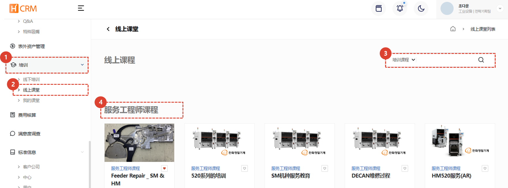
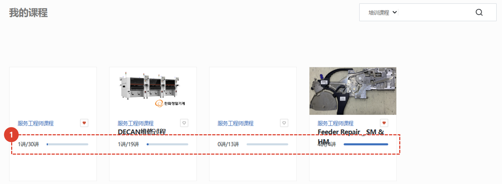
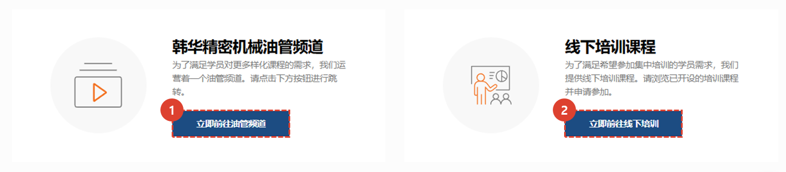
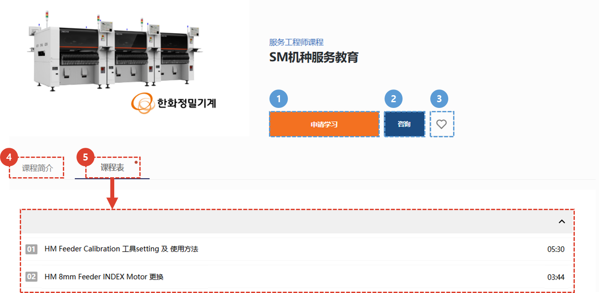
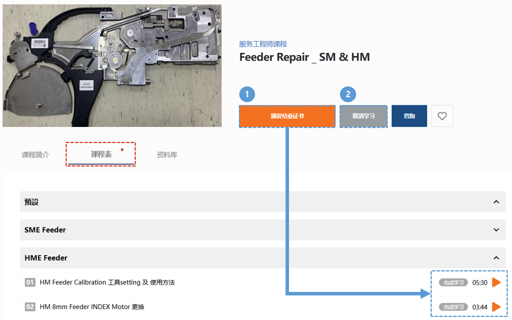
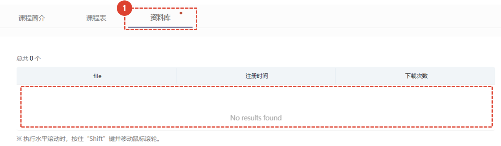
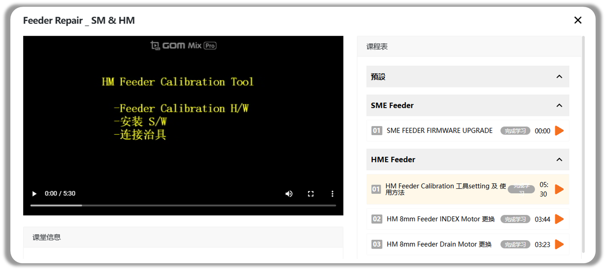

import ValidateTextByToken from "/src/utils/getQueryString.js";
import qna from "./img/005.png";
import Popup1 from "./img/014.png";
import Popup2 from "./img/016.png";
import Popup3 from "./img/018.png";

# 在线教育
在线课程简介及注册指南

<ValidateTextByToken dispTargetViewer={true} dispCaution={true} validTokenList={['head', 'branch', 'seller', 'agent', 'customer']}>

## 在线培训课程列表
### 在线课程

1. 点击“教育”菜单。
1. 点击“在线教育”菜单，查看可用的在线课程。
1. 从下拉框中选择课程类型，并使用所需的关键词进行搜索。
1. 这是在线课程列表。点击课程标题即可进入课程详情页面。
1. 点击“♡”按钮，将课程保存到“我的教室 > 我感兴趣的课程”。
 
 

### 我的课程

1. 以下是您目前已选修的课程列表。点击课程名称即可进入课程详情页面，查看您的课程状态。
 
 

### YouTube 和小组培训

1. 点击**前往 YouTube 频道**按钮，即可前往韩华精密机械 YouTube 频道。
1. 点击**前往小组培训**按钮，即可前往小组培训页面。
 
 

## 课程详情
### 申请前

1. 点击**课程注册**按钮注册课程。
1. 点击**联系我们**按钮将在新标签页中打开在线教育咨询页面。您可以在那里提交您的咨询。
    :::info
    

    您提交并保存查询后，培训人员将进行审核并回复您。
    :::
1. 点击 **♡** 按钮，即可将课程保存到 [我的教室 > 我感兴趣的课程]。
1. 点击“课程介绍”选项卡，查看课程简介。
1. 选择“课程大纲”选项卡，查看课程视频列表。
 
 

### 注册课程后

1. 您可以通过点击课程中的**报名**按钮或**播放**按钮来观看课程。
1. 您可以通过点击**取消报名**按钮来取消报名。
    :::warning
    

    如果您取消课程，**您该课程的所有注册记录将被删除**。
    :::
1. 您可以通过选择“课程介绍/课程设置/资源室”选项卡进行移动。
 
 

1. 您可以点击资料名称下载培训经理分享的资料。
 
 

1. 您可以在课程注册页面查看当前已注册课程列表和课程大纲。
    :::warning
    

     完成视频课程后，您必须点击课程完成弹出窗口中的**确认**按钮才能**完成课程**。
    :::
    :::tip
    完成所有课程后，将弹出一个窗口，其中包含颁发结业证书的说明。
     点击“确认”按钮将跳转至证书颁发页面。（待开发）
    :::
 
 

### 课程已完成
:::info
如果您完成所有课程，“颁发证书”按钮将被激活，您可以下载您的证书。（待开发）
:::
</ValidateTextByToken>

<ValidateTextByToken dispTargetViewer={false} dispCaution={false} validTokenList={['head']}>

## 在线教育管理
:::info
本指南解释了如何**创建课程以及在课程结束后如何管理学生**。
:::

1. 点击“任务管理”。
1. 点击“培训管理”。
1. 点击“在线培训课程”选项卡，以管理培训课程、培训地点和学员。
</ValidateTextByToken>