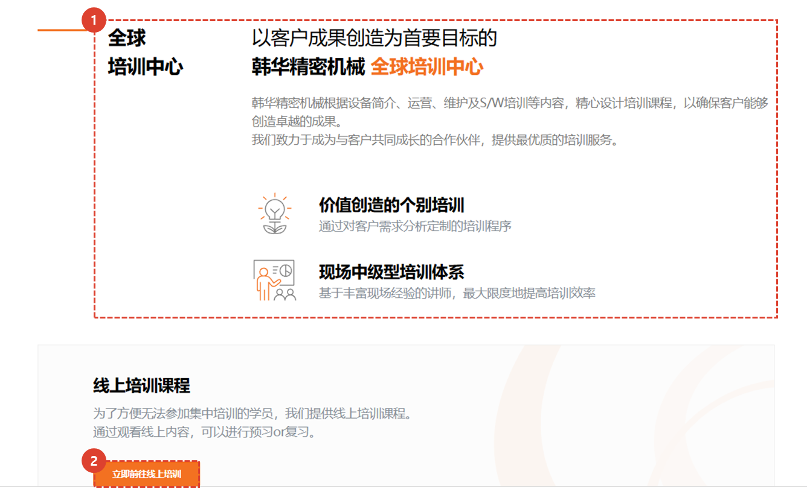
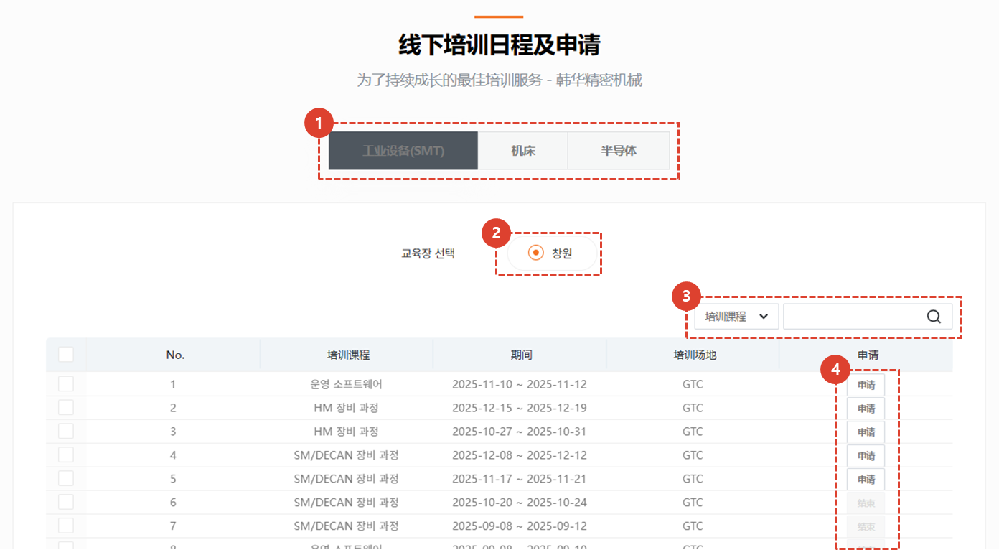
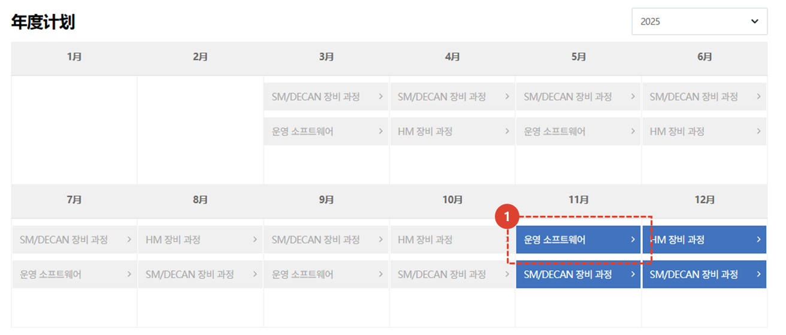
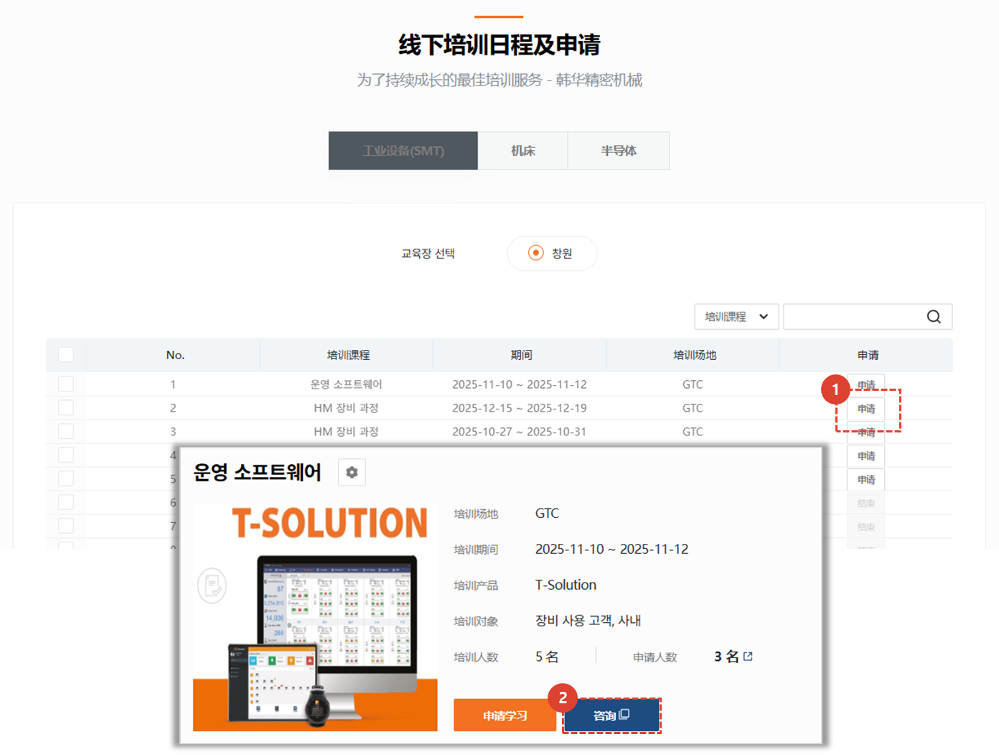
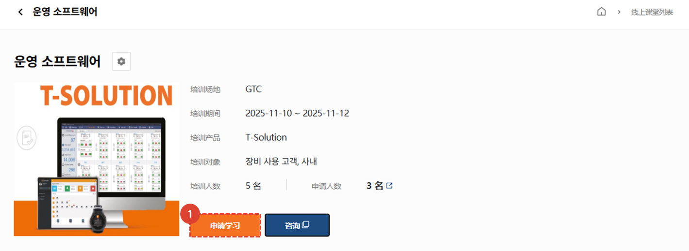
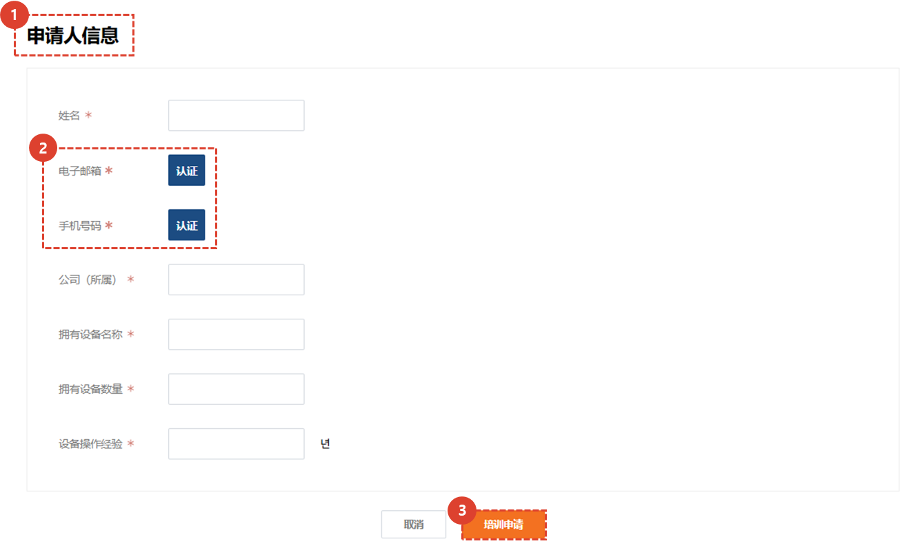

import ValidateTextByToken from "/src/utils/getQueryString.js";
import qna from "./img/005.png";

# 团体训练
本节介绍团体培训（线下培训）课程，并解释注册流程。
<ValidateTextByToken dispTargetViewer={true} dispCaution={false} validTokenList={['head', 'branch', 'seller', 'agent', 'customer']}>

## 主页
### 简介

1. 小组讲座页面简介
1. 点击**前往在线讲座**按钮进入在线讲座页面。
 
 

### 小组培训安排及申请

1. 您可以选择一个**业务部门**。
1. 您可以选择您所需的**培训地点**。
1. 以下是根据您选择的业务部门和培训地点列出的当前可用的线下培训项目列表。点击[应用](#详情页) 将跳转至详情页面。
1. 在下拉框中选择类型后，您可以使用所需的关键词进行**搜索**。
 
 

### 年度日程

1. 您可以一目了然地查看年度课程安排。点击[**课程名称**](#培训申请)即可进入详情页面。
1. 您可以按年份查看年度课程安排。
 
 

## 详情页
### 列表

1. 点击**申请**按钮将带您进入[**培训申请页面**](#培训申请)。
    :::tip
    - 在培训申请期之外，您不能点击“申请”按钮。
    :::
1. 点击“联系我们”按钮将在新标签页中打开咨询页面。您可以在那里提交您的咨询。
    :::info
    

    您撰写并保存咨询后，培训人员将进行审核并回复您。
    :::
 
 

### 培训申请

1. 点击**申请**按钮将带您进入[申请页面](#应用程序页面)。
::tip
- 在培训申请期之外，您不能点击“申请”按钮。
:::
 
 

### 应用程序页面

1. 您必须填写线下培训的申请人信息。
1. 您必须验证您的电子邮件地址和电话号码。
1. 填写完所有必填信息后，点击“申请培训”按钮完成线下培训申请。管理员审核后，申请结果将发送至申请人的电子邮件地址。
</ValidateTextByToken>

<ValidateTextByToken dispTargetViewer={false} dispCaution={false} validTokenList={['head']}>

## Group training management
:::info
我们为团体培训提供**课程创建和培训后学员管理**方面的指导。
:::

1. 点击“任务菜单管理”。
1. 点击“培训管理”。
1. 点击[**小组培训课程选项卡**](/SMT/tutorial-13-task-management/02-manage-training.md)以管理培训课程、地点和参与者。
</ValidateTextByToken>