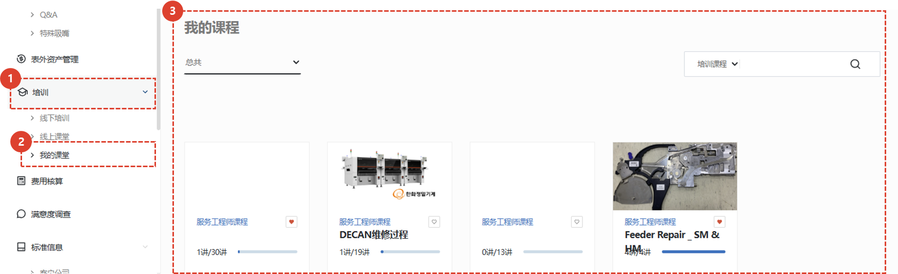
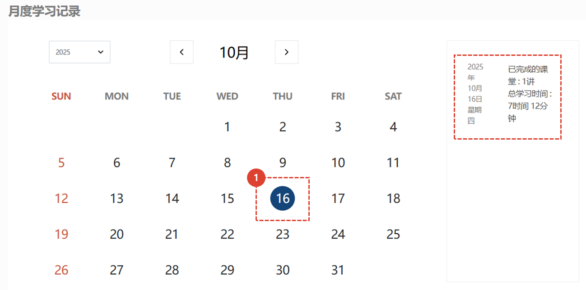
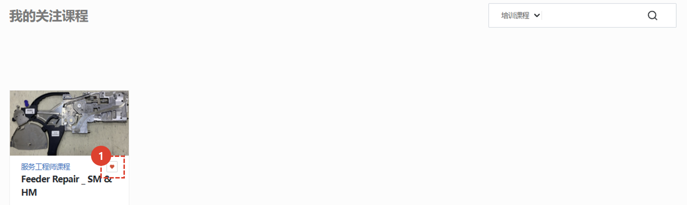
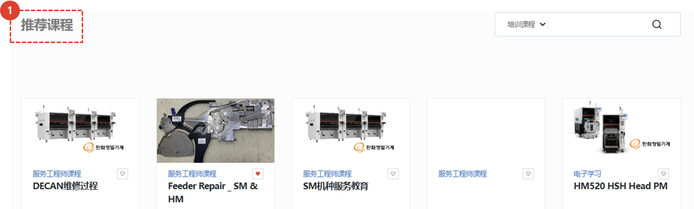

import ValidateTextByToken from "/src/utils/getQueryString.js";

# 我的教室
此页面提供您目前正在修读或已完成的课程信息。

<ValidateTextByToken dispTargetViewer={true} dispCaution={false} validTokenList={['head', 'branch', 'seller', 'agent', 'customer']}>

## 我的课程

1. 点击**教育**菜单。
1. 点击**我的课堂**。
1. 您可以查看您当前正在学习的**在线课程**列表。 点击课程即可观看视频。
 
 

## 每月学习历史

1. 您可以查看您每月学习的已完成课程数量和总学习时间。
 
 

## 我感兴趣的课程

1. 这是已点击**♡**按钮的课程列表。再次点击即可将其从“我感兴趣的课程”中移除。
 
 

## 推荐课程

1. 系统会提供与学生相关的**推荐课程**。点击即可进入课程详情页面并进行注册。
</ValidateTextByToken>