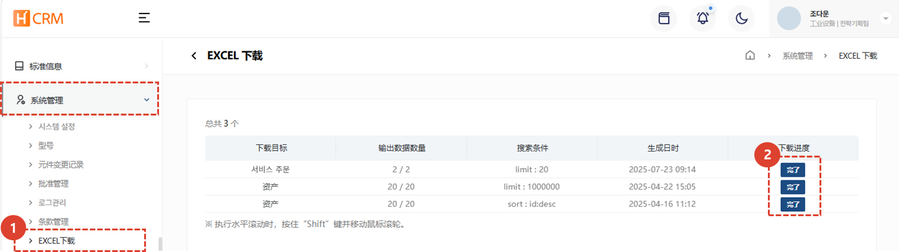

import ValidateTextByToken from "/src/utils/getQueryString.js";

# EXCEL 下载

本页面指导您查看和下载从 H-CRM 中提取的 Excel 列表。

<ValidateTextByToken dispTargetViewer={true} dispCaution={false} validTokenList={['head', 'branch', 'seller', 'agent', 'customer']}>

1. 从**系统管理**选项卡中选择**EXCEL 下载**。您可以在 ServiceCRM 中点击**Excel 完了**查看提取的数据。
2. 如果 Excel 提取状态为**完了**，请点击下载。

</ValidateTextByToken>