import ValidateTextByToken from "/src/utils/getQueryString.js";
import filterList from "./img/002.png";
import searchList from "./img/003.png";
import tableFilter from "./img/006.png";
import createLabor from "./img/013.png";
import filter1 from "./img/056.png";
import filter2 from "./img/057.png";
import filter3 from "./img/122.png";
import filter4 from "./img/059.png";
import table1 from "./img/124.png";
import table2 from "./img/061.png";
import popup1 from "./img/064.png";
import popup2 from "./img/066.png";
import popup3 from "./img/070.png";
import popup4 from "./img/074.png";

# 产品及元件

产品和零件数据管理指南。

<ValidateTextByToken dispTargetViewer={true} dispCaution={true} validTokenList={['head', 'branch', 'seller', 'agent']}>

## 列表页
:::tip 可查看数据
- 从 MDG 收集的产品和零件代码数据
- H-CRM 中自动生成的系统映射数据
:::

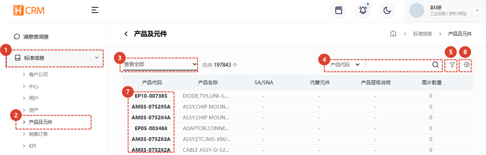
1. 点击**标准信息**菜单。
1. 点击**产品与零件**菜单。
1. 使用[**列表筛选**](#列表筛选) 仅显示符合特定条件的客户。
1. 输入 [**搜索词**](#搜索) 以搜索所需数据。
1. 输入 [**多个筛选条件**](#高级搜索) 以搜索数据。
1. 您可以进行[**Excel导出**](#导出到-excel)和[**表格管理**](#表格管理)。
1. 点击[**产品代码**](#detail-page)查看有关产品代码的详细信息。
 
 

### 列表筛选
:::tip
以下是如何按用户/部门或最新条目进行筛选的方法。
:::
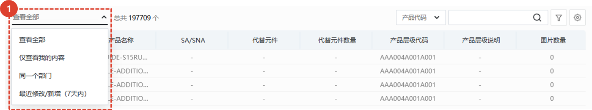
1. 选择所需的筛选方式。选择后，相应的列表将立即显示。
 
 

### 搜索
:::tip
表格搜索指南。
:::

1. **选择**一个搜索筛选条件，然后进行搜索。
 
 

### 高级搜索
:::tip
以下是如何应用**多个**搜索筛选条件。
:::
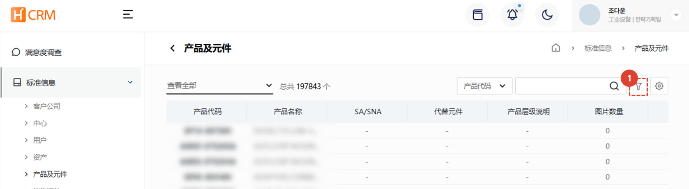
1. 点击**筛选按钮**。
 
 

1. 选择筛选条件。
1. 输入搜索词。
1. 点击**+**按钮添加搜索词。
1. 点击**搜索**按钮查看结果。
 
 

### 导出到 Excel
:::tip
以下是如何将列表导出到 Excel 的方法。
:::

1. 点击“导出到Excel”按钮。
 
 

1. 选择**输出选项**。
1. 单击**确定**按钮，然后访问[**系统管理 > Excel 下载**](/SMT/tutorial-12-system-management/03-export-data.md)菜单以下载Excel文件。
 
 
 
### 表格管理
:::tip
本指南解释了如何显示列、更改列的顺序以及更改要显示的列。
:::

1. 点击**表格管理**更改表格中显示的商品和顺序。
 
 

1. 点击要显示在表格中的项目旁边的切换按钮，使其变为蓝色。
1. 您可以拖动列表图标来更改列的位置。
1. 点击**关闭**按钮，表格将更新为显示所选内容。
 
 

## 详情页
### 基本信息
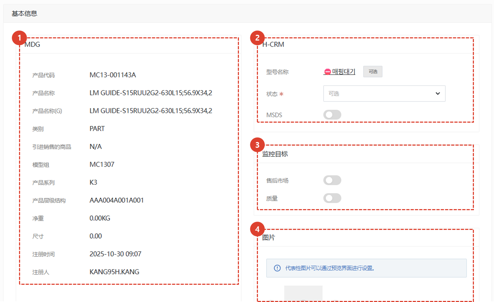
1. 显示与 MDG 接口的信息。此信息不可修改。
1. 显示可供 H-CRM 处理的其他信息。
    - **型号名称**：点击**选择**按钮选择型号。
        :::info
        模型在 [**模型管理页面**](/SMT/tutorial-12-system-management/01-model-manage.md) 中进行管理。
        :::
    - **状态**：设置产品/部件的可用性状态。
        - **SA**：服务可用。
        - **DNA**：各分公司均有库存，可提供服务，但不再接受总部额外订单。
        - **SNA**：服务不可用。请使用可更换的维修部件进行维修。
            :::warning
            部分产品和部件可能未显示状态。在这种情况下，您可以提交服务订单，但请注意，管理员可能会更改其状态。 
            :::
    - **MSDS**🚧: MSDS 是材料安全数据表的缩写。仅用于需要披露材料安全数据表的组件。当拨动开关打开时，会出现一个按钮，点击即可进入 MSDS 详情页面。
1. 监测目标 🚧
    - 当需要监控产品和组件数据的特定属性时使用。
    - 详情待定
1. 您可以附上产品和组件数据的实际照片或相关**图片**。
    ::info
    - 显示的第一张图片将用作代表图片。
    - 您可以在图片预览界面设置代表图片。
    :::
</ValidateTextByToken>
 
 

### 附加信息 - Plant
<ValidateTextByToken dispTargetViewer={false} dispCaution={true} validTokenList={['head', 'branch']}>

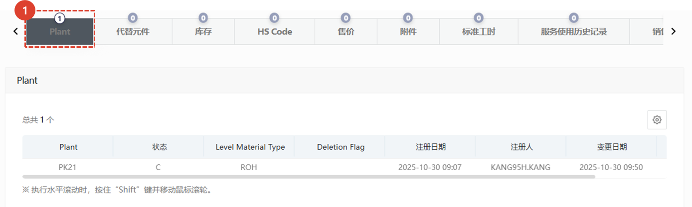
1. 您可以查看产品工厂信息。
    - **PK21 / VK21**: Industrial Equipment Division Plant
    - **PK22 / VK22**: Machine Tool Division Plant
    - **PK23 / VK23**: Semiconductor Equipment Division (Front Process) Plant
    - **PK24 / VK24**: Semiconductor Equipment Division (Back-Process) Plant
    :::tip
        如果您希望将该工厂扩展到其他业务部门，请更改 MDG 的参考信息。
    :::

 
 

### 附加信息 - 代替元件
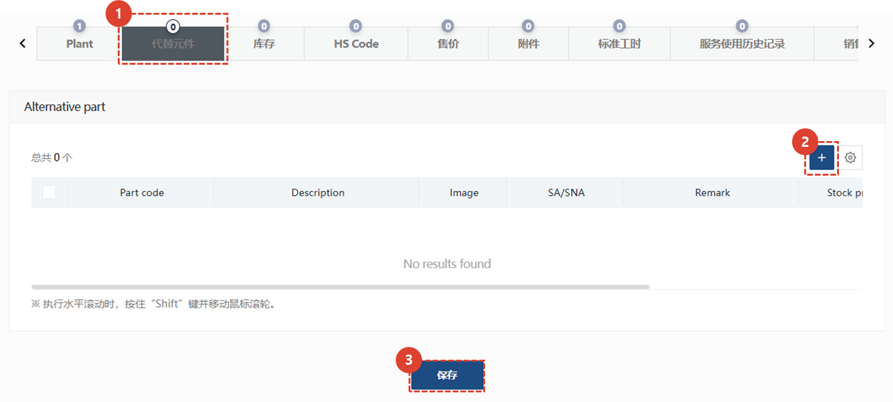
1. 如果有替代材料，您可以搜索相关信息。
1. 如果您需要添加替代材料，请点击 **+**按钮进行添加。
    :::info
    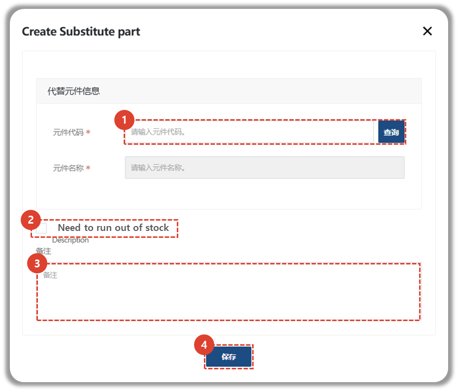
    1. 输入替换物料信息。
    1. 如果需要清理现有物料库存，请勾选“需要清理库存”。
    1. 输入其他相关信息。
    1. 点击“保存”按钮添加替换物料。
    :::
1. 更新替代材料信息后，必须点击**保存**按钮才能更新信息。

### 附加信息 - 库存
:::warning
    如果库存登记路径列的值为**SAP**，则无法修改数据。
:::
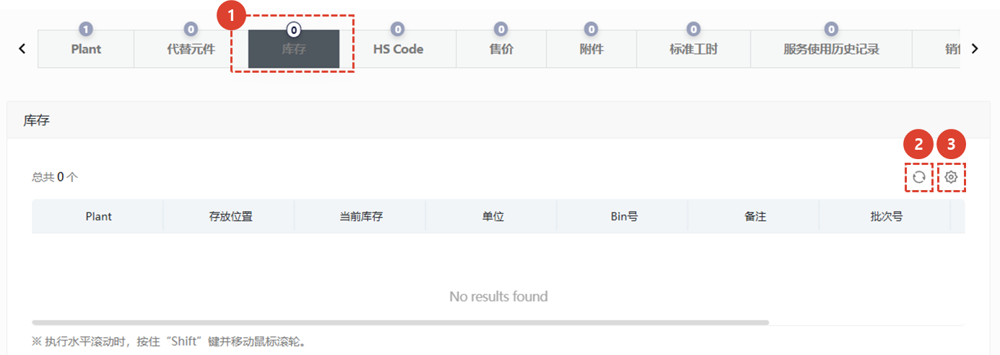
1. 显示所选产品/零件数据的库存状态。
    :::info
    - 隶属于总部的用户将看到所有仓库的库存。
    - 隶属于其他公司的用户将看到以下仓库的库存：
        - 仓库位置的库存信息设置在“中心 - 存储位置”中
        - 仓库位置的库存信息在“门店 - 库存”中手动登记和管理
        - 仓库位置的库存信息设置在“中心 - 物料审批中心”中
    :::
1. 点击**刷新**按钮更新库存状态。
2. 点击**齿轮**按钮管理库存清单表格。
</ValidateTextByToken>
 
 

<ValidateTextByToken dispTargetViewer={false} dispCaution={true} validTokenList={['head', 'branch', 'seller', 'agent']}>

### 附加信息 - HS Code
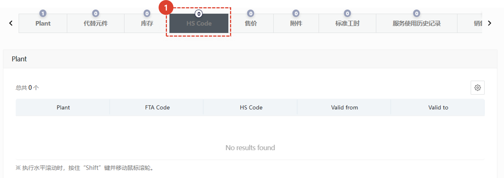
1. 如果有产品和零部件出口，您可以查看**国际税号**。

### 附加信息 - 售价
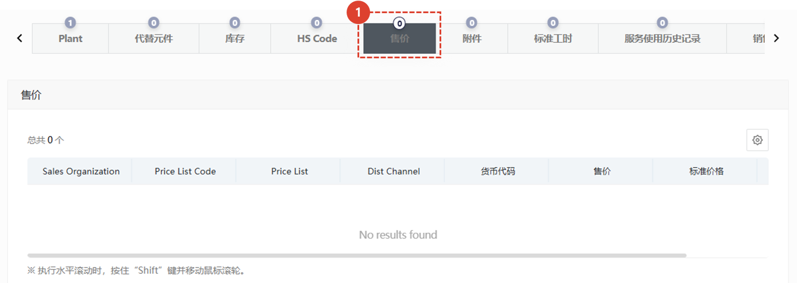
:::Warning 查看价格信息
- **价格管理员**：显示映射到所有**价格表**的价格信息。
- **其他用户**：显示来自**标准信息中心-组织信息**中设置的供应价格表和销售价格表的价格信息。
:::
1. 您可以点击“价格”选项卡查看价格信息。
 
 

### 附加信息 - 附件
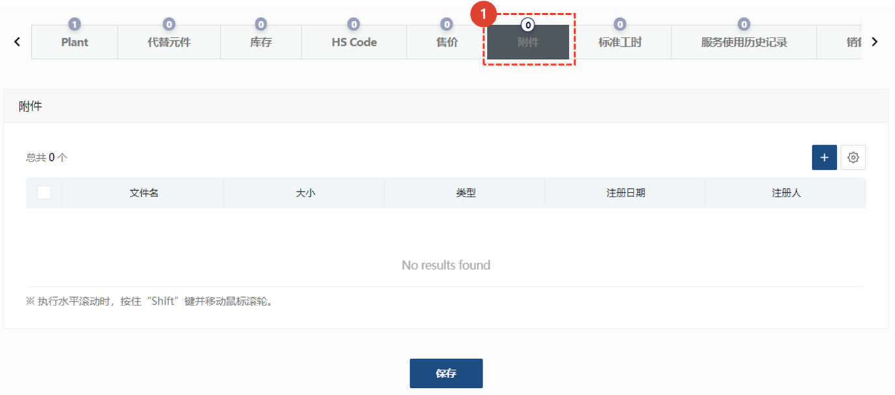
1. 您可以附加和查看相关文件。
 
 

### 附加信息 - 标准工时
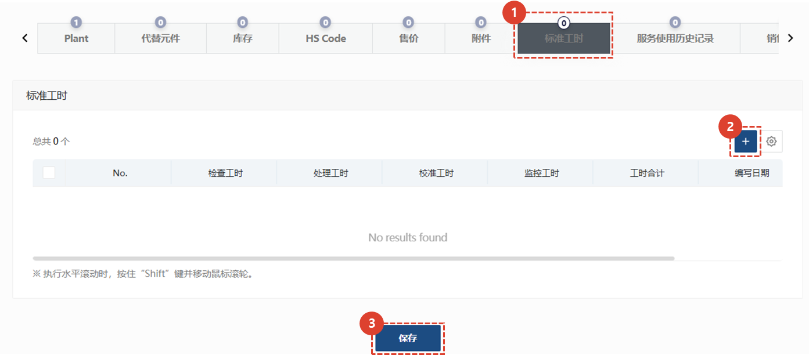
1. 点击**标准工时**选项卡，登记和管理更换所选服务部件的预计标准工时。
2. 点击**+**按钮添加标准工时。
    - 模型：选择适用标准工时的模型。（仅限叶片模型）
    - 工时：输入工时数（小时）。
    - 备注：输入有关工时的详细信息。
1. 输入标准工时后，点击**保存**按钮。
</ValidateTextByToken>
 
 
<ValidateTextByToken dispTargetViewer={false} dispCaution={true} validTokenList={['head']}>

### 附加信息 - 服务使用历史记录
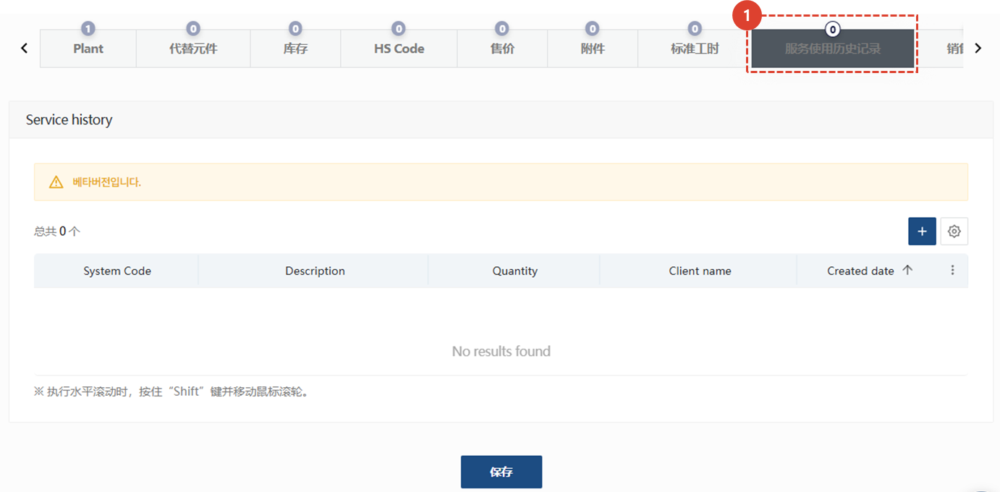
1. 我们计划提供一项功能，允许您查看资产的**服务历史记录**。
 
 

### 附加信息 - 销售记录
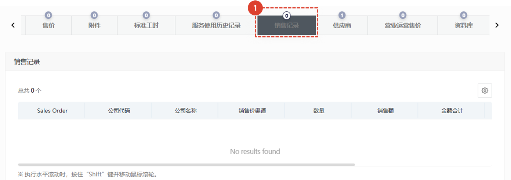
1. 显示与所选产品或零件相关的销售订单历史记录。
 
 

### 附加信息 - 供应商
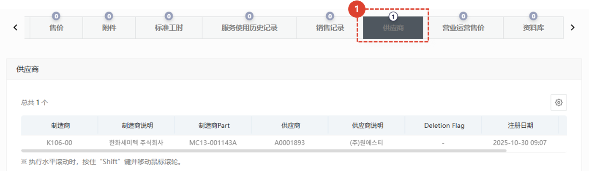
1. 显示所选产品或零件的供应商信息。
    :::danger
    - 显示销售价格，供设置维修零件价格时参考。
    - 禁止用于任何其他用途。
    :::
 
 

### 附加信息 - 营业运营售价
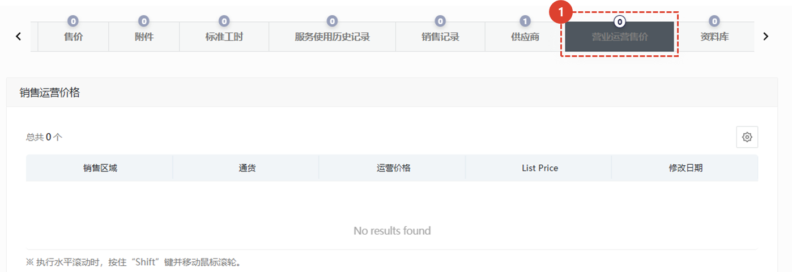
1. 您可以查看销售价格表。只有拥有价格查询权限的用户，例如总部销售经理和系统管理员，才能访问销售价格表。
 
 

### 附加信息 - 资料库
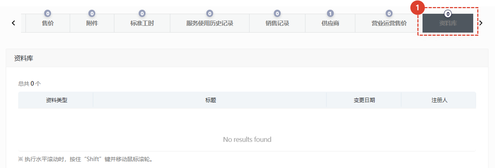
1. 如果与产品或组件相关的数据已上传，您可以查看列表。
</ValidateTextByToken>