import ValidateTextByToken from "/src/utils/getQueryString.js";
import filterList from "./img/002.png";
import searchList from "./img/017.png";
import tableFilter from "./img/006.png";
import createLabor from "./img/013.png";
import filter1 from "./img/126.png";
import filter2 from "./img/057.png";
import filter3 from "./img/128.png";
import filter4 from "./img/059.png";
import table1 from "./img/129.png";
import table2 from "./img/061.png";
import popup1 from "./img/064.png";
import popup2 from "./img/066.png";
import popup3 from "./img/070.png";
import popup4 from "./img/074.png";

# 客户公司

客户数据管理指南

<ValidateTextByToken dispTargetViewer={true} dispCaution={false} validTokenList={['head', 'branch', 'seller', 'agent']}>

## 列表页
    :::tip 以下数据将显示在列表中
        **注册渠道**列显示数据生成的位置。
        - **MDG**: 来自 MDG 编号的客户信息
        - **4CUST**: 从 4CUST 系统迁移的客户信息
        - **CRM**: 在H-CRM服务模块中创建的客户信息
        - **SALES-CRM**: 在H-CRM销售模块中创建的客户信息
    :::
 
 

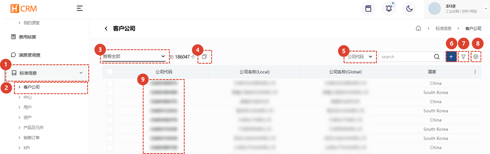
1. 单击**标准信息**菜单。
1. 单击**客户公司**菜单以显示客户数据列表。
1. 使用[**列表过滤**](#列表过滤)仅显示符合特定条件的客户。
1. 您可以为同一客户的多个客户[**连接客户代码**](#链接客户代码)。
1. 输入[**搜索词**](#搜索)来搜索所需的数据。
1. 您可以**创建新客户**。
1. 您可以通过输入[**多个过滤器**](#高级搜索)来搜索数据。
1. 您可以[**Excel 导出**](#excel-导出)、[**表格管理**](#表管理)或[**删除**](#删除)客户信息。
1. 点击[**客户代码**](#详情页)，查看客户详细信息。
 
 

### 列表过滤
:::tip
以下是按用户/部门或最近条目进行过滤的方法。
:::
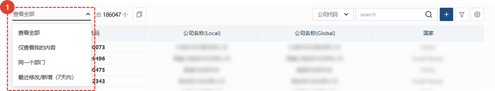
1. 选择您想要的过滤方式。选择后会立即出现相应的列表。
 
 

### 搜索
:::tip
搜索表格的方法如下。
:::

1. 选择搜索过滤器，然后搜索。
 
 

### 高级搜索
:::tip
以下是应用**多个**搜索过滤器的方法。
:::
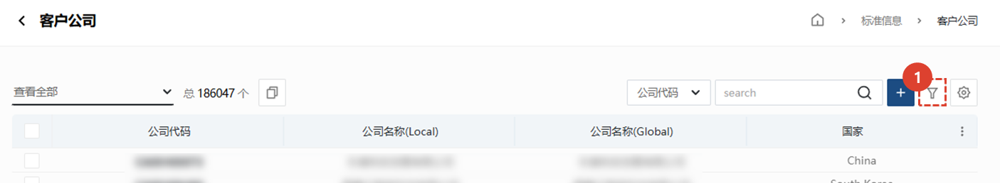
1. 点击**过滤按钮**。
 
 

1. 选择筛选条件。
1. 输入搜索词。
1. 点击 **+**按钮添加搜索词。
1. 点击**搜索**按钮查看结果。
 
 

### Excel 导出
:::tip
以下是将列表导出到 Excel 的方法。
:::

1. 单击 Excel 导出按钮。
 
 

1. 选择**输出选项**。
1. 单击**确定**按钮，然后访问[**系统管理 > Excel 下载**](/SMT/tutorial-12-system-management/03-export-data.md)菜单下载 Excel 文件。
 
 
 
### 表管理
:::tip
本指南介绍如何显示列、更改显示的列以及更改其顺序。
:::

1. 点击**表格管理**，可以更改表格中显示的项目和顺序。
 
 

1. 点击您想要在表格中显示的项目对应的切换按钮，使其变为蓝色。
1. 您可以拖动列表图标来更改列的位置。
1. 点击“关闭”以更改表格以反映所选内容。
 
 

### 删除
:::warning
以下是删除客户帐户的说明。 请谨慎操作，因为删除操作**很难恢复**。
:::

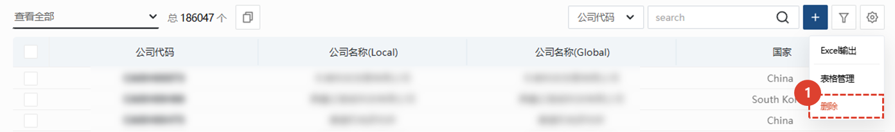
1. 点击**齿轮**按钮。
1. 点击**删除**按钮。
 
 

1. 点击弹出窗口中的**删除**按钮，删除该客户。
 
 

## 客户注册
:::warning
注册新客户时，请确保没有现有注册客户，以避免重复注册.
:::
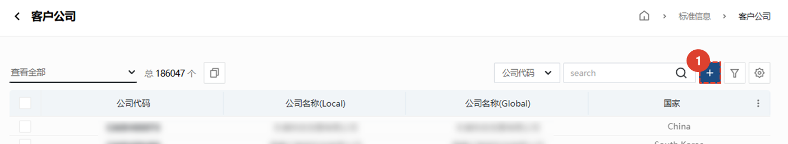
1. 点击**+**按钮。
 
 

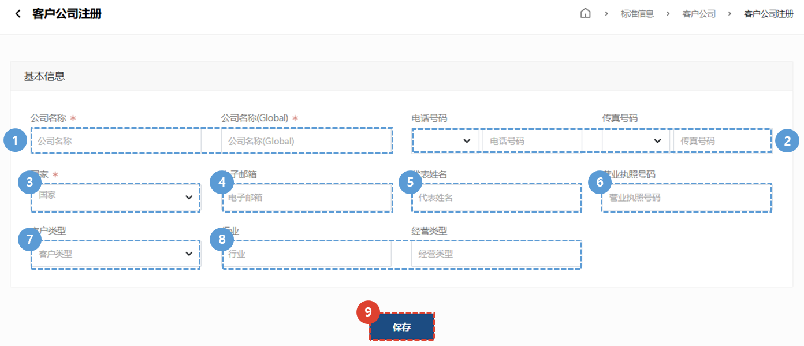
1. 输入您要注册的**公司名称**。
1. 输入您的**电话号码**和**传真号码**。
1. 选择您要注册的客户的**国家**。
    :::warning
    请输入设备安装的地点，而不是客户总部所在的国家。
    :::
1. 输入客户联系人的**电子邮件**。
1. 输入**代表姓名**。
1. 输入**商业登记号码**。
1. 选择**客户类型**。
1. 选择**行业**和**业务类型**。
1. 点击**保存**按钮完成客户注册。
 
 

## 链接客户代码
:::tip
**如果您有多个注册客户，**我们将向您展示如何将他们关联为一个客户。
 这可以防止订单历史记录或资产分散在多个注册中的问题。
:::

### 在列表页面上
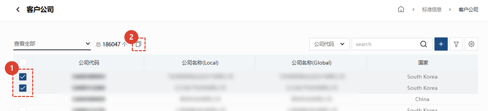
1. **勾选**您需要捆绑的多个客户。
1. 点击**复制图标**。
 
 

1. 点击**确认**按钮，完成客户连接。
 
 

### 在详细信息页面上
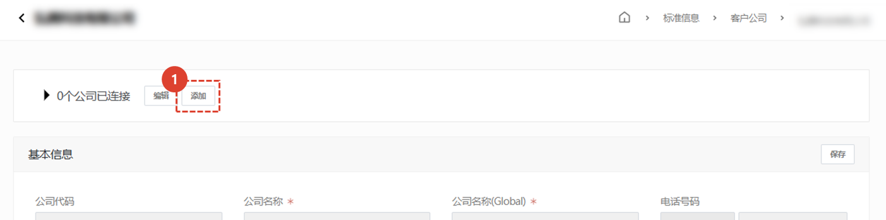
1. 点击**添加**按钮选择要连接的客户。
 
 

1. 搜索您要连接的客户端。
1. 确认搜索结果正确后，点击**保存**按钮。
:::tip
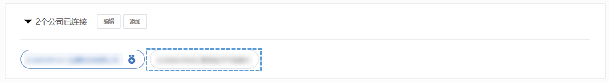
一旦客户连接完成，就会显示如上。
:::
 
 

### 代表公司变更
:::info
以下是如何更改您想要在链接公司中显示为代表的公司。
:::
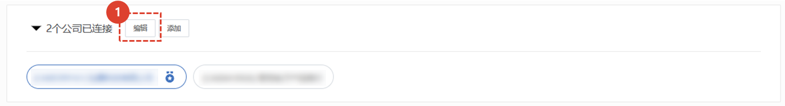
1. 单击**编辑**按钮。
 
 

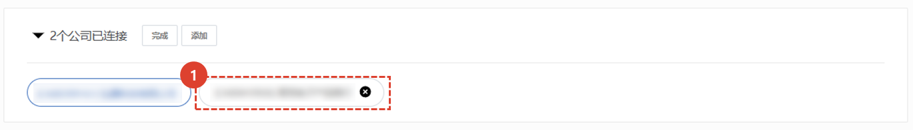
1. **选择**一家代表性公司。
 
 

1. 单击**更改**按钮。
 
 

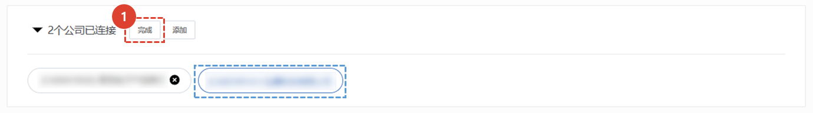
1. 点击**完成**按钮，完成代表客户信息的更改。

 
 

## 详情页
### 基本信息
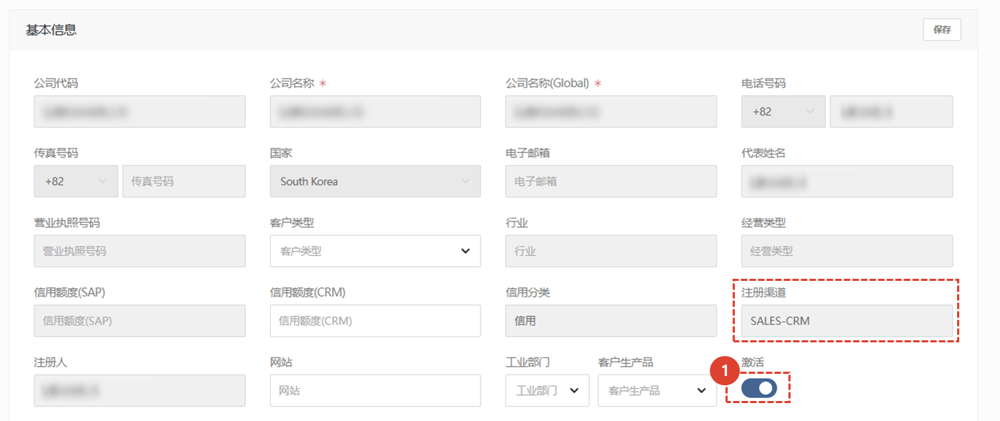
:::warning
在 MDG 注册的客户的大部分基本信息均无法修改。
 任何未标记为蓝色的基本信息的更改都必须**在 MDG 中进行**。
:::

1. 只有勾选“激活”复选框的客户才能在服务订单、技术支持等中被搜索到。
 对于不再提供服务的客户，请停用“激活”按钮。
 
 

### 附加信息 - 地址
:::warning
如果您访问中国的域名，则不会显示地图UI。
:::

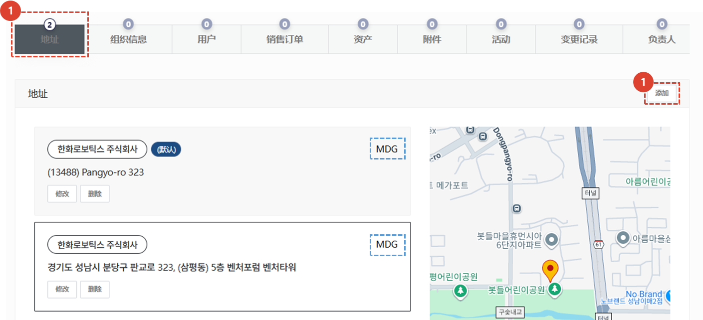
1. 单击“附加信息**中的**地址”选项卡，显示您公司注册的地址信息。
    :::tip
    该地址的注册频道显示为蓝色框。
    :::
1. 单击**添加**按钮添加新的客户地址。
    :::info 如何添加新的客户地址
    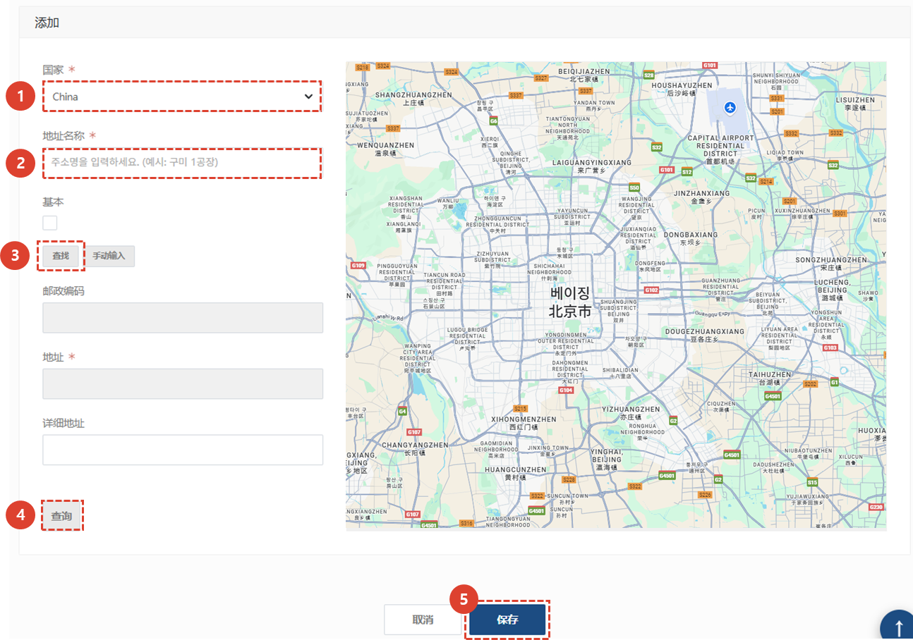
    1. 添加您要注册的地址的**国家**。
    1. 输入**地址名称**。
    1. 点击**查找**按钮搜索地址。
    1. 搜索或手动输入地址后，点击**搜索**按钮查看地图。
    1. 点击**保存**按钮完成地址注册。
    :::
 
 

### 附加信息 - 组织信息
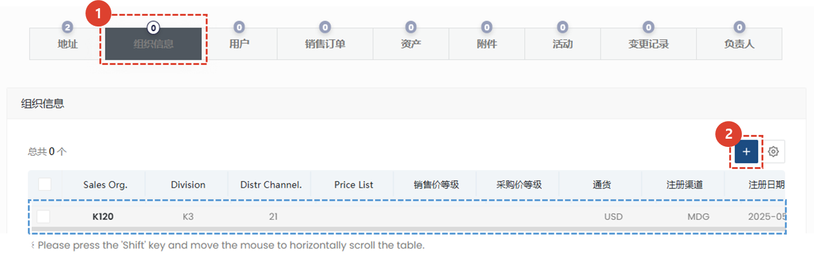
1. 点击“组织信息”选项卡，查看已注册的组织信息。
1. 如果需要添加其他组织信息，请点击“+”按钮进行添加。
    :::info
    添加组织信息所需的字段与 MDG 相同。
    :::
 
 

### 附加信息 - 用户
:::info
显示在选定客户公司下注册的用户的 CRM 帐户信息。
:::

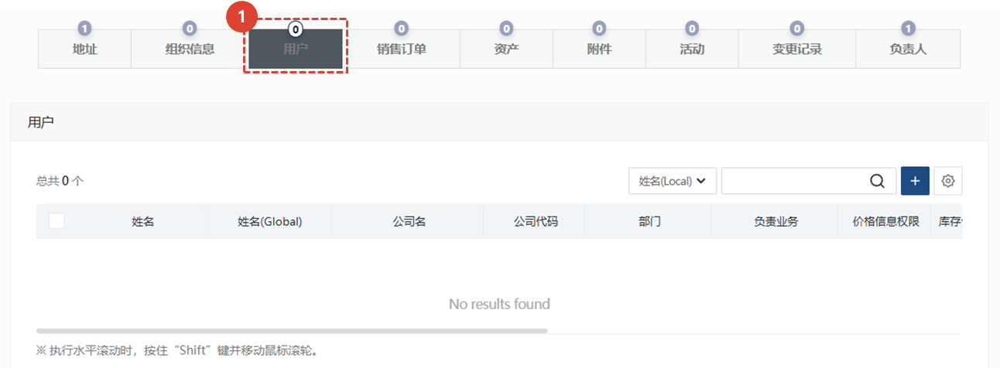
1. 点击“用户”选项卡查看用户。客户代表可以点击“+”按钮代表您注册用户。
</ValidateTextByToken>
 
 

### 附加信息 - 销售订单

<ValidateTextByToken dispTargetViewer={false} dispCaution={true} validTokenList={['head', 'branch']}>
:::info
显示向选定客户发出的销售订单列表。
:::
:::warning 权限通知
只有拥有“查看销售订单”权限的用户才能查看此选项卡。如需咨询权限问题，请联系您的 CRM 代表。
:::
 
 

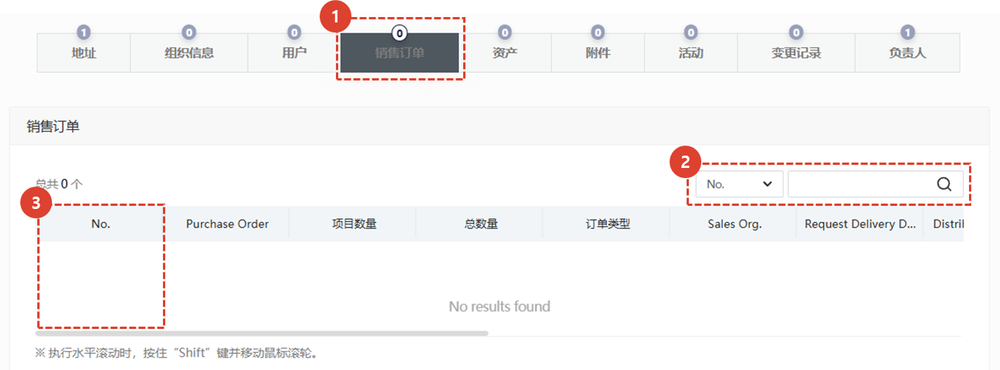

1. 点击“销售订单”选项卡，查看已发给客户的销售订单列表。
1. 您可以按“销售编号”或“采购订单编号”进行搜索。
1. 点击“销售编号”进入订单详情页面。
    :::warning
    访问销售订单详情页面需要特殊权限。
    :::
</ValidateTextByToken>
 
 

### 附加信息 - 资产

<ValidateTextByToken dispTargetViewer={false} dispCaution={true} validTokenList={['head', 'branch', 'seller', 'agent']}>
:::info
    显示选定客户持有的资产列表。
:::

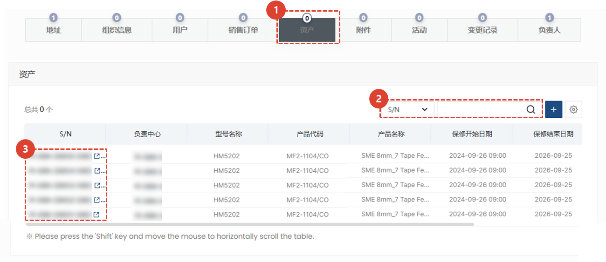
1. 点击“资产”选项卡。
1. 您可以搜索资产。
    :::tip 资产搜索筛选列表
    S/N / Model Name / Model Name (G) / Product Code / Product Name / Product Name (G) / Customer Name / Customer Name (G) / Customer Code / Customer Representative Name / Responsible Center Name / Responsible Center Name (G) / Responsible Center Code / Warranty Period (Months) / NC No. / Order Number / Registrant / Modifier / Subasset
    :::
1. 点击资产的**S/N**进入**详情页**。
 
 

### 附加信息 - 附件
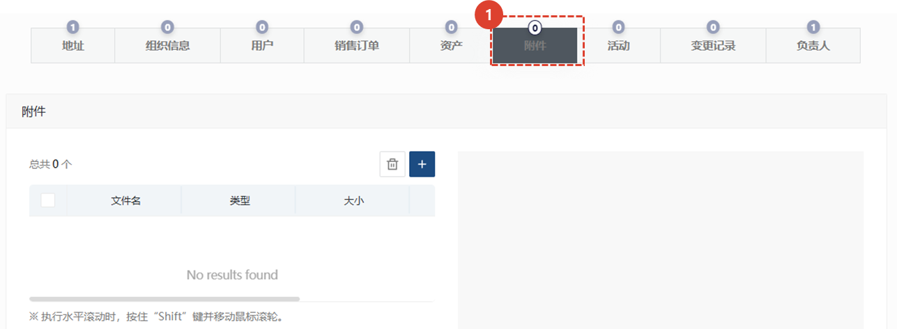

1. 点击**附件**标签，附加或查看相关文件。
 
 

### 附加信息 - 活动
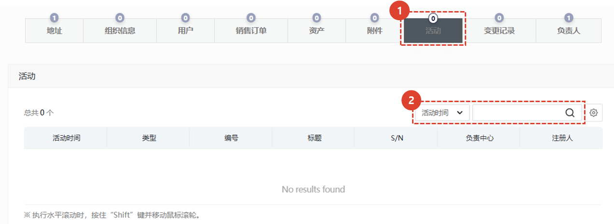
1. 点击“活动”选项卡，查看客户的服务活动详情。
1. 您可以搜索活动。
    :::tip 活动搜索筛选列表
    Activity Date/Type/Number/Title/S/N/Responsible Center/Registered Person
    :::
 
 

### 附加信息 - 变更历史
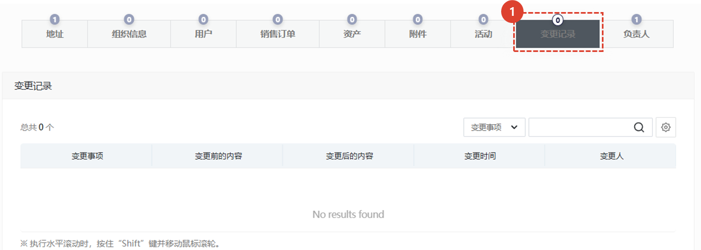
1. 点击**变更历史**标签，查看变更历史，包括贵公司的信息。
 
 

### 附加信息 - 联系人
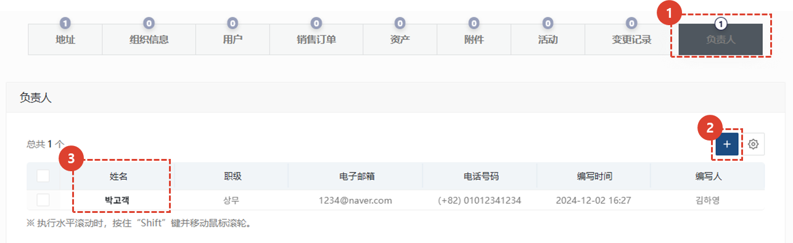
1. 点击“联系人”选项卡，查看或添加客户的联系人信息。
1. 点击“添加”按钮，添加客户的联系人信息。
1. 点击姓名，查看或编辑联系人详细信息。
</ValidateTextByToken>
