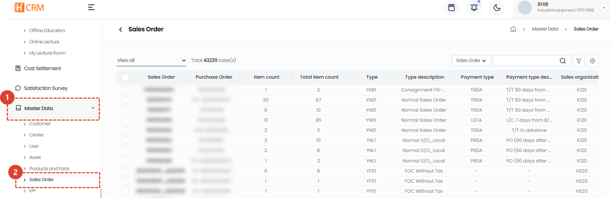

import ValidateTextByToken from "/src/utils/getQueryString.js";

# 销售订单

This guide explains how to manage sales order data.

<ValidateTextByToken dispTargetViewer={true} dispCaution={true} validTokenList={['head']}>

1. Click the **Standard Information** menu.
1. Click the **Sales Order** menu.
    - A list of relevant SOs will appear based on your organization. Click the SO number to view detailed information.
</ValidateTextByToken>
