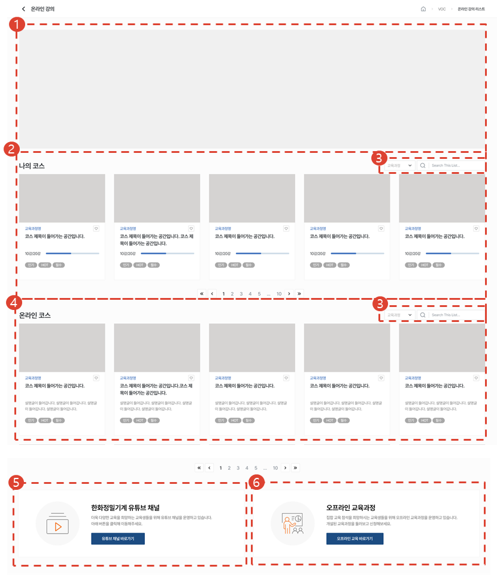
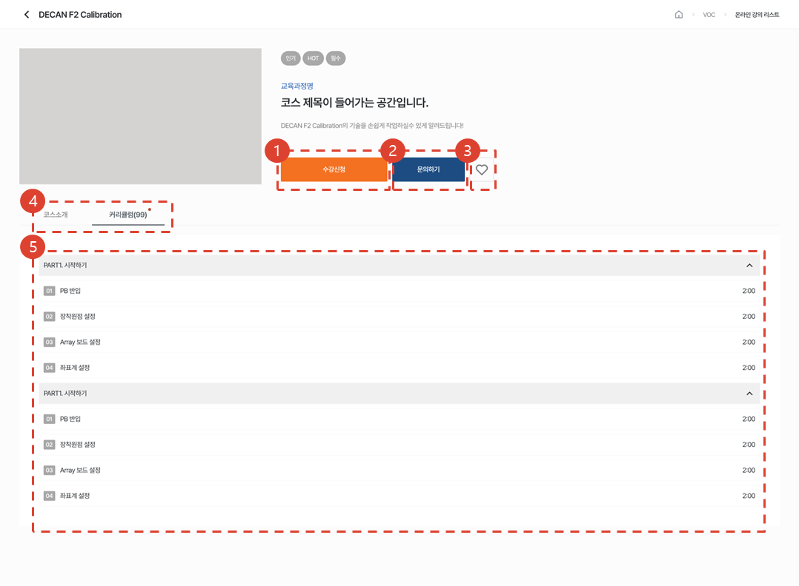
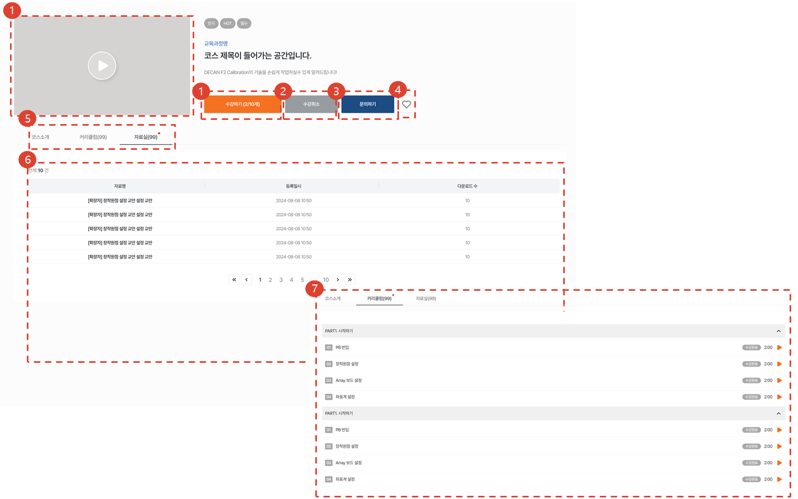
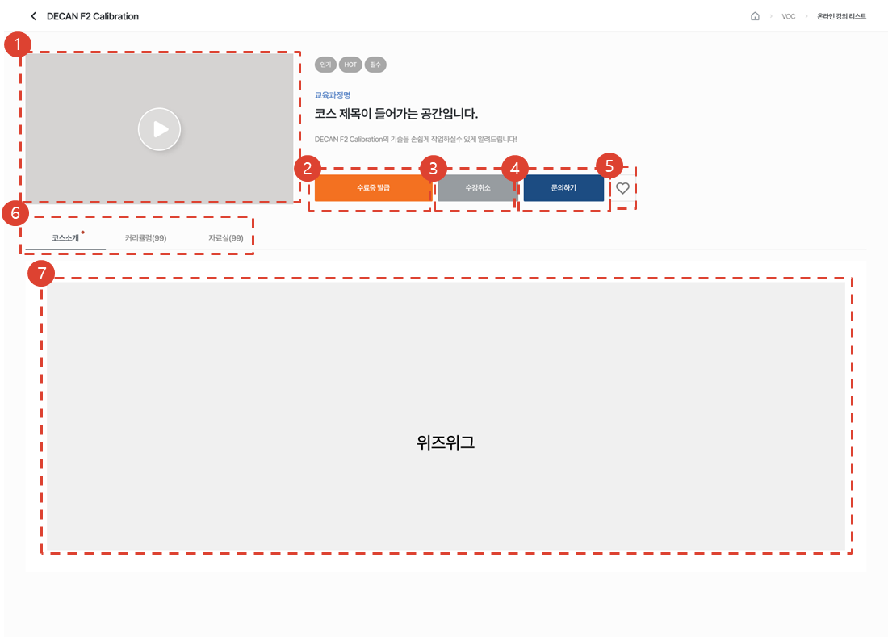
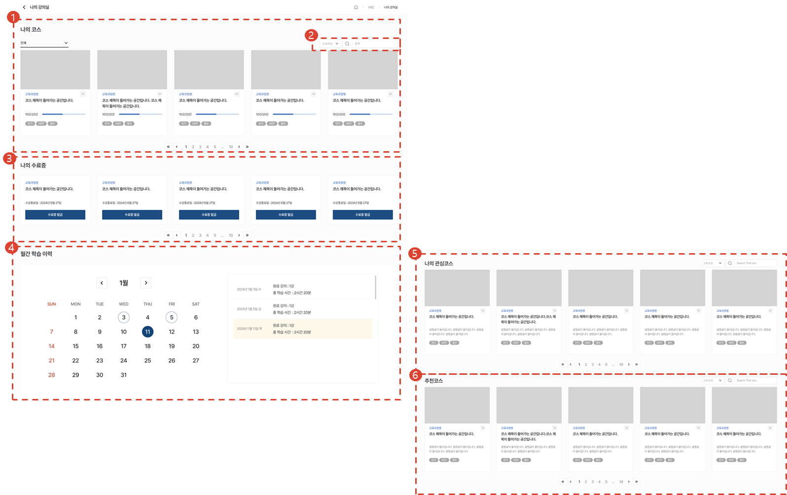

# 온라인 교육

온라인 교육과정의 소개와 수강 절차에 대해 안내합니다.

## 온라인 강의

1. 배너 영역입니다.
1. 수강중인 코스 목록입니다. 제목을 클릭하여 코스의 상세페이지로 이동이 가능합니다. [♡] 버튼 클릭 시, [나의 강의실 > 나의 관심코스]에 코스가 저장됩니다.
1. Selectbox의 유형을 선택 후, 원하는 검색어로 검색할 수 있습니다.
1. 온라인코스 목록입니다. 제목을 클릭하여 코스의 상세페이지로 이동이 가능합니다. [♡] 버튼 클릭 시, [나의 강의실 > 나의 관심코스]에 코스가 저장됩니다.
1. [유튜브 채널 바로가기] 버튼을 클릭하여 한화정밀기계 유튜브 채널로 이동할 수 있습니다.
1. [오프라인 교육 바로가기] 버튼을 클릭하여 오프라인교육 페이지로 이동할 수 있습니다.

## 코스 상세

### 수강 신청 전

1. [수강신청] 버튼을 클릭하여 수강신청을 할 수 있습니다. 
1. [문의하기] 버튼을 클릭 시 [기술지원 > Q&A] 온라인교육 문의 페이지가 새탭으로 열립니다. 해당 페이지에서 문의내용을 작성할 수 있습니다.
1. [♡] 버튼 클릭 시, [나의 강의실 > 나의 관심코스]에 코스가 저장됩니다.
1. 코스소개 / 커리큘럼 탭을 선택해 이동할 수 있습니다.
1. 코스의 커리큘럼을 확인할 수 있습니다.

### 수강 신청 후

1. [재생] 또는 [수강하기] 버튼을 클릭하여 강의를 재생할 수 있습니다.
1. [수강취소] 버튼을 클릭하여 수강취소를 할 수 있습니다. 
1. [문의하기] 버튼을 클릭 시 [기술지원 > Q&A] 온라인교육 문의 페이지가 새탭으로 열립니다. 해당 페이지에서 문의내용을 작성할 수 있습니다.
1. [♡] 버튼 클릭 시, [나의 강의실 > 나의 관심코스]에 코스가 저장됩니다.
1. 코스소개 / 커리큘럼 / 자료실 탭을 선택해 이동할 수 있습니다.
1. 자료명을 클릭하여 자료를 다운로드할 수 있습니다.
1. 강의를 재생 및 완료강의를 확인할 수 있습니다.

### 수강 완료

1. [재생] 버튼을 클릭하여 강의를 재생할 수 있습니다.
1. [수료증발급] 버튼을 클릭하여 수료증을 다운로드할 수 있습니다.
1. [수강취소] 버튼을 클릭하여 수강취소를 할 수 있습니다. 
1. [문의하기] 버튼을 클릭 시 [기술지원 > Q&A] 온라인교육 문의 페이지가 새탭으로 열립니다. 해당 페이지에서 문의내용을 작성할 수 있습니다.
1. [♡] 버튼 클릭 시, [나의 강의실 > 나의 관심코스]에 코스가 저장됩니다.
1. 코스소개 / 커리큘럼 / 자료실 탭을 선택해 이동할 수 있습니다.
1. 코스 소개글을 볼 수 있습니다.

## 나의 강의실

1. 나의 수강중  / 수강완료 코스를 확인할 수 있습니다.
1. Selectbox의 유형을 선택 후, 원하는 검색어로 검색할 수 있습니다.
1. 수강완료된 코스의 수료증을 발급할 수 있습니다.
1. 월별로 학습이력을 확인할 수 있습니다. 1강 이상 학습을 한 일자에는 달력과 목록에 표시됩니다. 
1. [♡] 버튼으로 눌러 찜한 코스 목록입니다.  
1. 수강인원이 많은 코스를 추천해주고 있습니다. 

