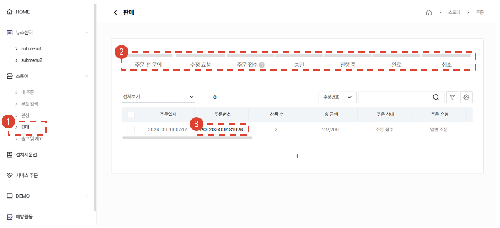
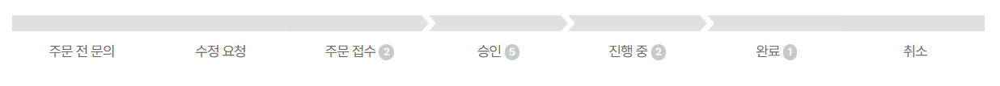
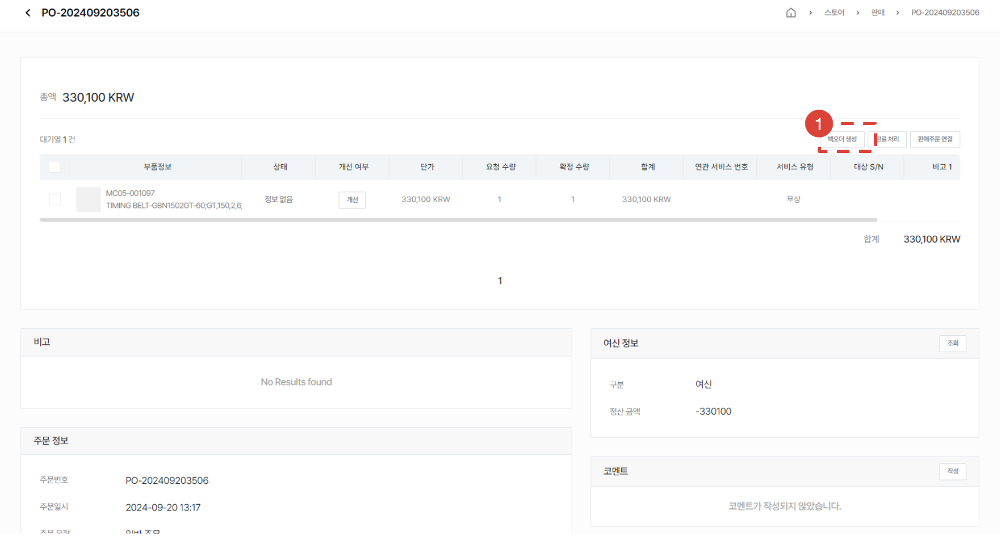

# 주문서 처리

접수된 주문서의 처리 절차에 대해 안내합니다.
 
## 주문서 목록

1. **스토어** - **판매** 메뉴를 선택합니다.
1. 주문서 목록에서 주문서의 상태를 확인합니다.
1. 주문번호를 눌러 상세페이지로 진입합니다.

## 주문서 목록 - 주문서 상태

- 주문전 문의: 구매자가 주문서를 임시저장해둔 상태입니다.
- 수정 요청: 판매자가 주문자에게 주문서의 수정을 요청한 상태에 있는 주문서입니다.
- 주문 접수: 구매자가 판매자에게 주문을 접수한 주문서입니다.
- 승인: 판매자가 승인한 주문서입니다.
- 진행중: SO가 발행이되면 진행중으로 표시됩니다.
- 완료: 모든 주문 아이템에 DO번호가 부여가 되면 완료로 표시됩니다.
- 취소: 취소된 주문건입니다.

## 주문서 상세

1. 주문 아이템을 확인합니다.
1. 구매자의 여신 정보를 확인할 수 있습니다.
1. 주문서의 상태를 변경할 수 있습니다.
    - 승인: 주문서를 승인합니다. [승인 이후의 절차를 보려면 여기를 클릭합니다.](#주문서-상세---승인)
    - 거절: 주문서가 반려/취소됩니다.
    - 수정요청: 주문서를 수정할 것을 요청합니다.(수량변경, 판가변경, 부품코드 변경등의 사유)

## 주문서 상세 - 승인

- 승인된 주문서는 다음의 절차를 진행할 수 있습니다.
    - 백오더: 중간 판매자가 본사를 대상으로 주문서의 부품을 재주문할 수 있습니다.
    - 완료처리: 주문서를 완료 상태로 처리합니다. 구매자에게는 이 주문서가 **완료** 상태로 표시됩니다.
    - 판매주문 생성: 이 주문서를 바탕으로 판매주문을 발행할 수 있습니다.

## 주문서 상세 - 승인 - 백오더

:::note
- 구매자의 주문 요청건을 대응하고 난 뒤, 대응한 수량만큼의 재고를 다시 충당하기 위해 본사로 주문을 해야하는 경우 간편히 사용할 수 있습니다.
- 이 주문서를 근거로 본사로 주문서를 생성할 수 있습니다.
- 백오더는 중간 판매자*1 의 사용 메뉴입니다.
> *1 법인 또는 자재거점(Amtest)
:::

## 주문서 상세 - 승인 - 백오더 - 생성

1. 법인 또는 자재거점(Amtest)용 메뉴입니다. 주문자 대응 이후에 본사로 다시 발주를 내야하는 경우에 활용합니다.
1. 백오더를 생성할 부품을 선택합니다.
1. [백오더 생성] 버튼을 누릅니다.
    - 백오더로 생성할 부품의 수량을 확인하고 ‘생성‘ 버튼을 누릅니다.
        :::note 
        ※ 선택 수량을 더블클릭하여 변경할 수 있습니다.
        :::