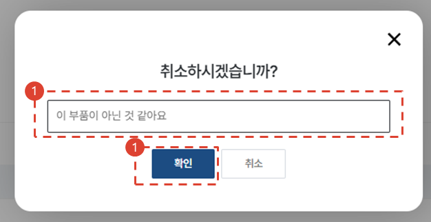
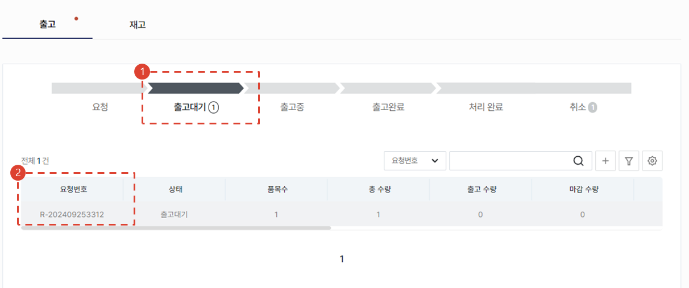
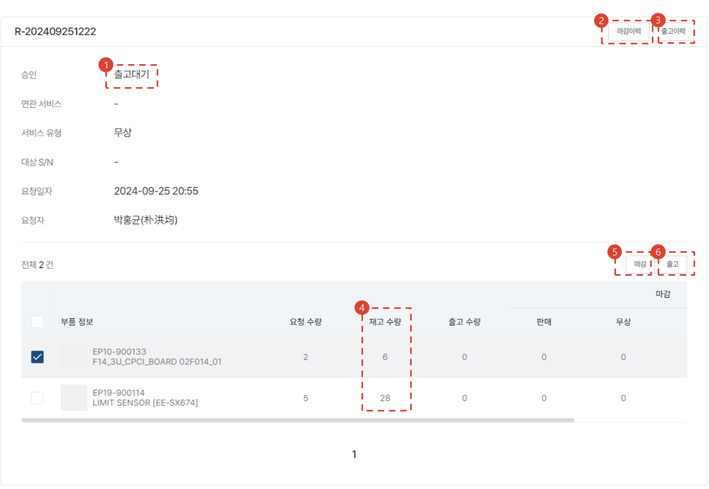
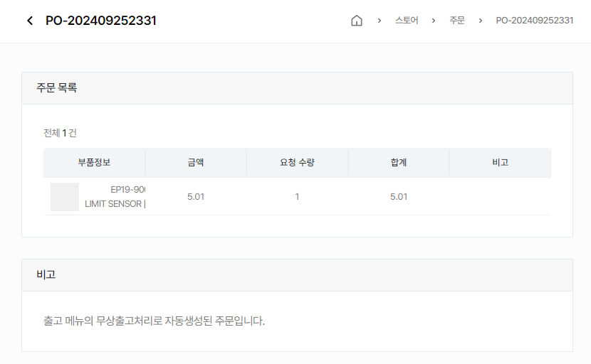
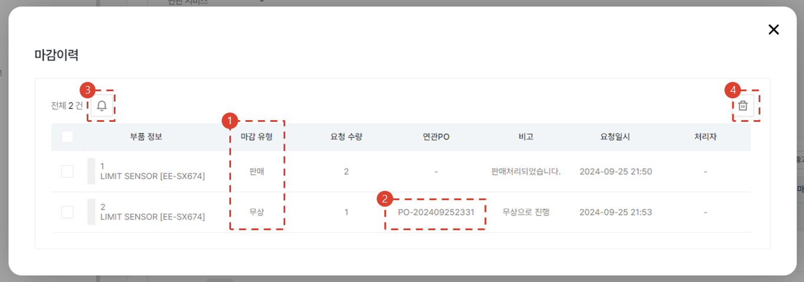

import img043 from "./img/043.png";
import img046 from "./img/046.png";

# 서비스부품 출고 승인 및 관리 ✨

서비스부품 입출고 요청과 승인 절차가 필요한 경우 사용절차에 대해 안내합니다.

## 출고 요청 내용 확인 ✨

1. [스토어] → [출고 및 재고] 메뉴를 클릭합니다.
1. [출고] 탭의 [요청] 바를 클릭하여 요청된 것만 볼수 있도록 필터링합니다.
1. **요청번호**를 클릭합니다.

1. 출고 상태를 확인합니다. **요청** 단계인 것을 확인합니다.
1. 연관된 서비스 주문이 있다면 서비스 주문번호, 서비스 유형, 서비스 대상 자산의 시리얼번호가 표시됩니다.
1. 요청일자와 요청자 정보를 확인합니다.
1. 요청 부품의 목록을 확인합니다.
1. 기각 사유가 있다면 클릭합니다. [기각 단계](#출고-요청-기각)로 이동합니다.
1. [승인] 버튼을 눌러 출고 승인 처리를 합니다. [승인 단계](#출고-요청-승인)로 이동합니다.

## 출고 요청 기각 ✨

1. 기각 사유를 입력합니다.
1. [확인] 버튼을 누릅니다.

## 출고 요청 승인 ✨

[출고 요청 승인](#출고-요청-내용-확인) 단계에서 [승인] 버튼을 클릭 시 표시되는 모달 화면에서 [확인] 버튼을 한번 더 누릅니다.

## 출고 진행 ✨

1. [출고] 탭의 [출고대기] 바를 클릭합니다.
2. 요청 내용을 클릭합니다.

1. 상태값이 **출고대기** 인 것을 확인합니다.
1. 마감처리된 이력을 확인할 수 있습니다.
1. 출고된 이력을 확인할 수 있습니다.
1. 재고 수량을 확인할 수 있습니다.
    :::info 재고수량 위치
    [기준정보] → [센터] → [기본정보] → [저장위치] 값에 해당하는 Storage Location의 가용 재고 수량을 표시합니다.
    ::: 
1. 마감 처리를 수행합니다.
1. 출고 처리를 진행합니다.

## 출고 ✨

1. 출고 수량을 더블클릭해서 편집합니다.
1. 출고 관련 코멘트를 기재합니다.
1. [저장] 버튼을 누릅니다.
:::warning
    여기서의 작업은 시스템 처리만을 다루기 때문에, 실제로 기재된 내용에 맞게 실제 부품의 출고 작업을 반드시 진행해주셔야 합니다.
:::
 
### 출고 이력 확인 ✨

1. 1 건의 출고이력이 발생하게 되면 상태가 **출고중** 으로 변경됩니다.
2. [출고 이력] 버튼을 눌러 출고 이력을 확인할 수 있습니다.

- 출고 이력을 확인합니다.
1. 실제 출고된 건이 아닌 경우 [삭제] 버튼을 눌러서 출고 이력을 삭제할 수 있습니다.

## 마감 ✨

### 마감 - 판매 ✨

1. 마감처리할 수량을 수정할 수 있습니다.
1. **처리유형** 항목을 **판매**로 선택합니다.
1. **고객 PO** 번호를 입력합니다.
    :::tip
    관리 목적이 크므로 제대로 된 데이터를 입력합니다.
    :::
1. 마감 처리 내용을 공유할 수 있도록 사용자를 검색합니다.
    :::info
    내 센터의 소속 사용자 중에서만 검색할 수 있습니다.
    :::
1. 관리에 필요한 추가 기재 사항을 입력합니다.
1. [저장] 버튼을 클릭합니다.

### 마감 - 무상 공급 ✨

1. 마감처리할 수량을 수정할 수 있습니다.
1. **처리유형** 항목을 **무상**로 선택합니다.
1. 마감 처리 내용을 공유할 수 있도록 사용자를 검색합니다.
    :::info
    내 센터의 소속 사용자 중에서만 검색할 수 있습니다.
    :::
1. 관리에 필요한 추가 기재 사항을 입력합니다.
1. [저장] 버튼을 클릭합니다.
    :::tip
        아래와 같이 [**스토어 → 무상 서비스 부품 주문**](../tutorial-04-store/create-a-store-order-buyer.md) 건도 함께 생성되었습니다.
        

    :::

### 마감 - 반납 ✨

1. 마감처리할 수량을 수정할 수 있습니다.
1. **처리유형** 항목을 **반납**로 선택합니다.
1. 마감 처리 내용을 공유할 수 있도록 사용자를 검색합니다.
    :::info
    내 센터의 소속 사용자 중에서만 검색할 수 있습니다.
    :::
1. 관리에 필요한 추가 기재 사항을 입력합니다.
1. [저장] 버튼을 클릭합니다.

### 마감 이력 확인 ✨

1. 마감 유형을 확인할 수 있습니다.
2. 연관 PO 번호를 조회할 수 있습니다.
    :::tip
        무상 부품 PO의 경우 클릭하여 [스토어]의 해당 주문 건의 상세페이지로 이동할 수 있습니다.
    :::
3. 이력을 선택하여 알림을 다시 발송할 수 있습니다.
4. 이력을 선택하여 삭제할 수 있습니다.
    :::warning
        무상 부품 PO의 경우 삭제할 수 없습니다.
    :::

