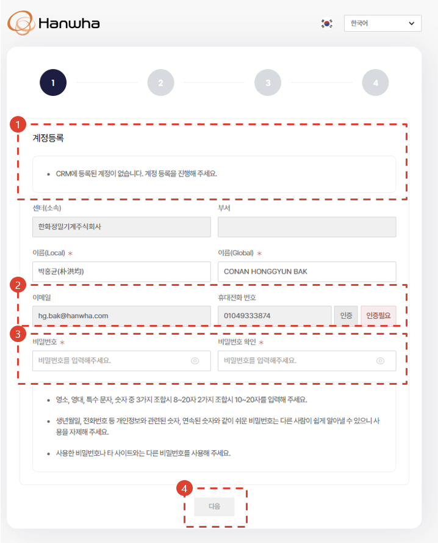
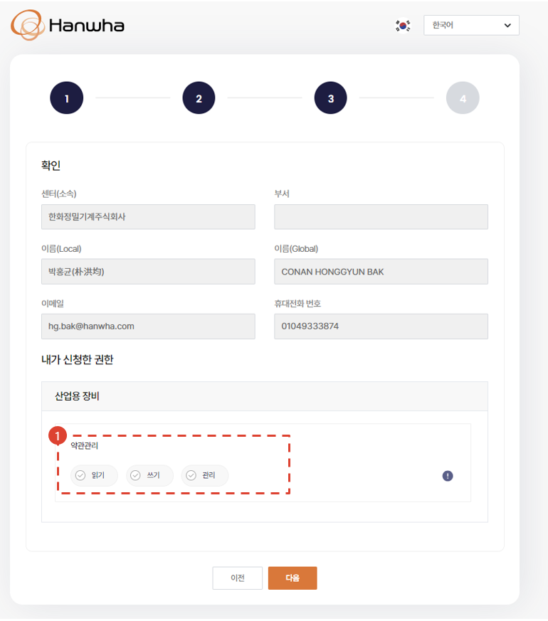

import qrImage from "./img/009.png";
import ValidateTextByToken from "/src/utils/getQueryString.js";
import StrongTextParser from "/src/utils/textParser.js";
import text from "/src/locale/ko/SMT/tutorial-01-auth/create-a-acount-circle-user.json";

# CRM 계정 생성 (서클사용자) 

<!-- 메뉴단에서 번역이 안되므로 여기 하드코딩해야 함 #가 달린 헤더와 함께 -->
사내망에서 CRM 사용 계정을 생성하기 위한 절차를 안내합니다.

<ValidateTextByToken dispTargetViewer={true} validTokenList={['head', 'branch']}>

## 시스템 접속 경로

1. <StrongTextParser text={text.systemAccessPath01} />
- <StrongTextParser text={text.systemAccessPath02} />
  - <StrongTextParser text={text.systemAccessPath03} />
- <StrongTextParser text={text.systemAccessPath04} />
  - <StrongTextParser text={text.systemAccessPath05} />  

## 계정생성 1단계

1. <StrongTextParser text={text.step1AccountCreation01} />
1. <StrongTextParser text={text.step1AccountCreation02} />    
    1. <StrongTextParser text={text.step1AccountCreation03} />
    2. <StrongTextParser text={text.step1AccountCreation04} />
1. <StrongTextParser text={text.step1AccountCreation05} />
    :::note
    - <StrongTextParser text={text.step1AccountCreation06} />
    - <StrongTextParser text={text.step1AccountCreation07} />
    - <StrongTextParser text={text.step1AccountCreation08} />
    :::
4. <StrongTextParser text={text.step1AccountCreation09} />

## 계정생성 2단계

<StrongTextParser text={text.step2AccountCreation01} />

1. <StrongTextParser text={text.step2AccountCreation02} />
1. <StrongTextParser text={text.step2AccountCreation03} />
1. <StrongTextParser text={text.step2AccountCreation04} />
1. <StrongTextParser text={text.step2AccountCreation05} />
1. <StrongTextParser text={text.step2AccountCreation06} />
1. <StrongTextParser text={text.step2AccountCreation07} />
1. <StrongTextParser text={text.step2AccountCreation08} />
1. <StrongTextParser text={text.step2AccountCreation09} />

## 계정생성 3단계

<StrongTextParser text={text.step3AccountCreation01} />

1. <StrongTextParser text={text.step3AccountCreation02} />
    1. <StrongTextParser text={text.step3AccountCreation03} />
    2. <StrongTextParser text={text.step3AccountCreation04} />

## 계정생성 4단계

<StrongTextParser text={text.step4AccountCreation01} />

1. <StrongTextParser text={text.step4AccountCreation02} />
1. <StrongTextParser text={text.step4AccountCreation03} />
1. <StrongTextParser text={text.step4AccountCreation04} />
1. <StrongTextParser text={text.step4AccountCreation05} />

## 계정생성 완료

1. <StrongTextParser text={text.step5AccountCreation01} />
1. <StrongTextParser text={text.step5AccountCreation02} />
1. <StrongTextParser text={text.step5AccountCreation03} />

</ValidateTextByToken>