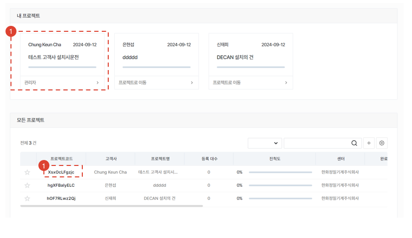
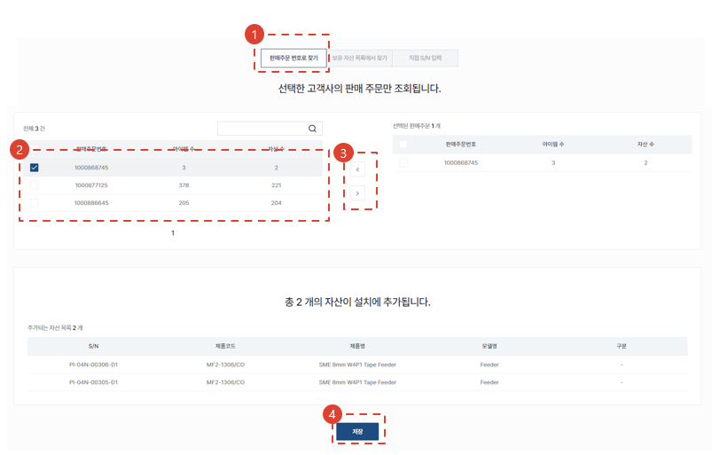
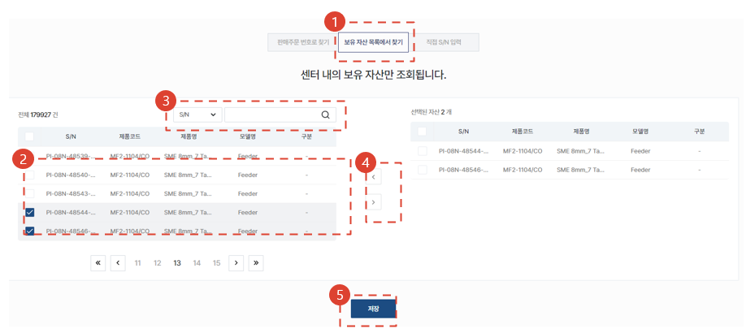
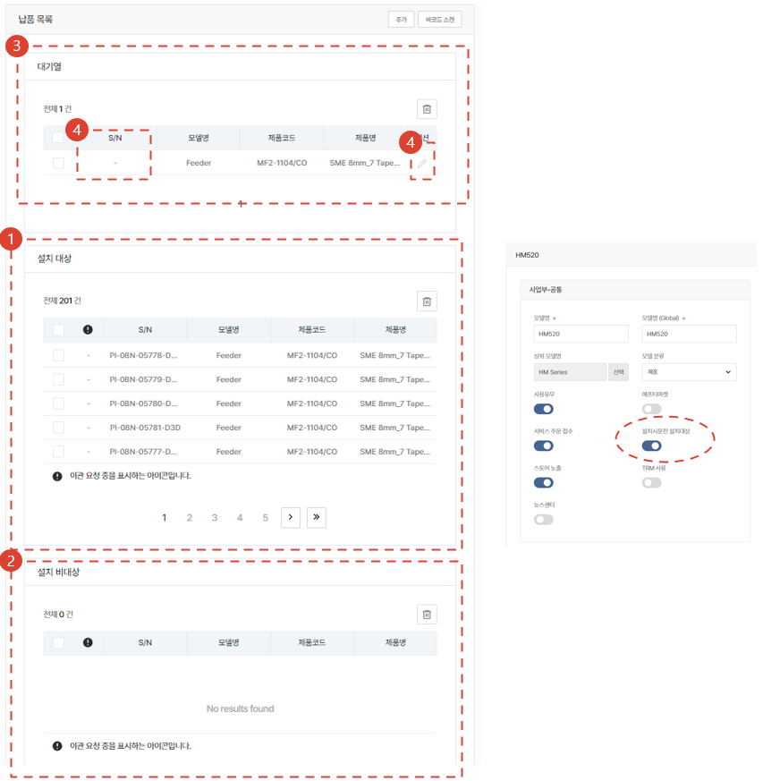
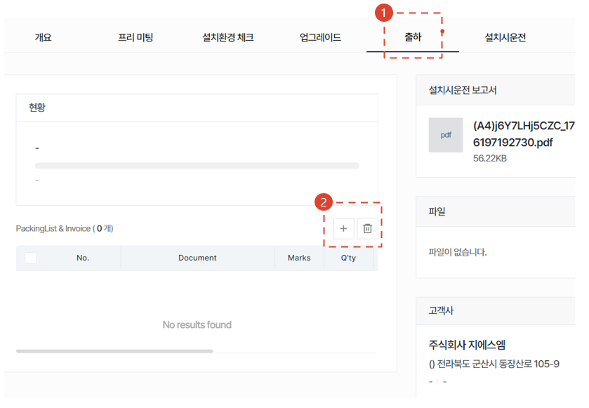

import ValidateTextByToken from "/src/utils/getQueryString.js";
import StrongTextParser from "/src/utils/textParser.js";
import text from "/src/locale/ko/SMT/tutorial-02-installation/02-details-project.json";

# 프로젝트 상세

고객사에 인도된 자산의 설치시운전 작업을 수행하기 위한 절차를 안내합니다.

<ValidateTextByToken dispTargetViewer={true} dispCaution={false} validTokenList={['head', 'branch', 'agent']}></ValidateTextByToken>

## 프로젝트 목록

<ValidateTextByToken dispTargetViewer={false} dispCaution={true} validTokenList={['head', 'branch', 'agent']}>

1. <StrongTextParser text={text.list01} />
1. <StrongTextParser text={text.list02} />

</ValidateTextByToken>

## 프로젝트 상세 진입

<ValidateTextByToken dispTargetViewer={false} dispCaution={true} validTokenList={['head', 'branch', 'agent']}>

1. <StrongTextParser text={text.details01} />

</ValidateTextByToken>

## 상세 - 개요

<ValidateTextByToken dispTargetViewer={false} dispCaution={true} validTokenList={['head', 'branch', 'agent']}>

1. <StrongTextParser text={text.overview01} />
1. <StrongTextParser text={text.overview02} />
    :::warning 
    <StrongTextParser text={text.overview03} link="자산추가" />
    :::
- <StrongTextParser text={text.overview04} link="상세 - 공통사항" />

</ValidateTextByToken>

### 자산추가

<ValidateTextByToken dispTargetViewer={false} dispCaution={true} validTokenList={['head', 'branch', 'agent']}>

1. <StrongTextParser text={text.overviewAddAsset01} />
    :::warning
    <StrongTextParser text={text.overviewAddAsset02} />
    :::

</ValidateTextByToken>

#### 판매주문으로 추가하기

<ValidateTextByToken dispTargetViewer={false} dispCaution={true} validTokenList={['head', 'branch']}>

1. <StrongTextParser text={text.overviewAddAssetBySalesOrder01} />
1. <StrongTextParser text={text.overviewAddAssetBySalesOrder02} />
1. <StrongTextParser text={text.overviewAddAssetBySalesOrder03} />
1. <StrongTextParser text={text.overviewAddAssetBySalesOrder04} />
    - <StrongTextParser text={text.overviewAddAssetBySalesOrder05} link="판매주문으로 자산이 추가된 경우" />

</ValidateTextByToken>

#### 자산목록에서 추가하기

<ValidateTextByToken dispTargetViewer={false} dispCaution={true} validTokenList={['head', 'branch', 'agent']}>

1.  <StrongTextParser text={text.overviewAddAssetByAssetList01} />
    :::note
    <StrongTextParser text={text.overviewAddAssetByAssetList02} />
    :::
1. <StrongTextParser text={text.overviewAddAssetByAssetList03} />
1. <StrongTextParser text={text.overviewAddAssetByAssetList04} /> 
    
1. <StrongTextParser text={text.overviewAddAssetByAssetList05} />
1. <StrongTextParser text={text.overviewAddAssetByAssetList06} />

</ValidateTextByToken>

#### 직접 등록하기

<ValidateTextByToken dispTargetViewer={false} dispCaution={true} validTokenList={['head', 'branch', 'agent']}>

1. <StrongTextParser text={text.overviewAddAssetByDirect01} />
    :::danger
    <StrongTextParser text={text.overviewAddAssetByDirect02} />
    :::
1. <StrongTextParser text={text.overviewAddAssetByDirect03} />
1. <StrongTextParser text={text.overviewAddAssetByDirect04} /> 
    
1. <StrongTextParser text={text.overviewAddAssetByDirect05} />
1. <StrongTextParser text={text.overviewAddAssetByDirect06} />

</ValidateTextByToken>

### 납품목록

<ValidateTextByToken dispTargetViewer={false} dispCaution={true} validTokenList={['head', 'branch', 'agent']}>

<StrongTextParser text={text.serveList01} />

</ValidateTextByToken>

#### 판매주문으로 자산이 추가된 경우

<ValidateTextByToken dispTargetViewer={false} dispCaution={true} validTokenList={['head', 'branch']}>

<StrongTextParser text={text.serveListBySalesOrder01} />

1. <StrongTextParser text={text.serveListBySalesOrder02} />
    :::note
    <StrongTextParser text={text.serveListBySalesOrder03} />
    :::
1. <StrongTextParser text={text.serveListBySalesOrder04} />
    :::note
    <StrongTextParser text={text.serveListBySalesOrder05} />
    :::
1. <StrongTextParser text={text.serveListBySalesOrder06} />
1. <StrongTextParser text={text.serveListBySalesOrder07} />

</ValidateTextByToken>

#### 보유자산목록에서 추가 또는 직접 자산을 등록한 경우

<ValidateTextByToken dispTargetViewer={false} dispCaution={true} validTokenList={['head', 'branch', 'agent']}>

1. <StrongTextParser text={text.serveListByOtherWay01} link="판매주문으로 자산이 추가된 경우" />

</ValidateTextByToken>

## 상세 - 프리미팅

<ValidateTextByToken dispTargetViewer={false} dispCaution={true} validTokenList={['head', 'branch', 'agent']}>

<StrongTextParser text={text.premeeting01} />

### 추가

1. <StrongTextParser text={text.premeetingAdd01} />
1. <StrongTextParser text={text.premeetingAdd02} />
1. <StrongTextParser text={text.premeetingAdd03} />
1. <StrongTextParser text={text.premeetingAdd04} />
1. <StrongTextParser text={text.premeetingAdd05} />

### 소요시간 등록

1. <StrongTextParser text={text.premeetingWorktime01} />
1. <StrongTextParser text={text.premeetingWorktime02} />

### 저장

1. <StrongTextParser text={text.premeetingSave01} />
1. <StrongTextParser text={text.premeetingSave02} />
1. <StrongTextParser text={text.premeetingSave03} />

</ValidateTextByToken>

## 상세 - 설치환경 체크 (for HTAA)

<ValidateTextByToken dispTargetViewer={false} dispCaution={true} validTokenList={['branch']}>

1. <StrongTextParser text={text.facility01} />
1. <StrongTextParser text={text.facility02} />
1. <StrongTextParser text={text.facility03} />

</ValidateTextByToken>

## 상세 - 업그레이드 (for HTAA)

<ValidateTextByToken dispTargetViewer={false} dispCaution={true} validTokenList={['branch']}>

1. <StrongTextParser text={text.upgrade01} />
1. <StrongTextParser text={text.upgrade02} />
    - <StrongTextParser text={text.upgrade03} />
    - <StrongTextParser text={text.upgrade04} />
1. <StrongTextParser text={text.upgrade05} />
1. <StrongTextParser text={text.upgrade06} />

</ValidateTextByToken>

## 상세 - 출하 (for HTAA)

<ValidateTextByToken dispTargetViewer={false} dispCaution={true} validTokenList={['branch']}>

1. <StrongTextParser text={text.packing01} />
1. <StrongTextParser text={text.packing02} />

### 패킹리스트 & 인보이스 생성 (1/3) (for HTAA)

1. <StrongTextParser text={text.step1Packing01} />

### 패킹리스트 & 인보이스 생성 (2/3) (for HTAA)

1. <StrongTextParser text={text.step2Packing01} />
1. <StrongTextParser text={text.step2Packing02} />
1. <StrongTextParser text={text.step2Packing03} />
1. <StrongTextParser text={text.step2Packing04} />
1. <StrongTextParser text={text.step2Packing05} />

### 패킹리스트 & 인보이스 생성 (3/3) (for HTAA)

1. <StrongTextParser text={text.step3Packing01} />
1. <StrongTextParser text={text.step3Packing02} />

</ValidateTextByToken>

## 상세 - 설치시운전

<ValidateTextByToken dispTargetViewer={false} dispCaution={true} validTokenList={['head', 'branch', 'agent']}>

1. <StrongTextParser text={text.installation01} />
1. <StrongTextParser text={text.installation02} />
1. <StrongTextParser text={text.installation03} />
    - <StrongTextParser text={text.installation04} link="소요시간 등록" />

### 설치대상 선택

1. <StrongTextParser text={text.installation05} />
1. <StrongTextParser text={text.installation06} />
- <StrongTextParser text={text.installation07} link="체크리스트 작성" />

### 사용부품 추가 (@HTAA)

1. <StrongTextParser text={text.installationAddParts01} />
1. <StrongTextParser text={text.installationAddParts02} />

### 체크리스트 작성

1. <StrongTextParser text={text.installationChecklist01} />

### 고객 검수 (@HTS)

1. <StrongTextParser text={text.installationInspection01} />
1. <StrongTextParser text={text.installationInspection02} />
1. <StrongTextParser text={text.installationInspection03} />
1. <StrongTextParser text={text.installationInspection04} />
1. <StrongTextParser text={text.installationInspection05} />
    :::note
    <StrongTextParser text={text.installationInspection06} />
    :::

</ValidateTextByToken>

## 상세 - 공통사항

<ValidateTextByToken dispTargetViewer={false} dispCaution={true} validTokenList={['head', 'branch', 'agent']}>

1. <StrongTextParser text={text.common01} />
1. <StrongTextParser text={text.common02} />

</ValidateTextByToken>
