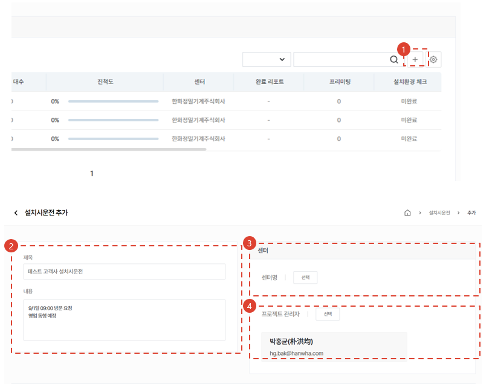
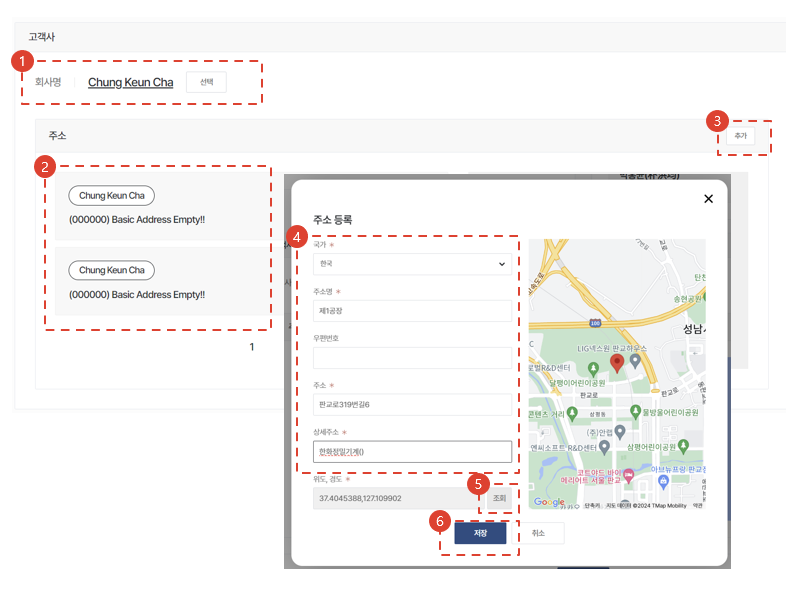
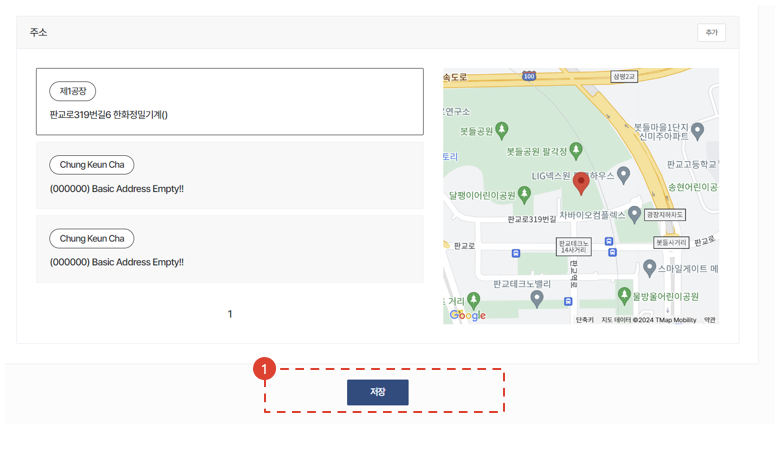

import ValidateTextByToken from "/src/utils/getQueryString.js";
import StrongTextParser from "/src/utils/textParser.js";
import text from "/src/locale/ko/SMT/tutorial-02-installation/01-create-project.json";

# 프로젝트 생성

고객사에 인도된 자산의 설치시운전 작업을 수행하기 위한 절차를 안내합니다.

<ValidateTextByToken dispTargetViewer={true} validTokenList={['head', 'branch', 'agent']}>

## 프로젝트 목록

1. <StrongTextParser text={text.projectList01} />
1. <StrongTextParser text={text.projectList02} />

## 프로젝트 생성 - 1/3

1. <StrongTextParser text={text.step1CreateProject01} />
1. <StrongTextParser text={text.step1CreateProject02} />
1. <StrongTextParser text={text.step1CreateProject03} />
1. <StrongTextParser text={text.step1CreateProject04} />

## 프로젝트 생성 - 2/3

1. <StrongTextParser text={text.step2CreateProject01} />
1. <StrongTextParser text={text.step2CreateProject02} />
1. <StrongTextParser text={text.step2CreateProject03} />
1. <StrongTextParser text={text.step2CreateProject04} />
1. <StrongTextParser text={text.step2CreateProject05} />
1. <StrongTextParser text={text.step2CreateProject06} />

## 프로젝트 생성 - 3/3

1. <StrongTextParser text={text.step3CreateProject01} />

</ValidateTextByToken>