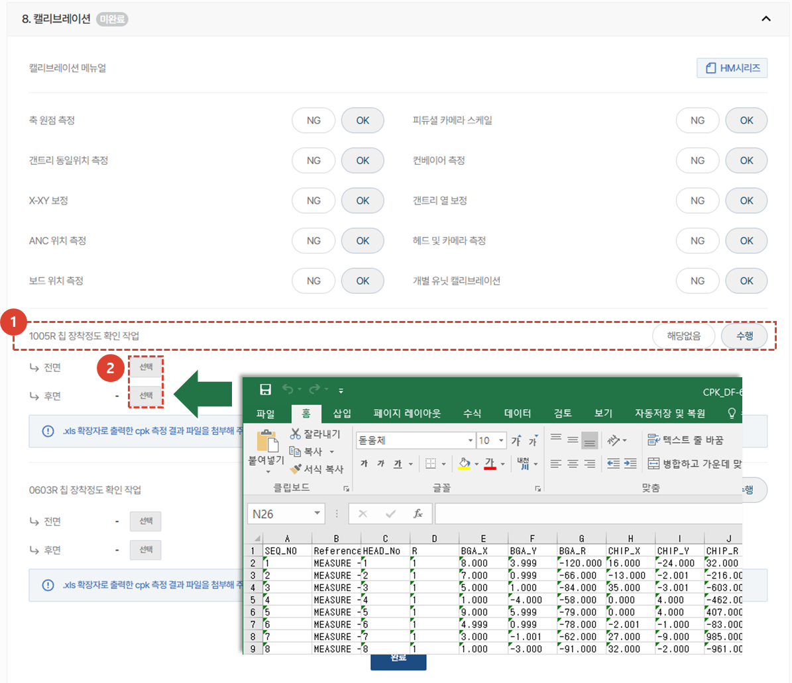
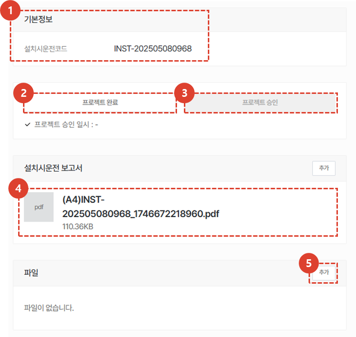
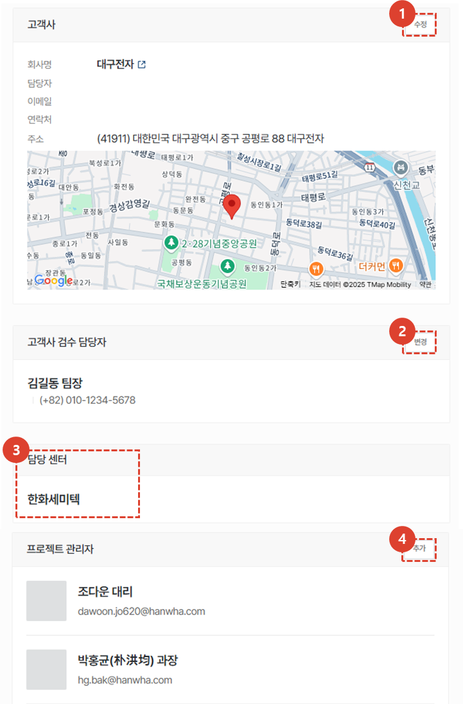

import ValidateTextByToken from "/src/utils/getQueryString.js";
import StrongTextParser from "/src/utils/textParser.js";
import text from "/src/locale/ko/SMT/tutorial-02-installation/02-details-project.json";
import DataAdd from "./img/012_2.png";
import Signature from "./img/039.png";

# 프로젝트 상세 - 설치

프로젝트 상세 화면의 설치 탭을 안내합니다. 

## 프로젝트 상세 탭 안내

<ValidateTextByToken dispTargetViewer={false} dispCaution={true} validTokenList={['head', 'branch', 'agent']}>

1. **개요** : 설치시운전에 대한 기본적인 내용 및 요약, 납품 목록을 입력합니다.
1. **프리미팅** : 설치시운전을 위해 고객과 진행한 프리 미팅 내용을 입력 할 수 있습니다. 프리미팅에 대한 상세 내용 및 소요 시간을 관리할 수 있습니다. 
1. **설치환경 체크** : (미주법인 전용)프리미팅이 어려운 경우, 고객에게 유선으로 전달받은 설치 환경 정보를 저장할 수 있습니다. 
1. **업그레이드** : (미주법인 전용) 고객의 주문에 따른 옵션 설치를 진행할 수행 장소를 입력할 수 있습니다. 
1. **출하** : (미주법인 전용) 출하 정보를 입력할 수 있습니다. 
1. **설치** : 설치시운전에 대한 상세한 내용을 입력하고, 설치시운전의 최종확인 여부를 선택 할 수 있습니다.
1. **시운전 및 교육** : 설치시운전 전후로 진행되는 시운전 및 교육 내역을 입력할 수 있습니다.
1. **품질 안정화** : 설치시운전 이후 품질 안정화를 위한 작업 내역을 입력할 수 있습니다. 

</ValidateTextByToken>
 
 

## 설치시운전

<ValidateTextByToken dispTargetViewer={false} dispCaution={true} validTokenList={['head', 'branch', 'agent']}>

1. 설치 탭을 클릭합니다. 
    :::info
    
     파란점 : 작업완료건이 있는 경우 나타납니다.
     주황점 : 작업이완료되어 관리자 승인이 필요한 경우 나타납니다.
    :::
1. 설치시운전 시작을 클릭합니다. 

1. 설치시운전이 시작되면, 진행현황을 확인 할 수 있습니다. 
    :::info
    해당 진행률은 설치시운전이 필요한 전체 장비에 대한 진행률입니다. 
     **예** : 설치 대상 장비 5대 중 설치시운전이 완료된 장비가 1건인 경우, 진행률은 20%가 됩니다.
    :::
1. 설치시운전 활동에 참여한 엔지니어를 추가합니다. 
1. 작업에 할애된 소요시간을 입력합니다.(비용정산목적)

1. 소요 시간을 입력합니다. 
1. 시운전 및 교육을 진행하며 참고할 문서를 첨부합니다(예 : 교육 리포트)
1. 추가한 소요시간을 캘린더에 반영하고자하면 체크 버튼을 클릭합니다.

1. 시운전 및 교육시 사용한 부품을 추가합니다. 
1. 부품 정보를 입력합니다. 
1. **추가**버튼을 클릭하여 목록에 부품이 정상적으로 추가되었는지 확인합니다. 
:::warning
작업에 필요한 부품이 있는 경우, 사용부품을 입력해야만 스토어에서 무상자재 신청이 가능합니다.
:::
1. **출고 요청** 버튼으로 자재 출고 요청이 가능합니다.
1. **저장**을 클릭하여 설치시운전을 위해 필요한 작업시간 등록(비용처리와 관련된 항목으로 작성을 권장합니다.)을 완료합니다.

### 설치대상 선택

1. 설치 대상을 클릭합니다.
     대상을 클릭하면, 설치시운전 [**체크리스트**](#체크리스트-작성) 작성이 시작됩니다. 
1. 자산이 많은 경우 S/N 검색을 수행할 수 있습니다. 

### 체크리스트 작성

1. 각 스텝을 오픈하여 점검 결과를 입력합니다. 
1. 진척률 목록을 클릭하여 해당 스텝으로 이동할 수 있습니다.
 
 

1. 각 항목의 검사를 진행하고 결과를 입력합니다.
1. 입력이 완료되면 **완료**버튼을 클릭합니다.
     완료가 된 항목은 진척률에 표시됩니다.
    :::info
    설치시운전 체크리스트는 **최종확인** 전까지 수정이 가능합니다.
     수정이 필요한 경우, 수정 후 **완료**버튼을 다시 누르면 저장됩니다.
    ::: 
 
 

1. 스텝 **8.캘리브레이션**에서 칩 장착정도 테스트를 한 경우, **수행** 버튼을 클릭합니다.
1. **선택**을 클릭하여, 장비에서 추출한 마운트옵셋 데이터 엑셀 파일을 업로드합니다. 
    :::info
    마운트옵셋 데이터를 업로드하면, 설치시운전 리포트에 장착정도 그래프가 작성됩니다.
    :::
 
 

1. 체크리스트가 완료되면, 해당 장비에 대한 설치시운전 리포트가 자동 생성됩니다. 

### 고객 검수

1. 설치시운전이 100% 완료되면 **최종확인**을 수행할 수 있습니다.
     최종확인 페이지로 이동됩니다.
 
 

1. 첨부파일이 있는 경우, 첨부를 진행합니다. 
1. 확인 일시, 엔지니어를 선택합니다.
    :::warning
    입력된 **확인 일시**를 기준으로 보증기간이 시작됩니다. 
    :::
1. 고객사 검수 담당자를 선택합니다. 
1. 고객사 검수 담당자가 제대로 입력되어있는지 확인합니다. 
1. **확인** 버튼을 눌러 설치시운전을 종료합니다. 
    :::info
    

     고객사 검수 담당자의 서명 후 저장을 눌러야 프로젝트가 완료됩니다. 
    1. 자필서명이 가능한 경우 선택하여 자필서명을 진행합니다.
    1. **중국**과 같이 전자서명의 법적 효력이 없는 경우, 서명을 대체할 공신력이 있는 파일을 첨부합니다.
    :::
    :::warning
    해당 페이지의 첨부파일은 서명을 대체할 파일을 의미하며, 작업 관련 첨부파일은 설치시운전 공통항목에 업로드 바랍니다. 
    :::

</ValidateTextByToken>
 
 

## 공통내용
<ValidateTextByToken dispTargetViewer={false} dispCaution={true} validTokenList={['head', 'branch', 'agent']}>

:::info
    프로젝트 상세 화면에서 각 탭에 공통으로 들어가는 내용입니다. 공통내용에 들어가는 각 항목은 하단의 내용을 참조해주세요.
:::
 
 
### 공통내용 - 1/3

1. 설치시운전 프로젝트의 코드를 확인 할 수 있습니다.
1. 설치시운전을 완료한 후에, **작업자**가 **프로젝트 완료** 버튼을 클릭해야 합니다. 해당 버튼 클릭 시 모든 탭의 작업이 **작업완료**처리 됩니다. 
    :::warning
     완료버튼 클릭 시 나타나는 팝업창에서 보증기간 시작일 변경이 가능합니다. 
     보증기간 시작일이 맞는지 다시한번 검토 후 완료 처리를 진행해야 합니다.
    :::
1. **프로젝트 완료**가 선택 된 경우, 버튼이 활성화 됩니다. **관리자**는 프로젝트 결과 확인 후 **프로젝트 승인** 버튼을 클릭합니다. 
    :::warning
     완료버튼 클릭 시 나타나는 팝업창에서 보증기간 시작일 변경이 가능합니다. 
     보증기간 시작일이 맞는지 다시한번 검토 후 완료 처리를 진행해야 합니다.
    :::
1. 클릭하여 **설치시운전 보고서**를 확인 할 수 있습니다. **설치**탭에서 체크리스트를 모두 완료하면 보고서가 자동 생성 됩니다. 
1. 프로젝트에 참고할만한 첨부파일을 추가할 수 있습니다.
 
 
### 공통내용 - 2/3

1. 고객사 정보를 확인하고, 수정이 필요한 경우 **수정** 버튼을 클릭합니다. 
1. 고객사 검수 담당자의 변경이 필요한 경우 **변경** 버튼을 클릭합니다. 
1. 담당 센터의 경우, 프로젝트 생성 이후 변경이 불가합니다. 
1. **추가** 버튼을 클릭하여 프로젝트 관리자를 추가할 수 있습니다.
 
 
### 공통내용 - 3/3

1. 프로젝트의 활동 내역을 타임라인으로 확인 할 수 있습니다. 
1. 코멘트 작성으로 엔지니어 및 관리자간 소통을 할 수 있습니다. 
    :::tip
    - <StrongTextParser text={text.common03} />
    :::
1. 프로젝트를 취소해야 할 경우 사용합니다. 설치시운전 작업이 완료되면 버튼이 비활성화 됩니다. 
1. **즐겨찾기**를 선택 할 수 있습니다.
</ValidateTextByToken>

