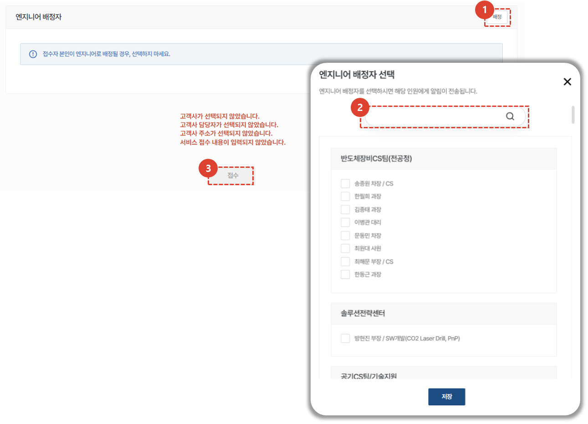

import ValidateTextByToken from "/src/utils/getQueryString.js";
import StrongTextParser from "/src/utils/textParser.js";
import text from "/src/locale/ko/SMT/tutorial-01-auth/create-a-acount-circle-user.json";

# 서비스 접수

고객사의 요청에 따라 서비스를 접수하고 처리하기 위한 절차를 안내합니다.
<ValidateTextByToken dispTargetViewer={true} dispCaution={false} validTokenList={['head', 'branch', 'agent']}>

## 서비스 목록

1. **서비스 주문** 을 선택합니다.
1. 모든 서비스 목록이 표시됩니다.
      - 처리중 : 처리중인 서비스 개수를 나타냅니다. 클릭 시 처리중인 리스트만 목록에 보여집니다. 
      - 완료 : 완료처리된 서비스 개수를 나타냅니다. 클릭시 완료된 리스트만 목록에 보여집니다.
      - 취소 : 취소된 서비스 개수를 나타냅니다. 클릭시 취소된 리스트만 목록에 보여집니다.
      - 종결 : 서비스 접수 후 정상적인 프로세스로 처리되지 않고 종결 처리된 서비스 개수를 나타냅니다. 클릭시 종결된 리스트만 목록에 보여집니다. '
1. 접수 : 일반적인 서비스 접수를 등록 할 수 있습니다. 
      - 접수만 먼저 등록하거나, 접수를 받아 등록하는 관리자가 별도로 있는 경우 사용하기 적합합니다. 
1. 실적등록 : 서비스 접수부터 처리 내용까지 한번에 입력이 가능합니다.   
      - 서비스 작업까지 완료된 후 접수 및 작업내용을 한번에 입력해야 할 경우 사용하기 적합합니다. 
1. [피더수리](./create-a-service-order_feeder.md) : 피더와 같이 여러 자산에 대한 서비스 이력을 입력해야 할 경우 진행합니다. **접수** 및 **실적등록** 과 달리 이동/작업/식사로 인한 소요시간추가를 하지 않고 **접수일자**와 **조치일자**만 입력하여 서비스를 등록합니다. 

## 서비스 접수 - 1/4

1. **접수**를 선택합니다.
1. 서비스 접수를 진행할 대상 설비를 **검색하여 등록**합니다. 
1. 대상 설비 정보가 검색되지 않을 경우, 버튼을 클릭하여 해당하는 자산을 찾아 추가합니다.
    :::warning
        자산 추가의 경우, 부득이하게 자산 검색이 불가능한 경우에만 사용 바랍니다.
    :::
1. 저장을 눌러 해당 자산을 반영합니다. 

## 서비스 접수 - 2/4

:::info
[위 단계](#서비스-접수---14)에서 자산이 선택 되면, 해당 자산을 보유한 고객사 정보가 자동으로 입력됩니다. 
고객사 등록은 자산과 연결되어있는 고객사 정보가 변경되었을 경우에만 진행합니다.
:::

1. **선택**을 눌러 고객사 정보를 등록합니다. 
    :::note
    서비스 대상 설비 또는 자산 검색을 선행하지 않으면, 고객사 등록이 불가합니다.
    :::
1. 고객사 명을 검색하여 저장합니다.
1. **선택**을 눌러 고객사의 담당자를 설정합니다. 

## 서비스 접수 - 3/4

1. 문의내용을 입력합니다. 
1. **추가**를 클릭하여 첨부파일을 추가 할 수 있습니다. 
1. 접수일자는 접수 시점으로 자동 입력됩니다. 변경이 필요할 경우 클릭하여 변경 할 수 있습니다. 
1. 방문 희망 날짜를 선택합니다. 
1. 해당 서비스와 관련된 서비스 번호를 입력 할 수 있습니다. 
    :::note
    참조 번호는 대리점에서 관리하는 번호를 입력하는 탭 입니다.
    :::

## 서비스 접수 - 4/4

1. 담당 엔지니어를 배정하기 위해 **배정**을 선택합니다.
    :::note
    담당 엔지니어의 기본값은 접수자 입니다.
    접수자 본인이 엔지니어로 배정될 경우, 별도의 선택이 필요하지 않습니다. 
    :::
1. **저장**을 클릭하여 엔지니어를 배정합니다. 
1. **접수**를 클릭하여 서비스 접수를 완료합니다. 
    :::note
    
    접수 화면 하단에 서비스 접수를 위한 필수값이 안내되며, 필수값이 입력되지 않을 경우 **접수** 버튼이 비활성화됩니다. 
    :::
</ValidateTextByToken>