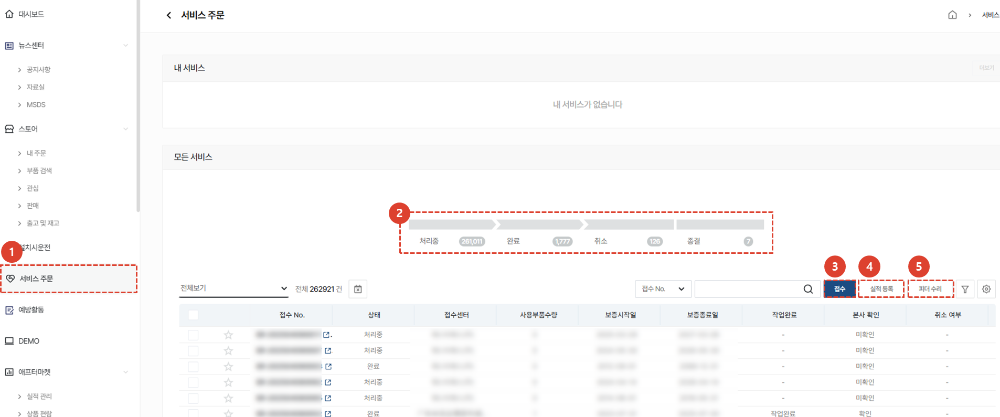
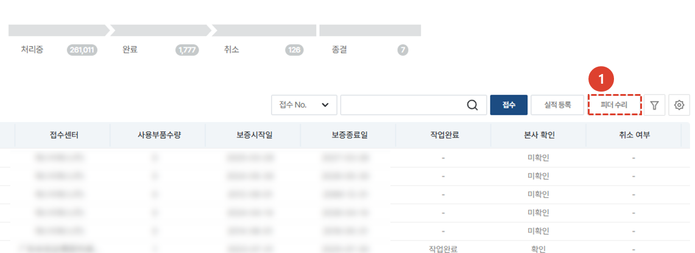
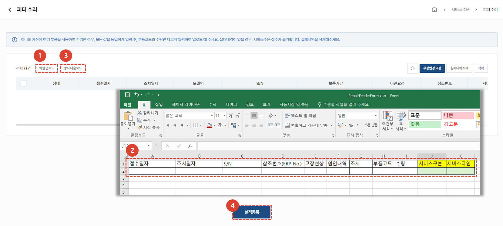

import ValidateTextByToken from "/src/utils/getQueryString.js";
import StrongTextParser from "/src/utils/textParser.js";
import text from "/src/locale/ko/SMT/tutorial-01-auth/create-a-acount-circle-user.json";

# 피더 수리

고객사의 피더 수리 요청을 등록하고 처리하는 절차를 안내합니다. 
<ValidateTextByToken dispTargetViewer={true} dispCaution={false} validTokenList={['head', 'branch', 'agent']}>

## 서비스 목록

1. **서비스 주문** 을 선택합니다.
1. 모든 서비스 목록이 표시됩니다.
      - 처리중 : 처리중인 서비스 개수를 나타냅니다. 클릭 시 처리중인 리스트만 목록에 보여집니다. 
      - 완료 : 완료처리된 서비스 개수를 나타냅니다. 클릭시 완료된 리스트만 목록에 보여집니다.
      - 취소 : 취소된 서비스 개수를 나타냅니다. 클릭시 취소된 리스트만 목록에 보여집니다.
      - 종결 : 서비스 접수 후 정상적인 프로세스로 처리되지 않고 종결 처리된 서비스 개수를 나타냅니다. 클릭시 종결된 리스트만 목록에 보여집니다. '
1. 접수 : 일반적인 서비스 접수를 등록 할 수 있습니다. 
      - 접수만 먼저 등록하거나, 접수를 받아 등록하는 관리자가 별도로 있는 경우 사용하기 적합합니다. 
1. 실적등록 : 서비스 접수부터 처리 내용까지 한번에 입력이 가능합니다.   
      - 서비스 작업까지 완료된 후 접수 및 작업내용을 한번에 입력해야 할 경우 사용하기 적합합니다. 
1. 피더수리 : 피더와 같이 여러 부품에 대한 서비스 이력을 입력해야 할 경우 진행합니다. **접수** 및 **실적등록** 과 달리 이동/작업/식사로 인한 소요시간추가를 하지 않고 **접수일자**와 **조치일자**만 입력하여 서비스를 등록합니다. 

## 피더수리 서비스 접수

1. **피더수리**를 선택합니다.

1. **양식 다운로드**를 선택하여 피더 수리 양식을 다운받습니다. 
1. 다운받은 **양식**에 서비스 내역을 작성하고 저장합니다. 
    :::note
    접수일자 및 조치일자는 '20250301' 과 같은 형식으로 입력해야 합니다.
    피더의 **S/N**를 정확히 입력해야 고객사 정보를 자동으로 불러올 수 있습니다. 
    서비스구분 및 서비스타입은 양식 우측에 작성된 항목 중 선택하여야 합니다. 
    :::
1. **엑셀업로드**를 선택하여 입력한 양식을 등록합니다. 
1. 입력된 데이터를 확인하고, **실적등록** 버튼을 눌러 접수를 완료합니다. 

</ValidateTextByToken>