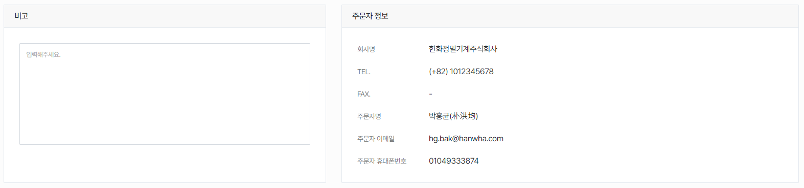
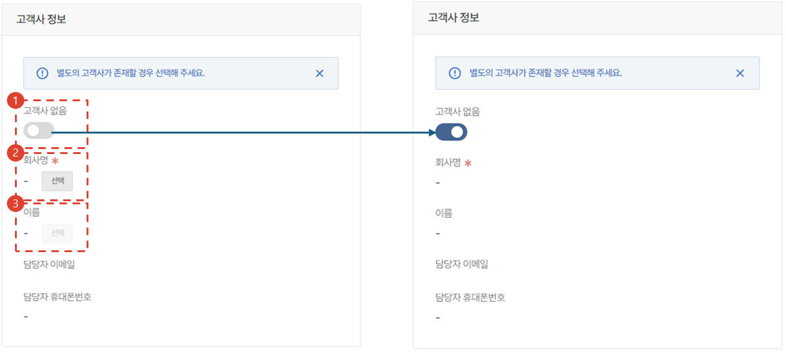
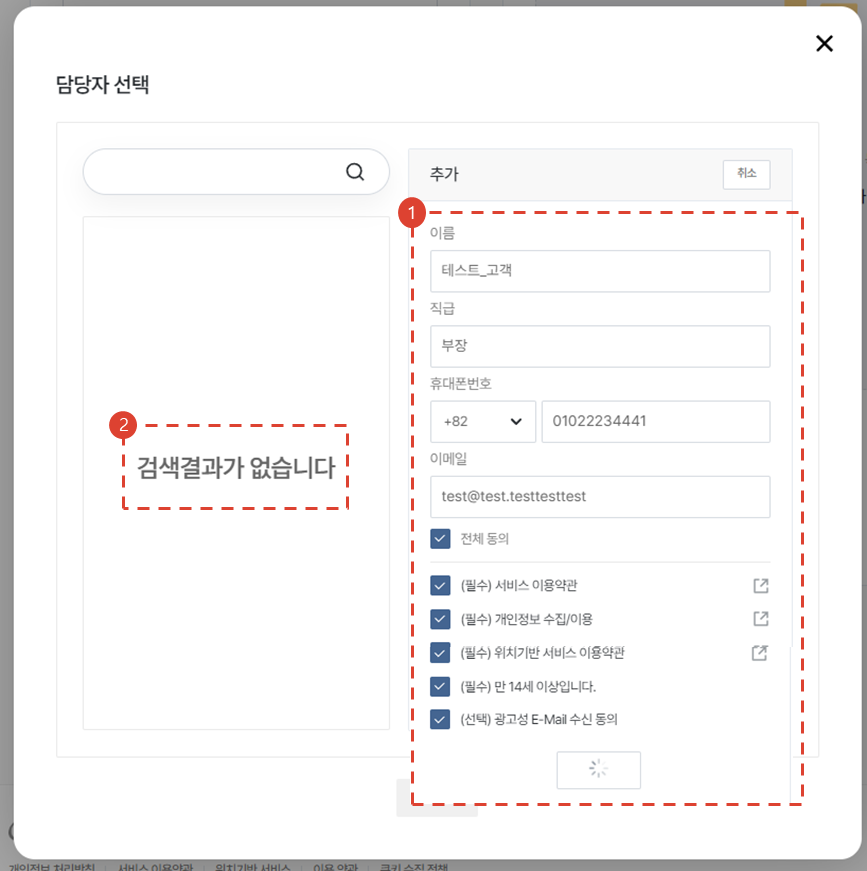

import ValidateTextByToken from "/src/utils/getQueryString.js";
import StrongTextParser from "/src/utils/textParser.js";
import text from "/src/locale/ko/SMT/tutorial-03-store/01-create-order-buyer.json";

# 주문서 작성 - 무상 출고 품의
서비스 연계 주문은 아니지만, 무상으로 자재를 출고해야하는 특수한 상황에 사용합니다. 

<ValidateTextByToken dispTargetViewer={false} validTokenList={['head', 'branch']}>

1. [무상 출고 품의]를 선택합니다.
1. [주문] 버튼을 누릅니다. 
 
 

### 주문할 부품 추가

1. 부품코드를 검색해서 PO 신청 부품을 추가할 수 있습니다.
    -  → 정상적으로 검색됨
    -  → 정상적으로 검색지 않음 **(진행 불가)**
1. 수량을 입력합니다
1. 신청할 부품과 관련된 특이사항을 입력합니다. 
     예) 관련 문서, 부품 특이사항, 배송지 등
1. **추가** 버튼을 누르면 추가됩니다.
1. 엑셀로 일괄 업로드가 가능합니다.
1. 무상 출고 품의의 경우 **SAP에 등록된 원가**를 입력해주세요.
 
 

## 주문 부품 목록 확인

1. 원가는 더블클릭하여 수정이 가능합니다.
1. 주문 수량과 비고란도 더블클릭하여 수정이 가능합니다.
1. 사내 시스템과 연동되어 주문자(기안자)의 **자재승인센터**의 재고, MOQ, L/T(Lead Time) 조회를 하실 수 있습니다.

## 기본사항 입력

- 비고란에 비고사항을 입력하고 주문자(기안자) 정보를 확인합니다.

## 추가정보 입력

1. 고객사 정보가 없으면 토글 버튼을 활성화합니다.
 교육센터에서의 자재 주문 등의 경우 고객사 없음을 선택합니다.
2. 고객사 정보를 [선택] 버튼을 눌러 불러옵니다. (필수값) - [고객사 선택 화면 보기](#추가정보-입력---고객사-선택)
3. 고객사의 담당자 정보를 [선택] 버튼을 눌러 불러옵니다. (옵션값) - [고객담당자 선택 화면 보기](#추가정보-입력---고객담당자-선택)

## 추가정보 입력 - 고객사 선택

1. 고객명을 입력하여 검색합니다.
1. [저장] 버튼을 누릅니다.

## 추가정보 입력 - 고객담당자 선택

1. 목록에 담당자 정보가 없는 경우 고객담당자 정보를 입력하여 등록합니다.
1. 목록에서 추가된 담당자를 선택합니다.

## 품의 작성

1. 품의 정보를 입력합니다.
2. 첨부파일이 있는 경우 파일을 첨부합니다.

## 품의 상신

1. 결재선을 검색합니다.(서클사용자들이 검색됩니다.)
1. 품의 상신 의견을 입력합니다.
1. [완료] 버튼을 눌러 결재문서를 서클로 전송합니다.

</ValidateTextByToken>