import ValidateTextByToken from "/src/utils/getQueryString.js";

# BS 활동

<ValidateTextByToken dispTargetViewer={true} dispCaution={false} validTokenList={['head', 'branch', 'seller', 'agent']}>

BS 프로젝트에 등록된 고객사를 대상으로 정기점검 활동을 수행하고 관리하는 서비스 절차를 안내합니다.

</ValidateTextByToken>

## 프로젝트 목록

<ValidateTextByToken dispTargetViewer={false} dispCaution={true} validTokenList={['head', 'branch', 'seller', 'agent']}>

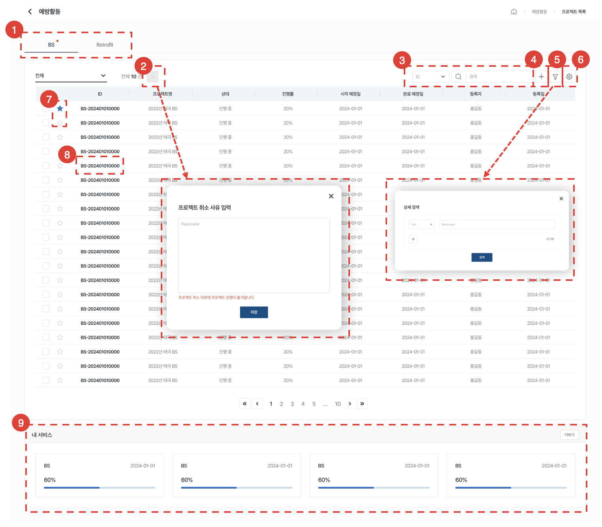

1. 탭을 클릭하여 해당 유형의 예방활동 목록을 하단에서 조회할 수 있습니다.
1. 프로젝트를 선택 후 [X]버튼을 클릭하여 프로젝트를 취소할 수 있습니다. 최종 확인 이후의 프로젝트는 취소가 불가합니다. 프로젝트 취소 시에는 프로젝트 취소 사유를 입력해야 합니다.
1. 원하는 검색어로 검색할 수 있습니다.
1. [+]버튼을 클릭하여 프로젝트를 생성할 수 있습니다.
1. 버튼을 클릭하여 목록 내에서 원하는 검색어에 따라 상세 검색 할 수 있습니다. 
1. 버튼을 클릭하여 엑셀 출력, 실적 삭제, 테이블 관리를 할 수 있습니다.
1. [☆]를 클릭 하여 즐겨찾기 설정/해제할 수 있습니다.
1. [ID]를 클릭하여 [프로젝트 상세]페이지로 이동합니다.
1. 프로젝트 관리자, 프로젝트 생성자는 본인이 할당된 프로젝트를 조회할 수 있습니다. 각 영역을 클릭하여 [프로젝트 상세]페이지로 이동할 수 있습니다.
    - [상세페이지](#프로젝트-상세) 보기로 바로 가려면 [여기](#프로젝트-상세)를 클릭하세요.

</ValidateTextByToken>

## 프로젝트 생성 

<ValidateTextByToken dispTargetViewer={false} dispCaution={true} validTokenList={['head', 'branch']}>

BS 활동 프로젝트를 생성합니다.

### 기본정보 & 비용 내역 입력

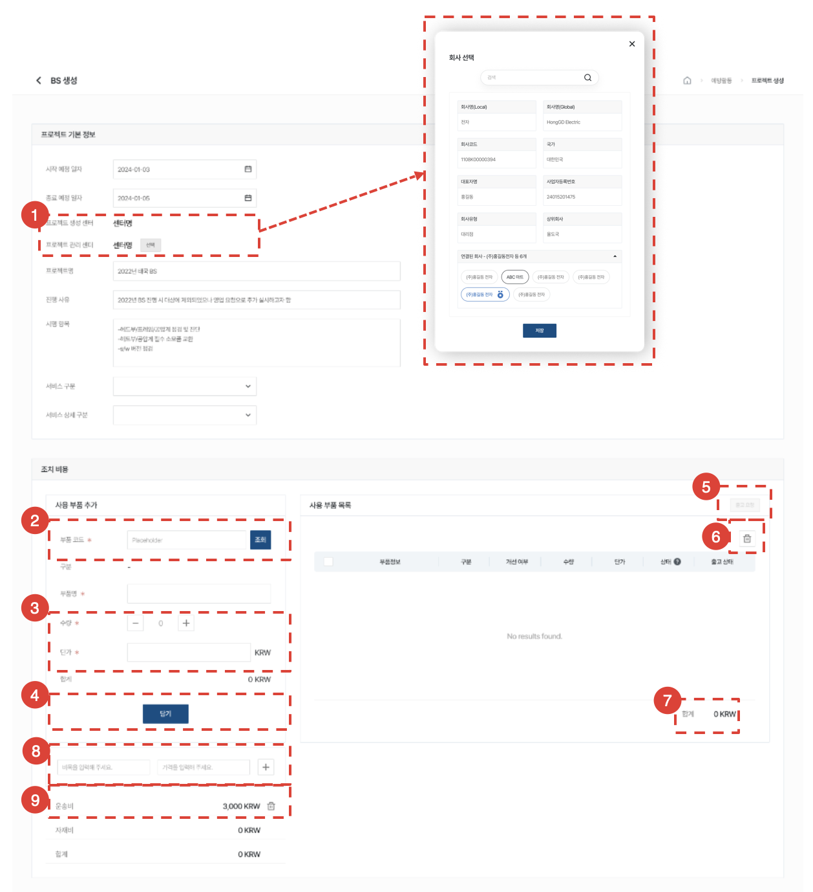

1. 프로젝트 생성 센터는 프로젝트를 생성하는 사용자가 소속된 센터로 수정이 불가합니다. 프로젝트 관리 센터는 수정이 가능합니다.
1. 부품 코드로 검색하여 사용 부품을 추가할 수 있습니다. 검색 후 일치하는 결과가 있을 경우 구분, 부품명, 단가를 불러옵니다. 
1. 단가는 수정이 가능합니다.
1. [담기]버튼을 클릭하여 사용 부품 목록에 추가할 수 있습니다.
1. [출고요청]버튼을 클릭하여 출고 요청을 전송할 수 있습니다. 
    :::warning
    변경 가능성이 큼 - 추후 필요하지 않을 경우 운영단에서 못 쓰게 하기로 함
    :::
1. 아이콘을 클릭하여 사용 부품 목록을 삭제할 수 있습니다.
1. 합계는 추가된 모든 사용 부품들의 가격으로, 자재비에 반영됩니다. 
1. 비목명과 가격을 입력할 수 있습니다. 추가 개수 제한은 없습니다.
1. 입력한 비목은 하단에서 조회할 수 있고 아이콘을 클릭하여 삭제할 수 있습니다.

### 담당자 및 그룹 편성

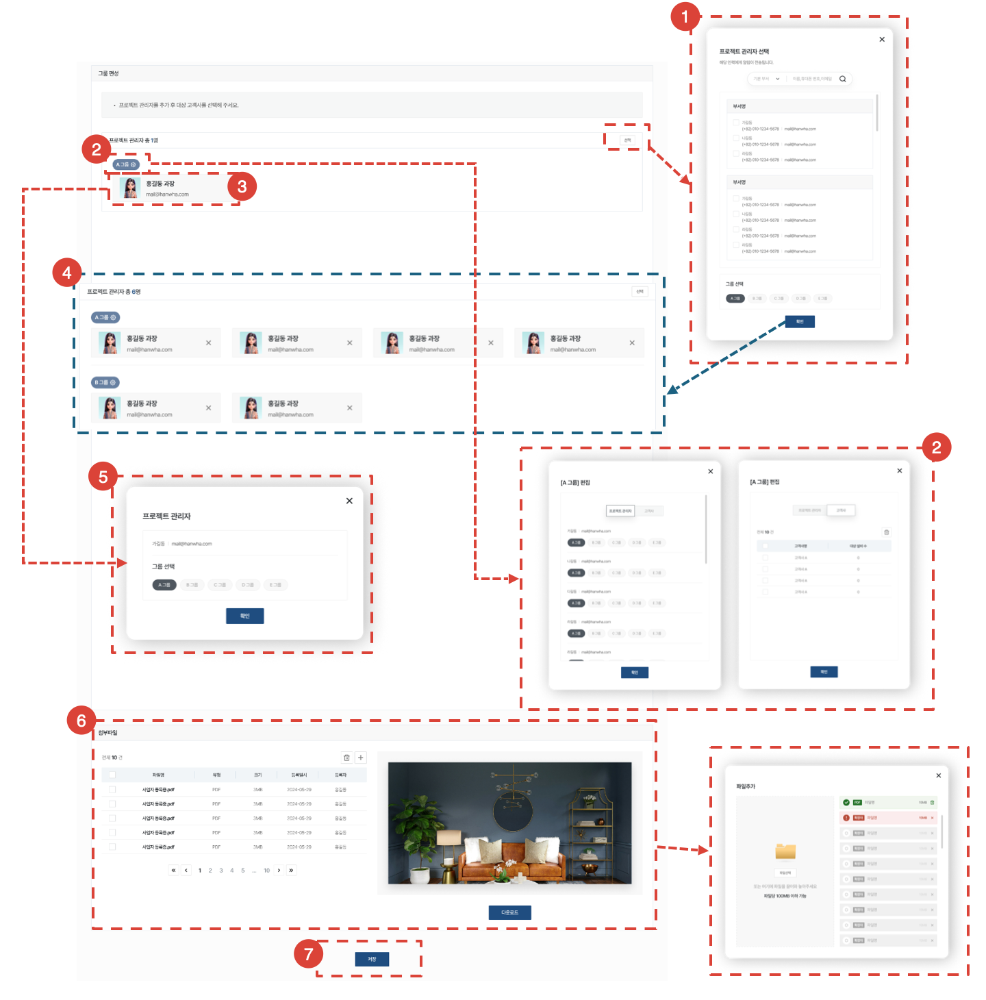

1. [선택]버튼을 클릭하여 프로젝트 관리자를 추가할 수 있습니다. 프로젝트 관리자는 프로젝트 관리센터에 소속된 사용자입니다. 프로젝트 관리자를 선택하면서 그룹 배정도 동시에 할 수 있습니다. 선택된 프로젝트 관리자에게 이메일, 문자, 시스템 알림이 전송됩니다.
1. [그룹]을 클릭하여 그룹에 배정된 프로젝트 관리자와 고객사를 편집할 수 있습니다.
1. 최초 생성 시, 프로젝트 생성자가 [A 그룹-프로젝트 관리자]로 고정되어 있습니다. 이 프로젝트 관리자는 삭제가 불가합니다. 
1. 프로젝트 관리자 추가 후 화면입니다.추가된 프로젝트 관리자는 [X] 아이콘을 클릭하여 개별적으로 삭제할 수 있습니다. 
1. 프로젝트 관리자 영역을 클릭하여 프로젝트 관리자의 배정 그룹을 변경할 수 있습니다. 
1. 첨부파일을 추가하거나 업로드한 파일을 다운로드 할 수 있습니다.
1. [저장]버튼을 클릭하여 새로운 프로젝트를 생성할 수 있습니다. 프로젝트 생성 센터 유저에게 시스템 알림이 전송됩니다.

### 고객사 및 설비 등록

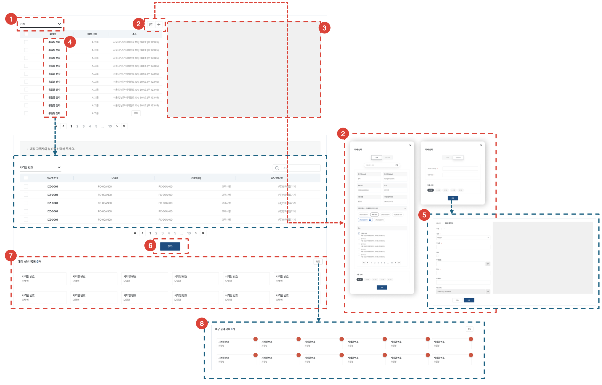

1. 그룹 별로 고객사를 조회할 수 있습니다.
1. 아이콘을 클릭하여 고객사를 삭제하거나, 검색 또는 직접 입력하여 추가할 수 있습니다. 
1. 고객사의 주소를 볼 수 있습니다.
1. [회사명]을 클릭하여 하단에 고객사의 설비 전체를 조회할 수 있습니다.
1. 고객사 주소 추가 화면입니다. 고객사를 직접 입력할 경우, 주소를 추가로 입력해야 합니다.
1. 설비를 선택 후 [추가]버튼을 클릭하여 프로젝트의 대상 설비에 추가할 수 있습니다.
1. 추가된 대상 설비 목록을 조회할 수 있습니다.
1. 추가된 대상 설비를 편집할 수 있습니다.

</ValidateTextByToken>

## 프로젝트 상세

<ValidateTextByToken dispTargetViewer={false} dispCaution={true} validTokenList={['head', 'branch', 'seller', 'agent']}>

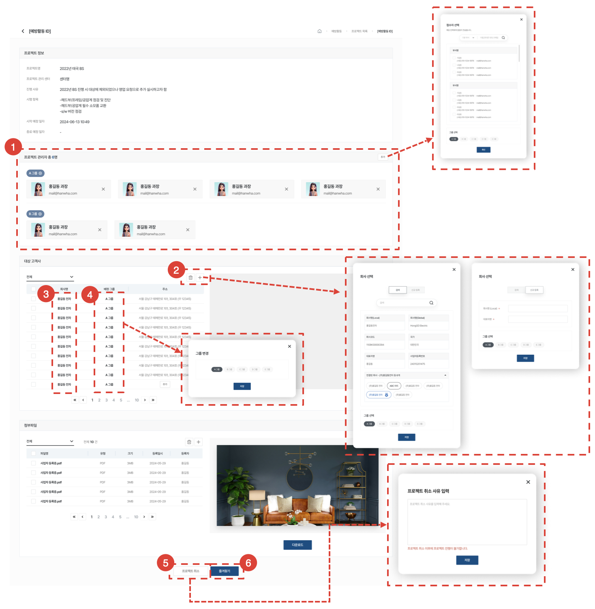

1. 프로젝트 관리자를 편집할 수 있습니다. 새로 추가된 프로젝트 관리자에게도 이메일, 문자, 시스템 알림이 전송됩니다.
1. 대상 고객사를 편집할 수 있습니다.
1. [대상 고객사명]을 클릭하여 [고객사 상세 페이지](#프로젝트-상세---고객정보)로 이동합니다. 
1. [그룹명]을 클릭하여 고객사의 배정 그룹을 변경할 수 있습니다.
1. [프로젝트 취소]버튼을 클릭하여 프로젝트를 취소할 수 있습니다. 최종 확인 이후의 프로젝트는 취소가 불가합니다. 프로젝트 취소 시에는 프로젝트 취소 사유를 입력해야 합니다. [취소된 프로젝트의 고객정보 화면](#프로젝트-취소---고객정보)은 [여기](#프로젝트-취소---고객정보)를 클릭하세요.
1. [즐겨찾기]버튼을 클릭 하여 즐겨찾기 설정/해제할 수 있습니다.

### 고객정보

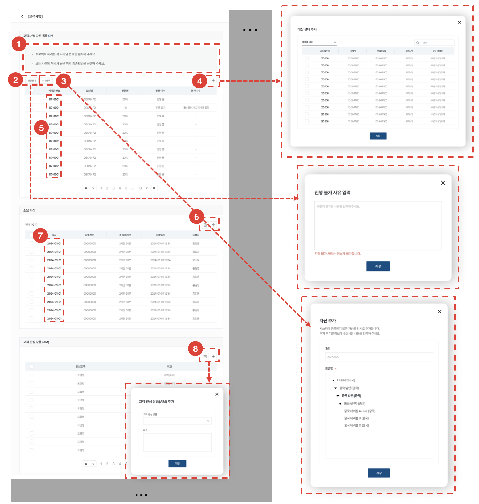

1. 고객사 별 자산 목록 진행률에 따라 텍스트가 변경됩니다.
1. [진행 불가]버튼을 클릭하여 불가 사유를 입력 후 특정 설비를 진행 불가 처리할 수 있습니다.
1. [수기 등록]버튼을 클릭하여 직접 입력한 설비를 대상 설비로 추가할 수 있습니다.
1. [+] 버튼을 클릭하여 대상 설비를 추가할 수 있습니다. 일치하는 검색 결과가 없을 경우 수기로 등록할 수 있습니다. 고객사명이 대상 고객사와 다를 경우 이관 진행 후 추가할 수 있습니다.
1. [시리얼 번호]를 클릭하여 [처리 페이지]로 이동합니다.
1. 소요 시간 편집이 가능합니다. [+]버튼을 클릭하여 [소요시간 추가]페이지로 이동합니다.
1. [일자]를 클릭하여 [소요시간 상세]페이지로 이동합니다.
1. 고객 관심 상품을 편집할 수 있습니다.

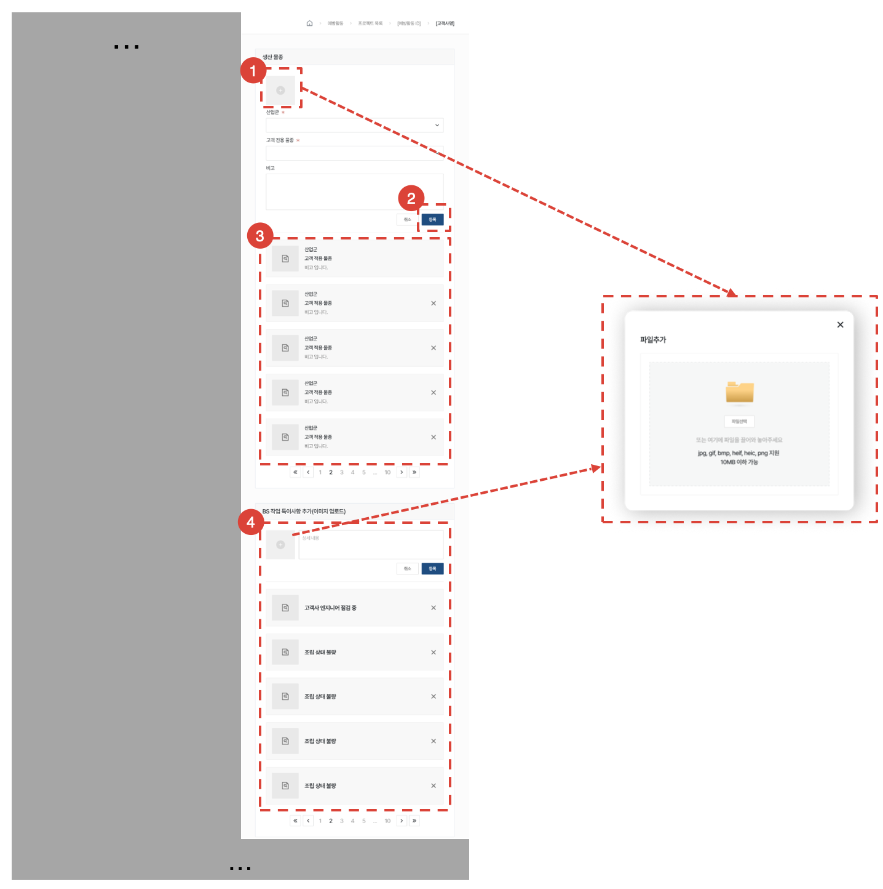

1. [이미지 업로드 아이콘]을 클릭하여 생산물종의 이미지를 추가할 수 있습니다.
1. 추가 정보를 입력하여 [등록]버튼을 클릭하여 생산 물종을 추가할 수 있습니다.
1. 생산 물종을 편집할 수 있습니다. 한 개의 생산 물종은 필수 항목으로 삭제가 불가합니다.
1. 작업 특이사항을 편집할 수 있습니다.

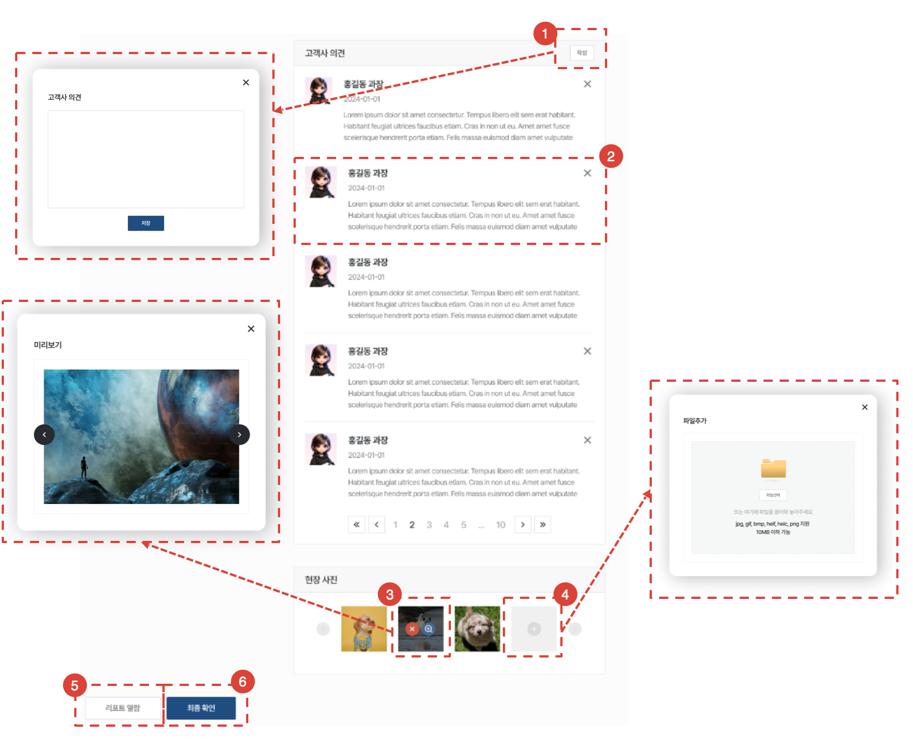

1. [작성]버튼을 클릭하여 고객사 의견을 추가할 수 있습니다.
1. 고객사 의견을 편집할 수 있습니다.
1. 업로드한 이미지를 호버 후 아이콘을 클릭하여 삭제하거나 미리볼 수 있습니다.
1. 현장사진을 업로드할 수 있습니다.
1. [리포트 열람]버튼을 클릭하여 프로젝트의 리포트를 새 창에서 조회할 수 있습니다.
1. [최종 확인]버튼을 클릭하여 [최종 확인]페이지로 이동합니다. 고객사 별 자산 목록의 진행률이 모두 100%일 경우에만 최종확인이 가능합니다.

#### 서비스 처리

BS 대상 고객사의 대상 설비를 대상으로 서비스 수행 결과를 입력하고 고객의 검수를 받는 절차를 안내합니다.

#### - 서비스 처리 - 체크리스트 작성

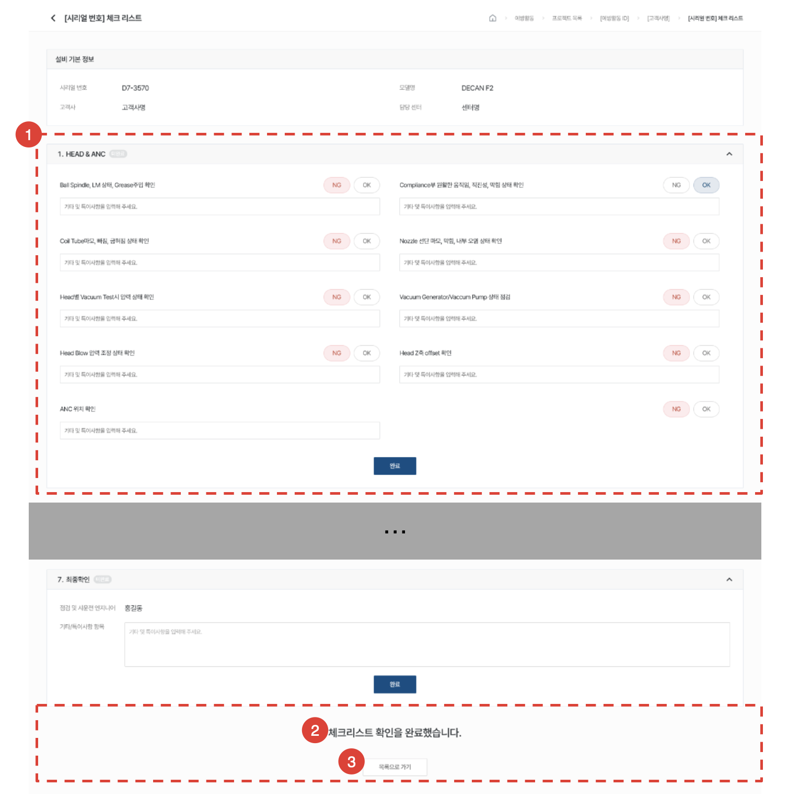

1. 대상 설비 별 체크리스트를 처리합니다. 대상 설비 모델에 따라 체크리스트가 달라집니다. 체크리스트 확인 후 [완료]버튼을 클릭하여 저장할 수 있습니다. 
1. 모든 항목 체크 완료 시 확인 문구가 표시됩니다.
1. [목록으로 가기]버튼을 클릭하여 [고객사 상세]페이지로 이동합니다.

:::note
- 최종 확인이 완료된 경우에는 아래와 같이 표시됩니다.
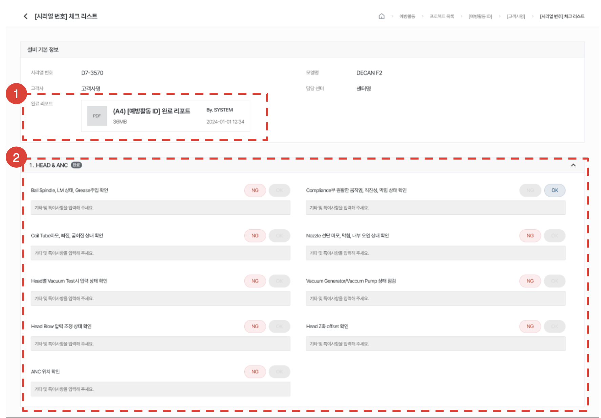
:::

#### 서비스 처리 - 소요시간 추가

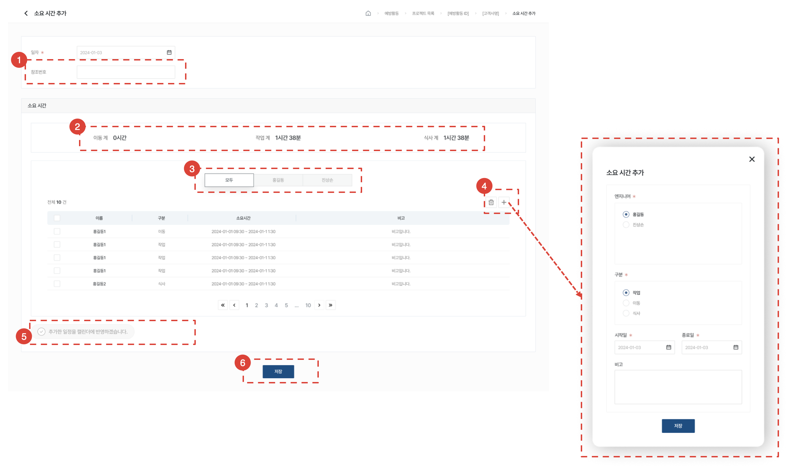

1. 참조 번호는 대리점 ERP 번호로 입력합니다.
    :::note
    국내 대리점 전용 필드입니다.
    :::
1. 각 소요 시간의 합을 조회합니다.
1. 엔지니어 별로 소요시간을 조회합니다.
1. [+]아이콘을 클릭하여 소요시간을 추가합니다. 
1. 체크 시 입력한 소요시간을 엔지니어의 캘린더에 반영합니다.
1. [저장]버튼을 클릭하여 소요시간을 저장하고 [고객사 상세]페이지로 이동합니다. 엔지니어는 소요시간을 중복 등록할 수 없습니다.

</ValidateTextByToken>

## 프로젝트 취소

<ValidateTextByToken dispTargetViewer={false} dispCaution={true} validTokenList={['head', 'branch']}>

프로젝트를 취소할 수 있습니다.

### 고객정보

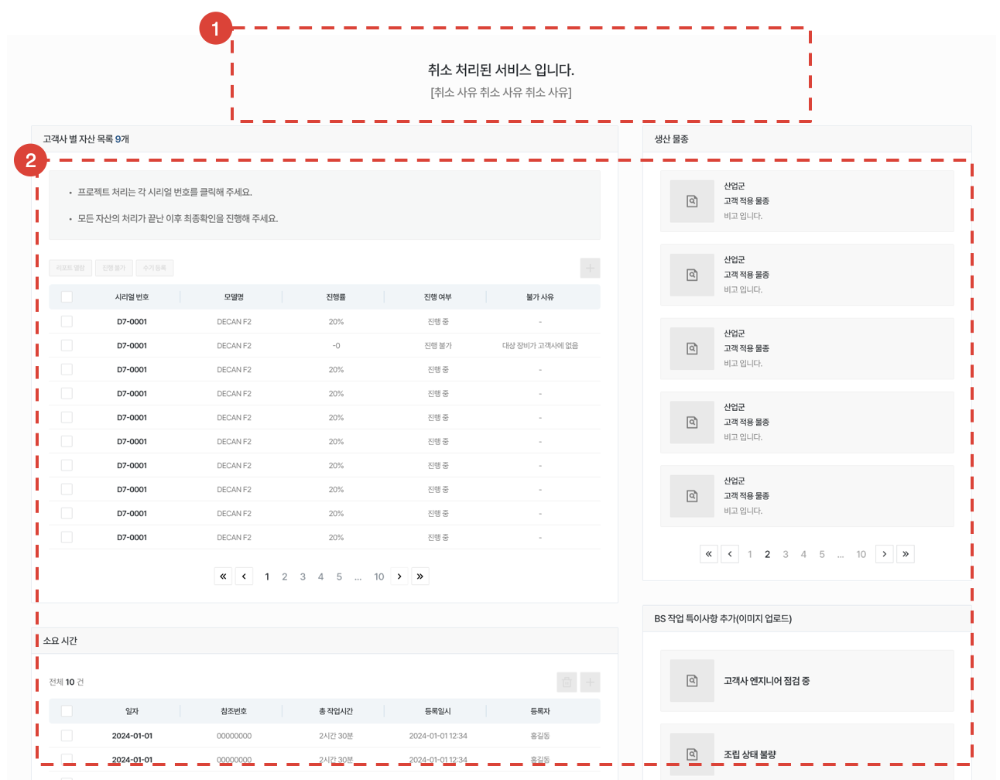

1. 취소처리된 프로젝트를 안내하는 문구와 사유를 조회할 수 있습니다.
1. 상세페이지의 모든 기능을 할 수 없습니다.

</ValidateTextByToken>