import ValidateTextByToken from "/src/utils/getQueryString.js";
import all_proceeding from "./img/027.png";
import proceeding from "./img/028.png";
import rejection from "./img/029.png";
import Approval from "./img/018.png";

# Retrofit 활동

<ValidateTextByToken dispTargetViewer={true} dispCaution={false} validTokenList={['head', 'branch', 'seller', 'agent']}>

Retrofit 대상 자산을 등록하고, 등록된 자산의 작업 수행 여부를 관리합니다. 

</ValidateTextByToken>

## 프로젝트 목록

<ValidateTextByToken dispTargetViewer={false} dispCaution={true} validTokenList={['head', 'branch', 'seller', 'agent']}>

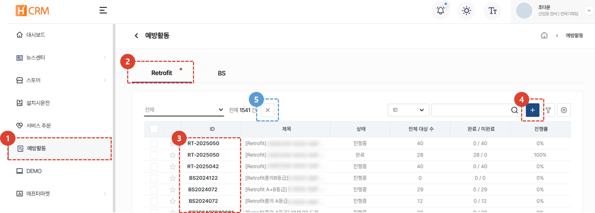
1. **예방활동** 탭을 선택합니다. 
1. Retrofit 메뉴가 기본 설정입니다. 현재 등록되어있는 Retrofit 목록을 확인 할 수 있습니다. 
1. **Retrofit ID**를 클릭하여 상세 페이지로 이동 할 수 있습니다. 
1. 신규 Retrofit 작업 등록을 위해 **+** 버튼을 클릭합니다. 
1. 프로젝트를 선택 후 **X**버튼을 클릭하여 프로젝트를 취소할 수 있습니다. 최종 확인 이후의 프로젝트는 취소가 불가합니다. 프로젝트 취소 시에는 프로젝트 취소 사유를 입력해야 합니다.

</ValidateTextByToken>

## 프로젝트 생성 

### 기본 정보 등록

<ValidateTextByToken dispTargetViewer={false} dispCaution={true} validTokenList={['head']}>
    :::info
        프로젝트 생성에 앞서, Retrofit 품의가 준비되어있어야 합니다.
        

    :::
 
 

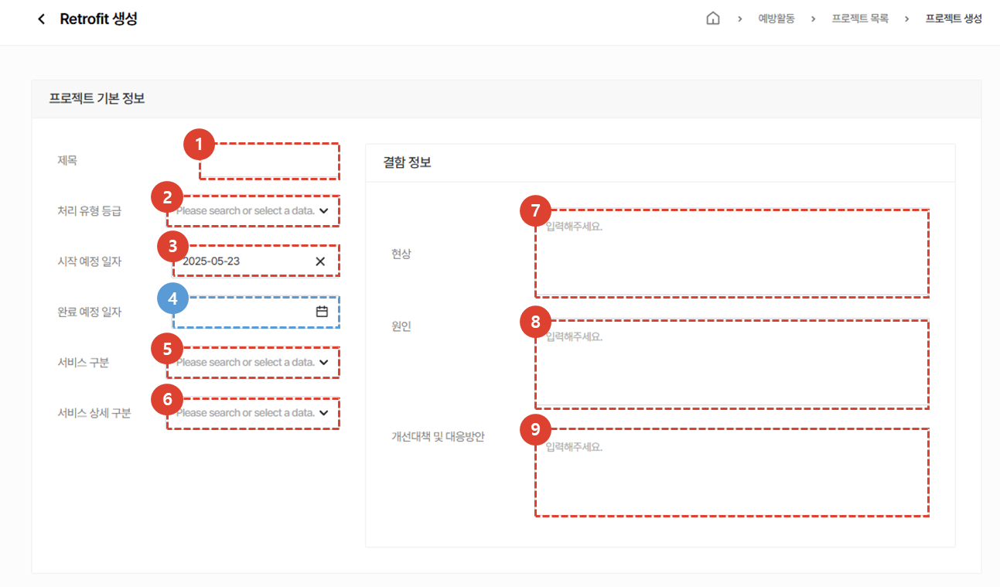
기본정보는 관련 품의를 기반으로 작성합니다. 
1. 프로젝트 제목을 입력합니다. 
1. 처리 유형 등급을 선택합니다. 
1. 시작 예정 일자를 선택합니다. 
1. 완료 예정 일자를 선택합니다. 완료 예정일자는 비 필수값으로 필요 시 입력합니다. 
1. 서비스 구분을 선택합니다. 
1. 서비스 구분에 대한 상세한 구분을 선택합니다. 
1. 결함 현상을 입력합니다. 
1. 결함의 원인을 입력합니다. 
1. 결함에 대한 개선대책 및 대응방안을 입력합니다. 
 
 

### 사용 부품 등록
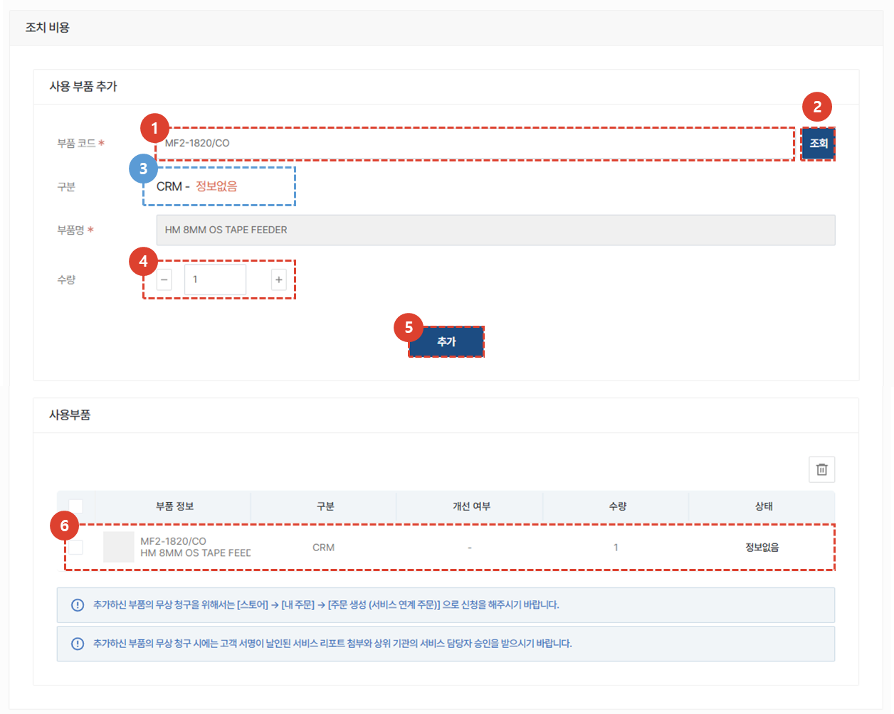
1. 작업에 필요한 부품 추가를 위해 부품 코드를 입력합니다. 
1. 조회 버튼을 클릭합니다. 
1. 사용 가능한 부품이 맞는지 확인합니다. 
1. 필요 수량을 체크합니다. 
1. **추가**버튼을 클릭합니다. 
1. 추가된 사용 부품을 확인합니다. 
 
 

### 대상 설비 정보 등록
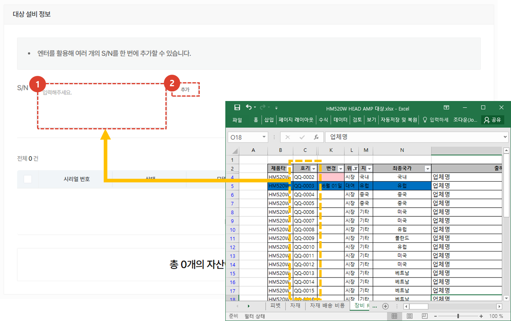
1. Retrofit 대상 장비의 호기를 복사하여 S/N 란에 붙여넣기합니다. 
1. 추가 버튼을 클릭합니다. 추가가 완료되면, 하단의 목록에 추가된 설비 리스트를 확인 할 수 있습니다. 
 
 

### 첨부파일 등록 및 프로젝트 등록
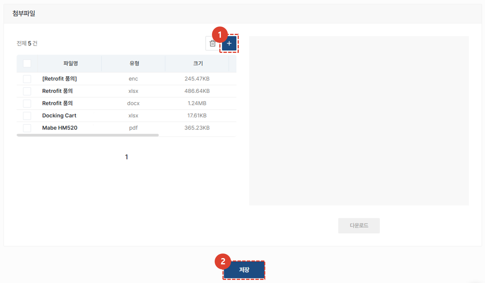
1. 관련 첨부파일을 추가합니다. (예. Retrofit 품의, 해당 장비리스트 등)
1. **저장** 버튼을 클릭하여 프로젝트 등록을 완료합니다. 
 
 

</ValidateTextByToken>

## 프로젝트 수정 및 처리

<ValidateTextByToken dispTargetViewer={false} dispCaution={true} validTokenList={['head', 'branch', 'seller', 'agent']}>
 
 

### 프로젝트 목록

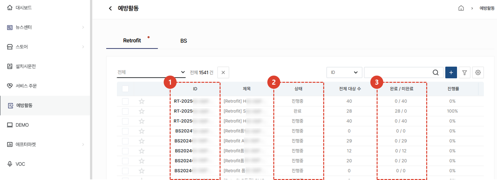
1. 등록된 Retrofit 리스트를 확인 할 수 있습니다. 수정이 필요한 ID를 클릭하여 상세 페이지로 이동합니다. 
1. 진행중 상태를 확인 할 수 있습니다. **완료** 상태의 프로젝트는 프로젝트 수정 및 취소가 불가합니다. 
1. 완료 및 미완료 상태의 장비 수를 확인 할 수 있습니다. 
 
 

### 기본정보 수정
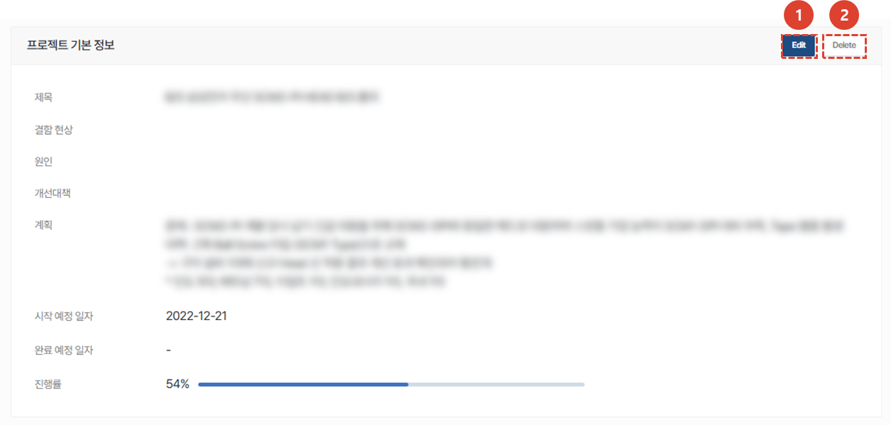
1. **Edit**를 클릭하여 내용 수정이 가능합니다. 
1. **Delete**를 클릭하여 프로젝트를 삭제 할 수 있습니다. 
    :::warning
    **Delete** 클릭 시, 모든 정보가 삭제되므로 유의해주시기 바랍니다. 
    :::
 
 

### 사용 부품 수정
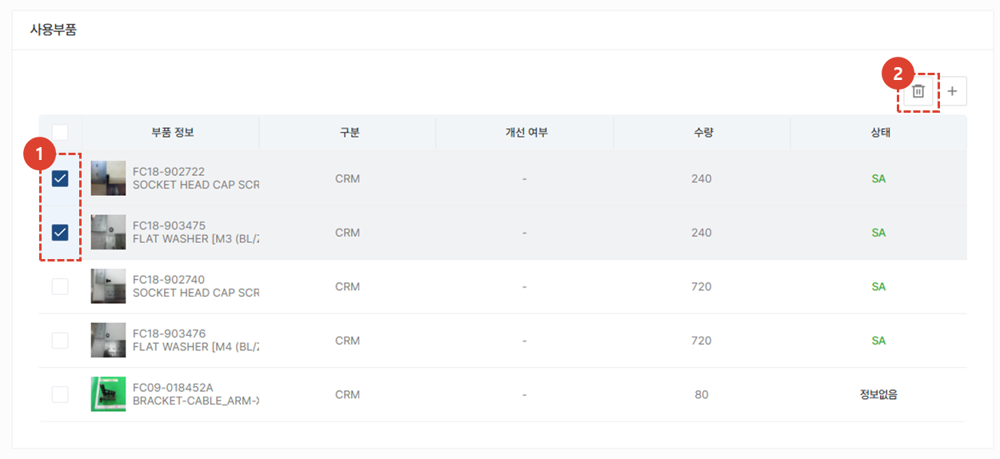

1. 삭제가 필요한 부품을 선택합니다. 
1. 버튼을 클릭하여 해당 부품을 삭제합니다. 
 
 

### 대상 설비 추가 및 처리
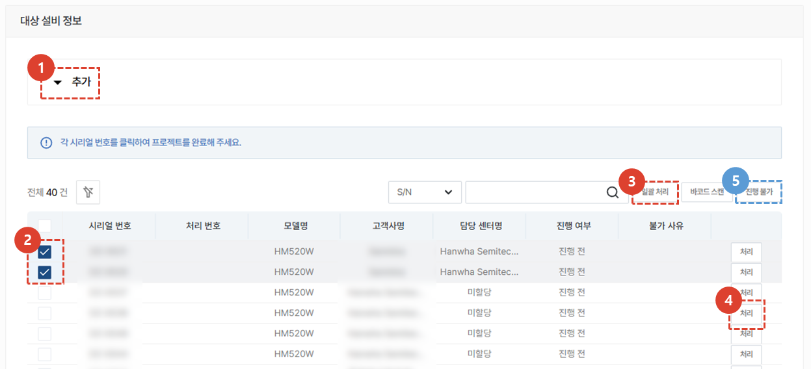

1. **추가** 탭을 클릭하면, 설비를 추가 할 수 있습니다. 
1. 처리나 진행불가 처리를 할 항목을 여러개 선택하여 일괄로 작업 할 수 있습니다. 
1. **일괄 처리** 선택 시 선택된 모든 설비가 처리됩니다. 
    :::info
    **확인**버튼 클릭 시 선택된 모든 설비가 일괄처리됩니다. 
    

    :::

1. **처리** 버튼을 클릭하여 리트로핏을 단건 처리 할 수 있습니다.
    :::info
    **확인**버튼 클릭 시 해당 설비가 일괄처리됩니다. 
    

    :::

1. 설비를 선택하고 **진행불가** 버튼 클릭 시, 해당 설비는 진행 항목에서 제외됩니다. 
    :::info
    진행 불가 사유를 입력 후 불가 처리 할 수 있습니다.
    

    :::
 
 

## 프로젝트 취소
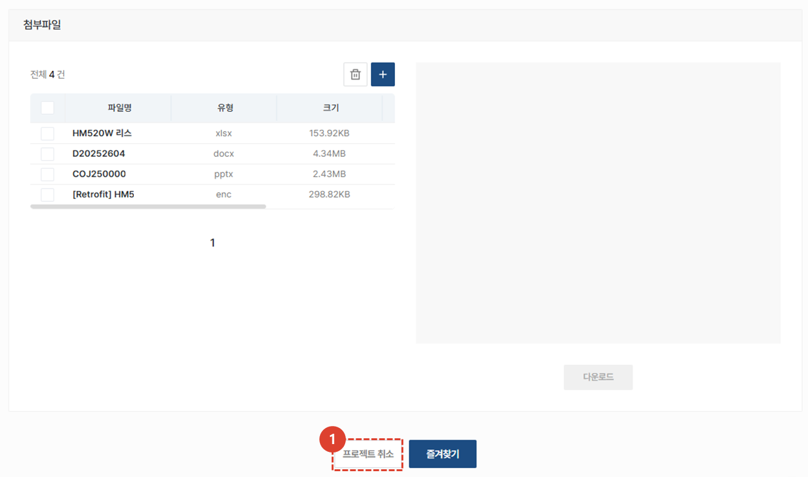
1. 화면 최 하단의 **프로젝트 취소** 버튼을 눌러 취소 할 수 있습니다. 

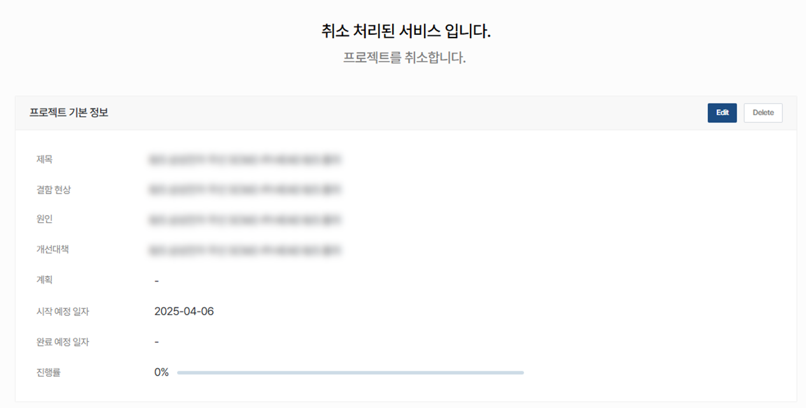

1. 취소 여부와 사유를 확인할 수 있습니다.
1. 취소된 프로젝트는 모든 기능이 불가합니다.

</ValidateTextByToken>