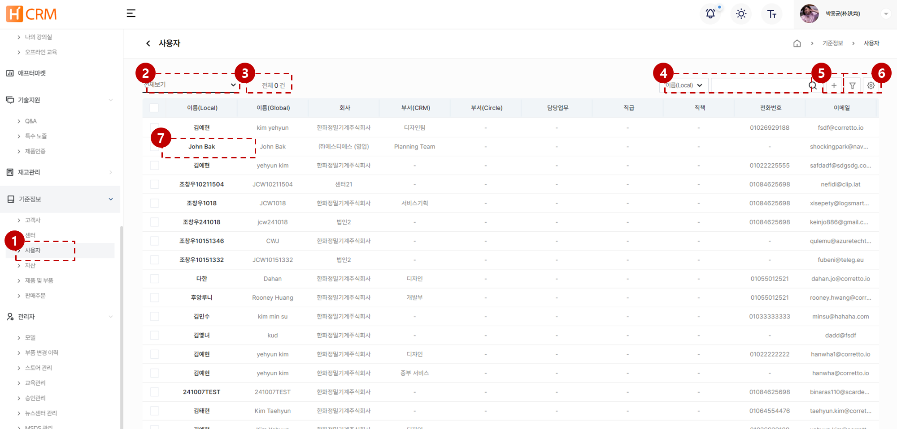
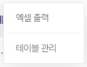
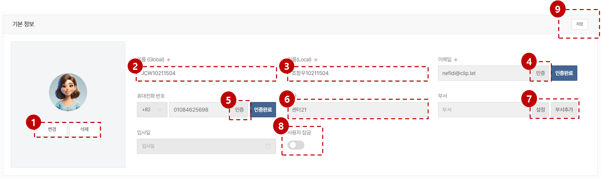

import ValidateTextByToken from "/src/utils/getQueryString.js";
import filterList from "./img/002.png";
import searchList from "./img/053.png";
import tableFilter from "./img/006.png";
import createLabor from "./img/013.png";

# 사용자 데이터 관리

H-CRM 사용자 계정 데이터 관리에 대한 안내입니다.

<ValidateTextByToken dispTargetViewer={true} dispCaution={true} validTokenList={['head', 'branch', 'seller', 'agent']}></ValidateTextByToken>

## 목록
 
<ValidateTextByToken dispTargetViewer={false} dispCaution={true} validTokenList={['head', 'branch', 'seller', 'agent']}>

1. [기준정보] - [사용자] 메뉴를 클릭합니다.
    :::info 메뉴 접근을 위해 필요한 권한
        - TBD
    :::
1. 목록 필터링
    - 아래의 항목을 기준으로 데이터를 필터링할 수 있습니다.
        

1. 전체 **제품 및 부품 데이터**의 개수를 표시합니다.
1. 검색어를 입력해서 원하는 데이터를 검색할 수 있습니다.
    - 아래의 항목을 기준으로 데이터를 검색할 수 있습니다.
        

1. 상세 필터링 기능을 수행합니다.
        

        1. 필터링 헤드를 선택합니다.
        1. 검색어를 입력합니다.
        1. 필터 조건을 추가합니다.
        1. 입력된 내용을 초기화합니다.
        1. [검색] 버튼을 눌러 결과를 확인합니다.
1. 미리 설정된 데이터 목록의 커스텀 기능을 수행합니다.
    

    - **엑셀 출력**: 현재 필터링된 결과의 데이터 목록을 엑셀파일로 출력합니다.
    - **테이블 관리**: 테이블 보기 옵션을 설정합니다.
        

        <ol style={{listStyleType:"number"}}>
            <li>테이블의 컬럼 보기를 토글할 수 있습니다.</li>
            <li>테이블의 컬럼의 위치를 드래그앤드롭으로 조절할 수 있습니다.</li>
        </ol>
1. [사용자 상세 페이지](#상세-페이지)로 이동합니다.

</ValidateTextByToken>

## 상세 페이지

<ValidateTextByToken dispTargetViewer={false} dispCaution={true} validTokenList={['head', 'branch', 'seller', 'agent']}>

### 기본 정보

1. 사용자 프로필 사진을 변경/삭제할 수 있습니다.
2. 글로벌 지역 사용자들에게 표시될 사용자의 이름을 입력합니다.
    :::warning
        - 서클 사용자의 경우, 서클 메인페이지의 링크로 접속을 시도하는 경우 서클의 사용자 정보로 초기화됩니다.
    :::
3. 현지 사용자들에게 표시될 사용자의 이름을 입력합니다.
    :::warning
        - 서클 사용자의 경우, 서클 메인페이지의 링크로 접속을 시도하는 경우 서클의 사용자 정보로 초기화됩니다.
    :::
4. 이메일 주소와 이메일 인증 상태를 표시합니다.
    - **인증**: 

</ValidateTextByToken>