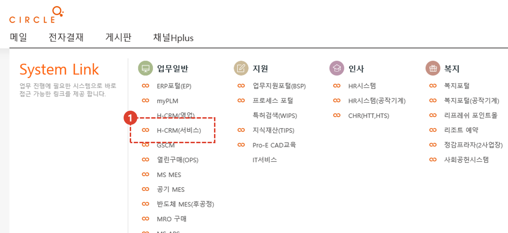
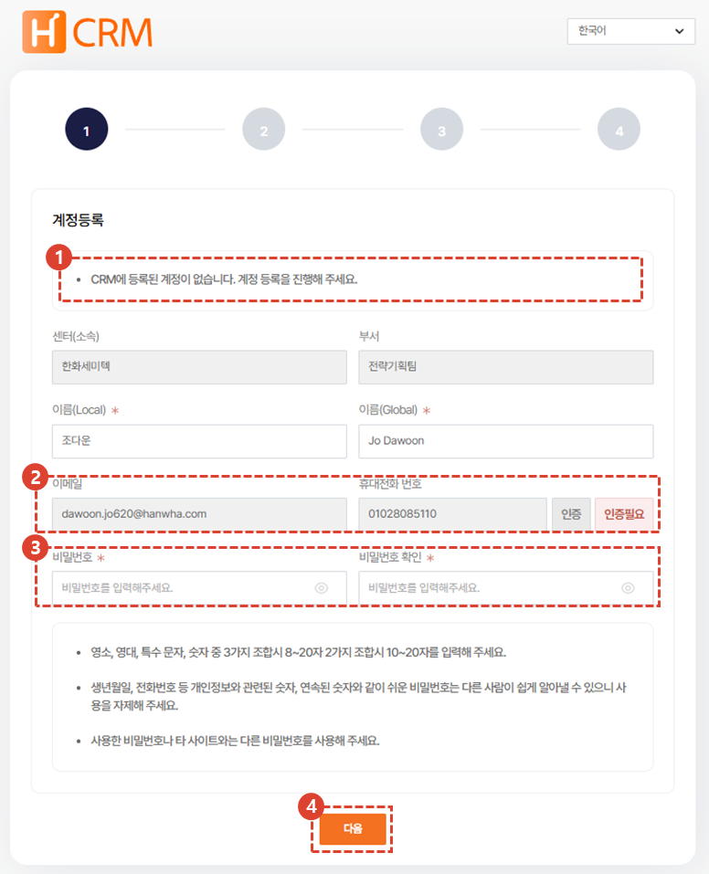
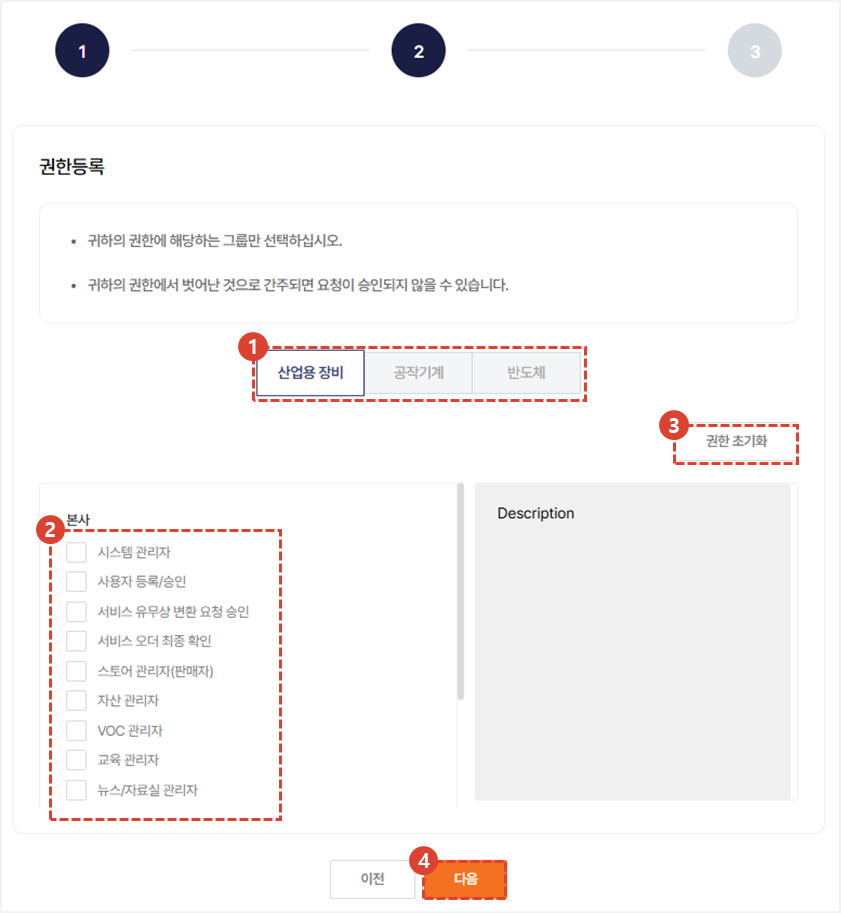
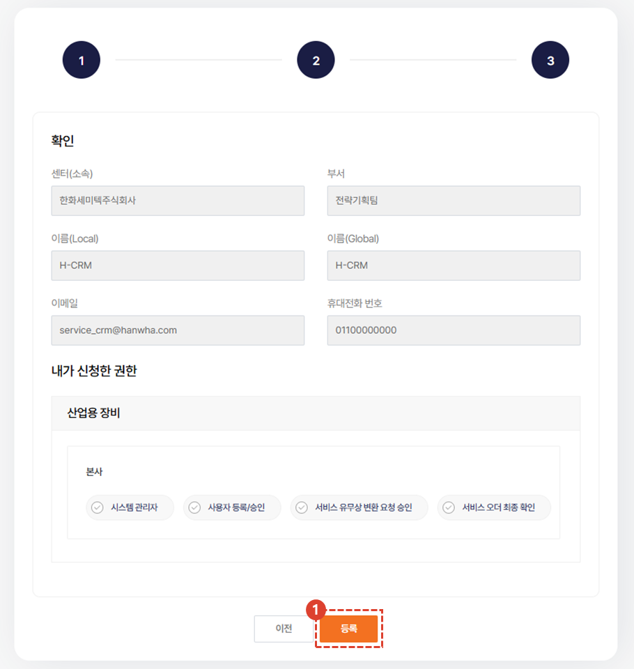
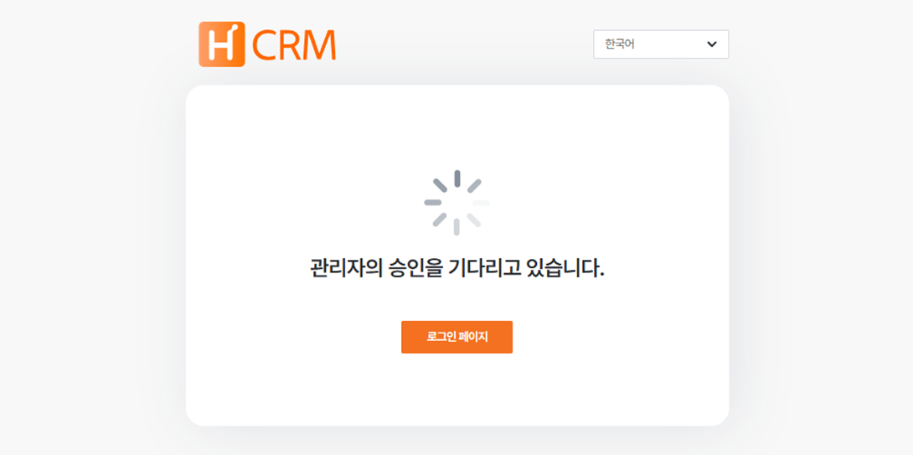

import ValidateTextByToken from "/src/utils/getQueryString.js";
import StrongTextParser from "/src/utils/textParser.js";
import text from "/src/locale/ko/SMT/tutorial-01-auth/create-a-acount-circle-user.json";
import Phon from "./img/004.png";

# CRM 계정 생성 (임직원) 
사내망에서 CRM 사용 계정을 생성하기 위한 절차를 안내합니다.

<ValidateTextByToken dispTargetViewer={true} dispCaution={true} validTokenList={['head', 'branch']}>

## 시스템 접속 경로

1. <StrongTextParser text={text.systemAccessPath01} />
- <StrongTextParser text={text.systemAccessPath02} />
  - <StrongTextParser text={text.systemAccessPath03} />
- <StrongTextParser text={text.systemAccessPath04} />
  - <StrongTextParser text={text.systemAccessPath05} />  
 
 

## 계정생성 - 기본정보 등록

1. <StrongTextParser text={text.step1AccountCreation01} />
1. <StrongTextParser text={text.step1AccountCreation02} /> 
    :::note
    

      1. <StrongTextParser text={text.step1AccountCreation03} />
      2. <StrongTextParser text={text.step1AccountCreation04} />
    :::
1. <StrongTextParser text={text.step1AccountCreation05} />
    :::info
    - <StrongTextParser text={text.step1AccountCreation06} />
    - <StrongTextParser text={text.step1AccountCreation07} />
    - <StrongTextParser text={text.step1AccountCreation08} />
    :::
4. <StrongTextParser text={text.step1AccountCreation09} />
 
 

## 계정생성 - 권한 등록

<StrongTextParser text={text.step2AccountCreation01} />

1. 해당되는 사업부를 선택합니다. 
1. 필요한 권한을 선택합니다.
1. 선택한 권한을 초기화 할 수 있습니다.
1. 다음단계로 진행합니다.
 
 

## 계정생성 - 확인 및 등록

<StrongTextParser text={text.step3AccountCreation01} />

1. 앞 단계에서 신청한 권한을 재확인하고 **등록**을 클릭합니다.
 
 

## 계정생성 완료

관리자의 승인 대기 화면이 나타나며, 승인 완료 시 **이메일로 알림이 발송**되며 로그인이 가능합니다.

</ValidateTextByToken>