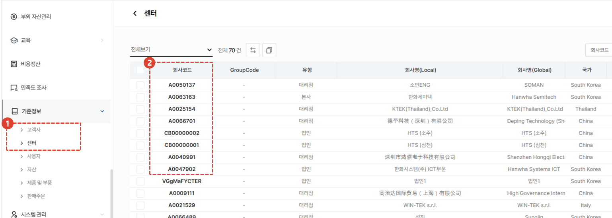

import ValidateTextByToken from "/src/utils/getQueryString.js";
import StrongTextParser from "/src/utils/textParser.js";
import text from "/src/locale/ko/SMT/tutorial-01-auth/create-a-acount-non-circle-user.json";

# CRM 계정 생성 (대리점)
**사외망**에서 CRM 사용 계정을 생성하기 위한 절차를 안내합니다.

:::danger
<StrongTextParser text={text.warning} />
:::
<ValidateTextByToken dispTargetViewer={true} dispCaution={true} validTokenList={['head', 'branch', 'agent']}>

## 개요
<StrongTextParser text={text.overview01} />
:::warning 
   - <StrongTextParser text={text.overview02} />
   - <StrongTextParser text={text.overview03} />
:::
 
 

## 서비스 대리점 사용자 계정 생성
:::info
<StrongTextParser text={text.createAgentAccount01} />
:::
 
 

### 페이지 이동

1. <StrongTextParser text={text.createAgentAccount02} />
2. <StrongTextParser text={text.createAgentAccount03} />
 
 

1. <StrongTextParser text={text.createAgentAccount04} />
2. <StrongTextParser text={text.createAgentAccount05} />
3. <StrongTextParser text={text.createAgentAccount06} />
 
 

### 사용자 추가 (1/3)

1. <StrongTextParser text={text.step1AddUser01} />
   - <StrongTextParser text={text.step1AddUser02} />
   - <StrongTextParser text={text.step1AddUser03} />
   - <StrongTextParser text={text.step1AddUser04} />
   - <StrongTextParser text={text.step1AddUser05} />
1. <StrongTextParser text={text.step1AddUser06} />
   :::note
   <StrongTextParser text={text.step1AddUser07} />
   :::
1. <StrongTextParser text={text.step1AddUser08} />
   :::tip
   <StrongTextParser text={text.step1AddUser09} />
   :::
 
 

### 사용자 추가 (1/3) - 부서 등록

1. <StrongTextParser text={text.step1AddDept01} />
1. <StrongTextParser text={text.step1AddDept02} />
 
 

### 사용자 추가 (2/3)

1. <StrongTextParser text={text.step2AddUser01} />
1. 할당할 권한을 선택합니다. 
   :::warning
      - <StrongTextParser text={text.step2AddUser09} />
      - <StrongTextParser text={text.step2AddUser10} />
   :::
1. 선택된 권한을 초기화 할 수 있습니다.
1. <StrongTextParser text={text.step2AddUser11} />
 
 

### 사용자 추가 (3/3)

- <StrongTextParser text={text.step3AddUser01} />
-  <StrongTextParser text={text.step3AddUser02} />
   :::danger
   <StrongTextParser text={text.step3AddUser03} />
   :::
1. <StrongTextParser text={text.step3AddUser04} />
   - <StrongTextParser text={text.step3AddUser05} />
   - <StrongTextParser text={text.step3AddUser06} />
 
 

### 사용자 추가인증 (1/2)

1. <StrongTextParser text={text.step1AdditionalAuth01} />
   :::tip
   <StrongTextParser text={text.step1AdditionalAuth02} />
   :::
1. <StrongTextParser text={text.step1AdditionalAuth03} />
   :::note
   <StrongTextParser text={text.step1AdditionalAuth04} />
   :::
 
 

### 사용자 추가인증 (2/2)

1. <StrongTextParser text={text.step2AdditionalAuth01} />
1. <StrongTextParser text={text.step2AdditionalAuth02} />
1. <StrongTextParser text={text.step2AdditionalAuth03} />
1. <StrongTextParser text={text.step2AdditionalAuth04} />
1. <StrongTextParser text={text.step2AdditionalAuth05} />
   :::note
   <StrongTextParser text={text.step2AdditionalAuth06} />
   :::
1. <StrongTextParser text={text.step2AdditionalAuth07} />
1. <StrongTextParser text={text.step2AdditionalAuth08} />
   :::note
   - <StrongTextParser text={text.step2AdditionalAuth09} />
   - <StrongTextParser text={text.step2AdditionalAuth10} />
   - <StrongTextParser text={text.step2AdditionalAuth11} />
   :::
1. <StrongTextParser text={text.step2AdditionalAuth12} />
 
 

- <StrongTextParser text={text.finalConfirm01} />
   :::tip
   <StrongTextParser text={text.finalConfirm02} />
   :::

</ValidateTextByToken>
