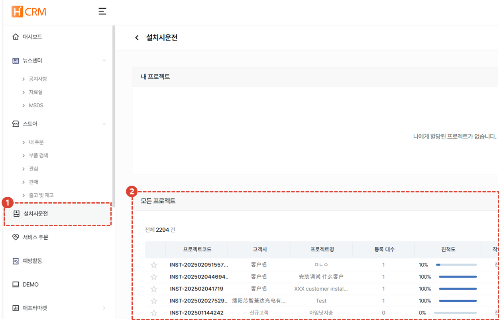

import ValidateTextByToken from "/src/utils/getQueryString.js";
import StrongTextParser from "/src/utils/textParser.js";
import text from "/src/locale/ko/SMT/tutorial-02-installation/01-create-project.json";

# 프로젝트 목록

설치시운전 프로젝트 목록을 안내합니다.

<ValidateTextByToken dispTargetViewer={true} dispCaution={true} validTokenList={['head', 'branch', 'agent']}>

1. <StrongTextParser text={text.projectList01} />
1. <StrongTextParser text={text.projectList02} />

</ValidateTextByToken>
