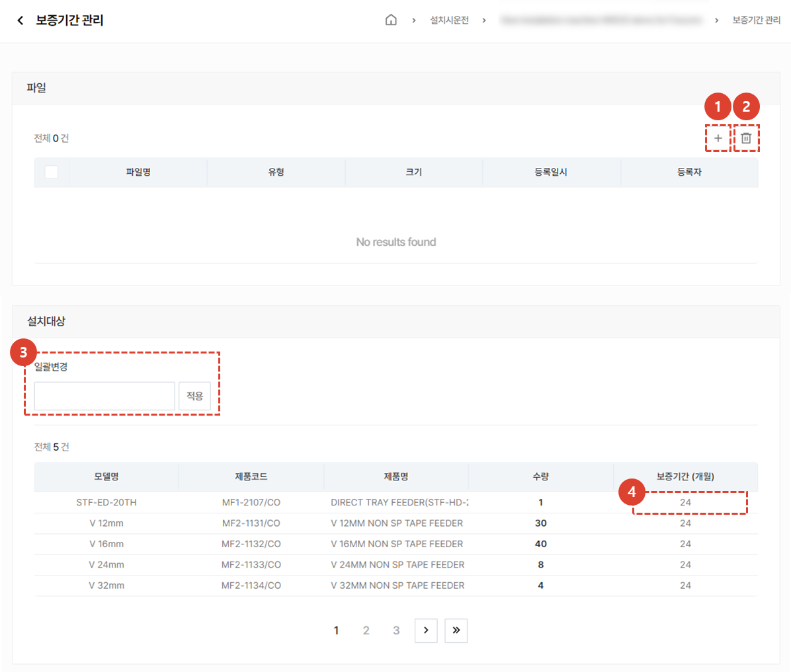

import ValidateTextByToken from "/src/utils/getQueryString.js";
import StrongTextParser from "/src/utils/textParser.js";
import text from "/src/locale/ko/SMT/tutorial-02-installation/02-details-project.json";
import DataAdd from "./img/012_2.png";
import Signature from "./img/039.png";

# 프로젝트 상세 - 개요

프로젝트 상세 화면의 개요 탭을 안내합니다.

## 프로젝트 상세 탭 안내
<ValidateTextByToken dispTargetViewer={true} dispCaution={false} validTokenList={['head', 'branch', 'agent']}>

1. **개요** : 설치시운전에 대한 기본적인 내용 및 요약, 납품 목록을 입력합니다.
1. **프리미팅** : 설치시운전을 위해 고객과 진행한 프리 미팅 내용을 입력 할 수 있습니다. 프리미팅에 대한 상세 내용 및 소요 시간을 관리할 수 있습니다. 
1. **설치환경 체크** : (미주법인 전용)프리미팅이 어려운 경우, 고객에게 유선으로 전달받은 설치 환경 정보를 저장할 수 있습니다. 
1. **업그레이드** : (미주법인 전용) 고객의 주문에 따른 옵션 설치를 진행할 수행 장소를 입력할 수 있습니다. 
1. **출하** : (미주법인 전용) 출하 정보를 입력할 수 있습니다. 
1. **설치** : 설치시운전에 대한 상세한 내용을 입력하고, 설치시운전의 최종확인 여부를 선택 할 수 있습니다.
1. **시운전 및 교육** : 설치시운전 전후로 진행되는 시운전 및 교육 내역을 입력할 수 있습니다.
1. **품질 안정화** : 설치시운전 이후 품질 안정화를 위한 작업 내역을 입력할 수 있습니다. 
 
 

## 개요 - 기본 정보

1. 프로젝트 생성 시 입력된 기본 내용을 수정할 수 있습니다. 
1. 설치시운전 프로젝트에 추가된 설치대상 자산의 보증기간 관리가 가능합니다. 
    :::warning 
    보증기간 관리는 **자산추가** 후 활용이 가능합니다.
     [**보증기간 관리**](#보증기간-관리)를 클릭하여 관리방법을 확인 할 수 있습니다.
    :::
 
 

1. 설치 대상 자산을 추가하기 위해 **추가** 버튼을 클릭합니다.
1. 자산에 부착되어있는 바코드를 이용해 추가를 원할 경우 **바코드 스캔** 버튼을 클릭합니다.
    :::info
    보증 기간 관리가 필요한 자산은 모두 등록해야 합니다. 추가 방법은 다음과 같습니다. 
    :::
</ValidateTextByToken>
 
 

## 개요 - 납품목록 추가
### 판매주문으로 추가하기

<ValidateTextByToken dispTargetViewer={false} dispCaution={true} validTokenList={['head', 'branch']}>

1. <StrongTextParser text={text.overviewAddAssetBySalesOrder01} />
1. <StrongTextParser text={text.overviewAddAssetBySalesOrder02} />
1. <StrongTextParser text={text.overviewAddAssetBySalesOrder03} />
1. <StrongTextParser text={text.overviewAddAssetBySalesOrder04} />
    - 여기에 추가된 자산은 [**판매주문으로 자산이 추가된 경우 납품목록 조회**](#판매주문으로-자산이-추가된-경우)와 같이 표시됩니다.
</ValidateTextByToken>
 
 

### 자산목록에서 추가하기
<ValidateTextByToken dispTargetViewer={false} dispCaution={true} validTokenList={['head', 'branch', 'agent']}>

1.  <StrongTextParser text={text.overviewAddAssetByAssetList01} />
    :::note
    <StrongTextParser text={text.overviewAddAssetByAssetList02} />
    :::
1. <StrongTextParser text={text.overviewAddAssetByAssetList03} />
1. <StrongTextParser text={text.overviewAddAssetByAssetList04} />
    :::info
    
    :::  
1. <StrongTextParser text={text.overviewAddAssetByAssetList05} />
1. <StrongTextParser text={text.overviewAddAssetByAssetList06} />
 
 

### 직접 S/N입력

1. 보유자산 목록에서 자산 조회가 되지 않는 경우, **직접 S/N 입력** 버튼을 클릭합니다.
    :::danger
    자산을 허위로 등록할 경우, 향후 불이익이 발생할 수 있습니다.
    :::
1. 추가할 자산의 시리얼 번호를 입력합니다.   그림과 같이 입력하면, 다량의 자산을 일괄 추가 할 수 있습니다.
1. 추가된 시리얼번호의 상태를 확인하고, 필요에 따라 **자산추가** 버튼을 클릭하여 자산을 추가할 수 있습니다. 
     
    

1. <StrongTextParser text={text.overviewAddAssetByDirect05} />
1. <StrongTextParser text={text.overviewAddAssetByDirect06} />
 
 

## 개요 - 납품목록

<StrongTextParser text={text.serveList01} />

### 판매주문으로 자산이 추가된 경우

1. 시리얼 번호가 매핑되지 않거나, 기타 사유로 설치 대상/비대상으로 분류가 되지 않은 경우 대기열에 잔류하게됩니다.    
    :::warning
    대기열에 자산이 존재할 경우, 다음 단계로 넘어갈 수 없습니다. 
     **S/N**를 더블클릭하거나 **액션버튼**을 클릭하여 Serial Number을 입력하면, 설치대상 또는 비대상으로 이동합니다.
    :::

4. 설치시운전의 대상이 되는 모델 목록입니다. 
     모델 데이터에서 **설치시운전 설치대상**이 체크되어있는 경우, 해당 목록에 추가됩니다.
    :::info
    <StrongTextParser text={text.serveListBySalesOrder03} />
    :::
5. 설치대상이 아닌 경우, **모델명**을 클릭하여 **설치시운전 설치대상**을 선택 해제합니다.
   설치대상에서 선택 해제 된 경우, **설치 비대상** 목록으로 이동 됩니다. 
6. 설치대상이 아닌 납품 목록입니다. 
    :::info
    <StrongTextParser text={text.serveListBySalesOrder05} />
    :::
 
 

### 보유자산목록에서 추가 또는 직접 자산을 등록한 경우

1. 직접 자산을 추가하는 경우에는 대기열이 존재하지 않습니다. 나머지는 [**판매주문으로 자산이 추가된 경우**](#판매주문으로-자산이-추가된-경우)와 동일한 프로세스를 따릅니다.

 
 

## 개요 - 보증기간 관리

1. 보증기간과 관련된 자료를 첨부할 수 있습니다. 
1. 업로드된 파일을 삭제 할 수 있습니다. 
1. 설치대상에 있는 제품의 보증기간을 일괄변경 할 수 있습니다. 
1. 변경하고자 하는 제품의 보증기간 탭을 **더블클릭**하여 보증기간 수정이 가능합니다.
 
 

## 공통내용

:::info
    프로젝트 상세 화면에서 각 탭에 공통으로 들어가는 내용입니다. 공통내용에 들어가는 각 항목은 하단의 내용을 참조해주세요.
:::
 
 

### 공통내용 - 1/3

1. 설치시운전 프로젝트의 코드를 확인 할 수 있습니다.
1. 설치시운전을 완료한 후에, **작업자**가 **프로젝트 완료** 버튼을 클릭해야 합니다. 해당 버튼 클릭 시 모든 탭의 작업이 **작업완료**처리 됩니다. 
    :::warning
     완료버튼 클릭 시 나타나는 팝업창에서 보증기간 시작일 변경이 가능합니다. 
     보증기간 시작일이 맞는지 다시한번 검토 후 완료 처리를 진행해야 합니다.
    :::
1. **프로젝트 완료**가 선택 된 경우, 버튼이 활성화 됩니다. **관리자**는 프로젝트 결과 확인 후 **프로젝트 승인** 버튼을 클릭합니다. 
    :::warning
     완료버튼 클릭 시 나타나는 팝업창에서 보증기간 시작일 변경이 가능합니다. 
     보증기간 시작일이 맞는지 다시한번 검토 후 완료 처리를 진행해야 합니다.
    :::
1. 클릭하여 **설치시운전 보고서**를 확인 할 수 있습니다. **설치**탭에서 체크리스트를 모두 완료하면 보고서가 자동 생성 됩니다. 
1. 프로젝트에 참고할만한 첨부파일을 추가할 수 있습니다.
 
 

### 공통내용 - 2/3

1. 고객사 정보를 확인하고, 수정이 필요한 경우 **수정** 버튼을 클릭합니다. 
1. 고객사 검수 담당자의 변경이 필요한 경우 **변경** 버튼을 클릭합니다. 
1. 담당 센터의 경우, 프로젝트 생성 이후 변경이 불가합니다. 
1. **추가** 버튼을 클릭하여 프로젝트 관리자를 추가할 수 있습니다.
 
 

### 공통내용 - 3/3

1. 프로젝트의 활동 내역을 타임라인으로 확인 할 수 있습니다. 
1. 코멘트 작성으로 엔지니어 및 관리자간 소통을 할 수 있습니다. 
    :::tip
    - <StrongTextParser text={text.common03} />
    :::
1. 프로젝트를 취소해야 할 경우 사용합니다. 설치시운전 작업이 완료되면 버튼이 비활성화 됩니다. 
1. **즐겨찾기**를 선택 할 수 있습니다.
</ValidateTextByToken>

