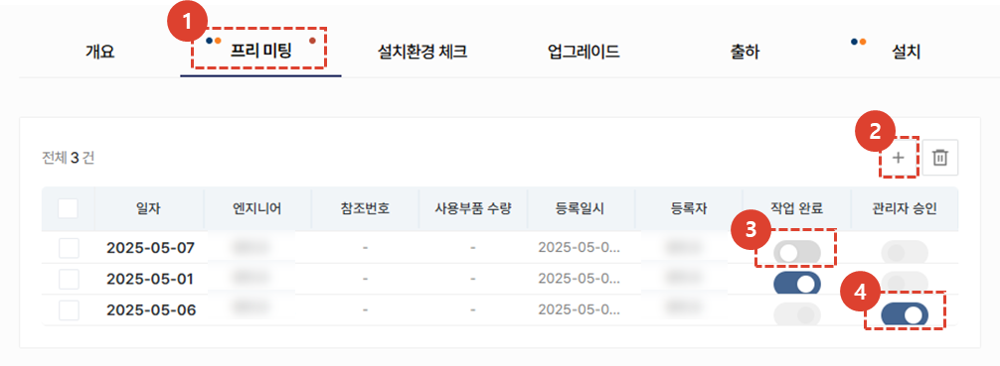
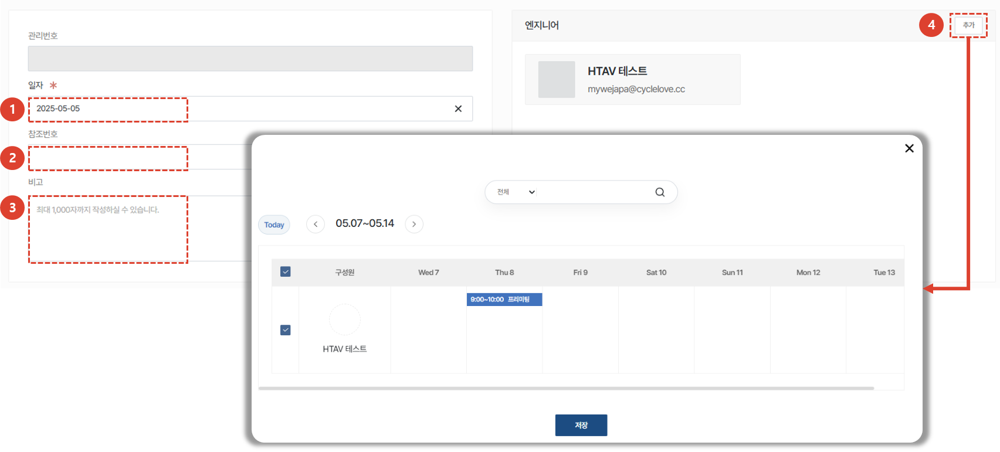

import ValidateTextByToken from "/src/utils/getQueryString.js";
import StrongTextParser from "/src/utils/textParser.js";
import text from "/src/locale/ko/SMT/tutorial-02-installation/02-details-project.json";
import DataAdd from "./img/012_2.png";
import Signature from "./img/039.png";

# 프로젝트 상세 - 프리미팅

프로젝트 상세 화면의 프리미팅 탭을 안내합니다.

## 프로젝트 상세 탭 안내

<ValidateTextByToken dispTargetViewer={true} dispCaution={true} validTokenList={['head', 'branch', 'agent']}>

1. **개요** : 설치시운전에 대한 기본적인 내용 및 요약, 납품 목록을 입력합니다.
1. **프리미팅** : 설치시운전을 위해 고객과 진행한 프리 미팅 내용을 입력 할 수 있습니다. 프리미팅에 대한 상세 내용 및 소요 시간을 관리할 수 있습니다. 
1. **설치환경 체크** : (미주법인 전용)프리미팅이 어려운 경우, 고객에게 유선으로 전달받은 설치 환경 정보를 저장할 수 있습니다. 
1. **업그레이드** : (미주법인 전용) 고객의 주문에 따른 옵션 설치를 진행할 수행 장소를 입력할 수 있습니다. 
1. **출하** : (미주법인 전용) 출하 정보를 입력할 수 있습니다. 
1. **설치** : 설치시운전에 대한 상세한 내용을 입력하고, 설치시운전의 최종확인 여부를 선택 할 수 있습니다.
1. **시운전 및 교육** : 설치시운전 전후로 진행되는 시운전 및 교육 내역을 입력할 수 있습니다.
1. **품질 안정화** : 설치시운전 이후 품질 안정화를 위한 작업 내역을 입력할 수 있습니다. 

 
 

## 프리미팅

설치시운전 작업 수행 전, 고객사와 사전 미팅을 수행하는 경우 사용합니다.

1. **프리미팅** 탭을 클릭하여 고객과 진행한 프리미팅 내역을 확인 또는 추가할 수 있습니다. 
    :::info
    **파란점** : 진행중인 작업 내역이 있음을 나타냅니다. 엔지니어는 작업 완료 후에 **작업 완료** 체크를 진행해야 합니다.
     **주황점** : 작업완료 처리된 항목이 있음을 나타냅니다. 관리자는 작업 내역을 확인하고 **관리자 승인** 체크를 진행해야 합니다.
    :::
1. 프리미팅을 수행하는 경우 **+** 버튼을 클릭합니다.
1. (엔지니어)프리미팅이 완료된 경우, **작업완료** 토글을 클릭합니다. 
1. (관리자)엔지니어가 완료 처리한 프리미팅 내역을 확인하고, **관리자 승인** 토글을 클릭합니다.
 
 

### 프리미팅 추가

1. <StrongTextParser text={text.premeetingAdd02} />
1. <StrongTextParser text={text.premeetingAdd03} />
1. <StrongTextParser text={text.premeetingAdd04} />
1. **추가** 버튼을 클릭하여 프리미팅 진행 엔지니어를 선택합니다. 
 엔지니어 선택 시, 해당 프로젝트에서 선택할 수 있는 엔지니어의 일정을 확인 할 수 있습니다. 
 
 

1. 미팅에 소요된 시간 입력을 위해(비용 정산용) **+** 버튼을 누릅니다. 엔지니어, 작업 구분, 작업 시간을 입력한 뒤 **저장 후 닫기**를 누릅니다.
1. 프리미팅 결과 보고서를 첨부합니다.
1. 추가된 일정을 스케줄에 등록하려면 **추가한 소요시간을 캘린더에 반영하겠습니다.** 를 체크합니다. 센터 내 동료들에게 해당 스케줄이 보이게됩니다.
 
 

1. 프리미팅에 사용한 부품을 추가합니다. 
1. 부품 정보를 입력합니다. 
1. **추가**버튼을 클릭하여 목록에 부품이 정상적으로 추가되었는지 확인합니다.  작업에 필요한 부품이 있는 경우, 사용부품을 입력해야만 스토어에서 무상자재 신청이 가능합니다.
1. **출고 요청** 버튼으로 자재 출고 요청이 가능합니다.
1. **저장**을 클릭하여 등록을 완료합니다.
 
 

## 공통내용

:::info
    프로젝트 상세 화면에서 각 탭에 공통으로 들어가는 내용입니다. 공통내용에 들어가는 각 항목은 하단의 내용을 참조해주세요.
:::
 
 

### 공통내용 - 1/3

1. 설치시운전 프로젝트의 코드를 확인 할 수 있습니다.
1. 설치시운전을 완료한 후에, **작업자**가 **프로젝트 완료** 버튼을 클릭해야 합니다. 해당 버튼 클릭 시 모든 탭의 작업이 **작업완료**처리 됩니다. 
    :::warning
     완료버튼 클릭 시 나타나는 팝업창에서 보증기간 시작일 변경이 가능합니다. 
     보증기간 시작일이 맞는지 다시한번 검토 후 완료 처리를 진행해야 합니다.
    :::
1. **프로젝트 완료**가 선택 된 경우, 버튼이 활성화 됩니다. **관리자**는 프로젝트 결과 확인 후 **프로젝트 승인** 버튼을 클릭합니다. 
    :::warning
     완료버튼 클릭 시 나타나는 팝업창에서 보증기간 시작일 변경이 가능합니다. 
     보증기간 시작일이 맞는지 다시한번 검토 후 완료 처리를 진행해야 합니다.
    :::
1. 클릭하여 **설치시운전 보고서**를 확인 할 수 있습니다. **설치**탭에서 체크리스트를 모두 완료하면 보고서가 자동 생성 됩니다. 
1. 프로젝트에 참고할만한 첨부파일을 추가할 수 있습니다.
 
 

### 공통내용 - 2/3

1. 고객사 정보를 확인하고, 수정이 필요한 경우 **수정** 버튼을 클릭합니다. 
1. 고객사 검수 담당자의 변경이 필요한 경우 **변경** 버튼을 클릭합니다. 
1. 담당 센터의 경우, 프로젝트 생성 이후 변경이 불가합니다. 
1. **추가** 버튼을 클릭하여 프로젝트 관리자를 추가할 수 있습니다.
 
 

### 공통내용 - 3/3

1. 프로젝트의 활동 내역을 타임라인으로 확인 할 수 있습니다. 
1. 코멘트 작성으로 엔지니어 및 관리자간 소통을 할 수 있습니다. 
    :::tip
    - <StrongTextParser text={text.common03} />
    :::
1. 프로젝트를 취소해야 할 경우 사용합니다. 설치시운전 작업이 완료되면 버튼이 비활성화 됩니다. 
1. **즐겨찾기**를 선택 할 수 있습니다.
</ValidateTextByToken>

