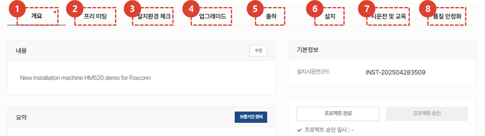
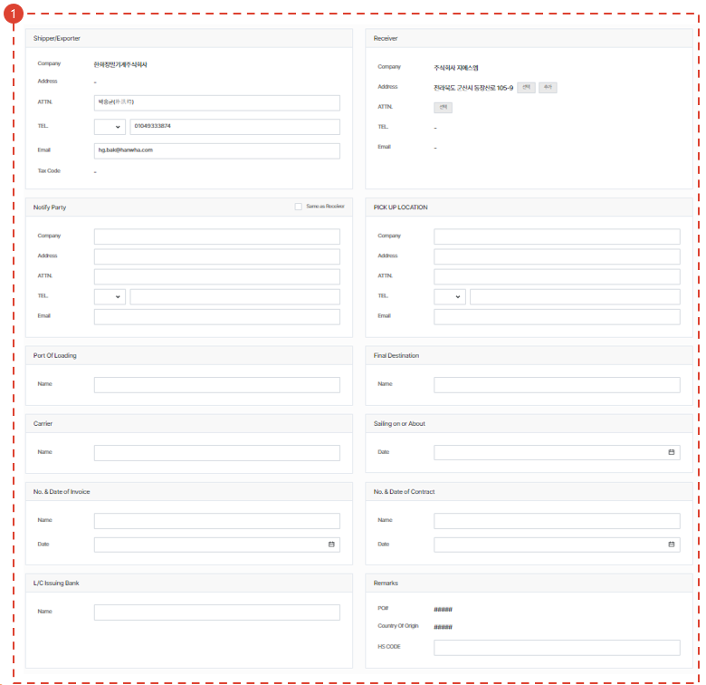

import ValidateTextByToken from "/src/utils/getQueryString.js";
import StrongTextParser from "/src/utils/textParser.js";
import text from "/src/locale/ko/SMT/tutorial-02-installation/02-details-project.json";
import DataAdd from "./img/012_2.png";
import Signature from "./img/039.png";

# 프로젝트 상세 - 출하(HSA)

프로젝트 상세 화면의 출하 탭을 안내합니다.  HSA 전용 탭 입니다. 

## 프로젝트 상세 탭 안내

<ValidateTextByToken dispTargetViewer={true} dispCaution={false} validTokenList={['head', 'branch', 'agent']}>

1. **개요** : 설치시운전에 대한 기본적인 내용 및 요약, 납품 목록을 입력합니다.
1. **프리미팅** : 설치시운전을 위해 고객과 진행한 프리 미팅 내용을 입력 할 수 있습니다. 프리미팅에 대한 상세 내용 및 소요 시간을 관리할 수 있습니다. 
1. **설치환경 체크** : (미주법인 전용)프리미팅이 어려운 경우, 고객에게 유선으로 전달받은 설치 환경 정보를 저장할 수 있습니다. 
1. **업그레이드** : (미주법인 전용) 고객의 주문에 따른 옵션 설치를 진행할 수행 장소를 입력할 수 있습니다. 
1. **출하** : (미주법인 전용) 출하 정보를 입력할 수 있습니다. 
1. **설치** : 설치시운전에 대한 상세한 내용을 입력하고, 설치시운전의 최종확인 여부를 선택 할 수 있습니다.
1. **시운전 및 교육** : 설치시운전 전후로 진행되는 시운전 및 교육 내역을 입력할 수 있습니다.
1. **품질 안정화** : 설치시운전 이후 품질 안정화를 위한 작업 내역을 입력할 수 있습니다. 

</ValidateTextByToken>
 
 

## 출하 (for HSA)

<ValidateTextByToken dispTargetViewer={false} dispCaution={true} validTokenList={['branch']}>

1. <StrongTextParser text={text.packing01} />
1. <StrongTextParser text={text.packing02} />
 
 

### 패킹리스트 & 인보이스 생성 (1/3) (for HSA)

1. 선적정보를 입력합니다.
 
 

### 패킹리스트 & 인보이스 생성 (2/3) (for HSA)

1. <StrongTextParser text={text.step2Packing01} />
1. <StrongTextParser text={text.step2Packing02} />
1. <StrongTextParser text={text.step2Packing03} />
1. <StrongTextParser text={text.step2Packing04} />
1. <StrongTextParser text={text.step2Packing05} />
 
 

### 패킹리스트 & 인보이스 생성 (3/3) (for HSA)

1. <StrongTextParser text={text.step3Packing01} />
1. <StrongTextParser text={text.step3Packing02} />

</ValidateTextByToken>
 
 

## 공통내용
<ValidateTextByToken dispTargetViewer={false} dispCaution={true} validTokenList={['head', 'branch', 'agent']}>

:::info
    프로젝트 상세 화면에서 각 탭에 공통으로 들어가는 내용입니다. 공통내용에 들어가는 각 항목은 하단의 내용을 참조해주세요.
:::
 
 

### 공통내용 - 1/3

1. 설치시운전 프로젝트의 코드를 확인 할 수 있습니다.
1. 설치시운전을 완료한 후에, **작업자**가 **프로젝트 완료** 버튼을 클릭해야 합니다. 해당 버튼 클릭 시 모든 탭의 작업이 **작업완료**처리 됩니다. 
    :::warning
     완료버튼 클릭 시 나타나는 팝업창에서 보증기간 시작일 변경이 가능합니다. 
     보증기간 시작일이 맞는지 다시한번 검토 후 완료 처리를 진행해야 합니다.
    :::
1. **프로젝트 완료**가 선택 된 경우, 버튼이 활성화 됩니다. **관리자**는 프로젝트 결과 확인 후 **프로젝트 승인** 버튼을 클릭합니다. 
    :::warning
     완료버튼 클릭 시 나타나는 팝업창에서 보증기간 시작일 변경이 가능합니다. 
     보증기간 시작일이 맞는지 다시한번 검토 후 완료 처리를 진행해야 합니다.
    :::
1. 클릭하여 **설치시운전 보고서**를 확인 할 수 있습니다. **설치**탭에서 체크리스트를 모두 완료하면 보고서가 자동 생성 됩니다. 
1. 프로젝트에 참고할만한 첨부파일을 추가할 수 있습니다.
 
 

### 공통내용 - 2/3

1. 고객사 정보를 확인하고, 수정이 필요한 경우 **수정** 버튼을 클릭합니다. 
1. 고객사 검수 담당자의 변경이 필요한 경우 **변경** 버튼을 클릭합니다. 
1. 담당 센터의 경우, 프로젝트 생성 이후 변경이 불가합니다. 
1. **추가** 버튼을 클릭하여 프로젝트 관리자를 추가할 수 있습니다.
 
 

### 공통내용 - 3/3

1. 프로젝트의 활동 내역을 타임라인으로 확인 할 수 있습니다. 
1. 코멘트 작성으로 엔지니어 및 관리자간 소통을 할 수 있습니다. 
    :::tip
    - <StrongTextParser text={text.common03} />
    :::
1. 프로젝트를 취소해야 할 경우 사용합니다. 설치시운전 작업이 완료되면 버튼이 비활성화 됩니다. 
1. **즐겨찾기**를 선택 할 수 있습니다.
</ValidateTextByToken>

