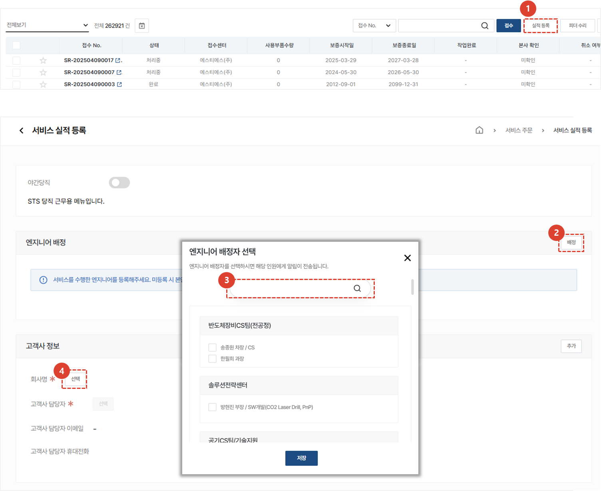
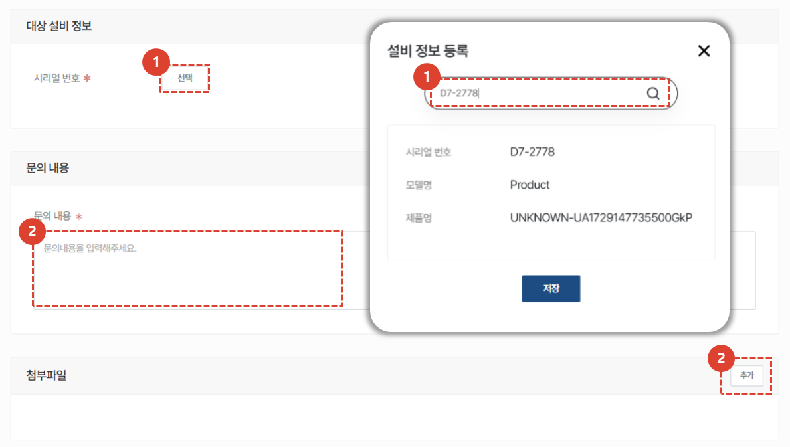
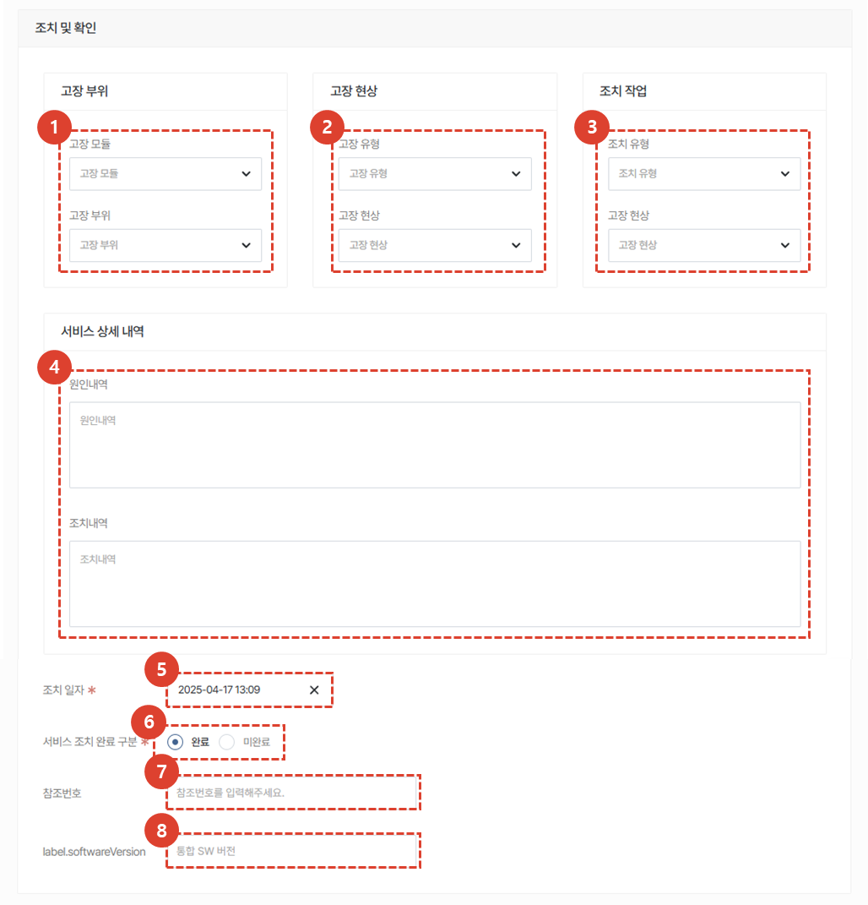
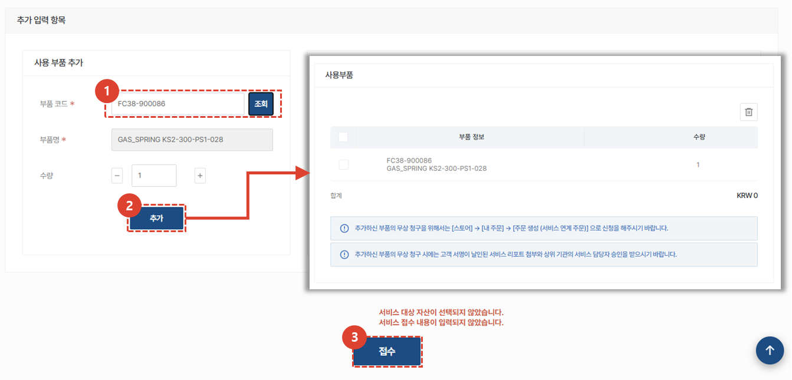

import ValidateTextByToken from "/src/utils/getQueryString.js";
import StrongTextParser from "/src/utils/textParser.js";
import text from "/src/locale/ko/SMT/tutorial-01-auth/create-a-acount-circle-user.json";

# 실적등록
서비스 등록 후 처리 내용을 추후에 입력할 수 있는 기본 절차와 달리, 
서비스 접수/등록/처리를 한번에 입력 할 수 있는 실적등록 탭을 안내합니다. 
<ValidateTextByToken dispTargetViewer={true} dispCaution={true} validTokenList={['head', 'branch', 'agent']}>

## 서비스 목록

1. **서비스 주문** 을 선택합니다.
1. 모든 서비스 목록이 표시됩니다.
      - 처리중 : 처리중인 서비스 개수를 나타냅니다. 클릭 시 처리중인 리스트만 목록에 보여집니다. 
      - 완료 : 완료처리된 서비스 개수를 나타냅니다. 클릭시 완료된 리스트만 목록에 보여집니다.
      - 취소 : 취소된 서비스 개수를 나타냅니다. 클릭시 취소된 리스트만 목록에 보여집니다.
      - 종결 : 서비스 접수 후 정상적인 프로세스로 처리되지 않고 종결 처리된 서비스 개수를 나타냅니다. 클릭시 종결된 리스트만 목록에 보여집니다. '
1. 접수 : 일반적인 서비스 접수를 등록 할 수 있습니다. 
      - 접수만 먼저 등록하거나, 접수를 받아 등록하는 관리자가 별도로 있는 경우 사용하기 적합합니다. 
1. 실적등록 : 서비스 접수부터 처리 내용까지 한번에 입력이 가능합니다.   
      - 서비스 작업까지 완료된 후 접수 및 작업내용을 한번에 입력해야 할 경우 사용하기 적합합니다. 
1. 피더수리 : 피더와 같이 여러 부품에 대한 서비스 이력을 입력해야 할 경우 진행합니다. **접수** 및 **실적등록** 과 달리 이동/작업/식사로 인한 소요시간추가를 하지 않고 **접수일자**와 **조치일자**만 입력하여 서비스를 등록합니다. 
 
 

## 서비스 실적등록 - 1/2

1. **실적등록**을 선택합니다.
    :::note
    
    STS 엔지니어의 당직 근무 시 야간당직버튼을 활성화합니다. 
    :::
1. **배정**을 선택하여 엔지니어를 배정합니다. 
1. **선택**을 눌러 고객사 정보를 등록합니다. 
    :::note
    서비스 대상 설비 또는 자산 검색을 선행하지 않으면, 고객사 등록이 불가합니다.
    :::
1. **선택**을 눌러 고객사의 담당자를 설정합니다. 
 
 

## 서비스 실적등록 - 2/2

1. **선택**을 클릭하여 대상 설비 정보를 입력합니다.  
1. 고객사의 문의 내용을 입력합니다.
1. **추가**를 클릭하여 관련한 첨부파일을 입력합니다. 
 
 

### 서비스 처리 - 1/2

1. 고장모듈 및 상세한 고장부위를 선택합니다. 
1. 고장 유형 및 현상을 선택합니다. 
1. 조치 유형 및 작업 내용을 선택합니다. 
1. 서비스 상세 내역을 자세히 작성합니다. 
1. **조치 일자**를 선택합니다. 
1. **서비스 조치 완료 구분**을 선택합니다. 서비스 조치가 완료 되었을 경우 **완료**를 선택합니다. 
1. 관련된 참조 번호를 입력합니다. 
1. 통합 SW 버전을 입력합니다. 
 
 

### 서비스 처리 -2/2

1. 사용한 부품 코드를 입력하고 **조회** 버튼을 클릭합니다. 
    :::note
    부품 코드가 시스템상 등록되어 있는 경우, 부품명, 단가가 자동 입력됩니다. 
    그렇지 않은 경우 **구분** 탭에 원인이 표시되며, 필요한 경우 데이터를 직접 입력 할 수 있습니다. 
    :::
1. **추가**를 클릭하여 부품을 등록합니다. 
1. 등록된 부품을 확인합니다. 
1. 저장 버튼을 눌러 조치 내용을 저장합니다. 
</ValidateTextByToken>