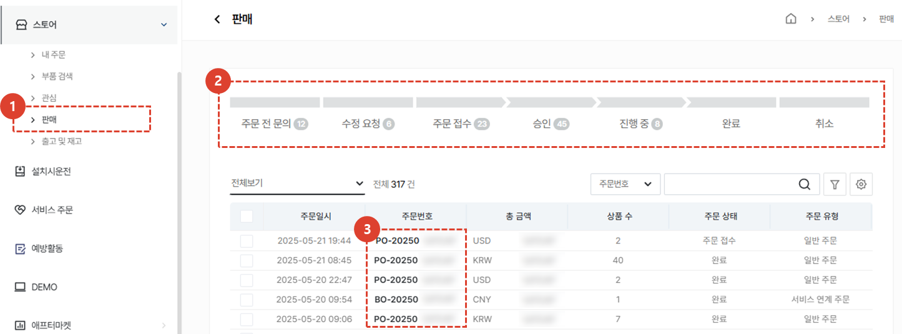
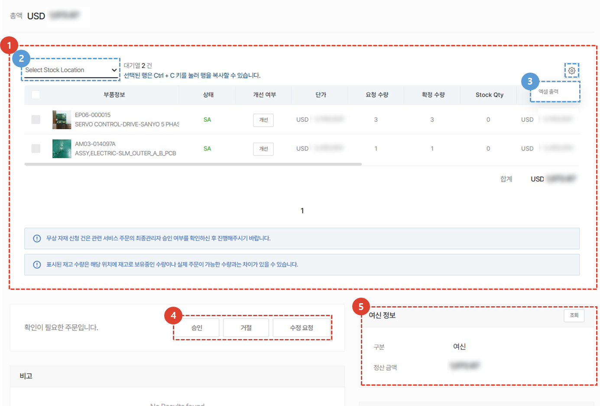
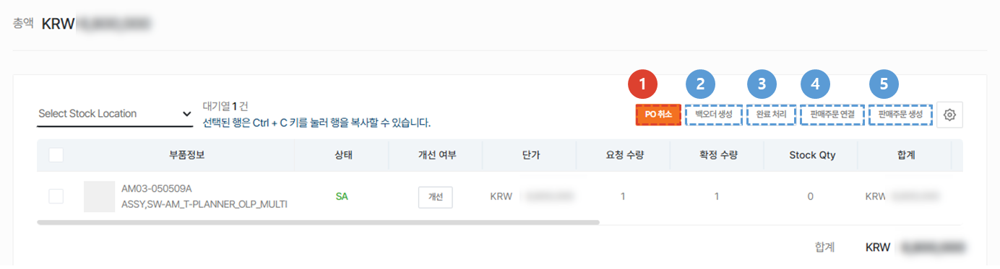
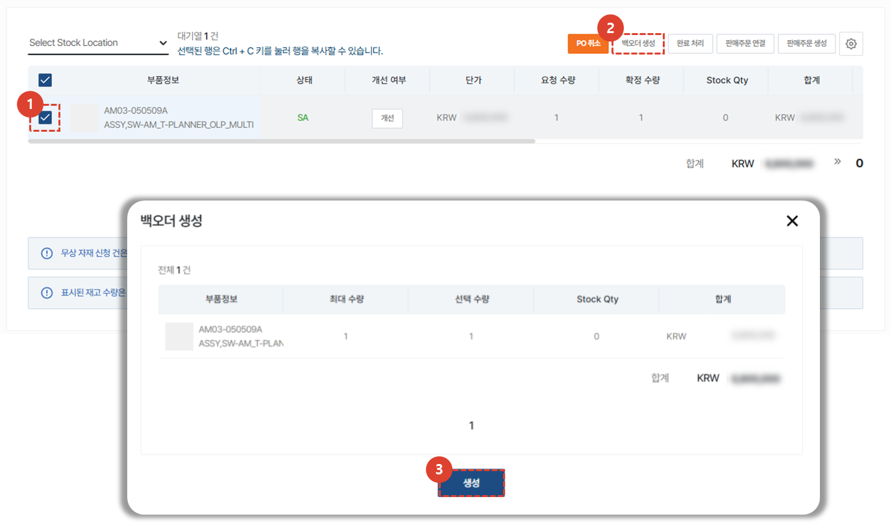
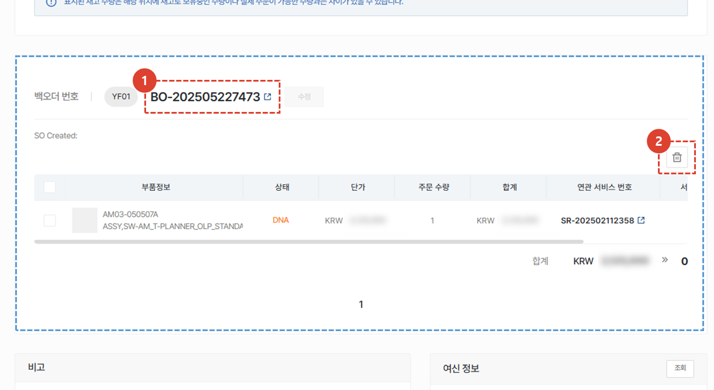
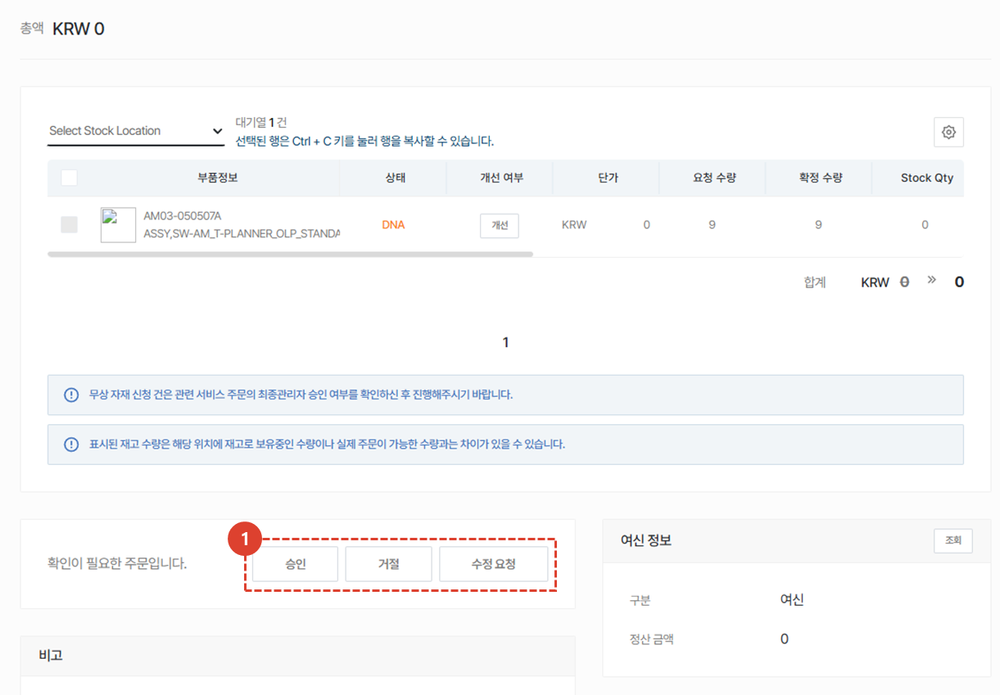
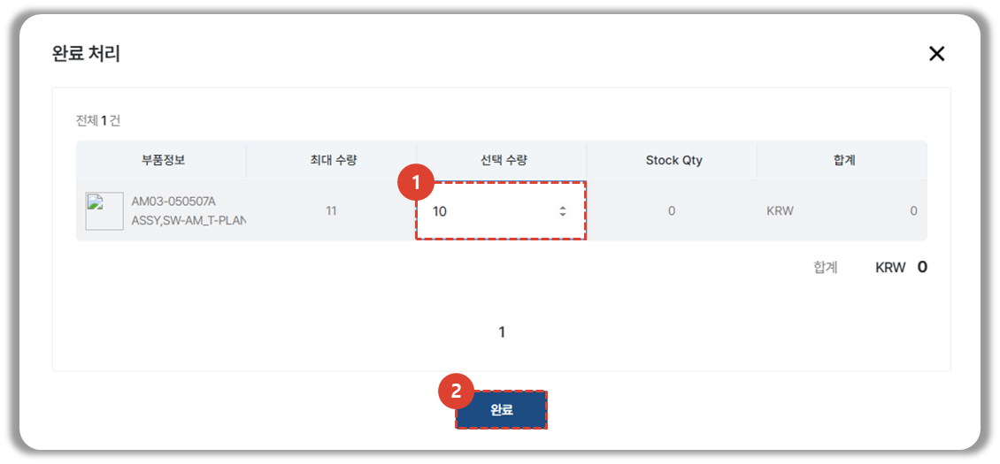
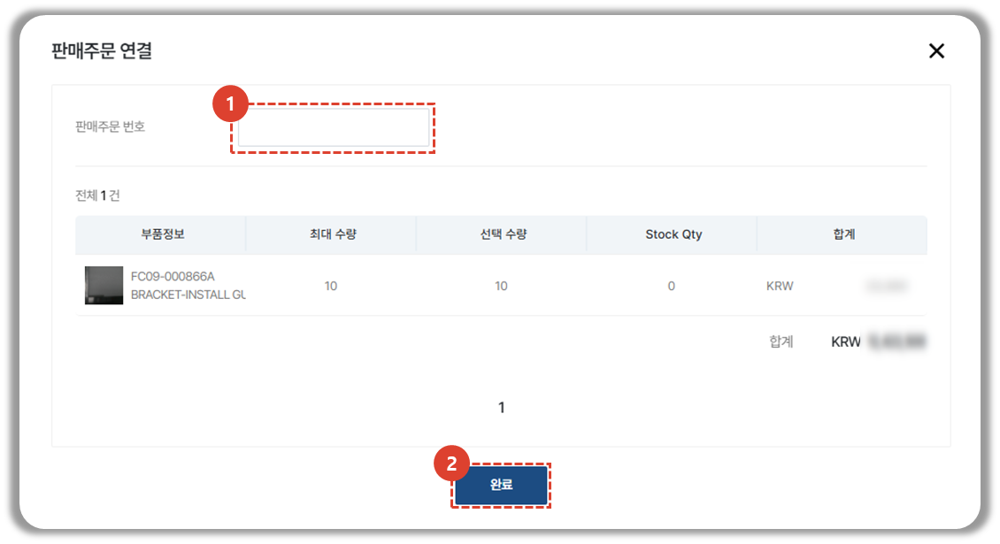
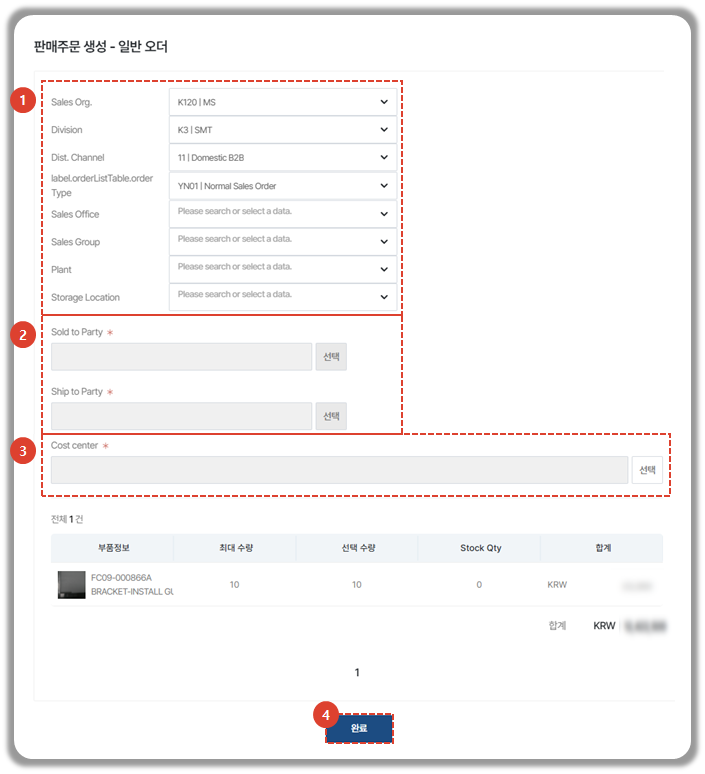

import ValidateTextByToken from "/src/utils/getQueryString.js";
import Cancle from "./img/057.png";
import back_order from "./img/058.png";
import circle from "./img/062.png";

# 주문서 처리
접수된 주문서의 처리 절차에 대해 안내합니다.
<ValidateTextByToken dispTargetViewer={true} dispCaution={false} validTokenList={['head', 'branch', 'seller', 'agent']}>
 
## 주문서 목록

1. **스토어** - **판매** 메뉴를 선택합니다.
1. 주문서 목록에서 주문서의 상태를 확인합니다.
    :::info
    주문서 목록에서 확인 가능 목록은 다음과 같습니다.
    - 주문 정보
    - 주문 번호
    - 총 금액
    - 상품 수 
    - 주문 상태
    - 주문 유형
    - 유무상 구분 : 서비스 오더 유형을 기반으로 유무상 구분이 진행되며, 수정 필요 시 승인센터 담당자가 변경 가능합니다.
    - 신청센터
    - 승인센터
    - 주문자 정보(이름, 이메일, 핸드폰 번호)
    - 품의
    - 고객사 정보(고객사명, 고객사 담당자명, 담당자 이메일 및 핸드폰 번호)
    :::
1. 주문번호를 눌러 상세페이지로 진입합니다.
 
 

### 주문서 상태

- 주문전 문의: 구매자가 주문서를 임시저장해둔 상태 중 **코멘트**가 작성된 건 입니다.
    :::warning
        주문서 처리 담당자의 **코멘트**에 대한 **회신**이 필요합니다.
    :::
- 수정 요청: 판매자가 주문자에게 주문서의 수정을 요청한 상태에 있는 주문서입니다.
- 주문 접수: 구매자가 판매자에게 주문을 접수한 주문서입니다.
- 승인: 판매자가 승인한 주문서입니다.
- 진행중: SO가 발행이되면 진행중으로 표시됩니다.
- 완료: 모든 주문 아이템에 DO번호가 부여가 되면 완료로 표시됩니다.
- 취소: 취소된 주문건입니다.
 
 
</ValidateTextByToken>

## 주문서 처리 1단계
<ValidateTextByToken dispTargetViewer={false} dispCaution={true} validTokenList={['head', 'branch']}>

1. 주문 아이템을 정보를 확인합니다.
     목록에서 부품 정보, 부품 상태, 개선 여부, 단가, 요청 수량, 확정 수량, Stock Qty, 합계, 연관 서비스 번호, 서비스 유형, 최종관리자 승인여부, 대상 S/N, 비고 를 확인 할 수 있습니다. 
1. **Storate Location**을 선택하여 특정 자재 창고의 재고 확인이 가능합니다. 
1. 주문 목록을 **엑셀 출력** 할 수 있습니다.
1. 내용 확인이 끝나면, 주문서의 승인여부를 선택합니다. 
    - 승인: 주문서를 승인합니다. [승인 이후의 절차를 보려면 여기를 클릭합니다.](#주문서-처리-2단계)
    - 거절: 주문서가 반려/취소됩니다.  주문 **거절 사유** 입력을 해야하며, 입력 시 주문 작성자에게 메일이 전송됩니다.
    - 수정요청: 주문서를 수정할 것을 요청합니다. 주문 **수정요청 사유**(수량변경, 판가변경, 부품코드 변경등의 사유) 입력을 해야하며, 입력 시 주문 작성자에게 메일이 전송됩니다.
1. 관련하여 구매자의 여신 정보를 확인할 수 있습니다.
 
 

## 주문서 처리 2단계

승인된 주문서는 다음의 5가지 방법으로 처리 할 수 있습니다.
1. [**PO 취소**](#po-취소) : 주문 정보의 유무상 구분 변경 등의 사유가 있는 경우, PO 취소를 할 수 있습니다. 
    :::info
        

        주문 정보의 유무상 구분 변경 등의 사유가 있는 경우, PO 취소를 할 수 있습니다. 취소된 주문서는 수정 요청 및 재 승인이 가능합니다.
    :::
1. [**백오더 생성**](#백오더-생성) : 중간 판매자가 본사를 대상으로 주문서의 부품을 재주문해야 하는 경우 사용합니다.
1. [**완료 처리**](#완료-처리) : 법인 외 대리점 허브가 다른 대리점으로부터 받은 주문을 처리할때 사용하는 버튼입니다. 완료 처리 버튼을 누르면 **구매자에게는 이 주문서가 완료** 상태로 표시됩니다.
1. [**판매주문 연결**](#판매주문-연결) : 이미 SAP에서 판매 주문을 한 후, 해당 정보를 입력할 경우 사용합니다.
1. [**판매주문 생성**](#판매주문-생성) : 이 주문서를 바탕으로 판매주문을 발행할 경우 사용합니다.
 
 
</ValidateTextByToken>

### 백오더 생성
<ValidateTextByToken dispTargetViewer={false} dispCaution={true} validTokenList={['head', 'branch', 'seller']}>

백오더는 **중간 판매자** (법인 또는 Amtest 등의 자재 거점)의 사용 메뉴로 구매자의 주문 요청건을 대응한 뒤, 재고 충당을 위해 본사로 주문을 해야하는 경우 사용할 수 있습니다. 이 주문서를 근거로 본사로 주문서가 생성됩니다. 
    :::info
    백오더 생성은 무상 자재 신청일 경우에만 생성 가능합니다.  
    :::

1. 재고 확보를 위해 본사로 발주를 낼 부품 항목을 체크합니다. 
1. **백오더 생성** 버튼을 클릭합니다. 
1. 백오더로 생성할 부품 수량을 확인합니다. **선택 수량**을 더블클릭하여 수정 할 수있습니다. 
 **생성** 버튼을 눌러 백오더를 생성합니다.
    :::info
    

    SO가 저장되면, **Circle 결재 전송** 버튼을 눌러 서클 품의를 상신해야 합니다.
    :::
 
 

백도어가 생성되면, 부품 목록 하단에 **주문 내역**이 나탑니다. 
1. 백도어 번호를 클릭하여 **백오더 상세**를 확인 할 수 있습니다. 
2. **삭제** 버튼을 클릭하여 생성된 백오더를 취소 할 수 있습니다.
</ValidateTextByToken>

<ValidateTextByToken dispTargetViewer={false} dispCaution={true} validTokenList={['head']}>
:::info

1. 본사 자재 출고 담당자는 백오더에 대한 정보 확인 후 승인/거절/수정요청 을 진행합니다. 
 이후 프로세스는 [**판매주문 생성**](#판매주문-생성)과 동일합니다. 
:::
 
 
</ValidateTextByToken>

### 완료 처리
<ValidateTextByToken dispTargetViewer={false} dispCaution={true} validTokenList={['head', 'branch', 'seller']}>
**완료 처리**는 법인 외 대리점 허브가 다른 대리점으로부터 받은 주문을 처리할때 사용하는 버튼입니다. 
처리 결과를 기록하는 목적을 갖고 있습니다. 

1. 주문이 완료된 부품 수량을 입력합니다.  최대 수량이 입력되어있으며, 수정이 필요 할 경우 더블클릭하여 수정합니다.
1. **완료** 버튼을 클릭하여 완료처리를 진행합니다. 
    :::warning
        

    :::
 
 
</ValidateTextByToken>

### 판매주문 연결
<ValidateTextByToken dispTargetViewer={false} dispCaution={true} validTokenList={['head']}>

1. 내부 시스템에서 발행된 판매주문번호를 입력합니다. 
1. **완료** 버튼을 클릭하여 판매주문을 연결합니다. 
 
 

### 판매주문 생성

1. 오더 발행을 위한 값을 선택합니다. 
2. 대금지급을 진행할 업체 및 배송받을 업체를 선택합니다. 
3. Cost center를 선택합니다. 
4. **완료** 버튼을 클릭합니다. 
 
 
</ValidateTextByToken>