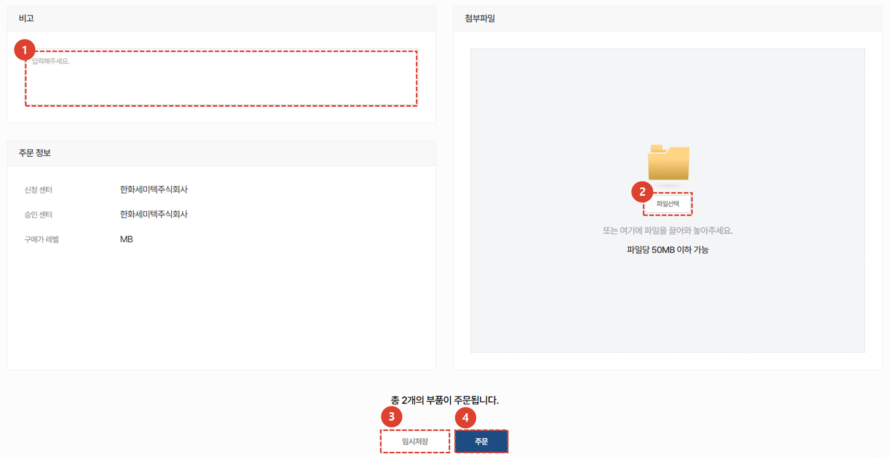

import ValidateTextByToken from "/src/utils/getQueryString.js";
import StrongTextParser from "/src/utils/textParser.js";
import text from "/src/locale/ko/SMT/tutorial-03-store/01-create-order-buyer.json";

# 주문서 작성 - 서비스 연계 주문

**서비스주문/설치시운전 프로젝트**에서 사용된 부품에 대한 유/무상 주문서를 생성합니다.

<ValidateTextByToken dispTargetViewer={true}  dispCaution={true} validTokenList={['head', 'branch', 'agent']}>

## 주문 추가

1. [서비스 연계 주문] 버튼을 클릭합니다.
1. [주문] 버튼을 클릭합니다.
 
 

## 부품 추가

1. 특정 자재 창고의 재고 확인을 위해 **Storage Location**을 선택합니다. 
    :::info
        Storage Location을 선택하면, 해당 창고에서 보유하고 있는 재고를 확인 할 수 있습니다. 
         예) **사업부코드**|**Storage Location** : **VK21**|**SC03**
        
    :::
1. 담당센터, 서비스 번호, S/N, 부품코드 및 부품명을 이용하여 상세 검색이 가능합니다.
1. 서비스 연계 주문을 진행할 항목을 선택합니다. 
:::note
기본적으로 체크박스는 활성화되어있습니다. 
해당 서비스에 대하여 이미 추가된 부품은 체크박스가 **비활성화** 됩니다.
:::
1. **추가**버튼을 눌러 부품을 추가합니다.
 
 

## 주문 목록 확인 및 추가 정보 입력

1. 상태 열의 값이 SNA/DNA 인 경우 주문서 진행이 불가합니다.
    - 상태가 **정보없음** 인 경우 자재 담당자의 업데이트가 아직 안된 것으로 판단하여 진행이 가능하도록 하였습니다.
1. SNA/DNA의 경우 개선품을 확인할 수 있습니다.
1. 주문수량을 확인하고 **더블 클릭** 하여 수정할 수 있습니다.
1. 비고란을 더블클릭하여 수정할 수 있습니다.
1. **판매자 센터**의 재고 수량을 확인할 수 있습니다.
 
 

## 추가 정보 입력 및 주문서 생성

1. 주문서의 전체적인 비고사항을 입력합니다.
1. 첨부파일이 있는 경우 파일을 추가합니다.
1. 주문서가 확정적이지 않은경우 임시 저장을 누릅니다. 임시저장 버튼을 누르면 페이지를 나가더라도 입력 **데이터가 손실되지 않습니다.** 
    :::info
    
    1. 임시저장된 주문서의 경우, 목록에서 **저장** 단계에 머무르게 됩니다.
    1. 저장된 주문서를 확인할 수 있습니다.
    1. 주문 목록과 비고란은 수정할 수 없습니다. 수정하기 위해서는 하단의 **수정** 버튼을 누릅니다.
    1. 판매자와 소통을 위한 메시지를 입력합니다.
    1. 주문정보가 표시됩니다.
    1. 임시저장된 주문서를 주문처리하기 위해서는 **수정**버튼을 누른 뒤 보이는 수정페이지에서 **주문**버튼을 누릅니다.
    :::
1. 주문서를 생성하려면 **주문** 버튼을 누릅니다.
 
 

## 주문 완료

1. 주문을 완료한 주문서의 경우, 목록에서 **주문접수** 단계에 머무르게 됩니다.
1. **주문번호**를 클릭하여 주문서를 확인할 수 있습니다.
 
 

1. 판매자와 소통을 위한 메시지를 입력합니다.
1. 판매자의 주문서 **승인 전**까지는 주문서 **수정**이 가능합니다.
1. 판매자의 주문서 **승인 전**까지는 주문서 **취소**이 가능합니다.
</ValidateTextByToken>
