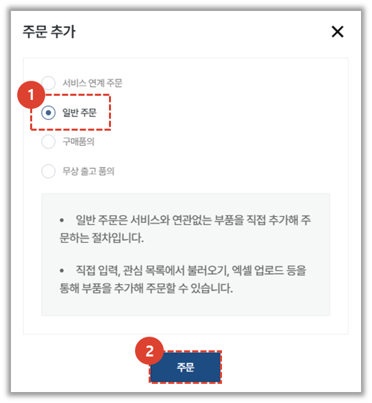
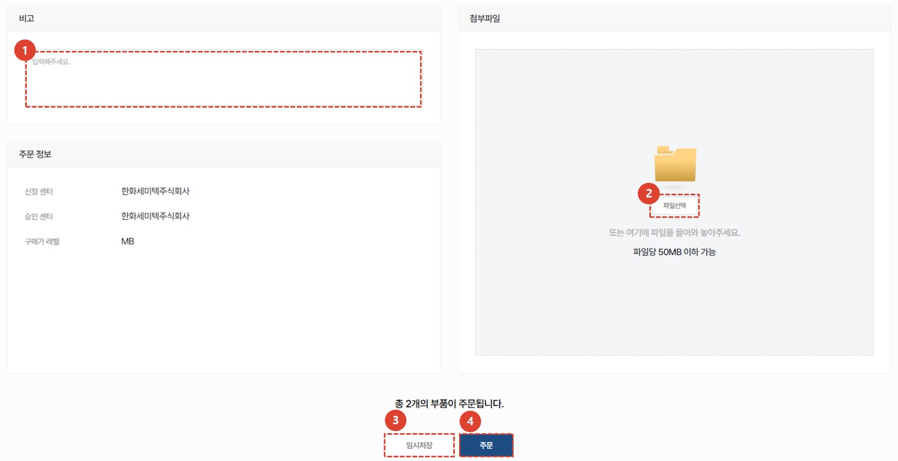

import ValidateTextByToken from "/src/utils/getQueryString.js";
import StrongTextParser from "/src/utils/textParser.js";
import text from "/src/locale/ko/SMT/tutorial-03-store/01-create-order-buyer.json";

# 주문서 작성 - 일반 주문
일반 주문은 서비스와 연관없는 부품을 직접 추가해 주문(유상PO)하는 절차입니다. 
직접 입력, 관심 목록에서 불러오기, 엑셀 업로드 등을 통해 부품을 추가하는 일반적인 유상 서비스 부품 주문 메뉴입니다.

<ValidateTextByToken dispTargetViewer={true} dispCaution={true} validTokenList={['head', 'branch', 'agent']}>

## 주문 추가

1. [일반 주문] 버튼을 클릭합니다.
1. [주문] 버튼을 클릭합니다.
 
 

## 부품 추가

1. 부품코드를 검색해서 PO 신청 부품을 추가할 수 있습니다.
    :::info
     → 정상적으로 검색됨 
     → 정상적으로 검색지 않음 **(진행 불가)**
    :::
1. 수량을 입력합니다
1. 신청할 부품과 관련된 특이사항을 입력합니다. 
     예) 관련 문서, 부품 특이사항, 배송지 등
1. **추가** 버튼을 누르면 추가됩니다.
1. 엑셀로 일괄 업로드가 가능합니다.
    :::note
    
    1. 엑셀 양식을 받을 수 있습니다. 
    1. 엑셀에 데이터를 입력하여 파일을 추가합니다.  
        - (필수입력)**Parts Code** : 부품 코드를 입력합니다.
        - (필수입력)**Quantity** : 부품 갯수를 입력합니다. 
        - **Price** : 정가 외 판가로 판매를 진행 할 경우에만 Special Price를 입력합니다. **미 입력시 일반 판가가 자동 적용됩니다.**
        - **Remarks** : 비고 내용을 입력합니다. 
    :::
 
 

## 주문 목록 확인 및 추가 정보 입력

1. 상태 열의 값이 SNA/DNA 인 경우 주문서 진행이 불가합니다. 
    - 상태가 **정보없음** 인 경우 자재 담당자의 업데이트가 아직 안된 것으로 판단하여 진행이 가능하도록 하였습니다.
1. SNA/DNA의 경우 개선품을 확인할 수 있습니다. **(TBD)**
1. 주문수량을 확인하고 **더블 클릭** 하여 수정할 수 있습니다.
1. **판매자 센터**의 재고 수량을 확인할 수 있습니다.
    :::info
    목록 리스트에는 **부품정보**/**상태**/**개선 여부**/**단가**/**주문 수량**/**합계**/**재고** 뿐만 아니라
     **담당 센터**/**비고**/**MOQ** 그리고 **L/T**가 표시됩니다.
    :::
 
 

## 추가 정보 입력 및 주문서 생성

1. 주문서의 전체적인 비고사항을 입력합니다.
1. 첨부파일이 있는 경우 파일을 추가합니다.
1. 주문서가 확정적이지 않은경우 임시 저장을 누릅니다. 임시저장 버튼을 누르면 페이지를 나가더라도 입력 **데이터가 손실되지 않습니다.** 
    :::info
    
    1. 임시저장된 주문서의 경우, 목록에서 **저장** 단계에 머무르게 됩니다.
    1. 저장된 주문서를 확인할 수 있습니다.
    1. 주문 목록과 비고란은 수정할 수 없습니다. 수정하기 위해서는 하단의 **수정** 버튼을 누릅니다.
    1. 판매자와 소통을 위한 메시지를 입력합니다.
    1. 주문정보가 표시됩니다.
    1. 임시저장된 주문서를 주문처리하기 위해서는 **수정**버튼을 누른 뒤 보이는 수정페이지에서 **주문**버튼을 누릅니다.
    :::
1. 주문서를 생성하려면 **주문** 버튼을 누릅니다.
 
 

## 주문 완료

1. 주문을 완료한 주문서의 경우, 목록에서 **주문접수** 단계에 머무르게 됩니다.
1. **주문번호**를 클릭하여 주문서를 확인할 수 있습니다.
 
 

1. 판매자와 소통을 위한 메시지를 입력합니다.
1. 판매자의 주문서 **승인 전**까지는 주문서 **수정**이 가능합니다.
1. 판매자의 주문서 **승인 전**까지는 주문서 **취소**이 가능합니다.
 
 
</ValidateTextByToken>
